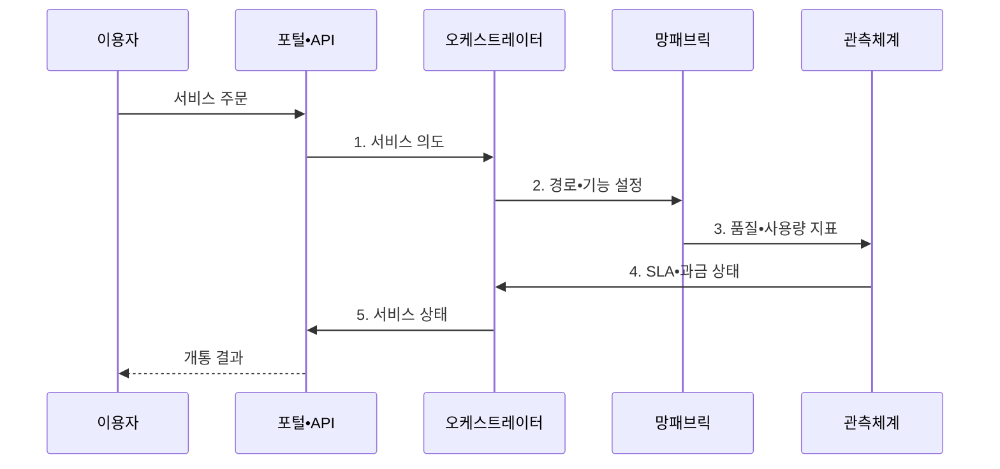

---
sidebar:
  order: 60
  label: "060. NaaS (Network as a Service)"
  badge:
    text: "기출 • 50%"
    variant: note
title: "NaaS (Network as a Service)"
date: "2026-08-03T08:48:47+09:00"
tags:
  - "notes-network"
weight: 60
extra:
  question_no: "060"
  source_status: "기출"
  source_history: "131회"
  priority: 50
  priority_note: "설명•설계형: 131회 NaaS 직접 출제"
---

## Ⅰ. 개요

핵심 용어

- **서비스형 네트워크(Network as a Service, NaaS)**: 연결•보안•품질 기능을 응용 프로그래밍 인터페이스(Application Programming Interface, API)로 주문•변경하고 구독•사용량으로 이용하는 네트워크 서비스

- 정의/개념: 연결•보안•품질 기능을 API로 주문•변경하는 **구독형 네트워크 서비스**
- 배경/필요성: 자체 구축은 **조달•개통 지연과 초기 투자 부담**

#### 한줄 요약

- 회선과 방화벽 장비를 따로 사지 않고 필요한 연결•보안 기능을 골라 즉시 빌려 쓴다

## Ⅱ. 특징

핵심 용어

- **서비스 카탈로그**: 주문할 수 있는 연결•대역폭•보안•품질 기능과 이용 조건을 정의한 목록이다.
- **서비스 수준 협약(Service Level Agreement, SLA)•사용량 과금**: 서비스 품질과 미달 책임을 계약하고 실제 사용 기간•등급•사용량으로 비용을 산정하는 방식
- **응용 프로그래밍 인터페이스(Application Programming Interface, API)**: 서비스 주문•변경•해지 요청을 자동 전달하는 호출 규격

- **서비스 카탈로그•API 기반 주문•변경•해지 자동화**
- **오케스트레이터 기반 연결•보안 기능의 종단 경로 구성**
- **SLA•사용량 과금에 따른 품질 책임 명시와 비용 변동**

#### 한줄 요약

- 버튼으로 대역폭을 늘릴 수 있어도 장애 구간과 복구 책임이 계약에 없으면 품질 문제를 해결하기 어렵다

## Ⅲ. 구조 및 구성요소

핵심 용어

- **오케스트레이터**: 주문 의도를 장비•회선•가상 기능의 설정과 작업 순서로 변환하는 제어 기능이다.
- **네트워크 패브릭**: 장비•회선•경로를 하나의 연결 기반으로 구성해 서비스 정책을 실행하는 네트워크이다.
- **응용 프로그래밍 인터페이스(Application Programming Interface, API)**: 이용자의 서비스 주문과 상태 조회를 오케스트레이터에 전달하는 호출 규격
- **서비스 수준 협약(Service Level Agreement, SLA)**: 종단 가용성•지연•손실 목표와 미달 책임을 정한 협약

| 구성요소 | 책임 |
|:---|:---|
| 포털•API | 서비스 **주문•변경•상태 조회** |
| 오케스트레이터 | **주문 의도의 경로•기능 변환** |
| 네트워크 패브릭•기능 | **연결•보안•품질 정책** 실행 |
| 서비스 에지 | 지사•클라우드 **접속 종단** |
| 관측•SLA•과금 | **품질•사용량 측정•계약 판정** |

#### 한줄 요약

- 사용자가 주문한 연결을 오케스트레이터가 실제 망에 만들고 관측 기능이 품질과 비용을 계산한다

## Ⅳ. 흐름도

핵심 용어

- **서비스 의도**: 이용자가 원하는 연결•보안•품질 결과를 장비 독립적인 형태로 선언한 주문 정보이다.
- **소프트웨어 정의 광역망(Software-Defined Wide Area Network, SD-WAN)•보안 액세스 서비스 에지(Secure Access Service Edge, SASE)**: SD-WAN은 광역 경로를 선택하고 SASE는 네트워크 연결과 클라우드 보안을 서비스 에지에서 통합하는 기술
- **응용 프로그래밍 인터페이스(Application Programming Interface, API)**: 서비스 주문•상태 정보를 포털과 오케스트레이터 사이에 전달하는 규격
- **서비스 수준 협약(Service Level Agreement, SLA)**: 경로 품질 목표와 위반 책임을 정한 협약

**동작 원리**

1. **서비스 의도**: 이용자 권한과 정책 충돌을 검증한 주문 전달
2. **경로•기능 설정**: 회선•SD-WAN•SASE 자원 연결
3. **품질•사용량 지표**: 실제 종단 경로의 SLA 지표와 사용량 제공
4. **SLA•과금 상태**: 품질 위반 여부와 과금량 산정 결과 전달
5. **서비스 상태**: 개통 상태•품질•예상 비용을 포털에 제공

#### 한줄 요약

- 주문이 설정값으로 바뀐 뒤 실제 지사 경로의 품질을 재야 서비스가 제대로 열린 것이다

## Ⅴ. 종류 및 비교

핵심 용어

- **서비스형 네트워크(Network as a Service, NaaS)•자체 구축•관리형 네트워크**: NaaS는 서비스를 구독하고 자체 구축은 자산을 소유하며 관리형은 보유 자산의 운영을 위탁하는 제공 방식
- **공급자 종속**: 전용 응용 프로그래밍 인터페이스(Application Programming Interface, API)•구성 모델•서비스 기능 때문에 다른 공급자로 이전하기 어려워지는 상태

| 네트워크 제공 방식 | NaaS | 자체 구축 | 관리형 네트워크 |
|:---|:---|:---|:---|
| 적용 기준 | 수요 변동•**신속한 지점 연결** | 세부 통제•**고정 수요** | 자산 유지•**운영 인력 부족** |
| 핵심 특징 | **API 구독•자동 개통** | **자산 소유•직접 운영** | 보유 자산의 **운영 위탁** |
| 한계 | **공급자 종속•비용 변동** | **초기 투자•증설 지연** | 변경 속도•**책임 경계** |

> 요약: 소유는 **자체 구축**, 대행은 관리형, 구독은 **NaaS**

#### 한줄 요약

- 빨리 늘리고 줄이면 NaaS, 장비까지 통제하면 자체 구축, 장비를 두고 운영만 맡기면 관리형이다

## Ⅵ. 실무 고려사항 및 대책

핵심 용어

- **종단 측정점**: 이용자 접속 양 끝에서 실제 가용성•지연•손실을 측정해 서비스 수준 협약(Service Level Agreement, SLA) 책임을 판정하는 위치
- **구성 내보내기**: 서비스 정책과 연결 구성을 재사용 가능한 표준 형식으로 추출하는 기능이다.
- **응용 프로그래밍 인터페이스(Application Programming Interface, API)**: 서비스 정책과 연결 구성을 주문•변경하는 호출 규격

| 문제 | 대책 | 효과 |
|:---|:---|:---|
| 책임 측정점이 없으면 공급자 간 장애 원인 공방 | 종단 측정점과 **복구 책임** 명시 | 원인 판정으로 **장애 조정 시간** 단축 |
| 사용량 급증을 늦게 발견하면 예산 초과 | 예산 한도와 **이상 사용 경보** 설정 | 비용 급증 억제로 **예산 예측성** 확보 |
| 공급자 전용 API에 종속되면 서비스 이전 곤란 | 표준 모델과 **구성 내보내기** 지원 | 대체 공급자로의 **전환 가능성** 확보 |

#### 한줄 요약

- 지점 주소와 정책을 주문하면 연결과 방화벽이 같은 작업으로 열린다

## Ⅶ. 결론

핵심 용어

- **네트워크 제공 방식**: 수요 변동•자산 통제•운영 역량을 기준으로 서비스형 네트워크(Network as a Service, NaaS)•자체 구축•관리형 중 운영 모델을 정하는 분류

- 수요 변동은 **NaaS**, 자산 통제는 **자체 구축**, 운영 인력 부족은 관리형 선택

#### 한줄 요약

- 연결 수요가 자주 바뀌고 실제 경로 품질과 책임을 계약으로 확인할 수 있을 때 NaaS가 유리하다.
