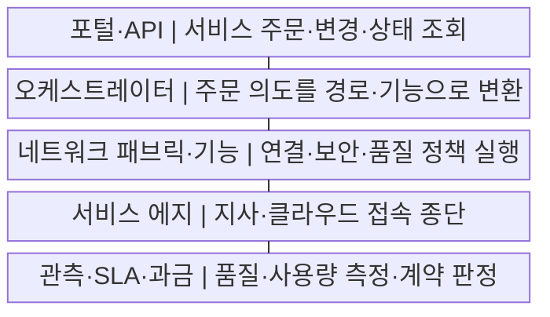
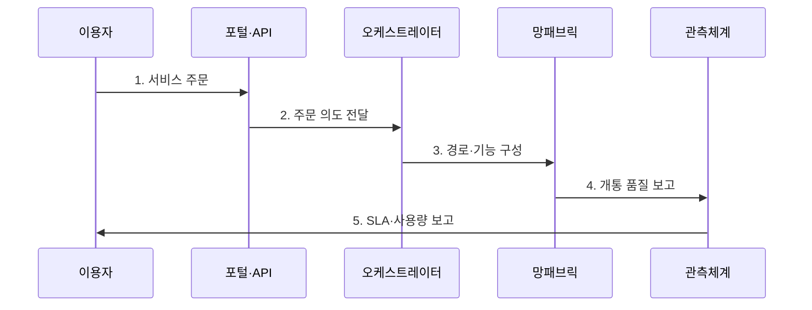

---
sidebar:
  order: 60
  label: "060. NaaS (Network as a Service)"
  badge:
    text: "기출 · 50%"
    variant: note
title: "NaaS (Network as a Service)"
date: "2026-07-29T23:30:00+09:00"
tags:
  - "notes-network"
weight: 60
extra:
  question_no: "060"
  source_status: "기출"
  source_history: "131회"
  priority: 50
  priority_note: "설명·설계형: 131회 NaaS 직접 출제"
---

## 미리 알고가기

- **서비스형 네트워크(Network as a Service, NaaS)**: ‘나스’로 읽고 Network와 as a Service를 결합한 표기이며 연결·보안·품질 기능을 API로 주문하고 구독·사용량으로 이용함
- **범용 고객 구내 장비(Universal Customer Premises Equipment, uCPE)**: ‘유씨피이’로 읽고 Universal의 소문자 u와 나머지 머리글자를 결합한 표기이며 지사에서 가상 라우터·방화벽을 실행함
- **소프트웨어 정의 광역망(Software-Defined Wide Area Network, SD-WAN)**: ‘에스디완’으로 읽고 핵심 영문 머리글자를 딴 표기이며 응용 정책과 회선 상태로 광역망 경로를 선택함
- **보안 접근 서비스 에지(Secure Access Service Edge, SASE)**: ‘새시’로 읽고 다섯 영문 단어의 머리글자를 딴 표기이며 네트워크 연결과 클라우드 보안을 서비스 에지에서 통합 제공함
- **응용 프로그래밍 인터페이스(Application Programming Interface, API)**: ‘에이피아이’로 읽고 세 영문 단어의 머리글자를 딴 표기이며 소프트웨어 기능과 데이터의 호출 방식을 정의함
- **서비스 수준 협약(Service Level Agreement, SLA)**: ‘에스엘에이’로 읽고 세 영문 단어의 머리글자를 딴 표기이며 가용성·지연·복구 시간과 미달 책임을 합의함
- **서비스 카탈로그(Service Catalog)**: 주문 가능한 연결·대역폭·보안·품질 기능과 조건을 정의한 목록
- **오케스트레이터(Orchestrator)**: 주문 의도를 장비·회선·가상 기능의 설정과 작업 순서로 변환하는 제어 기능
- **과금(Billing)**: 서비스 사용량·기간·등급을 측정해 비용을 산정하는 기능

## Ⅰ. 개요

- 정의/개념: 연결·보안·품질을 **API 기반 구독 서비스로 제공**
- 배경/필요성: 자체 구축은 **조달·개통 지연과 초기 투자 부담**

### 쉽게 이해하기 (학습용)

- 회선과 방화벽 장비를 따로 사지 않고 필요한 연결·보안 기능을 골라 즉시 빌려 쓴다

## Ⅱ. 특징

- **서비스 카탈로그·API**로 주문·변경·해지를 자동화한다.
- **오케스트레이터**가 연결·보안 기능을 종단 경로에 구성한다.
- **SLA·사용량 과금**은 품질 책임을 정하나 비용 변동이 발생한다.

### 쉽게 이해하기 (학습용)

- 버튼으로 대역폭을 늘릴 수 있어도 장애 구간과 복구 책임이 계약에 없으면 품질 문제를 해결하기 어렵다

## Ⅲ. 구조 및 구성요소

| 구성요소 | 책임 |
|:---|:---|
| 포털·API | 서비스 주문·변경·상태 조회 |
| 오케스트레이터 | 주문 의도를 경로·기능으로 변환 |
| 네트워크 패브릭·기능 | 연결·보안·품질 정책 실행 |
| 서비스 에지 | 지사·클라우드 접속 종단 |
| 관측·SLA·과금 | 품질·사용량 측정·계약 판정 |

### 쉽게 이해하기 (학습용)

- 사용자가 주문한 연결을 오케스트레이터가 실제 망에 만들고 관측 기능이 품질과 비용을 계산한다

## Ⅳ. 흐름도

**동작 원리**

1. **서비스 주문**: 카탈로그에서 접속·대역폭·보안 선택
2. **주문 의도 전달**: 신원·권한·정책 충돌 검증 후 요청
3. **경로·기능 구성**: 회선·SD-WAN·SASE 자원 연결
4. **개통 품질 보고**: 실제 경로에서 SLA 지표 측정
5. **SLA·사용량 보고**: 품질 위반과 과금량을 지속 제공

### 쉽게 이해하기 (학습용)

- 주문이 설정값으로 바뀐 뒤 실제 지사 경로의 품질을 재야 서비스가 제대로 열린 것이다

## Ⅴ. 종류 및 비교

| 네트워크 제공 방식 | NaaS | 자체 구축 | 관리형 네트워크 |
|:---|:---|:---|:---|
| 적용 기준 | 수요 변동·신속한 지점 연결 | 세부 통제·고정 수요 | 자산 유지·운영 인력 부족 |
| 핵심 특징 | API 구독·자동 개통 | 자산 소유·직접 운영 | 보유 자산 운영 위탁 |
| 한계 | 공급자 종속·비용 변동 | 초기 투자·증설 지연 | 변경 속도·책임 경계 |

> 요약: 자체는 소유, 관리형은 대행, NaaS는 구독이다

### 쉽게 이해하기 (학습용)

- 빨리 늘리고 줄이면 NaaS, 장비까지 통제하면 자체 구축, 장비를 두고 운영만 맡기면 관리형이다

## Ⅵ. 실무 고려사항 및 대책

| 고려사항 | 대책 | 효과 |
|:---|:---|:---|
| SLA 책임 구간 불명 | 종단 측정점·복구 책임 명시 | 장애 조정 단축 |
| 사용량 비용 급증 | 예산 한도·이상 사용 경보 | 비용 예측성 |
| 공급자 API 종속 | 표준 모델·구성 내보내기 | 전환 가능성 |

### 쉽게 이해하기 (학습용)

- 지점 주소와 정책을 주문하면 연결과 방화벽이 같은 작업으로 열린다

## Ⅶ. 결론

- **수요 변동·종단 SLA·출구 비용에 따른 NaaS 선택**

### 쉽게 이해하기 (학습용)

- 연결 수요가 자주 바뀌고 실제 경로 품질과 책임을 계약으로 확인할 수 있을 때 NaaS가 유리하다.
