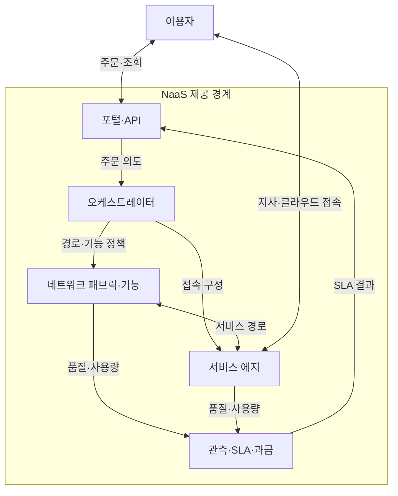
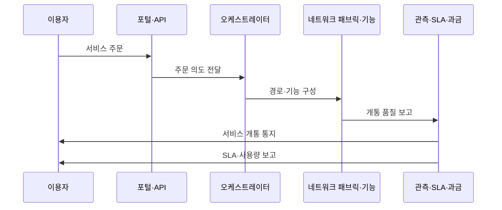

---
sidebar:
  order: 60
  label: "060. NaaS (Network as a Service)"
  badge:
    text: "기출 · 50%"
    variant: note
title: "NaaS (Network as a Service)"
date: "2026-07-25T12:02:00+09:00"
tags:
  - "notes-network"
weight: 60
extra:
  question_no: "060"
  source_status: "기출"
  source_history: "131회"
  priority: 50
  priority_note: "설명·설계형: 131회 NaaS 직접 출제"
---

## 미리 알고가기

- **서비스형 네트워크(Network as a Service, NaaS)**: 연결·보안·품질 기능을 API로 주문하고 사용량이나 구독으로 이용하는 서비스 모델
- **범용 고객 구내 장비(Universal Customer Premises Equipment, uCPE)**: 지사에서 가상 라우터·방화벽 같은 망 기능을 실행하는 범용 장비
- **소프트웨어 정의 광역망(Software-Defined Wide Area Network, SD-WAN)**: 응용 정책과 회선 상태로 광역망 경로를 선택하는 기술
- **보안 접근 서비스 에지(Secure Access Service Edge, SASE)**: 네트워크 연결과 클라우드 보안 기능을 분산 서비스 지점에서 통합 제공하는 구조
- **응용 프로그래밍 인터페이스(Application Programming Interface, API)**: 소프트웨어 기능과 데이터의 호출 방식을 정의한 계약
- **서비스 수준 협약(Service Level Agreement, SLA)**: 가용성·지연·복구 시간과 미달 시 책임을 합의한 계약
- **서비스 카탈로그(Service Catalog)**: 주문 가능한 연결·대역폭·보안·품질 기능과 조건을 정의한 목록
- **오케스트레이터(Orchestrator)**: 주문 의도를 장비·회선·가상 기능의 설정과 작업 순서로 변환하는 제어 기능
- **과금(Billing)**: 서비스 사용량·기간·등급을 측정해 비용을 산정하는 기능
- **핵심 약어 읽기와 표기**: NaaS는 엔에이에스로 읽고 Network as a Service의 핵심 머리글자를 딴 표기이며, 네트워크 기능을 주문형 구독 서비스로 제공하는 역할
- **구성 약어 읽기와 표기**: uCPE·SD-WAN·SASE는 유씨피이·에스디완·에스에이에스이로 읽고, 소문자 u는 Universal을 뜻하며 각 표기는 지사 범용 장비·정책형 광역망·연결과 보안 통합 역할을 나타냄
- **계약 약어 읽기와 표기**: API·SLA는 에이피아이·에스엘에이로 읽고 영문 머리글자를 딴 표기이며, 각각 자동 주문 계약과 품질 책임 계약의 역할을 함

## Ⅰ. 개요

- 정의: 연결·보안 기능을 주문형 구독으로 제공한다
- 배경: 조달·구축 지연과 초기 투자 비용을 줄인다

### 쉽게 이해하기 (학습용)

- 회선과 방화벽 장비를 따로 사지 않고 필요한 연결·보안 기능을 골라 즉시 빌려 쓴다

## Ⅱ. 특징

- API 자동화는 주문·변경·해지 시간을 줄인다
- 기능 구독 조합은 장비 구매와 증설 비용을 줄인다
- 사용량 과금은 유휴 비용을 줄이나 예산 변동을 키운다
- SLA는 책임 경계를 정해 장애 복구 지연을 줄인다

### 쉽게 이해하기 (학습용)

- 버튼으로 대역폭을 늘릴 수 있어도 장애 구간과 복구 책임이 계약에 없으면 품질 문제를 해결하기 어렵다

## Ⅲ. 아키텍처 및 구성요소

| 설계 요소 | 설명 |
|:---|:---|
| 포털·API | 서비스 주문·변경·해지·상태 조회 |
| 오케스트레이터 | 주문 의도를 경로·기능 설정으로 변환 |
| 네트워크 패브릭·기능 | 연결·보안·품질 정책 실행 |
| 서비스 에지 | 이용자 지사·클라우드 접속 종단 |
| 관측·SLA·과금 | 품질·사용량 측정과 계약 판정 |

> 요약: 주문 의도가 기능으로 개통되고 품질로 측정된다

### 쉽게 이해하기 (학습용)

- 사용자가 주문한 연결을 오케스트레이터가 실제 망에 만들고 관측 기능이 품질과 비용을 계산한다

## Ⅳ. 원리 및 절차 흐름도

| 절차 | 설명 |
|:---|:---|
| 서비스 주문 | 카탈로그에서 접속·대역폭·보안 선택 |
| 주문 의도 전달 | 신원·권한·정책 충돌 검증 후 요청 |
| 경로·기능 구성 | 회선·SD-WAN·SASE 자원 연결 |
| 개통 품질 보고 | 실제 경로에서 SLA 지표 측정 |
| 서비스 개통 통지 | 목표 충족 시 이용자에게 활성화 알림 |
| SLA·사용량 보고 | 품질 위반과 과금량을 지속 제공 |

> 요약: 서비스를 주문·할당하고 SLA로 운영한다

### 쉽게 이해하기 (학습용)

- 주문이 설정값으로 바뀐 뒤 실제 지사 경로의 품질을 재야 서비스가 제대로 열린 것이다

## Ⅴ. 종류 및 비교

| 판단 기준 | NaaS | 자체 구축 | 관리형 네트워크 |
|:---|:---|:---|:---|
| 핵심 특징 | API 기반 구독·자동 개통 | 자산 소유·직접 운영 | 보유 자산의 운영 위탁 |
| 적용 기준 | 수요 변동·신속한 지점 연결 | 세부 통제·고정 수요 | 자산 유지·운영 인력 부족 |
| 주요 위험 | 공급자 종속·비용 가시성 | 초기 투자·증설 지연 | 변경 속도·책임 경계 |

> 요약: 자체는 소유, 관리형은 대행, NaaS는 구독이다

### 쉽게 이해하기 (학습용)

- 빨리 늘리고 줄이면 NaaS, 장비까지 통제하면 자체 구축, 장비를 두고 운영만 맡기면 관리형이다

## Ⅵ. 실무 사례

1. API로 지점 SD-WAN·방화벽을 함께 개통한다
2. 실제 경로 지연으로 멀티클라우드 SLA를 판정한다

### 쉽게 이해하기 (학습용)

- 지점 주소와 정책을 주문하면 연결과 방화벽이 같은 작업으로 열린다
- 공급자 화면의 수치가 아니라 지사에서 클라우드까지 실제 지연으로 계약 이행을 확인한다

## Ⅶ. 결론

- 수요 변동·SLA 검증 가능성으로 NaaS를 선택한다

### 쉽게 이해하기 (학습용)

- 연결 수요가 자주 바뀌고 실제 경로 품질을 계약으로 확인할 수 있을 때 NaaS를 선택한다
