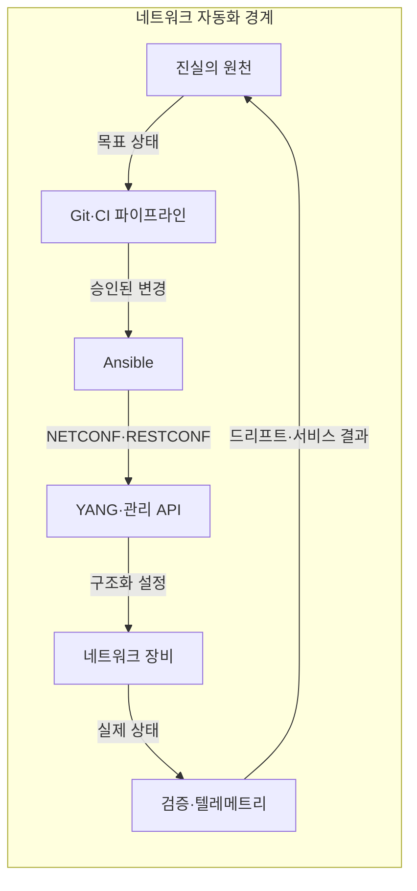
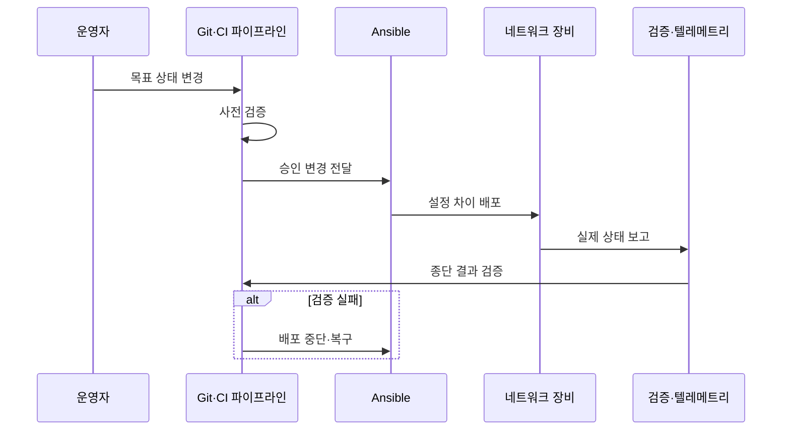

---
sidebar:
  order: 61
  label: "061. 네트워크 자동화 - Ansible·RESTCONF·NETCONF (Network Automation)"
  badge:
    text: "미출제 · 50%"
    variant: note
title: "네트워크 자동화 - Ansible·RESTCONF·NETCONF (Network Automation)"
date: "2026-07-25T12:04:00+09:00"
tags:
  - "notes-network"
weight: 61
extra:
  question_no: "061"
  source_status: "미출제"
  source_history: ""
  priority: 50
  priority_note: "설계·운영형: 자동화·검증·Rollback 현재성"
---

## 미리 알고가기

- **YANG(Yet Another Next Generation)**: 네트워크 설정·상태 데이터의 계층·자료형·제약을 정의하는 모델링 언어
- **네트워크 설정 프로토콜(Network Configuration Protocol, NETCONF)**: YANG 데이터를 RPC로 조회·변경하며 잠금·검증·커밋을 지원하는 프로토콜
- **RESTCONF(REST Configuration Protocol)**: HTTP 메서드와 JSON·XML로 YANG 데이터를 조회·변경하는 프로토콜
- **앤서블(Ansible)**: 인벤토리와 선언형 작업 파일로 여러 장비의 설정 작업을 조율하는 자동화 도구
- **진실의 원천(Source of Truth)**: 주소·토폴로지·정책의 의도 상태를 유일한 기준으로 관리하는 저장소
- **지속적 통합(Continuous Integration, CI)**: 변경마다 구문·스키마·정책 검사를 자동 실행하는 개발 방식
- **응용 프로그래밍 인터페이스(Application Programming Interface, API)**: 소프트웨어가 구조화된 요청으로 장비 설정과 상태를 다루는 호출 규약
- **명령줄 인터페이스(Command-Line Interface, CLI)**: 운영자가 텍스트 명령으로 장비를 설정하고 결과를 확인하는 조작 방식
- **텔레메트리(Telemetry)**: 장비의 상태·성능 데이터를 지속 수집해 관리 체계에 전달하는 기능
- **설정 드리프트(Configuration Drift)**: 장비의 실제 설정이 진실의 원천에 선언된 목표 상태와 달라진 현상
- **멱등성(Idempotency)**: 같은 자동화 작업을 반복해도 목표 상태와 결과가 달라지지 않는 성질
- **후보 설정(Candidate Configuration)**: 실행 설정에 반영하기 전에 변경을 편집·검증하는 NETCONF 데이터 저장소
- **관리 모델 약어 읽기와 표기**: YANG은 양으로 읽는 공식 언어명이고 NETCONF·RESTCONF는 넷콘프·레스트콘프로 읽으며, Configuration을 CONF로 줄여 모델 기반 설정과 웹 자원 설정 역할을 구분함
- **데이터 형식 약어 읽기와 표기**: RPC·HTTP·JSON·XML은 알피씨·에이치티티피·제이슨·엑스엠엘로 읽고 영문 핵심 글자를 딴 표기이며, 원격 호출·웹 전송·구조화 데이터 교환 역할을 함
- **운영 약어 읽기와 표기**: CI·API·CLI는 씨아이·에이피아이·씨엘아이로 읽고 영문 머리글자를 딴 표기이며, 자동 검증·구조화 호출·명령행 조작 경로를 나타냄

## Ⅰ. 개요

- 정의: 목표 망 상태를 모델·코드로 배포하는 체계다
- 배경: 수동 명령의 편차·감사 누락을 제거한다

### 쉽게 이해하기 (학습용)

- 사람이 장비마다 명령을 입력하는 대신 원하는 상태를 코드로 정의해 같은 절차로 검사하고 적용함

## Ⅱ. 특징

- 목표·실제 상태 비교는 설정 드리프트를 찾아낸다
- YANG 제약은 잘못된 설정 배포를 사전에 막는다
- Ansible은 순서·범위를 조율해 장애 확산을 막는다
- 구조화 API는 출력 파싱 실패와 변경 비용을 줄인다

### 쉽게 이해하기 (학습용)

- 자동화 도구만 도입하고 화면 문자열을 계속 파싱하면 장비 출력이 바뀔 때 작업이 쉽게 깨짐

## Ⅲ. 아키텍처 및 구성요소

| 설계 요소 | 설명 |
|:---|:---|
| 진실의 원천 | 주소·토폴로지·목표 정책의 정본 저장 |
| Git·CI 파이프라인 | 변경 리뷰·검사·승인·감사 기록 |
| Ansible | 인벤토리·배포 범위·의존성 조율 |
| YANG·관리 API | 모델 제약에 맞춰 설정 조회·변경 |
| 네트워크 장비 | 승인된 설정 적용과 운용 상태 제공 |
| 검증·텔레메트리 | 배포 전후 상태·종단 서비스 확인 |

> 요약: 목표를 배포하고 실제 상태를 정본에 환류한다

### 쉽게 이해하기 (학습용)

- Source of Truth와 실제 장비 상태의 차이를 찾아야 자동화 코드가 오래된 설정을 다시 덮어쓰지 않음

## Ⅳ. 원리 및 절차 흐름도

| 절차 | 설명 |
|:---|:---|
| 목표 상태 변경 | 모델·템플릿으로 원하는 상태 선언 |
| 사전 검증 | 구문·YANG·정책·도달성 검사 |
| 승인 변경 전달 | 리뷰를 통과한 작업만 실행기에 전달 |
| 설정 차이 배포 | 현재 상태와 다른 설정만 단계 적용 |
| 실제 상태 보고 | 장비가 적용 설정·운용 상태 제공 |
| 종단 결과 검증 | 경로·정책이 실제 트래픽에 반영됐는지 확인 |
| 배포 중단·복구 | 실패 범위를 멈추고 이전 설정으로 복원 |

> 요약: 목표 상태를 선언하고 배포·검증한다

### 쉽게 이해하기 (학습용)

- API 성공 응답만 보지 말고 경로와 정책이 실제 트래픽에 반영됐는지 확인해야 변경이 끝남

## Ⅴ. 종류 및 비교

| 판단 기준 | NETCONF | RESTCONF | CLI 자동화 |
|:---|:---|:---|:---|
| 핵심 특징 | RPC·XML·YANG 데이터 저장소 | HTTP·JSON/XML·YANG 자원 | 명령·비구조 출력 파싱 |
| 적용 기준 | 잠금·검증·커밋 필요 | 웹 응용·포털 API 연계 | 구조화 API 없는 장비 |
| 주요 위험 | 장비별 기능 광고 차이 | 트랜잭션 지원 차이 | 출력 변경·부분 실패 |

> 요약: 트랜잭션은 NETCONF, 웹 연계는 RESTCONF다

### 쉽게 이해하기 (학습용)

- NETCONF의 후보 설정·검증 기능은 장비가 지원 기능을 알릴 때만 사용할 수 있다

## Ⅵ. 실무 사례

1. 스위치는 후보 설정 검증 뒤 단계 커밋한다

### 쉽게 이해하기 (학습용)

- 일부 스위치에서 먼저 설정을 검증하고 트래픽 경로가 유지될 때 나머지에 적용한다

## Ⅶ. 결론

- 모델 검증·종단 확인·복구 범위까지 자동화한다

### 쉽게 이해하기 (학습용)

- 실패를 배포 중 멈추고 실제 경로를 확인해 되돌릴 수 있는 범위까지만 자동화한다
