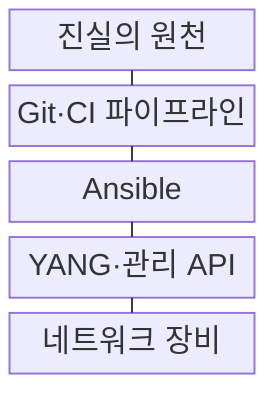
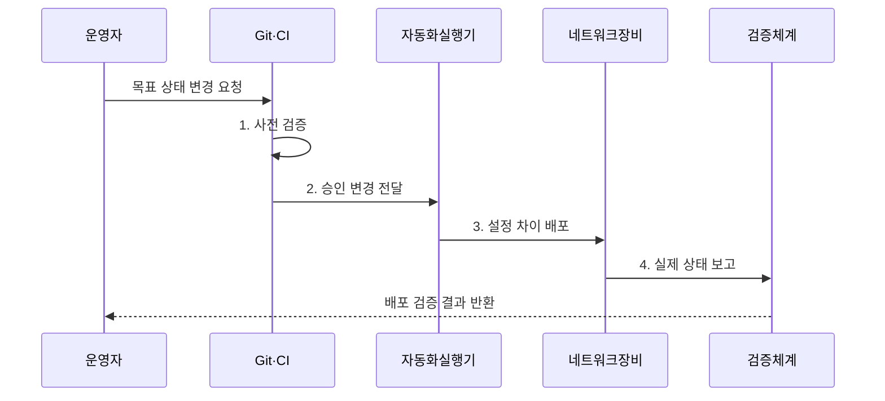

---
sidebar:
  order: 61
  label: "061. 네트워크 자동화 - Ansible·RESTCONF·NETCONF (Network Automation)"
  badge:
    text: "미출 · 50%"
    variant: note
title: "네트워크 자동화 - Ansible·RESTCONF·NETCONF (Network Automation)"
date: "2026-08-02T14:01:00+09:00"
tags:
  - "notes-network"
weight: 61
extra:
  question_no: "061"
  source_status: "미출"
  source_history: ""
  priority: 50
  priority_note: "설계·운영형: 자동화·검증·Rollback 현재성"
---

## Ⅰ. 개요

핵심 용어

- **네트워크 자동화(Network Automation)**: 목표 네트워크 상태를 모델과 코드로 정의하고 반복 가능한 절차로 검증·배포·복구하는 운영 체계
- **진실의 원천(Source of Truth)**: 주소·토폴로지·정책의 의도 상태를 유일한 기준으로 관리하는 저장소

- 정의/개념: 목표 망 상태를 모델·코드로 배포하는 **운영 자동화 체계**
- 배경/필요성: 장비별 수동 CLI는 **설정 편차·감사 누락** 유발

### 쉽게 이해하기 (학습용)

- 사람이 장비마다 명령을 입력하는 대신 원하는 상태를 코드로 정의해 같은 절차로 검사하고 적용함

## Ⅱ. 특징

핵심 용어

- **설정 드리프트(Configuration Drift)**: 장비의 실제 설정이 진실의 원천에 선언된 목표 상태와 달라진 현상
- **멱등성(Idempotency)**: 같은 자동화 작업을 반복해도 목표 상태와 결과가 달라지지 않는 성질
- **지속적 통합(Continuous Integration, CI)**: 변경마다 구문·스키마·정책 검사를 자동 실행하는 개발 방식

- **상태 비교**: 목표·실제 설정의 드리프트 탐지
- **모델 검증**: YANG 제약 위반 설정의 배포 차단
- **배포 조율**: Ansible로 변경 순서·범위 통제

### 쉽게 이해하기 (학습용)

- 자동화 도구만 도입하고 화면 문자열을 계속 파싱하면 장비 출력이 바뀔 때 작업이 쉽게 깨짐

## Ⅲ. 구조 및 구성요소

핵심 용어

- **YANG(Yet Another Next Generation)**: 네트워크 설정·상태 데이터의 계층·자료형·제약을 정의하는 모델링 언어
- **네트워크 설정 프로토콜(Network Configuration Protocol, NETCONF)**: YANG 데이터를 RPC로 조회·변경하며 잠금·검증·커밋을 지원하는 프로토콜
- **RESTCONF(REST Configuration Protocol)**: HTTP 메서드와 JSON·XML로 YANG 데이터를 조회·변경하는 프로토콜
- **앤서블(Ansible)**: 인벤토리와 선언형 작업 파일로 여러 장비의 설정 작업을 조율하는 자동화 도구

| 구성요소 | 책임 |
|:---|:---|
| 진실의 원천 | 주소·토폴로지·목표 정책의 정본 저장 |
| Git·CI 파이프라인 | 변경 리뷰·검사·승인·감사 기록 |
| Ansible | 인벤토리·배포 범위·의존성 조율 |
| YANG·관리 API | 모델 제약에 맞춰 설정 조회·변경 |
| 네트워크 장비 | 승인된 설정 적용과 운용 상태 제공 |

### 쉽게 이해하기 (학습용)

- Source of Truth와 실제 장비 상태의 차이를 찾아야 자동화 코드가 오래된 설정을 다시 덮어쓰지 않음

## Ⅳ. 흐름도

핵심 용어

- **후보 설정(Candidate Configuration)**: 실행 설정에 반영하기 전에 변경을 편집·검증하는 NETCONF 데이터 저장소
- **기능 광고(Capability Advertisement)**: 장비가 지원하는 NETCONF 기능을 관리 체계에 알리는 절차
- **롤백(Rollback)**: 실패한 변경을 이전의 정상 설정으로 되돌리는 복구 작업

**동작 원리**

1. **사전 검증**: 구문·YANG·정책·도달성 검사
2. **승인 변경 전달**: 리뷰 통과 작업만 실행기에 전달
3. **설정 차이 배포**: 현재 상태와 다른 설정만 단계 적용
4. **실제 상태 보고**: 적용 설정·운용 상태 제공

### 쉽게 이해하기 (학습용)

- API 성공 응답만 보지 말고 경로와 정책이 실제 트래픽에 반영됐는지 확인해야 변경이 끝남

## Ⅴ. 종류 및 비교

핵심 용어

- **YANG·NETCONF·RESTCONF**: YANG은 장비 설정·상태 모델을 정의하고, NETCONF와 RESTCONF는 해당 모델 기반 데이터를 조회·변경하는 관리 프로토콜
- **RPC·HTTP·JSON·XML**: 원격 호출과 웹 전송, 구조화된 관리 데이터 교환에 사용하는 호출·전송·표현 방식
- **CI·API·CLI**: 네트워크 변경의 자동 검증·구조화 호출·명령행 조작에 사용하는 운영 인터페이스

| 판단 기준 | **NETCONF** | **RESTCONF** | **CLI 자동화** |
|:---|:---|:---|:---|
| 적용 기준 | 잠금·검증·커밋 필요 | 웹 응용·포털 API 연계 | 구조화 API 없는 장비 |
| 핵심 특징 | RPC·XML·YANG 데이터 저장소 | HTTP·JSON/XML·YANG 자원 | 명령·비구조 출력 파싱 |
| 한계 | 장비별 기능 광고 차이 | 트랜잭션 지원 차이 | 출력 변경·부분 실패 |

> 요약: 트랜잭션은 NETCONF, 웹 연계는 RESTCONF다

### 쉽게 이해하기 (학습용)

- NETCONF의 후보 설정·검증 기능은 장비가 지원 기능을 알릴 때만 사용할 수 있다

## Ⅵ. 실무 고려사항 및 대책

핵심 용어

- **템플릿(Template)**: 변수와 공통 형식으로 장비별 설정을 생성하는 코드
- **도달성(Reachability)**: 출발지에서 목적지까지 패킷이 전달될 수 있는 상태
- **텔레메트리(Telemetry)**: 장비의 상태·성능 데이터를 지속 수집해 관리 체계에 전달하는 기능

| 문제 | 대책 | 효과 |
|:---|:---|:---|
| 정본과 실제 설정 차이로 변경 충돌 | 배포 전 **드리프트 탐지·승인** | 오래된 설정 덮어쓰기 방지 |
| 일괄 변경 실패가 전체 망으로 확산 | **소수 장비 선행·단계 배포** | 실패 범위 제한 |
| CLI 출력 변경으로 파싱 실패 | **YANG·구조화 API** 우선 | 파싱 오류 감소 |
| 배포 후 도달성 저하가 지속 | **검증 실패·시간 초과 롤백** | 장애 복구 시간 단축 |

### 쉽게 이해하기 (학습용)

- 일부 스위치에서 먼저 설정을 검증하고 트래픽 경로가 유지될 때 나머지에 적용한다

## Ⅶ. 결론

핵심 용어

- **깃(Git)**: 네트워크 설정 코드의 변경·리뷰·승인 이력을 관리하는 버전 관리 도구
- **응용 프로그래밍 인터페이스(Application Programming Interface, API)**: 소프트웨어가 구조화된 요청으로 장비 설정과 상태를 다루는 호출 규약

- 영향 큰 변경은 **소수 선행 배포**, 복구 목표 초과 시 **자동 롤백**

### 쉽게 이해하기 (학습용)

- 실패를 중단하고 실제 경로를 검증해 되돌릴 수 있는 범위까지만 자동화해야 한다.
