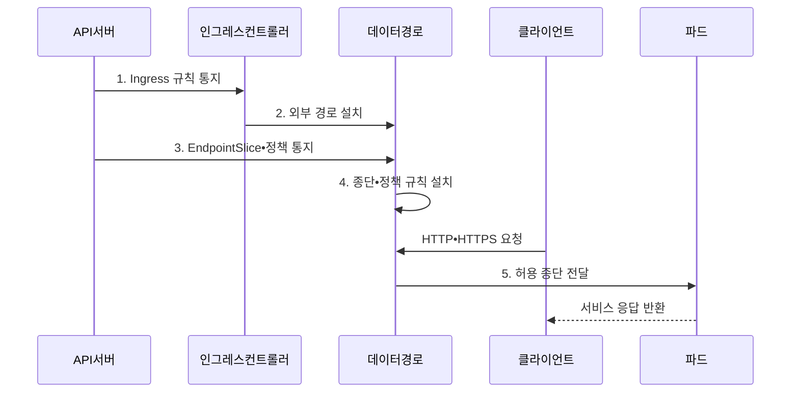

---
sidebar:
  order: 62
  label: "062. 쿠버네티스 네트워킹 - CNI•Ingress (Kubernetes Networking)"
  badge:
    text: "기출 • 50%"
    variant: note
title: "쿠버네티스 네트워킹 - CNI•Ingress (Kubernetes Networking)"
date: "2026-08-05T01:30:12+09:00"
tags:
  - "notes-network"
weight: 62
extra:
  question_no: "062"
  source_status: "기출"
  source_history: "137회"
  priority: 50
  priority_note: "설계형: 137회 CNI•Ingress•Policy 장문"
---

## Ⅰ. 개요

<details><summary>핵심 용어</summary>

- **쿠버네티스 네트워킹(Kubernetes Networking)**: 동적으로 생성•삭제되는 파드의 통신, 서비스 발견, 외부 노출과 정책을 제공하는 네트워크 체계
- **쿠버네티스(Kubernetes)**: 컨테이너 응용의 배포•확장•복구를 선언적으로 관리하는 플랫폼
- **인터넷 프로토콜(Internet Protocol, IP)**: 패킷 주소 지정과 전달을 담당하는 프로토콜
- **파드(Pod)**: 하나 이상의 컨테이너가 네트워크 이름공간과 IP 주소를 공유하는 실행 단위
- **컨테이너 네트워크 인터페이스(Container Network Interface, CNI)**: 파드의 인터페이스•주소•경로를 구성하는 플러그인 규격
- **서비스(Service)**: 변하는 파드 집합에 고정 접근점을 제공하는 객체
- **인그레스(Ingress)**: 외부 요청을 Service로 전달하는 경로 규칙 객체

</details>

- 정의/개념: CNI•Service•Ingress로 연결을 제공하는 **컨테이너 네트워크 체계**
- 배경/필요성: 파드 IP 변동은 **고정 접근점•정책 유지 곤란**

#### 한줄 요약

- 파드가 바뀌어도 Service 이름과 외부 진입 규칙은 유지돼 사용자가 같은 서비스에 접속한다

## Ⅱ. 특징

<details><summary>핵심 용어</summary>

- **가상 IP 주소(Virtual IP Address, VIP)**: 여러 파드 종단을 하나의 고정 IP 주소로 나타내는 접근점
- **준비 상태(Readiness)**: 파드가 서비스 요청을 받을 수 있는지 나타내는 상태

</details>

- **파드 연결**: CNI가 인터페이스•IP•노드 경로 구성
- **서비스 분산**: VIP 요청을 준비된 파드로 전달
- **정책 선언**: 외부 경로와 허용 통신 대상을 분리

#### 한줄 요약

- 정책 객체만 만들어도 CNI 플러그인이 실행 규칙으로 바꾸지 않으면 실제 패킷은 차단되지 않는다

## Ⅲ. 구조 및 구성요소

<details><summary>핵심 용어</summary>

- **엔드포인트슬라이스(EndpointSlice)**: 서비스가 선택한 준비된 파드의 IP•포트 목록을 분할 저장하는 객체
- **네트워크 정책(NetworkPolicy)**: 선택한 파드에 허용할 수신•송신 대상을 선언하는 객체
- **전송 계층 보안(Transport Layer Security, TLS)**: 외부 요청의 서버 인증과 전송 암호화를 제공하는 프로토콜
- **확장 버클리 패킷 필터(extended Berkeley Packet Filter, eBPF)**: 커널에서 서비스 분산과 네트워크 정책 규칙을 실행하는 기술

</details>

```text
[인그레스 컨트롤러]---[Service]---[EndpointSlice]
          |                              |
          +------------------------------+---+
                                             |
                    [NetworkPolicy]----------[프록시•eBPF 데이터 경로]
```

선의 의미: 인그레스 컨트롤러는 Service 및 데이터 경로의 외부 경로 규칙과 결속되고, Service•EndpointSlice는 고정 접근점과 준비 파드 목록 관계이며, NetworkPolicy•EndpointSlice는 데이터 경로의 차단•분산 규칙 근거이다.

| 구성요소 | 책임 |
|:---|:---|
| 인그레스 컨트롤러 | 호스트•경로•TLS 규칙 실행 |
| Service | VIP 기반 고정 접근점 제공 |
| EndpointSlice | 준비 파드 IP•포트 관리 |
| NetworkPolicy | 허용 수신•송신 대상 선언 |
| 프록시•eBPF 데이터 경로 | 분산•정책 규칙 실행 |

#### 한줄 요약

- 외부 요청은 인그레스가 서비스를 고르고 데이터 경로가 준비된 파드 하나로 보낸다

## Ⅳ. 흐름도

<details><summary>핵심 용어</summary>

- **데이터 경로(Data Path)**: 프록시나 eBPF로 실제 패킷의 분산•정책 규칙을 실행하는 경로
- **프록시(Proxy)**: 요청을 대신 받아 선택한 서비스 종단으로 전달하는 중계 구성요소
- **응용 프로그래밍 인터페이스(Application Programming Interface, API)**: 구조화된 요청으로 객체와 기능을 다루는 호출 규격
- **API 서버**: 쿠버네티스 객체의 생성•조회•변경과 상태 통지를 제공하는 구성요소
- **하이퍼텍스트 전송 프로토콜(Hypertext Transfer Protocol, HTTP)**: 웹 요청•응답을 전달하는 프로토콜
- **보안 하이퍼텍스트 전송 프로토콜(Hypertext Transfer Protocol Secure, HTTPS)**: TLS를 적용한 암호화 웹 통신 프로토콜

</details>



**동작 원리**

1. **Ingress 규칙 통지**: API 서버가 외부 경로 객체 전달
2. **외부 경로 설치**: 컨트롤러가 실제 전달 규칙 생성
3. **EndpointSlice•정책 통지**: 준비 종단•허용 통신 전달
4. **종단•정책 규칙 설치**: 데이터 경로에 분산•차단 반영
5. **허용 종단 전달**: 정책을 통과한 준비 파드로 전송

#### 한줄 요약

- 준비 상태가 실패한 파드는 후보 목록에서 빠져 정상 파드에만 요청이 전달된다

## Ⅴ. 종류 및 비교

<details><summary>핵심 용어</summary>

- **게이트웨이 응용 프로그래밍 인터페이스(Gateway Application Programming Interface, Gateway API)**: 인프라•경로 역할을 분리해 다양한 외부 트래픽 전달을 선언하는 쿠버네티스 API

</details>

| 외부 트래픽 API | **Ingress** | **Gateway API** |
|:---|:---|:---|
| 적용 기준 | 단순 웹 서비스 외부 노출 | 다중 팀•고급 경로 정책 |
| 핵심 특징 | HTTP•HTTPS 경로 객체 | 역할 분리•다중 프로토콜 |
| 한계 | 구현별 확장 기능 종속 | 객체•권한 설계 복잡성 |

> 요약: 단순 웹은 Ingress, 역할 분리는 Gateway API다

#### 한줄 요약

- 한 팀의 단순 웹 경로는 Ingress, 플랫폼팀과 응용팀이 권한을 나누면 Gateway API가 맞다

## Ⅵ. 실무 고려사항 및 대책

<details><summary>핵심 용어</summary>

- **서비스 불가(Service Unavailable, 503)**: 처리 가능한 서버가 없을 때 반환하는 HTTP 상태 코드

</details>

| 문제 | 대책 | 효과 |
|:---|:---|:---|
| 정책 객체만 있고 실행 규칙 부재 | **CNI 차단 규칙** 확인 | 통신 격리 보장 |
| 준비된 서비스 종단이 없음 | **EndpointSlice•준비 상태** 추적 | 503 오류 원인 식별 |
| 여러 팀의 외부 경로 권한 충돌 | **Gateway API 역할•소유권** 분리 | 다중 팀 운영 안정성 |
| **TLS 인증서 만료•호스트 불일치** | 인증서 유효기간•이름•비밀정보 갱신 검증 | 외부 **HTTPS 연결 실패** 방지 |

#### 한줄 요약

- 외부 주소가 정상이어도 EndpointSlice에 준비된 파드가 없으면 요청은 전달되지 않는다

## Ⅶ. 결론

- 정책 차단은 **CNI 검증**, 단순 웹은 **Ingress**, 역할 분리는 **Gateway API**

#### 한줄 요약

- 객체 존재 여부뿐 아니라 준비된 파드까지 실제 패킷이 도달하는지 확인해야 한다.
