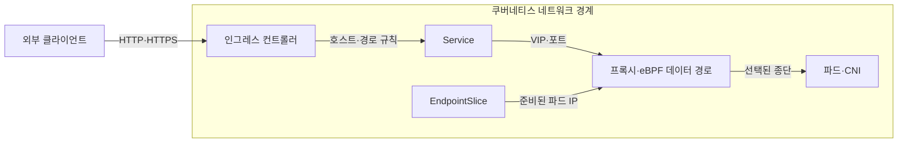
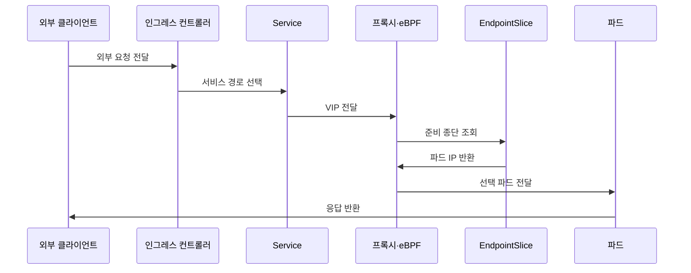

---
sidebar:
  order: 62
  label: "062. 쿠버네티스 네트워킹 - CNI·Ingress (Kubernetes Networking)"
  badge:
    text: "기출 · 50%"
    variant: note
title: "쿠버네티스 네트워킹 - CNI·Ingress (Kubernetes Networking)"
date: "2026-07-25T12:06:00+09:00"
tags:
  - "notes-network"
weight: 62
extra:
  question_no: "062"
  source_status: "기출"
  source_history: "137회"
  priority: 50
  priority_note: "설계형: 137회 CNI·Ingress·Policy 장문"
---

## 미리 알고가기

- **파드(Pod)**: 하나 이상의 컨테이너가 네트워크 이름공간과 IP 주소를 공유하는 쿠버네티스 실행 단위
- **컨테이너 네트워크 인터페이스(Container Network Interface, CNI)**: 런타임이 플러그인을 호출해 파드 인터페이스·IP·경로를 구성하는 규격
- **서비스(Service)**: 변하는 파드 집합을 고정 가상 IP와 이름으로 추상화하는 쿠버네티스 객체
- **엔드포인트슬라이스(EndpointSlice)**: 서비스가 선택한 준비된 파드의 IP·포트 목록을 분할 저장하는 객체
- **인그레스(Ingress)**: 외부 HTTP·HTTPS 요청을 서비스로 전달하는 호스트·경로 규칙 객체
- **인그레스 컨트롤러(Ingress Controller)**: Ingress 객체를 읽어 프록시·로드밸런서의 실제 전달 규칙을 구성하는 제어기
- **네트워크 정책(NetworkPolicy)**: 선택한 파드에 허용할 수신·송신 대상을 선언하는 객체
- **확장 버클리 패킷 필터(extended Berkeley Packet Filter, eBPF·이비피에프)**: Berkeley Packet Filter 앞에 확장을 뜻하는 소문자 e를 붙인 표기이며, 커널에서 패킷 전달과 정책을 실행하는 기술
- **가상 IP(Virtual IP, VIP)**: 서비스의 여러 파드 종단을 하나의 고정 주소로 나타내는 IP
- **게이트웨이 API(Gateway API)**: 인프라·경로 역할을 분리해 다양한 외부 트래픽 전달을 선언하는 쿠버네티스 API
- **쿠버네티스(Kubernetes)**: 그리스어로 조타수·항해사를 뜻하는 공식 프로젝트명이며, 파드의 배포·확장·복구와 네트워크 객체를 선언적으로 관리하는 플랫폼
- **응용 프로그래밍 인터페이스(Application Programming Interface, API)**: 소프트웨어 객체와 기능을 구조화된 요청으로 다루는 호출 규약
- **하이퍼텍스트 전송 프로토콜(Hypertext Transfer Protocol, HTTP)**: 웹 요청과 응답을 교환하는 응용 계층 프로토콜
- **보안 하이퍼텍스트 전송 프로토콜(Hypertext Transfer Protocol Secure, HTTPS)**: HTTP를 TLS로 보호해 웹 요청과 응답을 암호화하는 방식
- **전송 계층 보안(Transport Layer Security, TLS)**: 통신 상대를 인증하고 전송 데이터를 암호화하는 보안 프로토콜
- **핵심 약어 읽기와 표기**: CNI·VIP·API는 씨엔아이·브이아이피·에이피아이로 읽고 영문 머리글자를 딴 표기이며, 파드 접속 구성·고정 가상 주소·객체 호출 계약 역할을 함
- **웹 보안 약어 읽기와 표기**: HTTP·HTTPS·TLS는 에이치티티피·에이치티티피에스·티엘에스로 읽고, HTTPS의 S는 Secure를 뜻하며 외부 웹 요청과 암호화 연결 역할을 나타냄

## Ⅰ. 개요

- 정의: 파드 연결·분산·외부 진입을 추상화한다
- 배경: 변하는 파드에도 고정 서비스 경로를 제공한다

### 쉽게 이해하기 (학습용)

- 파드가 바뀌어도 Service 이름과 외부 진입 규칙은 유지돼 사용자가 같은 서비스에 접속한다

## Ⅱ. 특징

- CNI는 파드 경로를 구성해 노드 간 통신을 만든다
- Service는 파드 교체에도 고정 접근점을 유지한다
- 프록시·eBPF는 준비된 파드로 부하를 분산한다
- CNI가 정책을 미지원하면 차단 선언이 무효가 된다

### 쉽게 이해하기 (학습용)

- 정책 객체만 만들어도 CNI 플러그인이 실행 규칙으로 바꾸지 않으면 실제 패킷은 차단되지 않는다

## Ⅲ. 아키텍처 및 구성요소

| 설계 요소 | 설명 |
|:---|:---|
| 인그레스 컨트롤러 | 외부 호스트·경로·TLS 규칙 실행 |
| Service | VIP로 파드 집합의 고정 접근점 제공 |
| EndpointSlice | 준비된 파드 IP·포트 목록 관리 |
| 프록시·eBPF 데이터 경로 | VIP 트래픽을 선택한 종단으로 변환 |
| 파드·CNI | 파드 인터페이스·IP·경로 구성 |

> 요약: 외부 규칙과 준비 종단을 데이터 경로로 연결한다

### 쉽게 이해하기 (학습용)

- 외부 요청은 인그레스가 서비스를 고르고 데이터 경로가 준비된 파드 하나로 보낸다

## Ⅳ. 원리 및 절차 흐름도

| 절차 | 설명 |
|:---|:---|
| 외부 요청 전달 | 호스트·경로·TLS 규칙과 일치 확인 |
| 서비스 경로 선택 | Ingress 백엔드 Service 결정 |
| VIP 전달 | 서비스 가상 IP·포트로 요청 전달 |
| 준비 종단 조회 | EndpointSlice에서 정상 파드 조회 |
| 파드 IP 반환 | 선택 가능한 파드 주소 제공 |
| 선택 파드 전달 | 데이터 경로가 목적 IP로 변환·전송 |
| 응답 반환 | 역변환 경로로 클라이언트에 응답 |

> 요약: 외부 요청을 준비된 파드 종단까지 전달한다

### 쉽게 이해하기 (학습용)

- 준비 상태가 실패한 파드는 후보 목록에서 빠져 정상 파드에만 요청이 전달된다

## Ⅴ. 종류 및 비교

| 판단 기준 | Ingress | Gateway API |
|:---|:---|:---|
| 핵심 특징 | HTTP·HTTPS 경로 객체 | 역할 분리형 다중 프로토콜 API |
| 적용 기준 | 단순 웹 서비스 외부 노출 | 다중 팀·고급 경로 정책 |
| 주요 위험 | 구현별 확장 기능 종속 | 객체·권한 설계 복잡성 |

> 요약: 단순 웹은 Ingress, 역할 분리는 Gateway API다

### 쉽게 이해하기 (학습용)

- 한 팀의 단순 웹 경로는 Ingress, 플랫폼팀과 응용팀이 권한을 나누면 Gateway API가 맞다

## Ⅵ. 실무 사례

1. Ingress부터 EndpointSlice까지 장애를 추적한다
2. Gateway API로 멀티팀 경로 권한을 분리한다

### 쉽게 이해하기 (학습용)

- 외부 주소가 정상이어도 EndpointSlice에 준비된 파드가 없으면 요청은 전달되지 않는다
- 플랫폼팀은 게이트웨이를, 응용팀은 자기 경로만 관리하도록 권한을 나눈다

## Ⅶ. 결론

- 종단 준비·정책 집행으로 서비스 경로를 검증한다

### 쉽게 이해하기 (학습용)

- 객체 상태뿐 아니라 준비된 파드까지 실제 패킷이 도달하는지 확인한다
