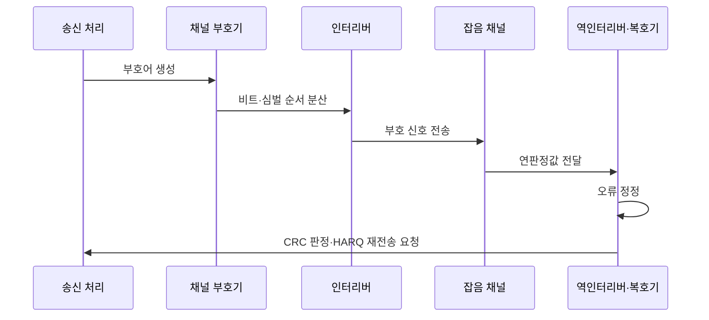

---
sidebar:
  order: 63
  label: "063. 채널 코딩 — 해밍·리드-솔로몬·터보 (Channel Coding)"
  badge:
    text: "기출 · 30%"
    variant: note
title: "채널 코딩 — 해밍·리드-솔로몬·터보 (Channel Coding)"
date: "2026-07-27T23:59:59+09:00"
tags:
  - "notes-network"
weight: 63
extra:
  question_no: "063"
  source_status: "기출"
  source_history: "129회"
  priority: 30
  priority_note: "비교형: 125·129회 FEC·Channel Coding"
---

## 미리 알고가기

- **순방향 오류 정정(Forward Error Correction, FEC)**: 송신자가 중복 부호를 더해 수신자가 재전송 없이 일정 범위의 오류를 정정하는 방식
- **혼성 자동 재전송 요청(Hybrid Automatic Repeat Request, HARQ)**: FEC 복호와 오류 패킷 재전송·결합을 함께 사용하는 방식
- **순환 중복 검사(Cyclic Redundancy Check, CRC)**: 다항식 나눗셈의 나머지로 수신 블록의 잔여 오류를 검출하는 방식
- **부호율(Code Rate)**: 정보 비트 수를 전체 부호어 비트 수로 나눈 값이며 낮을수록 중복이 많음
- **최소 거리(Minimum Distance)**: 서로 다른 유효 부호어 사이의 최소 해밍 거리로 검출·정정 한계를 결정하는 값
- **인터리버(Interleaver)**: 연속된 비트·심벌의 순서를 흩어 버스트 오류를 분산하는 기능
- **연판정(Soft Decision)**: 수신 비트를 0·1로 확정하지 않고 각 값의 가능도와 함께 복호하는 방식
- **비트 오류율(Bit Error Rate, BER)**: 전체 수신 비트 중 잘못 판정된 비트의 비율
- **블록 오류율(Block Error Rate, BLER)**: 전체 수신 블록 중 하나 이상의 오류가 남은 블록의 비율
- **코딩 이득(Coding Gain)**: 같은 오류율을 달성할 때 무부호 전송보다 줄어드는 요구 신호대잡음비
- **터보 부호(Turbo Code)**: 인터리버로 연결한 구성 부호기의 확률 정보를 반복 교환해 복호하는 채널 부호
- **FEC·HARQ·CRC**: FEC는 수신 오류를 정정하고, HARQ는 정정과 재전송을 결합하며, CRC는 복호 후 남은 오류를 검출함
- **BER·BLER**: 각각 전체 비트와 블록 중 오류가 발생한 비율을 나타내는 전송 품질 지표
- **신호대잡음비(Signal-to-Noise Ratio, SNR·에스엔알)**: 영문 핵심 단어의 머리글자를 딴 표기이며, 코딩 이득과 목표 오류율에 필요한 수신 신호 품질을 나타냄

## Ⅰ. 개요

- 정의: **중복 부호**로 채널 오류를 검출·정정
- 기존 한계: 무부호 전송의 **오류 복원 불가**

### 쉽게 이해하기 (학습용)

- 원본에 규칙적인 힌트를 더 보내 수신기가 일부 데이터가 깨져도 원래 값을 추정하게 함

## Ⅱ. 특징

- **부호율**에 따른 오류 복원·전송률 상충
- **최소 거리**에 따른 검출·정정 한계
- **인터리빙**을 통한 버스트 오류 분산

### 쉽게 이해하기 (학습용)

- 중복을 많이 넣으면 오류에는 강해지지만 같은 정보를 보내는 데 더 많은 시간과 대역폭이 필요함

## Ⅲ. 아키텍처 및 구성요소

| 설계 요소 | 설명 |
|:---|:---|
| 채널 부호기 | 정보에 패리티를 추가해 부호어 생성 |
| 인터리버 | 인접 심벌 순서 분산 |
| 잡음 채널 | 전송 신호에 잡음·페이딩·오류 추가 |
| 역인터리버·복호기 | 순서를 복원하고 연판정값으로 오류 정정 |

> 요약: 중복·순서 분산으로 채널 오류를 복원한다

### 쉽게 이해하기 (학습용)

- 송신자가 규칙적인 힌트를 넣고 순서를 섞으면 수신기는 흩어진 오류를 힌트로 되돌린다

## Ⅳ. 원리 및 절차 흐름도

| 절차 | 설명 |
|:---|:---|
| 부호어 생성 | 선택한 부호율로 패리티 추가 |
| 비트·심벌 순서 분산 | 연속 오류가 다른 부호어 위치로 퍼지게 함 |
| 부호 신호 전송 | 잡음·페이딩 채널을 통과 |
| 연판정값 전달 | 비트별 가능도를 복호기에 제공 |
| 오류 정정 | 부호 제약에 맞는 정보 후보 선택 |
| CRC·HARQ 판정 | CRC 실패 시 HARQ 재전송을 요청 |

> 요약: 채널 품질에 맞는 부호로 오류를 정정한다

### 쉽게 이해하기 (학습용)

- CRC가 실패하면 복호 결과를 신뢰하지 않고 HARQ 재전송이나 더 강한 부호율을 선택함

## Ⅴ. 종류 및 비교

| 채널 부호 비교 | 해밍 | 리드-솔로몬 | 터보 |
|:---|:---|:---|:---|
| 적용 기준 | 짧은 블록·낮은 복호 비용 | 연속 심벌 오류 채널 | 코딩 이득 우선 장거리 링크 |
| 핵심 특징 | 신드롬 기반 비트 오류 정정 | 심벌 기반 버스트 오류 정정 | 연판정 정보 반복 복호 |
| 한계 | 다중 비트 정정 한계 | 큰 심벌 연산량 | 반복 복호 지연·전력 |

> 요약: 오류 형태와 복호 비용에 맞춰 부호를 고른다

### 쉽게 이해하기 (학습용)

- 해밍은 한 비트, 리드-솔로몬은 묶음 심벌, 터보는 긴 비트열의 확률을 반복 계산해 복구함

## Ⅵ. 실무 사례

1. 위성 링크의 **터보 반복 횟수** 제한

### 쉽게 이해하기 (학습용)

- 반복 복호를 늘리되 제어 응답 시간과 단말 전력을 넘기기 전에 멈춘다

## Ⅶ. 결론

- 잡음 채널의 비트 오류를 허용 수준으로 낮추기 위해 오류 형태·부호율·복호 지연·연산·전력을 검토하여, 서비스 제약 안에서 목표 오류율을 만족하는 채널 부호를 선택해야 한다.

### 쉽게 이해하기 (학습용)

- 가장 강한 부호보다 정해진 지연과 전력 안에서 필요한 오류율을 만족하는 부호가 적합함
