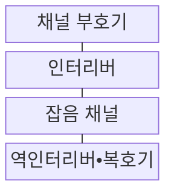
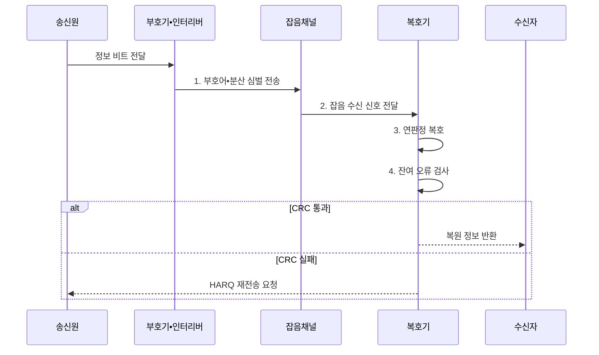

---
sidebar:
  order: 63
  label: "063. 채널 코딩 : 해밍•리드-솔로몬•터보 (Channel Coding)"
  badge:
    text: "기출 • 30%"
    variant: note
title: "채널 코딩 : 해밍•리드-솔로몬•터보 (Channel Coding)"
date: "2026-08-03T08:48:47+09:00"
tags:
  - "notes-network"
weight: 63
extra:
  question_no: "063"
  source_status: "기출"
  source_history: "129회"
  priority: 30
  priority_note: "비교형: 125•129회 FEC•Channel Coding"
---

## Ⅰ. 개요

핵심 용어

- **채널 코딩(Channel Coding)**: 전송 데이터에 제어된 중복을 추가해 오류를 검출하거나 정정하도록 하는 부호화 기술
- **순방향 오류 정정(Forward Error Correction, FEC)**: 송신자가 중복 부호를 더해 수신자가 재전송 없이 일정 범위의 오류를 정정하는 방식

- 정의/개념: 중복 부호로 전송 오류를 복구하는 **순방향 오류 정정 기법**
- 배경/필요성: 무부호 전송의 **오류 복원 불가**

#### 한줄 요약

- 원본에 규칙적인 힌트를 더 보내 수신기가 일부 데이터가 깨져도 원래 값을 추정하게 함

## Ⅱ. 특징

핵심 용어

- **부호율(Code Rate)**: 정보 비트 수를 전체 부호어 비트 수로 나눈 값이며 낮을수록 중복이 많음
- **최소 거리(Minimum Distance)**: 서로 다른 유효 부호어 사이의 최소 해밍 거리로 검출•정정 한계를 결정하는 값
- **인터리버(Interleaver)**: 연속된 비트•심벌의 순서를 흩어 버스트 오류를 분산하는 기능

- **부호율 상충**: 중복 증가로 복원력 향상•전송률 감소
- **거리 한계**: 최소 거리로 검출•정정 가능 오류 결정
- **오류 분산**: 인터리빙으로 버스트 오류 위치 분산

#### 한줄 요약

- 중복을 많이 넣으면 오류에는 강해지지만 같은 정보를 보내는 데 더 많은 시간과 대역폭이 필요함

## Ⅲ. 구조 및 구성요소

핵심 용어

- **순환 중복 검사(Cyclic Redundancy Check, CRC)**: 다항식 나눗셈의 나머지로 수신 블록의 잔여 오류를 검출하는 방식
- **신드롬(Syndrome)**: 수신 부호어와 패리티 검사식으로 계산한 오류 위치 정보
- **블록 길이(Block Length)**: 하나의 부호어를 구성하는 전체 비트나 심벌 수

| 구성요소 | 책임 |
|:---|:---|
| 채널 부호기 | 정보에 패리티를 추가해 부호어 생성 |
| 인터리버 | 인접 심벌 순서 분산 |
| 잡음 채널 | 전송 신호에 잡음•페이딩•오류 추가 |
| 역인터리버•복호기 | 순서를 복원하고 연판정값으로 오류 정정 |

#### 한줄 요약

- 송신자가 규칙적인 힌트를 넣고 순서를 섞으면 수신기는 흩어진 오류를 힌트로 되돌린다

## Ⅳ. 흐름도

핵심 용어

- **연판정(Soft Decision)**: 수신 비트를 0•1로 확정하지 않고 각 값의 가능도와 함께 복호하는 방식
- **혼성 자동 재전송 요청(Hybrid Automatic Repeat Request, HARQ)**: 순방향 오류 정정(Forward Error Correction, FEC) 복호와 오류 패킷 재전송•결합을 함께 사용하는 방식
- **순환 중복 검사(Cyclic Redundancy Check, CRC)**: 복호 후 남은 오류를 다항식 나눗셈의 나머지로 검출하는 방식

**동작 원리**

1. **부호어•분산 심벌 전송**: 패리티 추가 후 심벌 순서 분산
2. **잡음 수신 신호 전달**: 페이딩을 거친 신호 제공
3. **연판정 복호**: 가능도와 부호 제약으로 정보 후보 선택
4. **잔여 오류 검사**: CRC로 복호 후 오류 검출

#### 한줄 요약

- CRC가 실패하면 복호 결과를 신뢰하지 않고 HARQ 재전송이나 더 강한 부호율을 선택함

## Ⅴ. 종류 및 비교

핵심 용어

- **해밍 부호(Hamming Code)**: 패리티 검사식의 신드롬으로 제한된 비트 오류를 정정하는 블록 부호
- **리드-솔로몬 부호(Reed-Solomon Code, RS)**: 유한체 심벌 단위로 버스트 오류를 정정하는 블록 부호
- **터보 부호(Turbo Code)**: 인터리버로 연결한 구성 부호기의 확률 정보를 반복 교환해 복호하는 채널 부호

| 채널 부호 비교 | **해밍** | **리드-솔로몬** | **터보** |
|:---|:---|:---|:---|
| 적용 기준 | 짧은 블록•낮은 복호 비용 | 연속 심벌 오류 채널 | 코딩 이득 우선 장거리 링크 |
| 핵심 특징 | 신드롬 기반 비트 오류 정정 | 심벌 기반 버스트 오류 정정 | 연판정 정보 반복 복호 |
| 한계 | 다중 비트 정정 한계 | 큰 심벌 연산량 | 반복 복호 지연•전력 |

> 요약: 오류 형태와 복호 비용에 맞춰 부호를 고른다

#### 한줄 요약

- 해밍은 한 비트, 리드-솔로몬은 묶음 심벌, 터보는 긴 비트열의 확률을 반복 계산해 복구함

## Ⅵ. 실무 고려사항 및 대책

핵심 용어

- **비트 오류율(Bit Error Rate, BER)**: 전체 수신 비트 중 잘못 판정된 비트의 비율
- **블록 오류율(Block Error Rate, BLER)**: 전체 수신 블록 중 하나 이상의 오류가 남은 블록의 비율
- **코딩 이득(Coding Gain)**: 같은 오류율을 달성할 때 무부호 전송보다 줄어드는 요구 신호대잡음비

| 문제 | 대책 | 효과 |
|:---|:---|:---|
| 오류 환경과 부호율이 불일치 | **BER•BLER•지연별 부호율•블록 길이** 시험 | 복호 성공률 확보 |
| 반복 복호 증가로 서비스 지연 초과 | **서비스 기한 내 반복 횟수** 제한 | 종단 지연 보호 |
| 강한 부호의 복호 연산량 과다 | **처리량•전력 기준** 구현 비교 | 코딩 이득 대비 **수신 자원 최적화** |

#### 한줄 요약

- 반복 복호를 늘리되 제어 응답 시간과 단말 전력을 넘기기 전에 멈춘다

## Ⅶ. 결론

핵심 용어

- **페이딩(Fading)**: 전파 경로 변화로 수신 신호의 세기와 위상이 변하는 현상
- **신뢰성•처리량 절충**: 중복을 늘리면 오류 내성은 커지지만 유효 데이터율은 감소하는 관계

- 채널 페이딩과 오류 형태에 따라 단일 비트•저비용은 **해밍**, 버스트는 **리드-솔로몬 부호(Reed-Solomon Code, RS)**, 코딩 이득은 **터보** 선택

#### 한줄 요약

- 오류 복원 이득과 추가 비트•복호 지연을 함께 비교해 채널 부호를 정해야 한다.
