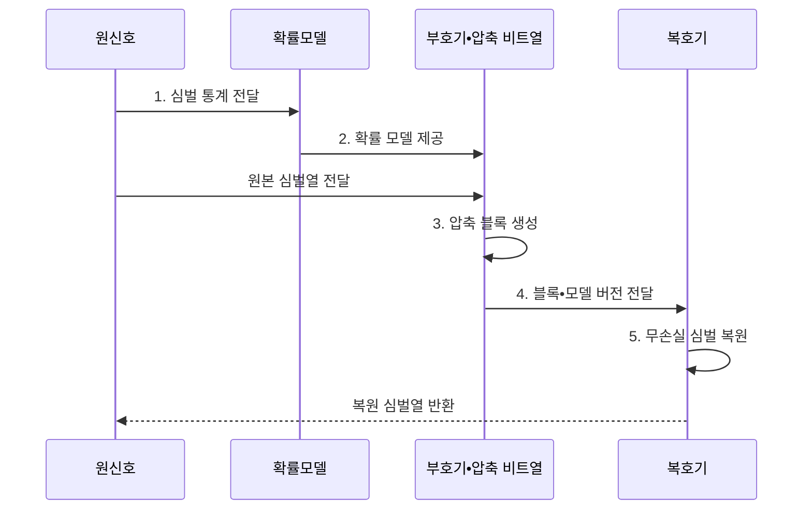

---
sidebar:
  order: 64
  label: "064. 소스 코딩 : 허프만•산술 (Source Coding)"
  badge:
    text: "기출 • 30%"
    variant: note
title: "소스 코딩 : 허프만•산술 (Source Coding)"
date: "2026-08-05T01:30:12+09:00"
tags:
  - "notes-network"
weight: 64
extra:
  question_no: "064"
  source_status: "기출"
  source_history: "129회"
  priority: 30
  priority_note: "비교형: 129회 Source•Channel Coding"
---

## Ⅰ. 개요

<details><summary>핵심 용어</summary>

- **소스 코딩(Source Coding)**: 소스는 원천 정보, 코딩은 부호화를 뜻하며 정보원의 통계적 중복을 제거하는 역할
- **엔트로피(Entropy)**: 정보원에서 심벌 하나를 표현하는 데 필요한 평균 정보량의 이론적 하한

</details>

- 정의/개념: 정보원의 통계적 중복을 제거하는 **무손실 압축 기법**
- 배경/필요성: 원시 표현의 **저장•전송 낭비**

#### 한줄 요약

- 자주 나오는 심벌은 짧게, 드문 심벌은 길게 표현해 전체 데이터 길이를 줄임

## Ⅱ. 특징

<details><summary>핵심 용어</summary>

- **심벌(Symbol)**: 부호화가 구분해 확률과 코드를 부여하는 문자•값•토큰 단위
- **접두 부호(Prefix Code)**: 어떤 부호어도 다른 부호어의 시작 부분이 아니어서 구분자 없이 복호 가능한 부호
- **확률 모델(Probability Model)**: 심벌이나 문맥별 발생 확률을 부호기•복호기에 제공하는 모델

</details>

- **확률 부호화**: 발생 확률에 따라 가변 길이 배정
- **이론 하한**: 엔트로피로 평균 부호 길이 한계 결정
- **모델 동기화**: 송수신 확률 모델 일치로 원본 복원

#### 한줄 요약

- 데이터 분포와 다른 코드표를 쓰면 압축이 거의 되지 않거나 원본보다 커질 수도 있음

## Ⅲ. 구조 및 구성요소

<details><summary>핵심 용어</summary>

- **코드북(Codebook)**: 심벌과 부호어의 대응 관계를 기록한 표
- **문맥 모델(Context Model)**: 앞선 심벌에 따라 다음 심벌의 확률을 추정하는 모델
- **고정 정밀도 연산(Fixed-precision Arithmetic)**: 정해진 비트 폭에서 확률 구간을 계산하는 구현 방식
- **순환 중복 검사(Cyclic Redundancy Check, CRC)**: 압축 블록에 남은 오류를 다항식 나눗셈의 나머지로 검출하는 방식

</details>

```text
[확률 모델]---[소스 부호기]---[블록•재시작 경계]---[소스 복호기]
```

선의 의미: 각 선은 심벌•문맥 확률, 압축 비트열, 모델•길이•CRC•초기 상태와 동일 조건으로 원본을 복원하는 복호기의 결속 관계를 나타낸다.

| 구성요소 | 책임 |
|:---|:---|
| 확률 모델 | 심벌•문맥 확률 추정 |
| 소스 부호기 | 트리•확률 구간으로 비트열 생성 |
| 블록•재시작 경계 | 모델•길이•CRC와 복호 초기점 제공 |
| 소스 복호기 | 동일 모델•초기 상태로 심벌열 복원 |

#### 한줄 요약

- 송신기와 수신기의 확률 모델과 초기 상태가 같아야 같은 비트열에서 같은 심벌을 복원함

## Ⅳ. 흐름도

<details><summary>핵심 용어</summary>

- **재시작 지점(Restart Point)**: 복호 상태를 초기화해 비트 오류의 전파 범위를 제한하는 블록 경계

</details>



**동작 원리**

1. **심벌 통계 전달**: 빈도•문맥을 모델 학습에 제공
2. **확률 모델 제공**: 코드표•누적 확률을 부호기에 제공
3. **압축 블록 생성**: 부호 비트•경계•CRC 결합
4. **블록•모델 버전 전달**: 복호 조건과 압축 비트 제공
5. **무손실 심벌 복원**: 동일 모델과 초기 상태로 역변환

#### 한줄 요약

- 블록 경계가 없으면 한 비트 오류가 후속 복호로 번짐

## Ⅴ. 종류 및 비교

<details><summary>핵심 용어</summary>

- **허프만 부호화(Huffman Coding)**: 확률이 큰 심벌에 짧은 접두 부호를 배정하는 무손실 압축 방식
- **산술 부호화(Arithmetic Coding)**: 심벌열 전체를 누적 확률의 부분 구간 하나로 표현하는 무손실 압축 방식

</details>

| 소스 부호 비교 | **허프만** | **산술 코딩** |
|:---|:---|:---|
| 적용 기준 | 단순•고속 복호 우선 | 엔트로피 근접 압축 우선 |
| 핵심 특징 | 심벌별 정수 길이 접두 부호 | 심벌열의 누적 확률 구간 |
| 한계 | 정수 길이로 인한 압축 손실 | 오류 전파•정밀 연산 비용 |

> 요약: 단순성은 허프만, 압축률은 산술이 유리하다

#### 한줄 요약

- 심벌 확률이 비정형일수록 산술 코딩이 압축에 유리함

## Ⅵ. 실무 고려사항 및 대책

<details><summary>핵심 용어</summary>

- **오류 전파(Error Propagation)**: 압축 비트열의 작은 손상이 이후 여러 심벌의 잘못된 복호로 이어지는 현상
- **모델 불일치(Model Mismatch)**: 실제 심벌 분포와 압축 모델의 확률 추정이 달라 압축 효율이 낮아지는 상태

</details>

| 문제 | 대책 | 효과 |
|:---|:---|:---|
| 실제 분포와 확률 모델 불일치 | **코드북•모델 재학습 기준** 정의 | 저장•전송 효율 유지 |
| 비트 오류가 후속 심벌로 전파 | **재시작 지점•CRC** 삽입 | 오류 전파 범위 제한 |
| 부호기와 복호기의 버전 불일치 | **형식•코드북•버전** 함께 전달 | 데이터 복원성 확보 |

#### 한줄 요약

- 빈도표로 접두 부호를 만들고 빠른 복호가 필요한 로그 블록에 적용한다

## Ⅶ. 결론

<details><summary>핵심 용어</summary>

- **무손실 복원(Lossless Reconstruction)**: 압축 해제 후 원본 비트열을 완전히 동일하게 복구하는 성질
- **엔트로피 한계(Entropy Bound)**: 무손실 부호의 평균 길이가 정보원 엔트로피보다 작을 수 없다는 이론적 경계

</details>

- 단순•고속 복호는 **허프만**, 엔트로피 근접 압축은 **산술** 선택

#### 한줄 요약

- 압축률•복호 비용•오류 전파 범위와 복호기 호환성을 함께 판단해야 한다.
