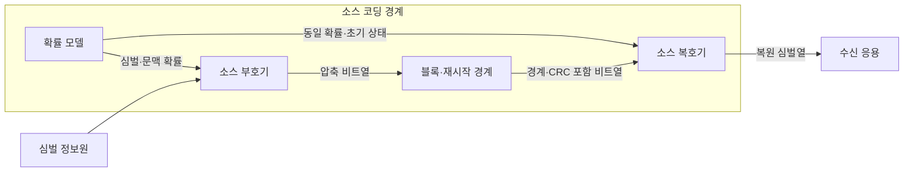
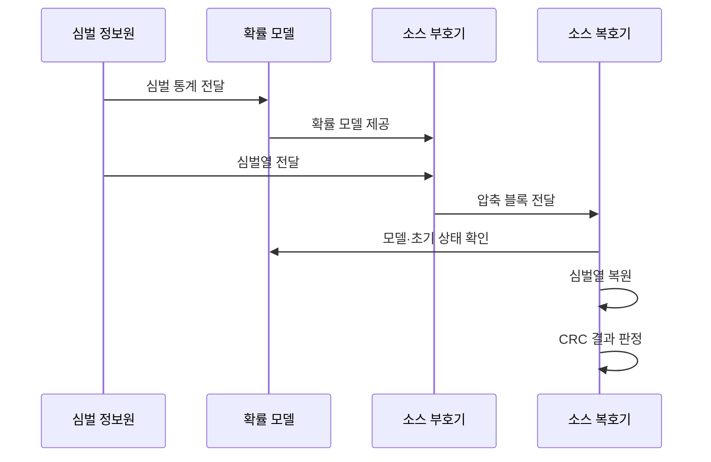

---
sidebar:
  order: 64
  label: "064. 소스 코딩 — 허프만·산술 (Source Coding)"
  badge:
    text: "기출 · 30%"
    variant: note
title: "소스 코딩 — 허프만·산술 (Source Coding)"
date: "2026-07-25T12:10:00+09:00"
tags:
  - "notes-network"
weight: 64
extra:
  question_no: "064"
  source_status: "기출"
  source_history: "129회"
  priority: 30
  priority_note: "비교형: 129회 Source·Channel Coding"
---

## 미리 알고가기

- **엔트로피(Entropy)**: 정보원에서 심벌 하나를 표현하는 데 필요한 평균 정보량의 이론적 하한
- **심벌(Symbol)**: 부호화가 구분해 확률과 코드를 부여하는 문자·값·토큰 단위
- **허프만 부호화(Huffman Coding)**: 확률이 큰 심벌에 짧은 접두 부호를 배정하는 무손실 압축 방식
- **산술 부호화(Arithmetic Coding)**: 심벌열 전체를 누적 확률의 부분 구간 하나로 표현하는 무손실 압축 방식
- **접두 부호(Prefix Code)**: 어떤 부호어도 다른 부호어의 시작 부분이 아니어서 구분자 없이 복호 가능한 부호
- **확률 모델(Probability Model)**: 심벌이나 문맥별 발생 확률을 부호기·복호기에 제공하는 모델
- **재시작 지점(Restart Point)**: 복호 상태를 초기화해 비트 오류의 전파 범위를 제한하는 블록 경계
- **순환 중복 검사(Cyclic Redundancy Check, CRC·씨알씨)**: 영문 머리글자를 딴 표기이며, 다항식 나눗셈의 나머지로 압축 블록의 잔여 오류를 검출하는 방식

## Ⅰ. 개요

- 정의: 정보원의 통계적 중복을 줄이는 부호화다
- 배경: 무손실 데이터의 저장·전송 비용을 줄인다

### 쉽게 이해하기 (학습용)

- 자주 나오는 심벌은 짧게, 드문 심벌은 길게 표현해 전체 데이터 길이를 줄임

## Ⅱ. 특징

- 엔트로피는 평균 부호 길이의 압축 하한을 정한다
- 모델 오차는 부호를 늘려 저장·전송 비용을 높인다

### 쉽게 이해하기 (학습용)

- 데이터 분포와 다른 코드표를 쓰면 압축이 거의 되지 않거나 원본보다 커질 수도 있음

## Ⅲ. 아키텍처 및 구성요소

| 설계 요소 | 설명 |
|:---|:---|
| 확률 모델 | 심벌·문맥 확률 추정 |
| 소스 부호기 | 트리·확률 구간으로 비트열 생성 |
| 블록·재시작 경계 | 모델·길이·CRC와 복호 초기점 제공 |
| 소스 복호기 | 동일 모델·초기 상태로 심벌열 복원 |

> 요약: 같은 확률 모델과 경계로 심벌열을 복원한다

### 쉽게 이해하기 (학습용)

- 송신기와 수신기의 확률 모델과 초기 상태가 같아야 같은 비트열에서 같은 심벌을 복원함

## Ⅳ. 원리 및 절차 흐름도

| 절차 | 설명 |
|:---|:---|
| 심벌 통계 전달 | 빈도·문맥을 모델 학습에 제공 |
| 확률 모델 제공 | 코드표·누적 확률을 부호기에 제공 |
| 심벌열 전달 | 압축할 원본 순서를 입력 |
| 압축 블록 전달 | 부호 비트·경계·CRC를 함께 전달 |
| 모델·초기 상태 확인 | 송수신 확률 모델과 시작 상태 일치 |
| 심벌열 복원 | 트리·확률 구간을 역해석 |
| CRC 결과 판정 | 오류 블록 폐기·재전송 결정 |

> 요약: 확률 모델을 맞춰 부호화·복호를 동기화한다

### 쉽게 이해하기 (학습용)

- 블록 경계가 없으면 한 비트 오류가 후속 복호로 번짐

## Ⅴ. 종류 및 비교

| 판단 기준 | 허프만 | 산술 코딩 |
|:---|:---|:---|
| 핵심 특징 | 심벌별 정수 길이 접두 부호 | 심벌열의 누적 확률 구간 |
| 적용 기준 | 단순·고속 복호 우선 | 엔트로피 근접 압축 우선 |
| 주요 위험 | 확률 편향에서 길이 손실 | 오류 전파·정밀 연산 비용 |

> 요약: 단순성은 허프만, 압축률은 산술이 유리하다

### 쉽게 이해하기 (학습용)

- 심벌 확률이 비정형일수록 산술 코딩이 압축에 유리함

## Ⅵ. 실무 사례

1. 로그를 허프만으로 빠르게 무손실 압축한다
2. 재시작 지점으로 위성 데이터 오류 전파를 줄인다

### 쉽게 이해하기 (학습용)

- 빈도표로 접두 부호를 만들고 빠른 복호가 필요한 로그 블록에 적용한다
- 비트 오류가 나도 다음 재시작 지점부터 다시 복호해 손상 범위를 줄인다

## Ⅶ. 결론

- 압축률·복호 비용·오류 전파로 부호를 선택한다

### 쉽게 이해하기 (학습용)

- 필요한 속도·복구 범위에 맞춰 압축 방식을 선택한다
