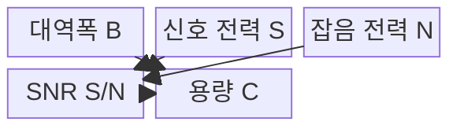
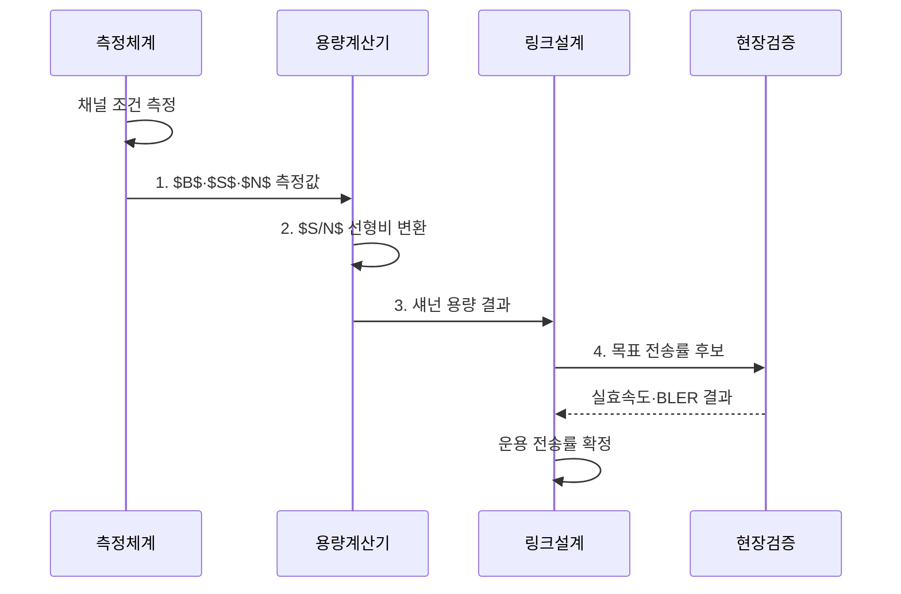

---
sidebar:
  order: 65
  label: "065. 채널 용량 : 섀넌 한계 (Shannon Channel Capacity)"
  badge:
    text: "기출 · 50%"
    variant: note
title: "채널 용량 : 섀넌 한계 (Shannon Channel Capacity)"
date: "2026-08-02T14:05:00+09:00"
tags:
  - "notes-network"
weight: 65
extra:
  question_no: "065"
  source_status: "기출"
  source_history: "135회"
  priority: 50
  priority_note: "설명·계산형: 135회 Shannon 용량 직접 출제"
---

## Ⅰ. 개요

핵심 용어

- **채널 용량(Channel Capacity)**: 채널 부호를 충분히 길게 설계할 때 신뢰성 있게 전달 가능한 최대 정보율 $C$
- **섀넌 한계(Shannon Limit)**: 주어진 채널에서 오류 확률을 임의로 낮출 수 있는 정보 전송률의 이론적 경계

- 정의/개념: AWGN 채널이 신뢰성 있게 전달할 **최대 정보율의 이론 경계**
- 배경/필요성: 경험적 속도 산정의 **가능성 오판**

#### 한줄 요약

- 주어진 주파수 폭과 신호 품질로 아무리 좋은 변조·코딩을 써도 넘을 수 없는 정보율 경계임

## Ⅱ. 특징

핵심 용어

- **대역폭(Bandwidth)**: 채널이 사용하는 주파수 범위 $B$
- **신호대잡음비(Signal-to-Noise Ratio, SNR)**: 수신 신호 전력 $S$를 같은 대역의 잡음 전력 $N$으로 나눈 비율
- **로그 관계(Logarithmic Relationship)**: SNR 증가에 따른 용량 증가가 로그 함수 형태로 점차 둔화되는 관계

> 파란 1MHz와 붉은 2MHz 선은 대역폭을 두 배로 하면 용량도 두 배가 되지만 SNR 증가는 로그 형태로 용량을 높이는 이론 상한이며, 실제 변조·부호화 처리량은 이보다 낮다.

- **달성 가능 영역**: 용량 미만에서 오류 확률 감소
- **불가능 영역**: 용량 초과에서 신뢰 통신 불가
- **로그 관계**: 대역폭은 선형, SNR은 로그로 기여

#### 한줄 요약

- 송신 전력을 두 배로 늘려도 로그 관계 때문에 용량이 두 배가 되지는 않음

## Ⅲ. 구조 및 구성요소

핵심 용어

- **가산 백색 가우스 잡음(Additive White Gaussian Noise, AWGN)**: 신호에 더해지며 주파수별 전력 밀도가 일정하고 진폭이 가우스 분포인 잡음
- **수식 기호 읽기와 역할**: $C$·$B$·$S$·$N$은 씨·비·에스·엔으로 읽고 Capacity·Bandwidth·Signal·Noise의 머리글자를 딴 기호이며, 용량·대역폭·신호 전력·잡음 전력을 뜻함

| 구성요소 | 책임 |
|:---|:---|
| 대역폭 B | 채널 사용 주파수 폭 |
| 신호 전력 S | 유효 수신 신호 전력 |
| 잡음 전력 N | 대역 내 누적 잡음 |
| SNR S/N | 신호 전력과 잡음 전력의 선형 비 |
| 용량 C | $B\log_2(1+S/N)$ bit/s |

#### 한줄 요약

- SNR은 dB 값을 식에 바로 넣지 않고 선형 전력비로 변환해 계산해야 함

## Ⅳ. 흐름도

핵심 용어

- **구현 격차(Implementation Gap)**: 이론 한계와 실제 변조·부호·수신기가 요구하는 SNR의 차이
- **타당성 여유(Feasibility Margin)**: 요구 전송률과 이론 채널 용량 사이에 확보한 차이

**동작 원리**

1. **$B$·$S$·$N$ 측정값**: 대역폭과 수신 전력 수집
2. **$S/N$ 선형비 변환**: dB 값을 선형 전력비로 변환
3. **섀넌 용량 결과**: $C=B\log_2(1+S/N)$ 적용
4. **목표 전송률 후보**: 구현 격차를 차감한 속도 설정
#### 한줄 요약

- 섀넌 식은 장비 속도가 아닌 이론 상한을 제시함

## Ⅴ. 종류 및 비교

핵심 용어

- **대역폭 증대**: 사용 주파수 범위를 넓혀 용량을 거의 선형적으로 높이는 접근
- **SNR 증대**: 송신 전력이나 수신 품질을 개선해 용량을 로그적으로 높이는 접근

| 용량 확장 수단 | **대역폭 확대** | **SNR 개선** |
|:---|:---|:---|
| 적용 기준 | 추가 주파수 확보 비용이 낮음 | 전력·안테나 개선 비용이 낮음 |
| 핵심 특징 | 주파수 자유도 확대 | 신호대잡음비 향상 |
| 한계 | 대역 확보 비용·잡음 증가 | 전력 규제·로그 한계효용 |

> 요약: 대역 확보비와 전력 개선비로 확장 수단을 정한다

#### 한줄 요약

- 대역을 넓히면 잡음 전력도 늘 수 있어 SNR을 고정한 단순 선형 증가로만 보면 안 됨

## Ⅵ. 실무 고려사항 및 대책

핵심 용어

- **스펙트럼 효율(Spectral Efficiency)**: 단위 대역폭당 정보 전송률을 나타내는 bit/s/Hz 값
- **블록 오류율(Block Error Rate, BLER)**: 전체 수신 블록 중 하나 이상의 오류가 남은 블록의 비율
- **굿풋(Goodput)**: 헤더·재전송을 제외하고 응용에 실제 전달된 유효 정보율

| 문제 | 대책 | 효과 |
|:---|:---|:---|
| 이론 용량을 실효속도로 오인 | **부호·프로토콜 오버헤드** 차감 | 용량 계획 현실화 |
| 전력 증가만으로 용량 확대 시도 | **대역폭·SNR 한계 이득** 비교 | 투자 효율 향상 |
| 평균 SNR이 시간·위치 변동 은폐 | **시간·위치별 SNR 백분위** 측정 | 서비스 품질 예측 |

#### 한줄 요약

- 대역폭과 신호 대 잡음비로 계산한 이론 상한에서 부호화·재전송 손실을 제외해 실제 목표 전송률을 정한다

## Ⅶ. 결론

핵심 용어

- **프로토콜 오버헤드(Protocol Overhead)**: 헤더·제어·재전송으로 소모되어 유효 정보에 쓰이지 않는 전송량
- **실제 굿풋**: 오버헤드·오류·재전송·구현 손실을 반영해 사용자가 얻는 유효 전송률

- 계산 용량에서 **구현 격차·오버헤드**를 차감해 목표 전송률 확정

#### 한줄 요약

- 샤논 한계는 이상적 상한이므로 실제 속도에서는 부호와 프로토콜 비용을 빼야 한다.
