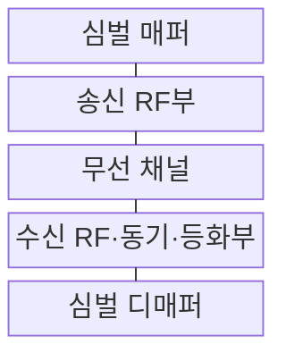
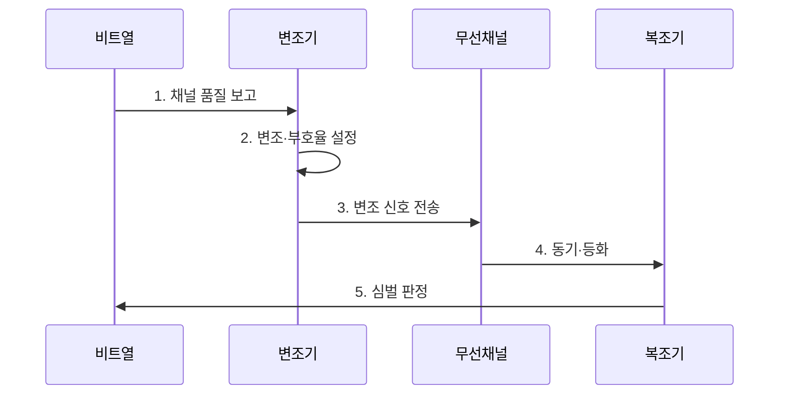

---
sidebar:
  order: 66
  label: "066. 변조 방식 : AM·FM·QAM·QPSK (Modulation Methods)"
  badge:
    text: "미출 · 30%"
    variant: note
title: "변조 방식 : AM·FM·QAM·QPSK (Modulation Methods)"
date: "2026-07-29T23:30:00+09:00"
tags:
  - "notes-network"
weight: 66
extra:
  question_no: "066"
  source_status: "미출"
  source_history: ""
  priority: 30
  priority_note: "비교형: 변조 선택의 대역폭·잡음 기준"
---

## 미리 알고가기

- **변조(Modulation)**: 정보를 반송파의 진폭·주파수·위상 변화에 대응시켜 전송 가능한 파형으로 바꾸는 과정
- **진폭 변조(Amplitude Modulation, AM)**: 정보 신호에 따라 반송파 진폭을 연속적으로 바꾸는 아날로그 변조
- **주파수 변조(Frequency Modulation, FM)**: 정보 신호에 따라 반송파 순간 주파수를 연속적으로 바꾸는 아날로그 변조
- **직교 위상 편이 변조(Quadrature Phase Shift Keying, QPSK)**: 네 위상 상태에 심벌당 2비트를 매핑하는 디지털 변조
- **직교 진폭 변조(Quadrature Amplitude Modulation, QAM)**: 직교 반송파의 진폭을 조합해 다수의 진폭·위상 심벌을 만드는 디지털 변조
- **심벌(Symbol)**: 변조기가 한 번에 전송하는 진폭·위상·주파수 상태
- **성상도(Constellation)**: 디지털 변조 심벌을 동상·직교 축의 점으로 나타낸 그림
- **신호대잡음비(Signal-to-Noise Ratio, SNR)**: 수신 신호 전력과 잡음 전력의 비율
- **오류 벡터 크기(Error Vector Magnitude, EVM)**: 이상적인 심벌점과 실제 수신점 사이 오차의 크기
- **첨두전력대평균전력비(Peak-to-Average Power Ratio, PAPR)**: 신호 최대 전력과 평균 전력의 비율
- **적응 변조·부호화(Adaptive Modulation and Coding, AMC)**: 채널 품질에 따라 변조 차수와 부호율을 바꾸는 방식
- **AM·FM·QPSK·QAM**: 반송파의 진폭·주파수·위상 또는 진폭과 위상을 조절해 정보를 전송하는 변조 방식
- **SNR·EVM·PAPR·AMC**: 신호 품질·성상 오차·첨두 전력·적응형 변조 및 부호화 선택을 판단하는 지표와 제어 방식
- **무선 주파수부(Radio Frequency, RF·알에프)**: 영문 머리글자를 딴 표기이며, 기저대역 심벌을 반송파로 변환·증폭하고 수신 파형을 하향 변환하는 역할
- **변조·부호화 조합(Modulation and Coding Scheme, MCS·엠씨에스)**: 영문 핵심 단어의 머리글자를 딴 표기이며, 링크가 함께 적용할 변조 차수와 부호율 조합을 나타냄

## Ⅰ. 개요

- 정의/개념: 정보를 반송파 상태에 매핑하는 과정이다
- 배경/필요성: 채널·대역폭에 맞는 전송 파형을 만든다

### 쉽게 이해하기 (학습용)

- 반송파의 크기·빠르기·각도를 정보에 따라 바꿔 채널로 운반함

## Ⅱ. 특징

- **변조 차수 증가**로 심벌당 비트와 처리량이 증가한다.
- **심벌 간격 축소**로 잡음에 따른 오류율이 증가한다.
- 고차 QAM의 **PAPR 증가**로 증폭기 전력 효율이 저하된다.

### 쉽게 이해하기 (학습용)

- 한 심벌에 많은 비트를 담으면 빠르지만 잡음으로 심벌 위치가 조금만 흔들려도 다른 값으로 오인하기 쉬움

## Ⅲ. 구조 및 구성요소

| 구성요소 | 책임 |
|:---|:---|
| 심벌 매퍼 | 비트를 진폭·위상 심벌로 변환 |
| 송신 RF부 | 파형 성형·상향 변환·전력 증폭 |
| 무선 채널 | 잡음·간섭·페이딩을 신호에 추가 |
| 수신 RF·동기·등화부 | 주파수·시간·채널 왜곡 보상 |
| 심벌 디매퍼 | 수신점으로 비트 가능도 산출 |

### 쉽게 이해하기 (학습용)

- 송신점이 채널에서 흔들리면 수신기는 동기와 왜곡을 바로잡아 가장 가까운 심벌을 판정한다

## Ⅳ. 흐름도

**동작 원리**

1. **채널 품질 보고**: SNR·EVM·오류율을 제어기에 전달
2. **변조·부호율 설정**: 목표 오류율 안의 최고 효율 조합 선택
3. **변조 신호 전송**: 비트를 선택한 성상점에 매핑해 송신
4. **동기·등화**: 시간·주파수·채널 왜곡을 보상
5. **심벌 판정**: 수신점의 비트 가능도를 계산

### 쉽게 이해하기 (학습용)

- 채널이 나빠지면 낮은 차수로 내려 심벌 간 거리를 넓히고 좋아지면 높은 차수로 처리량을 높임

## Ⅴ. 종류 및 비교

| 판단 기준 | AM | FM | QPSK | QAM |
|:---|:---|:---|:---|:---|
| 적용 기준 | 단순 아날로그 전송 | 잡음 강한 아날로그 음성 | 낮은 SNR 디지털 링크 | 높은 SNR 고속 데이터 |
| 핵심 특징 | 연속 진폭 변화 | 연속 주파수 변화 | 4개 위상 심벌 | 진폭·위상 다중 심벌 |
| 한계 | 진폭 잡음 민감 | 넓은 대역폭 | 제한된 심벌당 비트 | 왜곡·EVM·PAPR |

> 요약: 아날로그는 AM·FM, 디지털은 QPSK·QAM이다

### 쉽게 이해하기 (학습용)

- AM·FM과 QPSK·QAM은 정보 형태와 품질 지표가 달라 심벌당 비트만으로 같은 축에서 우열을 매기면 안 됨

## Ⅵ. 실무 고려사항 및 대책

| 고려사항 | 대책 | 효과 |
|:---|:---|:---|
| 고차 변조의 오류 증가 | SNR별 적응 변조·부호 적용 | 처리량·신뢰 균형 |
| 증폭기 비선형 왜곡 | EVM·출력 백오프 측정 | 성상도 품질 유지 |
| 채널 추정 오차 | 파일럿 밀도·갱신주기 조정 | 복조 정확성 |

### 쉽게 이해하기 (학습용)

- SNR과 EVM이 기준을 만족할 때만 QAM 차수를 올리고 오류가 증가하면 낮춰 유효 전송량을 유지한다

## Ⅶ. 결론

- **SNR·대역효율·증폭기 선형성에 따른 변조 방식 선택**

### 쉽게 이해하기 (학습용)

- 한 심볼에 많은 비트를 담을수록 더 깨끗한 채널과 정밀한 송수신기가 필요하다.
