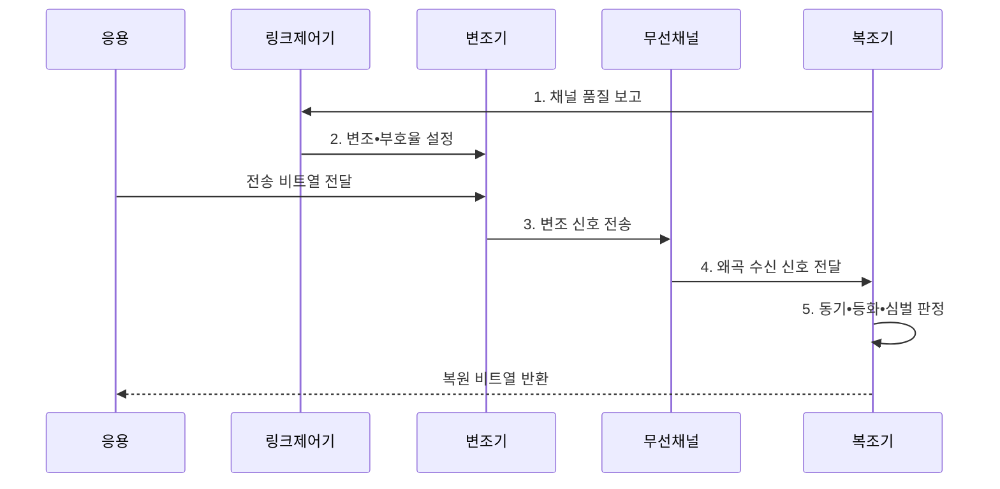

---
sidebar:
  order: 66
  label: "066. 변조 방식 : AM•FM•QAM•QPSK (Modulation Methods)"
  badge:
    text: "미출 • 30%"
    variant: note
title: "변조 방식 : AM•FM•QAM•QPSK (Modulation Methods)"
date: "2026-08-05T01:30:12+09:00"
tags:
  - "notes-network"
weight: 66
extra:
  question_no: "066"
  source_status: "미출"
  source_history: ""
  priority: 30
  priority_note: "비교형: 변조 선택의 대역폭•잡음 기준"
---

## Ⅰ. 개요

<details><summary>핵심 용어</summary>

- **변조(Modulation)**: 정보를 반송파의 진폭•주파수•위상 변화에 대응시켜 전송 가능한 파형으로 바꾸는 과정
- **기저대역(Baseband)**: 반송파에 싣기 전의 원래 정보 신호 주파수 영역
- **대역통과 채널(Bandpass Channel)**: 특정 반송파 주변의 주파수만 통과시키는 전송 채널

</details>

- 정의/개념: 정보를 반송파 상태에 대응시키는 **물리 계층 신호 변환 기법**
- 배경/필요성: 기저대역 신호는 **대역통과 채널 직접 전송 곤란**

#### 한줄 요약

- 반송파의 크기•빠르기•각도를 정보에 따라 바꿔 채널로 운반함

## Ⅱ. 특징

<details><summary>핵심 용어</summary>

- **심벌(Symbol)**: 변조기가 한 번에 전송하는 진폭•위상•주파수 상태
- **성상도(Constellation)**: 디지털 변조 심벌을 동상•직교 축의 점으로 나타낸 그림
- **신호대잡음비(Signal-to-Noise Ratio, SNR)**: 수신 신호 전력과 잡음 전력의 비율
- **직교 진폭 변조(Quadrature Amplitude Modulation, QAM)**: 직교 반송파의 진폭을 조합해 다수의 심벌을 만드는 디지털 변조
- **첨두전력대평균전력비(Peak-to-Average Power Ratio, PAPR)**: 신호 최대 전력과 평균 전력의 비율

</details>

- **차수 상충**: 심벌당 비트 증가와 잡음 내성 저하
- **성상 간격**: 심벌 간격 축소로 판정 오류 증가
- **전력 효율**: 고차 QAM의 PAPR로 증폭 효율 저하

#### 한줄 요약

- 한 심벌에 많은 비트를 담으면 빠르지만 잡음으로 심벌 위치가 조금만 흔들려도 다른 값으로 오인하기 쉬움

## Ⅲ. 구조 및 구성요소

<details><summary>핵심 용어</summary>

- **무선 주파수부(Radio Frequency, RF•알에프)**: 영문 머리글자를 딴 표기이며, 기저대역 심벌을 반송파로 변환•증폭하고 수신 파형을 하향 변환하는 역할
- **파일럿(Pilot)**: 채널 상태와 동기 기준을 추정하도록 미리 알려진 심벌
- **변조•부호화 조합(Modulation and Coding Scheme, MCS•엠씨에스)**: 영문 핵심 단어의 머리글자를 딴 표기이며, 링크가 함께 적용할 변조 차수와 부호율 조합을 나타냄

</details>

MCS에 맞춰 심벌을 생성하고 RF부가 반송파 변환•증폭을 수행한다.

```text
[심벌 매퍼]---[송신 RF부]---[무선 채널]---[수신 RF•동기•등화부]---[심벌 디매퍼]
```

선의 의미: 각 선은 진폭•위상 심벌, 반송파 파형, 잡음•간섭•페이딩이 반영된 수신 신호, 왜곡 보상값과 비트 가능도가 서로 대응하는 물리 계층 관계를 나타낸다.

| 구성요소 | 책임 |
|:---|:---|
| 심벌 매퍼 | 비트를 진폭•위상 심벌로 변환 |
| 송신 RF부 | 파형 성형•상향 변환•전력 증폭 |
| 무선 채널 | 잡음•간섭•페이딩을 신호에 추가 |
| 수신 RF•동기•등화부 | 주파수•시간•채널 왜곡 보상 |
| 심벌 디매퍼 | 수신점으로 비트 가능도 산출 |

#### 한줄 요약

- 송신점이 채널에서 흔들리면 수신기는 동기와 왜곡을 바로잡아 가장 가까운 심벌을 판정한다

## Ⅳ. 흐름도

<details><summary>핵심 용어</summary>

- **동기화(Synchronization)**: 수신 신호의 시간•주파수•위상 기준을 맞추는 처리
- **등화(Equalization)**: 채널이 만든 진폭•위상 왜곡을 추정해 보상하는 처리
- **복조(Demodulation)**: 수신 파형에서 반송파 상태를 판정해 원래 정보 심벌을 복원하는 과정
- **오류 벡터 크기(Error Vector Magnitude, EVM)**: 이상 심벌점과 실제 수신점 사이의 오차 크기

</details>



**동작 원리**

1. **채널 품질 보고**: SNR•EVM•오류율을 제어기에 전달
2. **변조•부호율 설정**: 목표 오류율 안의 최고 효율 조합 선택
3. **변조 신호 전송**: 비트를 선택한 성상점에 매핑해 송신
4. **왜곡 수신 신호 전달**: 잡음•간섭•페이딩 반영
5. **동기•등화•심벌 판정**: 왜곡 보상 후 비트 가능도 계산

#### 한줄 요약

- 채널이 나빠지면 낮은 차수로 내려 심벌 간 거리를 넓히고 좋아지면 높은 차수로 처리량을 높임

## Ⅴ. 종류 및 비교

<details><summary>핵심 용어</summary>

- **진폭 변조(Amplitude Modulation, AM)**: 정보 신호에 따라 반송파 진폭을 연속적으로 바꾸는 아날로그 변조
- **주파수 변조(Frequency Modulation, FM)**: 정보 신호에 따라 반송파 순간 주파수를 연속적으로 바꾸는 아날로그 변조
- **직교 위상 편이 변조(Quadrature Phase Shift Keying, QPSK)**: 네 위상 상태에 심벌당 2비트를 매핑하는 디지털 변조

</details>

| 판단 기준 | **AM** | **FM** | **QPSK** | **QAM** |
|:---|:---|:---|:---|:---|
| 적용 기준 | 단순 아날로그 전송 | 잡음 강한 아날로그 음성 | 낮은 SNR 디지털 링크 | 높은 SNR 고속 데이터 |
| 핵심 특징 | 연속 진폭 변화 | 연속 주파수 변화 | 4개 위상 심벌 | 진폭•위상 다중 심벌 |
| 한계 | 진폭 잡음 민감 | 넓은 대역폭 | 제한된 심벌당 비트 | 왜곡•EVM•PAPR |

> 요약: 아날로그는 AM•FM, 디지털은 QPSK•QAM이다

#### 한줄 요약

- AM•FM과 QPSK•QAM은 정보 형태와 품질 지표가 달라 심벌당 비트만으로 같은 축에서 우열을 매기면 안 됨

## Ⅵ. 실무 고려사항 및 대책

<details><summary>핵심 용어</summary>

- **출력 백오프(Output Back-off)**: 증폭기 비선형 왜곡을 줄이도록 최대 출력보다 낮게 운용하는 방식
- **적응 변조•부호화(Adaptive Modulation and Coding, AMC)**: SNR과 오류율에 따라 변조 차수와 부호율을 조정하는 방식

</details>

| 문제 | 대책 | 효과 |
|:---|:---|:---|
| 고차 변조가 낮은 SNR에서 오류 증가 | **SNR별 AMC** 적용 | 처리량•신뢰 균형 |
| 높은 PAPR와 증폭기 비선형으로 성상점 왜곡 | **EVM•출력 백오프** 측정 | 성상도 품질 유지 |
| 성긴 파일럿으로 채널 추정 오차 | **파일럿 밀도•갱신 주기** 조정 | 복조 정확성 향상 |

#### 한줄 요약

- SNR과 EVM이 기준을 만족할 때만 QAM 차수를 올리고 오류가 증가하면 낮춰 유효 전송량을 유지한다

## Ⅶ. 결론

<details><summary>핵심 용어</summary>

- **효율•강인성 절충**: 변조 차수가 높을수록 전송률과 요구 SNR이 함께 커지는 관계

</details>

- 적응 변조•부호화로 MCS를 선택하되 아날로그 단순은 **AM**, 잡음 내성은 **FM**, 저 SNR은 **QPSK**, 고속은 **QAM**

#### 한줄 요약

- 한 심벌에 많은 비트를 담을수록 더 깨끗한 채널과 정밀한 송수신기가 필요하다.
