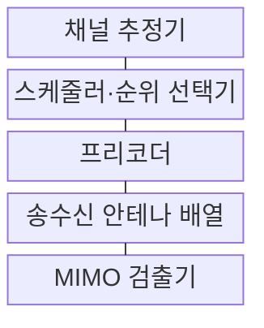
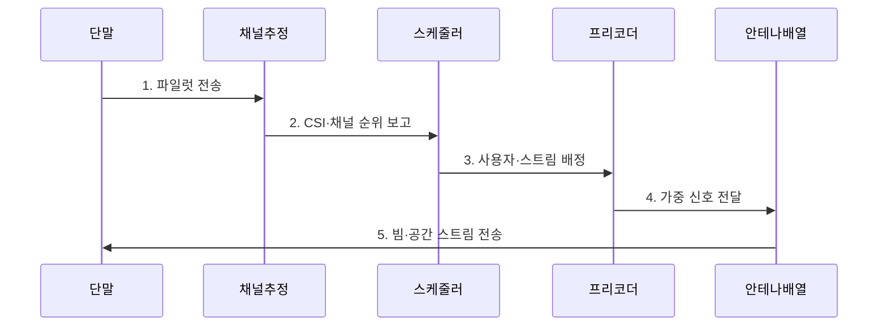

---
sidebar:
  order: 67
  label: "067. MIMO·대규모 MIMO (MIMO Massive MIMO)"
  badge:
    text: "미출 · 30%"
    variant: note
title: "MIMO·대규모 MIMO (MIMO Massive MIMO)"
date: "2026-07-31T01:11:36+09:00"
tags:
  - "notes-network"
weight: 67
extra:
  question_no: "067"
  source_status: "미출"
  source_history: ""
  priority: 30
  priority_note: "설명·설계형: 5G·6G MIMO 핵심 기반"
---

## 미리 알고가기

- **다중입출력(Multiple-Input Multiple-Output, MIMO)**: 여러 송수신 안테나로 공간 다중화·빔 형성·다이버시티를 수행하는 기술
- **단일입출력(Single-Input Single-Output, SISO)**: 송신과 수신에 각각 안테나 하나를 사용하는 무선 구조
- **대규모 MIMO(Massive MIMO)**: 많은 안테나 소자로 여러 사용자 빔을 동시에 형성하는 MIMO 구조
- **공간 스트림(Spatial Stream)**: 같은 시간·주파수 자원에서 독립적으로 전송하는 데이터 흐름
- **채널 상태 정보(Channel State Information, CSI·씨에스아이)**: 영문 각 단어의 머리글자를 딴 표기이며, 안테나 간 채널의 진폭·위상·품질을 나타내 프리코딩·빔·공간 스트림 수 결정에 쓰이는 측정값
- **채널 순위(Channel Rank)**: 채널 행렬에서 분리 가능한 독립 공간 경로의 수
- **채널 행렬(Channel Matrix)**: 각 송신 안테나에서 각 수신 안테나로 전달되는 신호의 크기와 위상을 행렬로 나타낸 값
- **프리코딩(Precoding)**: CSI에 따른 복소 가중치를 송신 신호에 곱해 빔과 스트림을 형성하는 처리
- **다이버시티(Diversity)**: 같은 정보를 서로 다른 공간 경로로 보내 결합해 오류 확률을 낮추는 방식
- **파일럿(Pilot)**: 송수신기가 채널을 추정하도록 알려진 값으로 보내는 참조 신호
- **파일럿 오염(Pilot Contamination)**: 여러 셀이 같은 파일럿을 재사용해 채널 추정값에 다른 사용자의 신호가 섞이는 현상
- **안테나 약어 읽기와 표기**: MIMO·SISO는 마이모·사이소로 읽고 Input과 Output의 수를 머리글자로 나타낸 표기이며, 각각 다중·단일 송수신 안테나 구조를 뜻함
- **이동통신 세대 기호(5G·6G, 파이브지·식스지)**: 숫자는 이동통신 세대, G는 Generation의 머리글자를 나타내며 대규모 MIMO가 적용되는 이동통신 체계를 구분함
- **빔·스트림(Beam·Stream)**: 빔은 안테나 신호가 합쳐지는 공간 방향이고 스트림은 같은 시간·주파수에서 독립 전송하는 데이터 흐름
- **스케줄러(Scheduler)**: 사용자·시간·주파수·공간 스트림 자원을 배정하는 제어기
- **복소 가중치(Complex Weight)**: 안테나별 신호의 크기와 위상을 조절하는 계수
- **간섭(Interference)**: 다른 송신 신호가 원하는 신호의 판정을 방해하는 현상
- **안테나 보정(Antenna Calibration)**: 배열 소자별 위상·이득 편차를 측정해 보상하는 작업

## Ⅰ. 개요

- 정의/개념: 다중 안테나로 공간 차원을 활용하는 **무선 전송 기술**
- 배경/필요성: SISO는 같은 대역에서 **용량·신뢰도 확장 제한**

### 쉽게 이해하기 (학습용)

- 여러 안테나가 같은 주파수에서 데이터를 분할·보강 송신함

## Ⅱ. 특징

- **빔 형성**: 목표 방향의 SNR을 높여 오류 감소
- **공간 다중화**: 채널 순위만큼 독립 스트림 전송
- **다이버시티**: 독립 경로를 결합해 신뢰도 향상

### 쉽게 이해하기 (학습용)

- 안테나 수가 많아도 채널 경로가 비슷하면 독립 스트림 수는 늘지 않아 채널 순위가 중요함

## Ⅲ. 구조 및 구성요소

| 구성요소 | 책임 |
|:---|:---|
| 채널 추정기 | 파일럿으로 안테나 간 CSI 산출 |
| 스케줄러·순위 선택기 | 사용자·자원·공간 스트림 수 결정 |
| 프리코더 | 안테나별 복소 가중치·전력 계산 |
| 송수신 안테나 배열 | 공간별 신호 방사·수신 |
| MIMO 검출기 | 수신 혼합 신호에서 스트림·간섭 분리 |

### 쉽게 이해하기 (학습용)

- 프리코더는 안테나별 크기·위상을 조절해 목적 방향에서 신호를 합치고 다른 방향의 간섭을 줄인다

## Ⅳ. 흐름도

**동작 원리**

1. **파일럿 전송**: 알려진 참조 신호를 안테나로 송신
2. **CSI·채널 순위 보고**: 채널 진폭·위상과 독립 경로 제공
3. **사용자·스트림 배정**: 분리 가능한 사용자와 스트림 결정
4. **가중 신호 전달**: 안테나별 복소 가중치·전력 적용
5. **빔·공간 스트림 전송**: 같은 자원에서 독립 데이터 송신

### 쉽게 이해하기 (학습용)

- 사용자가 이동해 CSI가 오래되면 빔이 빗나가므로 측정과 전송 사이의 시간도 성능을 좌우한다

## Ⅴ. 종류 및 비교

| 판단 기준 | **MIMO** | **대규모 MIMO** | **SISO** |
|:---|:---|:---|:---|
| 적용 기준 | 채널 순위 높은 링크 | 사용자 공간 분리 가능한 셀 | 단순·저비용 단일 링크 |
| 핵심 특징 | 복수 안테나·스트림 | 대형 배열·다중 사용자 빔 | 단일 송수신 안테나 |
| 한계 | 검출·CSI 복잡도 | 파일럿 오염·연산·전력 | 공간 다중화 이득 없음 |

> 요약: 채널 순위와 사용자 분리가 공간 이득을 정한다

### 쉽게 이해하기 (학습용)

- 대규모 MIMO는 한 사용자의 스트림을 무한히 늘리기보다 여러 사용자를 다른 빔으로 함께 서비스하는 데 강점이 있다

## Ⅵ. 실무 고려사항 및 대책

| 고려사항 | 대책 | 효과 |
|:---|:---|:---|
| 이동 중 오래된 CSI로 빔 이탈 | **이동 속도별 파일럿 갱신** | 빔 이탈 감소 |
| 셀 간 파일럿 재사용으로 추정 오염 | **자원 조정·공간 필터** 적용 | 간섭 억제 |
| 배열 소자별 위상·이득 편차 | **위상·이득 정기 보정** 수행 | 빔 형성 정확성 향상 |

### 쉽게 이해하기 (학습용)

- 안테나 수가 많아도 CSI로 확인한 독립 경로가 둘이면 해당 단말에는 공간 스트림을 둘까지만 배정한다

## Ⅶ. 결론

- 단일 저비용은 **SISO**, 고순위 링크는 **MIMO**, 사용자 분리는 **대규모 MIMO**

### 쉽게 이해하기 (학습용)

- 안테나 수보다 각 단말 채널을 정확히 알고 같은 방향으로 신호를 모으는 것이 중요하다.
