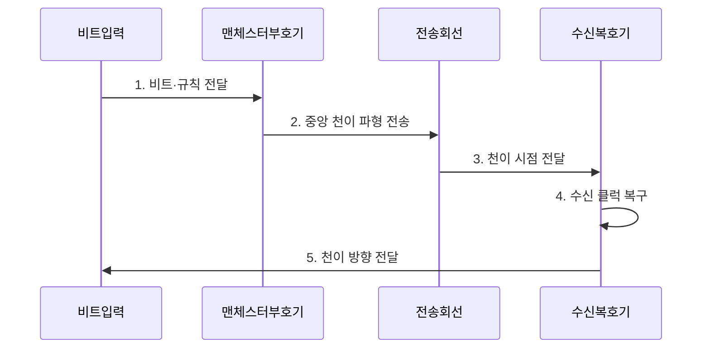

---
sidebar:
  order: 68
  label: "068. 맨체스터 인코딩 (Manchester Encoding)"
  badge:
    text: "기출 · 30%"
    variant: note
title: "맨체스터 인코딩 (Manchester Encoding)"
date: "2026-07-29T23:30:00+09:00"
tags:
  - "notes-network"
weight: 68
extra:
  question_no: "068"
  source_status: "기출"
  source_history: "132회"
  priority: 30
  priority_note: "설명형: 132회 Manchester Coding 직접 출제"
---

## 미리 알고가기

- **맨체스터 인코딩(Manchester Encoding)**: 각 비트 중앙의 전압 천이 방향으로 데이터와 클럭을 함께 표현하는 회선 부호
- **비복귀 영점(Non-Return-to-Zero, NRZ)**: 비트 구간 동안 일정한 전압 레벨로 값을 표현하는 회선 부호
- **위상 고정 루프(Phase-Locked Loop, PLL)**: 반복되는 신호 천이에 내부 발진기의 위상·주파수를 맞춰 클럭을 복구하는 회로
- **직류 성분(Direct Current Component, DC Component)**: 신호 평균값에 해당하는 0Hz 주파수 성분
- **비트 오류율(Bit Error Rate, BER)**: 전체 수신 비트 중 잘못 판정된 비트의 비율
- **차분 맨체스터(Differential Manchester)**: 비트 중앙에는 항상 천이를 두고 비트 경계의 천이 유무로 데이터를 표현하는 회선 부호
- **보드율(Baud Rate)**: 초당 전송하는 신호 심벌 수
- **지터(Jitter)**: 신호 천이 시점이 이상적인 시점에서 앞뒤로 흔들리는 현상
- **NRZ(Non-Return-to-Zero)**: 비트 구간 중 기준 전압으로 복귀하지 않고 두 신호 레벨로 비트를 표현하는 회선 부호
- **PLL·DC·BER**: 각각 수신 클럭 복원 회로·직류 성분·비트 오류율을 나타내는 동기 및 신호 품질 요소
- **영헤르츠 기호(0 Hz·제로 헤르츠)**: 0은 주파수 변화가 없음을, Hz는 헤르츠 단위를 나타내며 신호 평균값인 직류 성분의 위치를 뜻함
- **맨체스터(Manchester·맨체스터)**: 방식이 개발된 영국 도시 이름을 딴 표기이며, 비트 중앙 천이로 데이터와 클럭을 함께 전달

## Ⅰ. 개요

- 정의/개념: **비트 중앙 천이**로 데이터·클럭 표현
- 배경/필요성: NRZ의 **긴 동일 비트열 동기 손실**

### 쉽게 이해하기 (학습용)

- 각 비트 중앙에서 신호가 뒤집혀 데이터 박자를 알려줌

## Ⅱ. 특징

- 비트마다 존재하는 **중앙 천이**
- 중앙 천이 방향에 따른 **비트값 표현**
- 균형 파형에 따른 **직류 성분 억제**

### 쉽게 이해하기 (학습용)

- 중앙 천이는 항상 클럭용이고 비트 경계의 추가 천이는 앞뒤 데이터 조합에 따라 나타날 수 있음

## Ⅲ. 구조 및 구성요소

| 구성요소 | 책임 |
|:---|:---|
| 비트 클럭 | 비트 경계와 중앙 천이 시점 제공 |
| 맨체스터 부호기 | 비트와 클럭을 중앙 천이 파형으로 변환 |
| 전송 매체 | 파형에 감쇠·잡음·지터 추가 |
| 천이 검출기 | 전압 천이의 시점·방향 검출 |
| PLL·복호기 | 중앙 천이로 클럭과 데이터 복원 |

### 쉽게 이해하기 (학습용)

- PLL은 반복되는 중앙 천이에 맞춰 비트 판정 시점 보정

## Ⅳ. 흐름도

**동작 원리**

1. **비트·규칙 전달**: 0·1과 표준 천이 방향을 입력
2. **중앙 천이 파형 전송**: 반 비트마다 반대 레벨을 생성
3. **천이 시점 전달**: 수신 파형의 전압 반전 시점 검출
4. **수신 클럭 복구**: 반복 중앙 천이에 PLL 위상 동기
5. **천이 방향 전달**: 중앙의 상승·하강 방향 제공

### 쉽게 이해하기 (학습용)

- 천이 규칙이 다르면 0과 1을 반대로 해석할 수 있음

## Ⅴ. 종류 및 비교

| 회선 부호 비교 | 맨체스터 | NRZ | 차분 맨체스터 |
|:---|:---|:---|:---|
| 적용 기준 | 자체 동기·극성 일치 회선 | 대역 효율 우선·별도 동기 | 극성 반전 가능 회선 |
| 핵심 특징 | 중앙 천이 방향으로 비트 표현 | 비트 구간 전압 레벨 유지 | 경계 천이 유무로 비트 표현 |
| 한계 | NRZ 대비 대역폭 증가 | 긴 동일 비트열 동기 손실 | 천이 규칙 구현 복잡성 |

> 요약: 맨체스터는 대역폭을 써서 동기 성능을 얻는다

### 쉽게 이해하기 (학습용)

- 차분 방식은 경계 천이를 보므로 극성 반전에 강함

## Ⅵ. 실무 고려사항 및 대책

| 고려사항 | 대책 | 효과 |
|:---|:---|:---|
| 송수신 천이 규칙 불일치 | 중앙 상승·하강 정의 대조 | 비트 반전 방지 |
| 대역폭 부족 | NRZ 대비 필요 대역 사전 산정 | 파형 왜곡 예방 |
| 극성 반전 가능 회선 | 차분 맨체스터 검토 | 배선 극성 내성 |

### 쉽게 이해하기 (학습용)

- 송신기와 수신기가 비트 중앙의 상승·하강 천이를 같은 값으로 해석하도록 설정해 데이터와 클록을 함께 복원한다

## Ⅶ. 결론

- **천이 규칙·극성·대역폭을 검증한 맨체스터 부호화**

### 쉽게 이해하기 (학습용)

- 대역폭을 더 사용하는 대신 한 회선에서 데이터와 클럭을 함께 복원한다.
