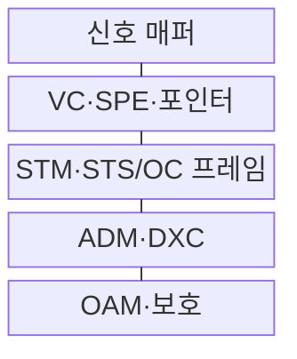
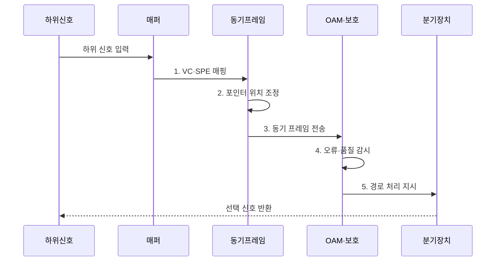

---
sidebar:
  order: 69
  label: "069. PDH·SDH·SONET 디지털 계위 (PDH SDH SONET)"
  badge:
    text: "기출 · 30%"
    variant: note
title: "PDH·SDH·SONET 디지털 계위 (PDH SDH SONET)"
date: "2026-08-02T14:09:00+09:00"
tags:
  - "notes-network"
weight: 69
extra:
  question_no: "069"
  source_status: "기출"
  source_history: "134회"
  priority: 30
  priority_note: "비교형: 134회 PDH·SDH·SONET 서술"
---

## Ⅰ. 개요

핵심 용어

- **준동기식 디지털 계위(Plesiochronous Digital Hierarchy, PDH)**: 서로 미세하게 다른 장비 클럭을 비트 채움으로 맞춰 다중화하는 전송 계위
- **동기식 디지털 계위(Synchronous Digital Hierarchy, SDH)**: 공통 클럭·STM 프레임·포인터로 신호를 다중화하는 국제 표준
- **동기식 광 네트워크(Synchronous Optical Network, SONET)**: STS·OC 프레임과 SPE를 사용하는 북미 동기식 광전송 표준

- 정의/개념: 디지털 신호의 다중화 속도와 프레임을 정한 **전송 계위 표준**
- 배경/필요성: PDH의 **다단 역다중화·관리 제약**

### 쉽게 이해하기 (학습용)

- PDH는 작은 회선을 꺼내려 포장을 풀지만, SDH·SONET은 필요한 신호를 직접 분기함

## Ⅱ. 특징

핵심 용어

- **비트 채움(Bit Stuffing)**: 입력 신호의 속도 차이를 흡수하도록 여분 비트를 삽입하는 PDH 방식
- **포인터(Pointer)**: 동기 프레임 안에서 페이로드가 시작되는 위치를 나타내는 값
- **운용·관리·유지보수(Operations, Administration and Maintenance, OAM)**: 오류·성능·경로·보호 상태를 감시·관리하는 기능

- **준동기 다중화**: PDH의 비트 채움으로 속도 편차 흡수
- **직접 분기**: SDH·SONET 포인터로 하위 신호 접근
- **운용 보호**: 전송 오버헤드로 OAM·보호 절체

### 쉽게 이해하기 (학습용)

- 포인터는 페이로드의 시작 위치를 알려 클럭 차이가 생겨도 전체 프레임을 다시 맞추지 않게 한다

## Ⅲ. 구조 및 구성요소

핵심 용어

- **가상 컨테이너(Virtual Container, VC)**: SDH에서 하위 신호와 경로 오버헤드를 담는 논리적 전송 단위
- **동기 페이로드 봉투(Synchronous Payload Envelope, SPE)**: SONET에서 사용자 신호와 경로 오버헤드를 담는 영역
- **동기 전송 모듈(Synchronous Transport Module, STM)**: SDH의 동기 프레임 전송 계위
- **동기 전송 신호(Synchronous Transport Signal, STS)**: SONET 전기 신호 계위이며 OC와 속도가 대응함
- **광 반송파(Optical Carrier, OC)**: SONET 광 신호 전송 계위

| 구성요소 | 책임 |
|:---|:---|
| 신호 매퍼 | 하위 신호를 VC·SPE에 수용 |
| VC·SPE·포인터 | 페이로드와 프레임 내 시작 위치 표현 |
| STM·STS/OC 프레임 | 동기 계위와 전송 오버헤드 제공 |
| ADM·DXC | 선택 신호의 분기·결합·교차 연결 |
| OAM·보호 | 오류·품질 감시와 예비 경로 절체 |

### 쉽게 이해하기 (학습용)

- 포인터로 신호 시작점을 찾아 전체 포장을 풀지 않고 필요한 회선만 꺼낸다

## Ⅳ. 흐름도

핵심 용어

- **신호 매퍼(Signal Mapper)**: 하위 계위 신호를 VC나 SPE의 정해진 위치에 수용하는 기능
- **경로 오버헤드(Path Overhead)**: 페이로드와 함께 전달되어 경로 상태·오류를 감시하는 제어 정보
- **보호 절체(Protection Switching)**: 주 경로 장애 시 예비 경로로 신호를 전환하는 기능

**동작 원리**

1. **VC·SPE 매핑**: 하위 신호와 경로 오버헤드 수용
2. **포인터 위치 조정**: 클럭 차이에 따라 시작 위치 변경
3. **동기 프레임 전송**: STM·STS 계위로 다중화해 전달
4. **오류·품질 감시**: 오버헤드로 경로 상태 판정
5. **경로 처리 지시**: 정상 분기 또는 장애 보호 절체

### 쉽게 이해하기 (학습용)

- 오버헤드는 장애 구간·품질·보호 상태를 전달함

## Ⅴ. 종류 및 비교

핵심 용어

- **준동기식 디지털 계위(Plesiochronous Digital Hierarchy, PDH)**: 서로 미세하게 다른 장비 클럭을 비트 채움으로 맞춰 다중화하는 전송 계위
- **동기식 디지털 계위(Synchronous Digital Hierarchy, SDH)**: 공통 클럭·STM 프레임·포인터로 신호를 다중화하는 국제 표준
- **동기식 광 네트워크(Synchronous Optical Network, SONET)**: STS·OC 프레임과 SPE를 사용하는 북미 동기식 광전송 표준

| 디지털 전송 계위 | **PDH** | **SDH** | **SONET** |
|:---|:---|:---|:---|
| 적용 기준 | 기존 준동기 회선 연동 | 국제 SDH 계위 연동 | 북미 SONET 계위 연동 |
| 핵심 특징 | 비트 채움 준동기 다중화 | STM·VC 동기 프레임 | STS/OC·SPE 동기 프레임 |
| 한계 | 다단 역다중화·지역 계위 차이 | 포인터 조정·동기 품질 | SDH 계위·용어 변환 필요 |

> 요약: SDH·SONET은 동기 프레임으로 PDH를 개선한다

### 쉽게 이해하기 (학습용)

- SDH와 SONET은 동기·포인터·관리 구조가 대응함

## Ⅵ. 실무 고려사항 및 대책

핵심 용어

- **지터(Jitter)**: 디지털 신호의 천이 시점이 이상적인 위치에서 흔들리는 현상
- **클럭 품질(Clock Quality)**: 전송 장비의 주파수 정확도와 안정성을 나타내며 계위 다중화의 오류·지터에 영향을 주는 특성
- **상호 연동(Interworking)**: 서로 다른 PDH·SDH·SONET 계위와 인터페이스 사이에서 신호를 매핑·변환하는 기능

| 문제 | 대책 | 효과 |
|:---|:---|:---|
| 지역별 계위 대응 오류로 연동 실패 | **PDH·SDH·SONET 매핑표** 검증 | 회선 상호운용 확보 |
| 동기 품질 저하로 포인터 조정 증가 | **동기 품질·포인터 이벤트** 감시 | 지터 억제 |
| 보호 절체 미시험으로 복구 지연 | **장애 유형별 예비 경로** 훈련 | 전송 연속성 확보 |

### 쉽게 이해하기 (학습용)

- 기존 준동기 회선을 알맞은 가상 컨테이너에 매핑해 전체 계위의 역다중화 없이 필요한 저속 회선을 분기한다

## Ⅶ. 결론

핵심 용어

- **분기결합 다중화기(Add-Drop Multiplexer, ADM)**: 전체 역다중화 없이 선택한 하위 신호를 분기·결합하는 장비
- **디지털 교차 연결기(Digital Cross-Connect, DXC)**: 다수 디지털 경로를 전자적으로 교차 연결하는 장비
- **운용·관리·유지보수(Operations, Administration and Maintenance, OAM)**: 오류·성능·경로·보호 상태를 감시·관리하는 기능

- 기존 준동기 연동은 **PDH**, 국제 계위는 **SDH**, 북미 계위는 **SONET**

### 쉽게 이해하기 (학습용)

- 연동 지역의 계위와 필요한 저속 회선 분기·보호 기능에 맞춰 전송 체계를 선택해야 한다.
