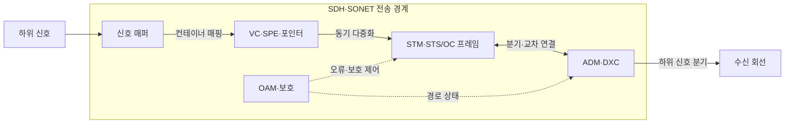
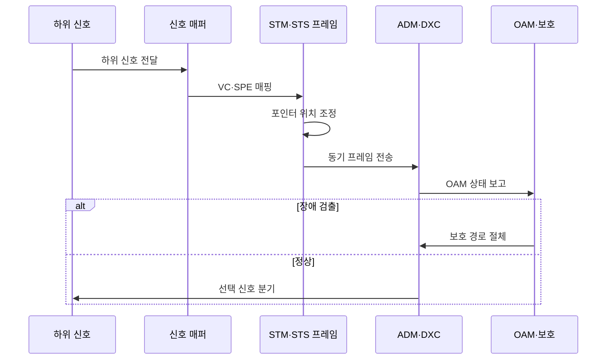

---
sidebar:
  order: 69
  label: "069. PDH·SDH·SONET 디지털 계위 (PDH SDH SONET)"
  badge:
    text: "기출 · 30%"
    variant: note
title: "PDH·SDH·SONET 디지털 계위 (PDH SDH SONET)"
date: "2026-07-27T23:59:59+09:00"
tags:
  - "notes-network"
weight: 69
extra:
  question_no: "069"
  source_status: "기출"
  source_history: "134회"
  priority: 30
  priority_note: "비교형: 134회 PDH·SDH·SONET 서술"
---

## 미리 알고가기

- **준동기식 디지털 계위(Plesiochronous Digital Hierarchy, PDH)**: 서로 미세하게 다른 장비 클럭을 비트 채움으로 맞춰 다중화하는 전송 계위
- **동기식 디지털 계위(Synchronous Digital Hierarchy, SDH)**: 공통 클럭·STM 프레임·포인터로 신호를 다중화하는 국제 표준
- **동기식 광 네트워크(Synchronous Optical Network, SONET)**: STS·OC 프레임과 SPE를 사용하는 북미 동기식 광전송 표준
- **비트 채움(Bit Stuffing)**: 입력 신호의 속도 차이를 흡수하도록 여분 비트를 삽입하는 PDH 방식
- **포인터(Pointer)**: 동기 프레임 안에서 페이로드가 시작되는 위치를 나타내는 값
- **가상 컨테이너(Virtual Container, VC)**: SDH에서 하위 신호와 경로 오버헤드를 담는 논리적 전송 단위
- **동기 페이로드 봉투(Synchronous Payload Envelope, SPE)**: SONET에서 사용자 신호와 경로 오버헤드를 담는 영역
- **동기 전송 모듈(Synchronous Transport Module, STM)**: SDH의 동기 프레임 전송 계위
- **동기 전송 신호(Synchronous Transport Signal, STS)**: SONET 전기 신호 계위이며 OC와 속도가 대응함
- **광 반송파(Optical Carrier, OC)**: SONET 광 신호 전송 계위
- **분기결합 다중화기(Add-Drop Multiplexer, ADM)**: 전체 역다중화 없이 선택한 하위 신호를 분기·결합하는 장비
- **디지털 교차 연결기(Digital Cross-Connect, DXC)**: 다수 디지털 경로를 전자적으로 교차 연결하는 장비
- **운용·관리·유지보수(Operations, Administration and Maintenance, OAM)**: 오류·성능·경로·보호 상태를 감시·관리하는 기능
- **전송 계위 약어 읽기와 표기**: PDH·SDH·SONET은 피디에이치·에스디에이치·소넷으로 읽고 영문 핵심 글자를 딴 표기이며, 준동기 계위·국제 동기 계위·북미 동기 광망을 구분함
- **프레임 약어 읽기와 표기**: VC·SPE·STM·STS·OC는 브이씨·에스피이·에스티엠·에스티에스·오씨로 읽고 영문 머리글자를 딴 표기이며, 컨테이너·페이로드·동기 모듈·전기 신호·광 반송파 계위를 나타냄
- **장비·운영 약어 읽기와 표기**: ADM·DXC·OAM은 에이디엠·디엑스씨·오에이엠으로 읽고 영문 머리글자를 딴 표기이며, 분기결합·교차 연결·운용 관리 역할을 함

## Ⅰ. 개요

- 정의: 디지털 신호의 **다중화·전송 계위**
- 기존 한계: PDH의 **다단 역다중화·관리 제약**

### 쉽게 이해하기 (학습용)

- PDH는 작은 회선을 꺼내려 포장을 풀지만, SDH·SONET은 필요한 신호를 직접 분기함

## Ⅱ. 특징

- PDH의 **비트 채움 기반 준동기 다중화**
- SDH·SONET의 **포인터 기반 직접 분기**
- 전송 오버헤드 기반 **OAM·보호 절체**

### 쉽게 이해하기 (학습용)

- 포인터는 페이로드의 시작 위치를 알려 클럭 차이가 생겨도 전체 프레임을 다시 맞추지 않게 한다

## Ⅲ. 아키텍처 및 구성요소

| 설계 요소 | 설명 |
|:---|:---|
| 신호 매퍼 | 하위 신호를 VC·SPE에 수용 |
| VC·SPE·포인터 | 페이로드와 프레임 내 시작 위치 표현 |
| STM·STS/OC 프레임 | 동기 계위와 전송 오버헤드 제공 |
| ADM·DXC | 선택 신호의 분기·결합·교차 연결 |
| OAM·보호 | 오류·품질 감시와 예비 경로 절체 |

> 요약: 포인터가 지정한 하위 신호를 직접 분기한다

### 쉽게 이해하기 (학습용)

- 포인터로 신호 시작점을 찾아 전체 포장을 풀지 않고 필요한 회선만 꺼낸다

## Ⅳ. 원리 및 절차 흐름도

| 절차 | 설명 |
|:---|:---|
| 하위 신호 전달 | 입력 속도·계위 식별 |
| VC·SPE 매핑 | 하위 신호와 경로 오버헤드 수용 |
| 포인터 위치 조정 | 클럭 차이에 따라 시작 위치 변경 |
| 동기 프레임 전송 | STM·STS 계위로 다중화해 전달 |
| OAM 상태 보고 | 오류·품질·경로 상태 전달 |
| 보호 경로 절체 | 장애 시 예비 전송 경로로 전환 |
| 선택 신호 분기 | 정상 시 목표 하위 신호만 추출 |

> 요약: 신호를 매핑·다중화하고 OAM으로 보호한다

### 쉽게 이해하기 (학습용)

- 오버헤드는 장애 구간·품질·보호 상태를 전달함

## Ⅴ. 종류 및 비교

| 디지털 전송 계위 | PDH | SDH | SONET |
|:---|:---|:---|:---|
| 적용 기준 | 기존 준동기 회선 연동 | 국제 SDH 계위 연동 | 북미 SONET 계위 연동 |
| 핵심 특징 | 비트 채움 준동기 다중화 | STM·VC 동기 프레임 | STS/OC·SPE 동기 프레임 |
| 한계 | 다단 역다중화·지역 계위 차이 | 포인터 조정·동기 품질 | SDH 계위·용어 변환 필요 |

> 요약: SDH·SONET은 동기 프레임으로 PDH를 개선한다

### 쉽게 이해하기 (학습용)

- SDH와 SONET은 동기·포인터·관리 구조가 대응함

## Ⅵ. 실무 사례

1. 기존 PDH 회선의 **SDH VC 매핑**

### 쉽게 이해하기 (학습용)

- 기존 준동기 회선을 알맞은 가상 컨테이너에 매핑해 전체 계위의 역다중화 없이 필요한 저속 회선을 분기한다

## Ⅶ. 결론

- **지역 계위·분기·보호** 조건으로 체계 선택

### 쉽게 이해하기 (학습용)

- 연동 지역의 계위와 필요한 회선 분기·보호 기능에 맞춰 전송 체계를 선택한다
