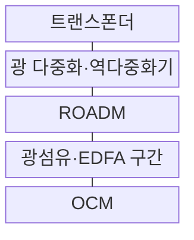
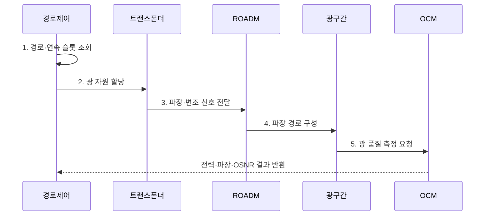

---
sidebar:
  order: 70
  label: "070. WDM·DWDM 광 다중화 (WDM DWDM)"
  badge:
    text: "미출 · 30%"
    variant: note
title: "WDM·DWDM 광 다중화 (WDM DWDM)"
date: "2026-08-02T14:10:00+09:00"
tags:
  - "notes-network"
weight: 70
extra:
  question_no: "070"
  source_status: "미출"
  source_history: ""
  priority: 30
  priority_note: "비교·설계형: 광 Backbone WDM 선택 기반"
---

## Ⅰ. 개요

핵심 용어

- **파장 분할 다중화(Wavelength Division Multiplexing, WDM)**: 서로 다른 광 파장을 한 광섬유에 결합해 병렬 전송하는 기술
- **저밀도 파장 분할 다중화(Coarse Wavelength Division Multiplexing, CWDM)**: 넓은 파장 간격과 비냉각 레이저로 비용을 낮춘 WDM 방식
- **고밀도 파장 분할 다중화(Dense Wavelength Division Multiplexing, DWDM)**: 좁은 주파수 간격으로 많은 광 채널을 전송하는 WDM 방식
- **유연 격자(Flexible Grid, Flex-Grid·플렉스 그리드)**: Flexible을 Flex로 줄이고 Grid와 결합한 표기이며, 광 채널의 중심 주파수와 슬롯 폭을 세밀한 단위로 가변 할당하는 방식

- 정의/개념: 여러 광 파장을 한 광섬유로 보내는 **광 다중화 기술**
- 배경/필요성: 단일 파장 링크는 용량 확대마다 **광섬유 증설 부담**

### 쉽게 이해하기 (학습용)

- 광섬유 한 가닥에 서로 다른 색의 빛을 함께 보내고 수신점에서 다시 나눈다

## Ⅱ. 특징

핵심 용어

- **파장 분할 다중화(Wavelength Division Multiplexing, WDM)**: 서로 다른 광 파장을 한 광섬유에 결합해 병렬 전송하는 기술
- **인접 채널 간섭(Adjacent Channel Interference)**: 가까운 파장 채널의 신호 성분이 서로 겹쳐 품질을 낮추는 현상
- **광 신호대잡음비(Optical Signal-to-Noise Ratio, OSNR·오에스엔알)**: SNR 앞에 광을 뜻하는 O를 붙인 표기이며, 기준 대역의 광 신호 전력과 잡음 전력 비로 복호 여유를 판단하는 지표

- **용량 확장**: 파장 다중화로 광섬유당 병렬 전송
- **채널 간섭**: 좁은 간격에서 인접 파장 간섭 증가
- **증폭 한계**: 신호와 잡음 동시 증폭으로 OSNR 저하

### 쉽게 이해하기 (학습용)

- 증폭기는 모든 색의 빛과 잡음을 함께 키우므로 거리가 길수록 수신 신호의 깨끗함이 떨어진다

## Ⅲ. 구조 및 구성요소

핵심 용어

- **트랜스폰더(Transponder)**: 클라이언트 신호를 지정 파장의 광 신호로 변환하고 역변환하는 장치
- **에르븀 첨가 광섬유 증폭기(Erbium-Doped Fiber Amplifier, EDFA)**: 전기 변환 없이 여러 광 채널을 함께 증폭하는 장치
- **재구성 광 분기결합 다중화기(Reconfigurable Optical Add-Drop Multiplexer, ROADM)**: 파장을 원격으로 분기·추가·우회하는 광 스위칭 장치
- **광 채널 모니터(Optical Channel Monitor, OCM)**: 채널별 광 전력·파장·신호대잡음비를 측정하는 장치

| 구성요소 | 책임 |
|:---|:---|
| 트랜스폰더 | 클라이언트를 지정 파장으로 변환 |
| 광 다중화·역다중화기 | 여러 파장을 결합·분리 |
| ROADM | 파장을 원격 추가·분기·우회 |
| 광섬유·EDFA 구간 | 결합 파장 전송과 광 손실 증폭 |
| OCM | 채널별 전력·파장·OSNR 감시 |

### 쉽게 이해하기 (학습용)

- 트랜스폰더가 신호마다 빛의 색을 정하고 ROADM이 원하는 색만 중간 경로로 보낸다

## Ⅳ. 흐름도

핵심 용어

- **파장 연속성(Wavelength Continuity)**: 파장 변환이 없을 때 경로의 모든 구간에서 같은 파장·슬롯이 비어 있어야 하는 제약
- **광 복호 여유(Optical Margin)**: 수신 OSNR과 최소 요구 OSNR 사이의 품질 차이

**동작 원리**

1. **경로·연속 슬롯 조회**: 모든 구간의 같은 파장·슬롯 확인
2. **광 자원 할당**: 연속성과 경합을 만족하는 후보 지정
3. **파장·변조 신호 전달**: 거리·용량에 맞는 광 신호 생성
4. **파장 경로 구성**: ROADM의 추가·분기 포트 연결
5. **광 품질 측정 요청**: 종단 전력·파장·OSNR 확인

### 쉽게 이해하기 (학습용)

- 빈 색이 있어도 모든 구간에서 같은 칸이 이어지고 수신 품질이 남아야 광 경로를 열 수 있다

## Ⅴ. 종류 및 비교

핵심 용어

- **저밀도 파장 분할 다중화(Coarse Wavelength Division Multiplexing, CWDM)**: 넓은 파장 간격과 비냉각 레이저로 비용을 낮춘 WDM 방식
- **고밀도 파장 분할 다중화(Dense Wavelength Division Multiplexing, DWDM)**: 좁은 주파수 간격으로 많은 광 채널을 전송하는 WDM 방식
- **유연 격자(Flexible Grid, Flex-Grid·플렉스 그리드)**: Flexible을 Flex로 줄이고 Grid와 결합한 표기이며, 광 채널의 중심 주파수와 슬롯 폭을 세밀한 단위로 가변 할당하는 방식

| 판단 기준 | **CWDM** | **DWDM** | **Flex-Grid** |
|:---|:---|:---|:---|
| 적용 기준 | 단거리·저비용 링크 | 장거리·다채널 백본 | 고속 채널별 폭 최적화 |
| 핵심 특징 | 넓은 간격·적은 채널 | 고정 격자·고밀도 채널 | 가변 중심 주파수·슬롯 폭 |
| 한계 | 채널 수·전송 거리 제한 | OSNR·레이저 정밀도 | 스펙트럼 단편화·제어 복잡성 |

> 요약: 거리·채널 수·비용으로 격자 방식을 선택한다

### 쉽게 이해하기 (학습용)

- 짧고 저렴하면 CWDM, 멀리 많은 채널을 보내면 DWDM, 채널마다 폭을 달리하면 Flex-Grid를 쓴다

## Ⅵ. 실무 고려사항 및 대책

핵심 용어

- **광 손실(Optical Loss)**: 광섬유와 접속점에서 신호 전력이 감소하는 현상
- **스펙트럼 단편화(Spectrum Fragmentation)**: 빈 슬롯이 흩어져 필요한 연속 폭을 할당하지 못하는 상태
- **인접 채널 간섭(Adjacent Channel Interference)**: 가까운 파장 채널의 신호 성분이 서로 겹쳐 품질을 낮추는 현상

| 문제 | 대책 | 효과 |
|:---|:---|:---|
| 전 구간의 연속 파장·슬롯 부재 | **연속성·경합 검사** 수행 | 개통 실패 방지 |
| 장거리 증폭으로 수신 OSNR 부족 | **거리별 변조·증폭·출력** 조정 | 복호 여유 확보 |
| 흩어진 빈 슬롯으로 폭 할당 실패 | **Flex-Grid 슬롯 재배치** | 대역 활용 향상 |

### 쉽게 이해하기 (학습용)

- 전 구간에 연속된 빈 파장이 있고 수신 OSNR이 기준을 만족할 때 해당 파장으로 광 경로를 개통한다

## Ⅶ. 결론

핵심 용어

- **EDFA·ROADM·OCM**: 각각 광 신호 증폭·원격 파장 분기결합·채널 품질 측정을 담당하는 광전송 장비
- **신규 광섬유 없는 용량 확장**: 기존 한 가닥의 광섬유에 여러 파장을 병렬 전송해 포설 없이 전송 용량을 늘리는 효과
- **광 경로 공학 제약**: 채널 수가 늘수록 OSNR·간섭·손실·파장 연속성을 함께 설계해야 하는 조건

- 단거리·저비용은 **CWDM**, 장거리·다채널은 **DWDM**, 가변 폭은 **Flex-Grid**

### 쉽게 이해하기 (학습용)

- 필요 거리와 채널 수를 보내고도 수신 품질 여유가 남는 다중화 방식을 선택해야 한다.
