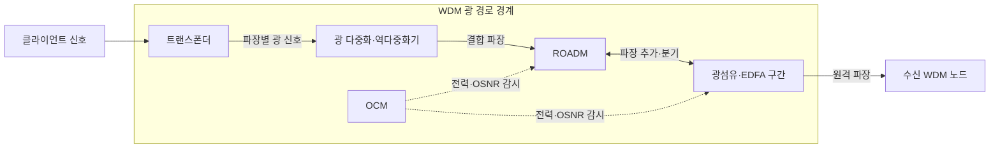
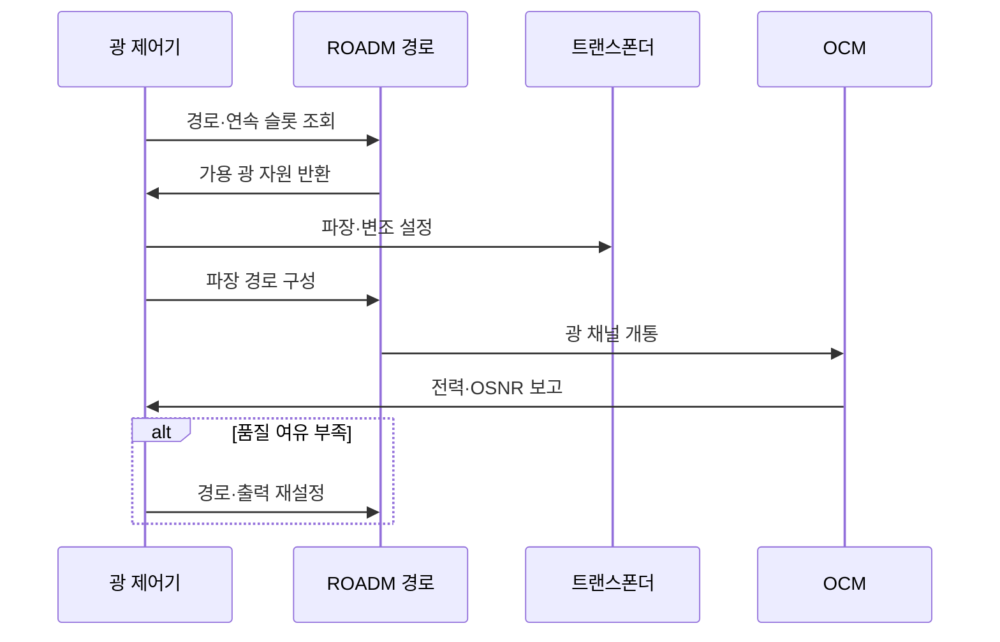

---
sidebar:
  order: 70
  label: "070. WDM·DWDM 광 다중화 (WDM DWDM)"
  badge:
    text: "미출제 · 30%"
    variant: note
title: "WDM·DWDM 광 다중화 (WDM DWDM)"
date: "2026-07-25T12:22:00+09:00"
tags:
  - "notes-network"
weight: 70
extra:
  question_no: "070"
  source_status: "미출제"
  source_history: ""
  priority: 30
  priority_note: "비교·설계형: 광 Backbone WDM 선택 기반"
---

## 미리 알고가기

- **파장 분할 다중화(Wavelength Division Multiplexing, WDM)**: 서로 다른 광 파장을 한 광섬유에 결합해 병렬 전송하는 기술
- **저밀도 파장 분할 다중화(Coarse Wavelength Division Multiplexing, CWDM)**: 넓은 파장 간격과 비냉각 레이저로 비용을 낮춘 WDM 방식
- **고밀도 파장 분할 다중화(Dense Wavelength Division Multiplexing, DWDM)**: 좁은 주파수 간격으로 많은 광 채널을 전송하는 WDM 방식
- **유연 격자(Flexible Grid, Flex-Grid·플렉스 그리드)**: Flexible을 Flex로 줄이고 Grid와 결합한 표기이며, 광 채널의 중심 주파수와 슬롯 폭을 세밀한 단위로 가변 할당하는 방식
- **에르븀 첨가 광섬유 증폭기(Erbium-Doped Fiber Amplifier, EDFA)**: 전기 변환 없이 여러 광 채널을 함께 증폭하는 장치
- **재구성 광 분기결합 다중화기(Reconfigurable Optical Add-Drop Multiplexer, ROADM)**: 파장을 원격으로 분기·추가·우회하는 광 스위칭 장치
- **광 채널 모니터(Optical Channel Monitor, OCM)**: 채널별 광 전력·파장·신호대잡음비를 측정하는 장치
- **광 신호대잡음비(Optical Signal-to-Noise Ratio, OSNR·오에스엔알)**: SNR 앞에 광을 뜻하는 O를 붙인 표기이며, 기준 대역의 광 신호 전력과 잡음 전력 비로 복호 여유를 판단하는 지표
- **트랜스폰더(Transponder)**: 클라이언트 신호를 지정 파장의 광 신호로 변환하고 역변환하는 장치
- **파장 연속성(Wavelength Continuity)**: 파장 변환이 없을 때 경로의 모든 구간에서 같은 파장·슬롯이 비어 있어야 하는 제약
- **파장 다중화 약어 읽기와 표기**: WDM·CWDM·DWDM은 더블유디엠·씨더블유디엠·디더블유디엠으로 읽고, 앞의 C와 D가 Coarse와 Dense를 뜻해 저밀도·고밀도 파장 간격을 구분함
- **광 장비 약어 읽기와 표기**: EDFA·ROADM·OCM은 이디에프에이·로덤·오씨엠으로 읽고 영문 핵심 글자를 딴 표기이며, 광 증폭·원격 파장 분기결합·채널 품질 측정 역할을 함

## Ⅰ. 개요

- 정의: 한 광섬유에 여러 파장을 병렬 전송한다
- 배경: 광섬유 증설 없이 링크 용량을 높인다

### 쉽게 이해하기 (학습용)

- 광섬유 한 가닥에 서로 다른 색의 빛을 함께 보내고 수신점에서 다시 나눈다

## Ⅱ. 특징

- 파장 분리는 한 광섬유의 병렬 처리량을 높인다
- 채널 간격 축소는 간섭을 늘려 복호 실패를 높인다

### 쉽게 이해하기 (학습용)

- 증폭기는 모든 색의 빛과 잡음을 함께 키우므로 거리가 길수록 수신 신호의 깨끗함이 떨어진다

## Ⅲ. 아키텍처 및 구성요소

| 설계 요소 | 설명 |
|:---|:---|
| 트랜스폰더 | 클라이언트를 지정 파장으로 변환 |
| 광 다중화·역다중화기 | 여러 파장을 결합·분리 |
| ROADM | 파장을 원격 추가·분기·우회 |
| 광섬유·EDFA 구간 | 결합 파장 전송과 광 손실 증폭 |
| OCM | 채널별 전력·파장·OSNR 감시 |

> 요약: 파장을 결합·스위칭·증폭해 병렬 전송한다

### 쉽게 이해하기 (학습용)

- 트랜스폰더가 신호마다 빛의 색을 정하고 ROADM이 원하는 색만 중간 경로로 보낸다

## Ⅳ. 원리 및 절차 흐름도

| 절차 | 설명 |
|:---|:---|
| 경로·연속 슬롯 조회 | 모든 구간의 같은 파장·슬롯 확인 |
| 가용 광 자원 반환 | 연속성과 경합을 만족하는 후보 제공 |
| 파장·변조 설정 | 거리·용량에 맞는 광 신호 생성 |
| 파장 경로 구성 | ROADM의 추가·분기 포트 연결 |
| 광 채널 개통 | EDFA 구간을 거쳐 종단까지 전송 |
| 전력·OSNR 보고 | 채널 전력과 복호 여유 측정 |
| 경로·출력 재설정 | 품질 부족 시 경로·전력·변조 변경 |

> 요약: 연속 슬롯에 채널을 열고 OSNR로 확정한다

### 쉽게 이해하기 (학습용)

- 빈 색이 있어도 모든 구간에서 같은 칸이 이어지고 수신 품질이 남아야 광 경로를 열 수 있다

## Ⅴ. 종류 및 비교

| 판단 기준 | CWDM | DWDM | Flex-Grid |
|:---|:---|:---|:---|
| 핵심 특징 | 넓은 간격·적은 채널 | 고정 격자·고밀도 채널 | 가변 중심 주파수·슬롯 폭 |
| 적용 기준 | 단거리·저비용 링크 | 장거리·다채널 백본 | 고속 채널별 폭 최적화 |
| 주요 위험 | 채널 수·전송 거리 제한 | OSNR·레이저 정밀도 | 스펙트럼 단편화·제어 복잡성 |

> 요약: 거리·채널 수·비용으로 격자 방식을 선택한다

### 쉽게 이해하기 (학습용)

- 짧고 저렴하면 CWDM, 멀리 많은 채널을 보내면 DWDM, 채널마다 폭을 달리하면 Flex-Grid를 쓴다

## Ⅵ. 실무 사례

1. 장거리 광전송망의 **DWDM 채널 개통**

### 쉽게 이해하기 (학습용)

- 전 구간에 연속된 빈 파장이 있고 수신 OSNR이 기준을 만족할 때 해당 파장으로 광 경로를 개통한다

## Ⅶ. 결론

- 거리·채널 수·OSNR 여유로 WDM 방식을 선택한다

### 쉽게 이해하기 (학습용)

- 필요한 거리와 채널 수를 보내고도 수신 품질 여유가 남는 다중화 방식을 선택한다
