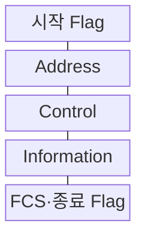
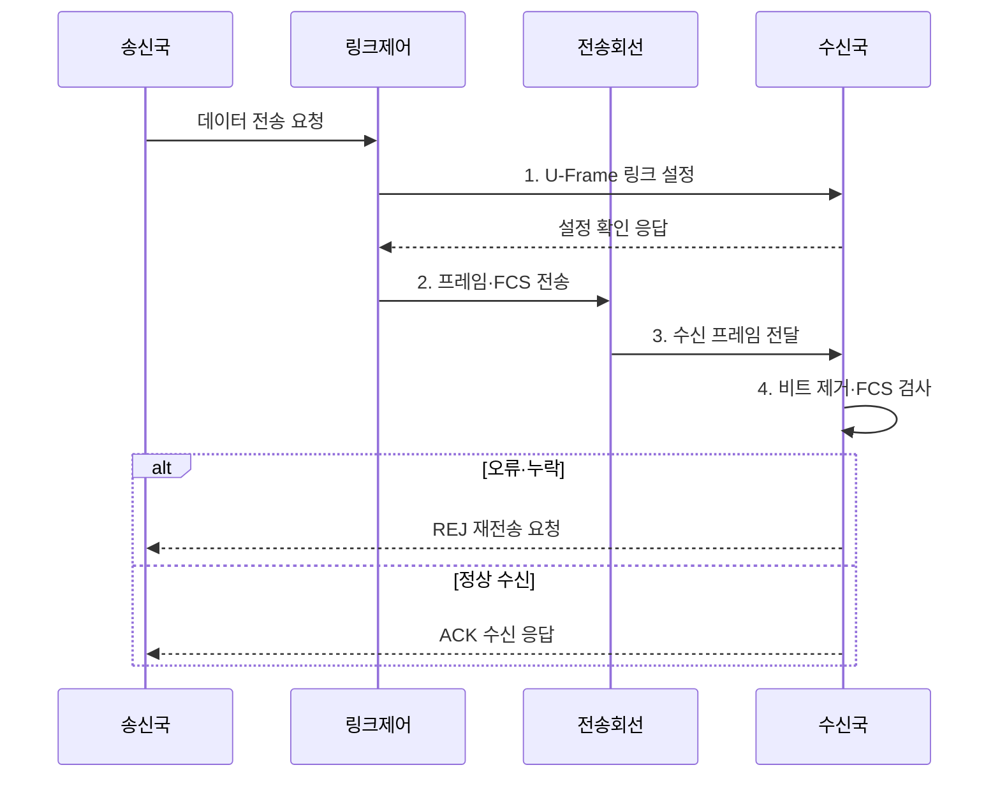

---
sidebar:
  order: 71
  label: "071. HDLC 프레임 구조와 동작 모드 (HDLC)"
  badge:
    text: "기출 · 30%"
    variant: note
title: "HDLC 프레임 구조와 동작 모드 (HDLC)"
date: "2026-08-02T12:00:00+09:00"
tags:
  - "notes-network"
weight: 71
extra:
  question_no: "071"
  source_status: "기출"
  source_history: "134회"
  priority: 30
  priority_note: "설명형: 134회 HDLC Frame·Mode 출제"
---

## Ⅰ. 개요

핵심 용어

- **비트 지향 프로토콜**: HDLC는 동기 회선의 연속 비트열을 프레임으로 구분하고 순서·흐름·오류·링크 모드를 제어하는 비트 지향 프로토콜이다.

- 정의/개념: 동기 회선의 프레임·흐름·오류를 제어하는 **비트 지향 프로토콜**
- 배경/필요성: 비트열의 **경계·순서·오류 식별 불가**

#### 한줄 요약

- 연속 비트 흐름에 경계와 번호를 붙여 어디까지 정상 도착했고 무엇을 다시 보낼지 정한다

## Ⅱ. 특징

핵심 용어

- **경계 투명성**: 경계 투명성은 데이터 안의 연속된 1 뒤에 0을 채워 플래그 패턴이 프레임 경계로만 해석되게 한다.

- **경계 투명성**: 플래그와 비트 채움으로 프레임 구분
- **기능 분리**: I·S·U 프레임으로 데이터·감독·제어
- **오류 복구**: FCS·순서 번호로 검출·재전송

#### 한줄 요약

- 데이터·응답·링크 제어를 다른 프레임으로 나눠 전송 순서와 권한을 관리한다

## Ⅲ. 구조 및 구성요소

핵심 용어

- **Control**: Control 필드는 I·S·U 프레임 유형과 송수신 순서 번호·명령·응답 상태를 표현한다.

| 구성요소 | 책임 |
|:---|:---|
| 시작 Flag | 고정 비트 패턴으로 프레임 시작 표시 |
| Address | 종국·복합국 등 통신 대상 식별 |
| Control | I·S·U 유형과 송수신 순서 표현 |
| Information | 사용자 데이터·관리 정보 수용 |
| FCS·종료 Flag | 오류 검출값과 프레임 끝 표시 |

#### 한줄 요약

- 양끝 깃발로 프레임을 찾고 제어부 번호와 FCS로 순서·오류를 확인한다

## Ⅳ. 흐름도

핵심 용어

- **4. 비트 제거·FCS 검사**: 수신국은 채움 비트를 제거한 뒤 FCS와 순서 번호를 검사해 정상 응답이나 재전송 위치를 결정한다.

**동작 원리**

1. **U-Frame 링크 설정**: 모드·순서 상태 초기화
2. **프레임·FCS 전송**: 필드 결합 후 비트 채움 적용
3. **수신 프레임 전달**: 채움 비트가 포함된 프레임 제공
4. **비트 제거·FCS 검사**: 채움 비트 제거 후 순서·오류 확인

#### 한줄 요약

- FCS 불일치 시 수신 순서 번호로 재전송 위치를 알림

## Ⅴ. 종류 및 비교

핵심 용어

- **ABM**: ABM은 양쪽 복합국이 주국·종국 구분 없이 대등하게 명령과 응답을 교환하는 전이중 점대점 모드다.

| HDLC 동작 모드 | **NRM** | **ARM** | **ABM** |
|:---|:---|:---|:---|
| 적용 기준 | 주국 통제 다중점 링크 | 불균형 링크의 자발 응답 | 전이중 점대점 링크 |
| 핵심 특징 | 주국 허가 후 종국 전송 | 종국 자발 전송 가능 | 양단 복합국 대등 통신 |
| 한계 | 폴링 지연·주국 장애 | 주국·종국 책임 복잡성 | 양단 상태·순서 불일치 |

> 요약: 전송 주도권에 따라 동작 모드를 구분한다

#### 한줄 요약

- ABM은 주국·종국 구분 없이 대등하게 통신함

## Ⅵ. 실무 고려사항 및 대책

핵심 용어

- **ACK·REJ 순서 상태 불일치**: ACK·REJ 순서 상태 불일치는 양단의 다음 기대 번호가 달라 누락 복구 범위나 정상 프레임 판단이 어긋나는 문제다.

| 문제 | 대책 | 효과 |
|:---|:---|:---|
| 양단 모드 불일치로 링크 수립 실패 | **NRM·ARM·ABM 설정** 대조 | 링크 수립 성공 |
| 비트 채움 오류로 플래그 오인 | **플래그 경계·연속 1** 시험 | 프레임 경계 보장 |
| ACK·REJ 순서 상태 불일치 | **순서 번호·응답 상태** 검증 | 데이터 무손실 전달 |

#### 한줄 요약

- 수신 측이 세 번째 프레임의 누락을 REJ로 알리면 송신 측은 해당 순서 번호부터 프레임을 다시 보낸다

## Ⅶ. 결론

핵심 용어

- **NRM**: NRM은 주국이 폴링으로 전송 기회를 부여한 뒤 종국이 응답하는 주국 통제 다중점 모드다.

- 주국 통제 다중점은 **NRM**, 종국 자발은 **ARM**, 대등 점대점은 **ABM**

#### 한줄 요약

- 누가 먼저 보내고 오류 시 어디부터 재전송할지를 양단에서 같게 설정해야 한다.
