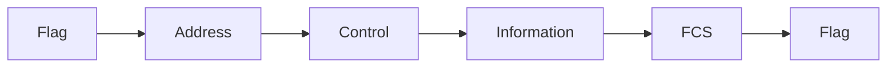
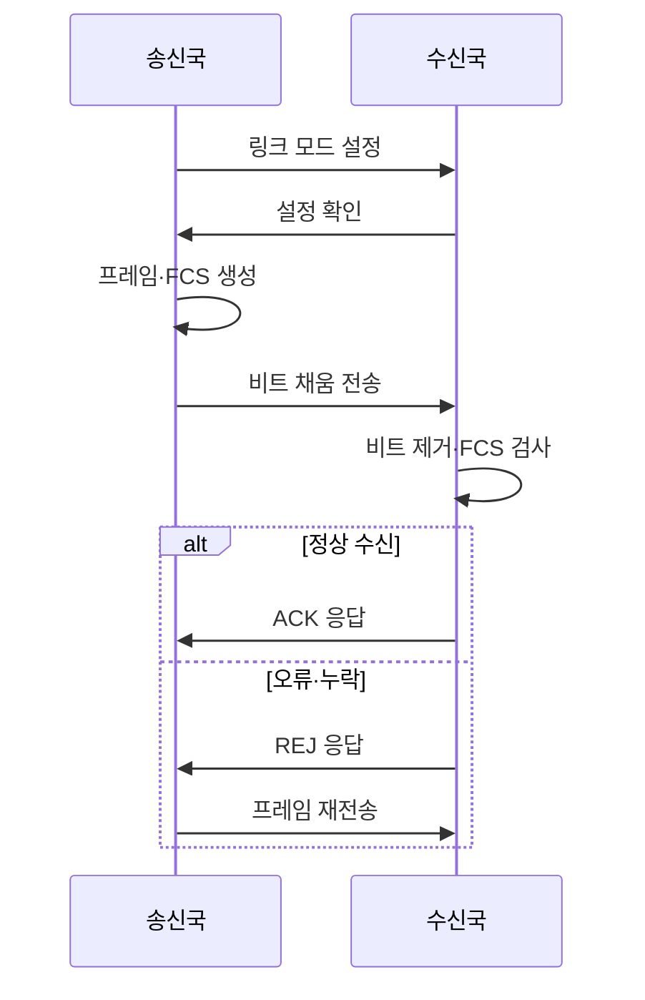

---
sidebar:
  order: 71
  label: "071. HDLC 프레임 구조와 동작 모드 (HDLC)"
  badge:
    text: "기출 · 30%"
    variant: note
title: "HDLC 프레임 구조와 동작 모드 (HDLC)"
date: "2026-07-25T12:24:00+09:00"
tags:
  - "notes-network"
weight: 71
extra:
  question_no: "071"
  source_status: "기출"
  source_history: "134회"
  priority: 30
  priority_note: "설명형: 134회 HDLC Frame·Mode 출제"
---

## 미리 알고가기

- **고급 데이터 링크 제어(High-Level Data Link Control, HDLC)**: 동기 회선에서 프레임·흐름·오류·링크 모드를 제어하는 비트 지향 프로토콜
- **프레임 검사 순서(Frame Check Sequence, FCS)**: 프레임의 전송 오류를 검출하도록 끝부분에 붙이는 검사값
- **순환 중복 검사(Cyclic Redundancy Check, CRC)**: 송수신 비트열을 생성다항식으로 나눈 나머지를 비교하는 오류 검출 방식
- **자동 재전송 요청(Automatic Repeat reQuest, ARQ)**: 오류·누락 프레임을 확인 응답과 순서 번호로 재전송하는 방식
- **정보 프레임(Information Frame, I-Frame)**: 사용자 데이터와 송수신 순서 번호를 전달하는 프레임
- **감독 프레임(Supervisory Frame, S-Frame)**: 수신 확인·재전송·흐름 상태를 전달하는 프레임
- **비번호 프레임(Unnumbered Frame, U-Frame)**: 링크 설정·해제·모드 제어를 수행하는 프레임
- **비트 채움(Bit Stuffing)**: 데이터에서 1이 다섯 번 연속되면 0을 넣어 플래그 패턴과 구분하는 방식
- **정상 응답 모드(Normal Response Mode, NRM)**: 주국의 허가가 있어야 종국이 전송하는 불균형 모드
- **비동기 응답 모드(Asynchronous Response Mode, ARM)**: 종국이 허가 없이 전송할 수 있는 불균형 모드
- **비동기 균형 모드(Asynchronous Balanced Mode, ABM)**: 양쪽 복합국이 대등하게 명령·응답하는 균형 모드
- **확인 응답(Acknowledgement, ACK·애크)**: 정상 수신한 다음 순서 번호를 알려 송신 가능한 프레임 범위를 갱신하는 응답
- **거부 응답(Reject, REJ·리젝트)**: 누락되거나 오류가 난 프레임의 순서 번호부터 재전송을 요구하는 응답
- **프로토콜 약어 읽기와 표기**: HDLC·FCS·CRC·ARQ는 에이치디엘씨·에프씨에스·씨알씨·에이알큐로 읽고 영문 머리글자를 딴 표기이며, 링크 제어·프레임 검사·오류 검출·재전송 역할을 함
- **프레임 기호 읽기와 표기**: I·S·U-Frame은 아이·에스·유 프레임으로 읽고 Information·Supervisory·Unnumbered의 머리글자를 딴 표기이며, 데이터·감독·링크 제어 기능을 구분함
- **모드 약어 읽기와 표기**: NRM·ARM·ABM은 엔알엠·에이알엠·에이비엠으로 읽고 영문 머리글자를 딴 표기이며, 주국 허가·종국 자발 응답·양단 대등 통신 모드를 구분함

## Ⅰ. 개요

- 정의: 비트 지향 링크 제어 프로토콜이다
- 배경: 동기 회선의 프레임·권한·오류를 표준화한다

### 쉽게 이해하기 (학습용)

- 연속 비트 흐름에 경계와 번호를 붙여 어디까지 정상 도착했고 무엇을 다시 보낼지 정한다

## Ⅱ. 특징

- 비트 채움은 데이터와 플래그의 경계 오인을 막는다
- I·S·U 분리는 데이터·감독·제어 오해를 막는다
- 슬라이딩 윈도는 대기 없이 전송해 처리량을 높인다
- 대칭·비대칭 모드는 회선 주도권 충돌을 막는다

### 쉽게 이해하기 (학습용)

- 데이터·응답·링크 제어를 다른 프레임으로 나눠 전송 순서와 권한을 관리한다

## Ⅲ. 아키텍처 및 구성요소

| 설계 요소 | 설명 |
|:---|:---|
| Flag | 고정 비트 패턴으로 프레임 경계 표시 |
| Address | 종국·복합국 등 통신 대상 식별 |
| Control | I·S·U 유형과 송수신 순서 표현 |
| Information | 사용자 데이터·관리 정보 수용 |
| FCS | CRC 나머지로 프레임 오류 검출 |

> 요약: 제어부는 순서, FCS는 오류를 판정한다

### 쉽게 이해하기 (학습용)

- 양끝 깃발로 프레임을 찾고 제어부 번호와 FCS로 순서·오류를 확인한다

## Ⅳ. 원리 및 절차 흐름도

| 절차 | 설명 |
|:---|:---|
| 링크 모드 설정 | U-Frame으로 모드·순서 상태 초기화 |
| 설정 확인 | 수신국이 링크 설정 수락을 응답 |
| 프레임·FCS 생성 | 주소·제어·정보와 CRC 나머지 결합 |
| 비트 채움 전송 | 연속 1 다섯 개 뒤 0 삽입 |
| 비트 제거·FCS 검사 | 채움 비트 제거 후 순서·오류 확인 |
| ACK 응답 | 정상 수신한 다음 순서 번호 알림 |
| REJ 응답 | 누락 위치부터 재전송 요청 |
| 프레임 재전송 | 요청된 순서부터 I-Frame 전송 |

> 요약: 순서 번호·FCS로 오류 프레임을 재전송한다

### 쉽게 이해하기 (학습용)
- FCS 불일치 시 수신 순서 번호로 재전송 위치를 알림

## Ⅴ. 종류 및 비교

| 판단 기준 | NRM | ARM | ABM |
|:---|:---|:---|:---|
| 핵심 특징 | 주국 허가 후 종국 전송 | 종국 자발 전송 가능 | 양단 복합국 대등 통신 |
| 적용 기준 | 주국 통제 다중점 링크 | 불균형 링크의 자발 응답 | 전이중 점대점 링크 |
| 주요 위험 | 폴링 지연·주국 장애 | 주국·종국 책임 복잡성 | 양단 상태·순서 불일치 |

> 요약: 전송 주도권에 따라 동작 모드를 구분한다

### 쉽게 이해하기 (학습용)
- ABM은 주국·종국 구분 없이 대등하게 통신함

## Ⅵ. 실무 사례

1. 양단의 FCS 길이·ABM 설정을 일치시킨다
2. REJ 순서 번호부터 오류 프레임을 재전송한다

### 쉽게 이해하기 (학습용)

- 두 장비의 오류 검사 길이와 대등 통신 모드가 같아야 프레임을 서로 해석한다
- 세 번째 프레임이 빠졌다는 응답을 받으면 그 번호부터 다시 보낸다

## Ⅶ. 결론

- 회선 주도권·오류 복구 요구로 HDLC 모드를 정한다

### 쉽게 이해하기 (학습용)

- 누가 먼저 보낼지와 오류 때 어디부터 다시 보낼지를 양단에서 같게 설정한다
