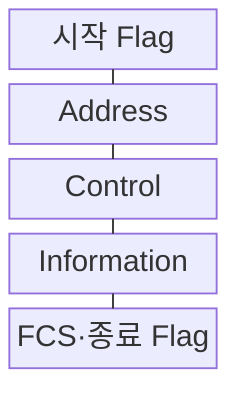
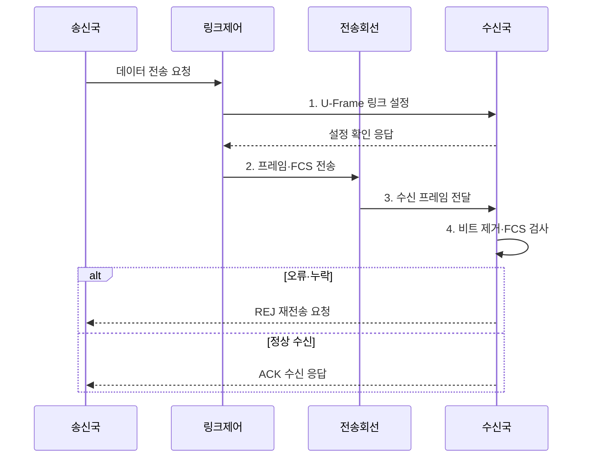

---
sidebar:
  order: 71
  label: "071. HDLC 프레임 구조와 동작 모드 (HDLC)"
  badge:
    text: "기출 · 30%"
    variant: note
title: "HDLC 프레임 구조와 동작 모드 (HDLC)"
date: "2026-07-31T11:04:27+09:00"
tags:
  - "notes-network"
weight: 71
extra:
  question_no: "071"
  source_status: "기출"
  source_history: "134회"
  priority: 30
  priority_note: "설명형: 134회 HDLC Frame·Mode 출제"
---

## 미리 알고가기

- **고급 데이터 링크 제어(High-Level Data Link Control, HDLC)**: 동기 회선에서 프레임·흐름·오류·링크 모드를 제어하는 비트 지향 프로토콜
- **프레임 검사 순서(Frame Check Sequence, FCS)**: 프레임의 전송 오류를 검출하도록 끝부분에 붙이는 검사값
- **순환 중복 검사(Cyclic Redundancy Check, CRC)**: 송수신 비트열을 생성다항식으로 나눈 나머지를 비교하는 오류 검출 방식
- **자동 재전송 요청(Automatic Repeat reQuest, ARQ)**: 오류·누락 프레임을 확인 응답과 순서 번호로 재전송하는 방식
- **정보 프레임(Information Frame, I-Frame)**: 사용자 데이터와 송수신 순서 번호를 전달하는 프레임
- **감독 프레임(Supervisory Frame, S-Frame)**: 수신 확인·재전송·흐름 상태를 전달하는 프레임
- **비번호 프레임(Unnumbered Frame, U-Frame)**: 링크 설정·해제·모드 제어를 수행하는 프레임
- **비트 채움(Bit Stuffing)**: 데이터에서 1이 다섯 번 연속되면 0을 넣어 플래그 패턴과 구분하는 방식
- **정상 응답 모드(Normal Response Mode, NRM)**: 주국의 허가가 있어야 종국이 전송하는 불균형 모드
- **비동기 응답 모드(Asynchronous Response Mode, ARM)**: 종국이 허가 없이 전송할 수 있는 불균형 모드
- **비동기 균형 모드(Asynchronous Balanced Mode, ABM)**: 양쪽 복합국이 대등하게 명령·응답하는 균형 모드
- **확인 응답(Acknowledgement, ACK·애크)**: 정상 수신한 다음 순서 번호를 알려 송신 가능한 프레임 범위를 갱신하는 응답
- **거부 응답(Reject, REJ·리젝트)**: 누락되거나 오류가 난 프레임의 순서 번호부터 재전송을 요구하는 응답
- **HDLC·FCS·CRC·ARQ**: 링크 제어·프레임 검사·오류 검출·재전송을 담당하는 데이터링크 계층 프로토콜과 오류 제어 요소
- **I·S·U-Frame**: 각각 사용자 데이터 전송·흐름 및 오류 감독·링크 설정과 제어를 담당하는 HDLC 프레임
- **NRM·ARM·ABM**: 각각 주국 허가 기반·종국 자발 응답·양단 대등 통신을 제공하는 HDLC 동작 모드
- **플래그(Flag)**: `01111110` 비트 패턴으로 HDLC 프레임의 시작과 끝을 표시하는 필드
- **주소·제어·정보 필드**: 통신 대상·프레임 유형과 순서·사용자 데이터를 담는 프레임 영역
- **주국·종국·복합국**: 명령 주체·응답 주체·두 역할을 모두 수행하는 HDLC 국
- **전이중(Full Duplex)**: 양방향에서 동시에 데이터를 전송할 수 있는 통신 방식
- **폴링(Polling)**: 주국이 종국에 차례로 전송 기회를 부여하는 제어 방식

> **키워드:** HDLC 프레임 구조와 동작 모드 (HDLC)

## Ⅰ. 개요

- 정의/개념: 동기 회선의 프레임·흐름·오류를 제어하는 **비트 지향 프로토콜**
- 배경/필요성: 비트열의 **경계·순서·오류 식별 불가**

### 쉽게 이해하기 (학습용)

- 연속 비트 흐름에 경계와 번호를 붙여 어디까지 정상 도착했고 무엇을 다시 보낼지 정한다

## Ⅱ. 특징

- **경계 투명성**: 플래그와 비트 채움으로 프레임 구분
- **기능 분리**: I·S·U 프레임으로 데이터·감독·제어
- **오류 복구**: FCS·순서 번호로 검출·재전송

### 쉽게 이해하기 (학습용)

- 데이터·응답·링크 제어를 다른 프레임으로 나눠 전송 순서와 권한을 관리한다

## Ⅲ. 구조 및 구성요소

| 구성요소 | 책임 |
|:---|:---|
| 시작 Flag | 고정 비트 패턴으로 프레임 시작 표시 |
| Address | 종국·복합국 등 통신 대상 식별 |
| Control | I·S·U 유형과 송수신 순서 표현 |
| Information | 사용자 데이터·관리 정보 수용 |
| FCS·종료 Flag | 오류 검출값과 프레임 끝 표시 |

### 쉽게 이해하기 (학습용)

- 양끝 깃발로 프레임을 찾고 제어부 번호와 FCS로 순서·오류를 확인한다

## Ⅳ. 흐름도

**동작 원리**

1. **U-Frame 링크 설정**: 모드·순서 상태 초기화
2. **프레임·FCS 전송**: 필드 결합 후 비트 채움 적용
3. **수신 프레임 전달**: 채움 비트가 포함된 프레임 제공
4. **비트 제거·FCS 검사**: 채움 비트 제거 후 순서·오류 확인

### 쉽게 이해하기 (학습용)

- FCS 불일치 시 수신 순서 번호로 재전송 위치를 알림

## Ⅴ. 종류 및 비교

| HDLC 동작 모드 | **NRM** | **ARM** | **ABM** |
|:---|:---|:---|:---|
| 적용 기준 | 주국 통제 다중점 링크 | 불균형 링크의 자발 응답 | 전이중 점대점 링크 |
| 핵심 특징 | 주국 허가 후 종국 전송 | 종국 자발 전송 가능 | 양단 복합국 대등 통신 |
| 한계 | 폴링 지연·주국 장애 | 주국·종국 책임 복잡성 | 양단 상태·순서 불일치 |

> 요약: 전송 주도권에 따라 동작 모드를 구분한다

### 쉽게 이해하기 (학습용)

- ABM은 주국·종국 구분 없이 대등하게 통신함

## Ⅵ. 실무 고려사항 및 대책

| 고려사항 | 대책 | 효과 |
|:---|:---|:---|
| 양단 모드 불일치로 링크 수립 실패 | **NRM·ARM·ABM 설정** 대조 | 링크 수립 성공 |
| 비트 채움 오류로 플래그 오인 | **플래그 경계·연속 1** 시험 | 프레임 경계 보장 |
| ACK·REJ 순서 상태 불일치 | **순서 번호·응답 상태** 검증 | 데이터 무손실 전달 |

### 쉽게 이해하기 (학습용)

- 수신 측이 세 번째 프레임의 누락을 REJ로 알리면 송신 측은 해당 순서 번호부터 프레임을 다시 보낸다

## Ⅶ. 결론

- 주국 통제 다중점은 **NRM**, 종국 자발은 **ARM**, 대등 점대점은 **ABM**

### 쉽게 이해하기 (학습용)

- 누가 먼저 보내고 오류 시 어디부터 재전송할지를 양단에서 같게 설정해야 한다.
