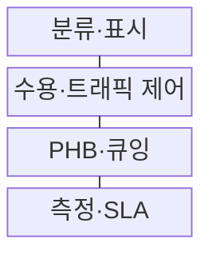
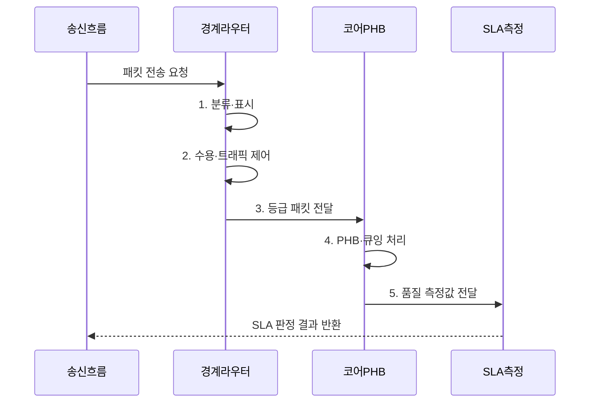

---
sidebar:
  order: 72
  label: "072. QoS, DiffServ, IntServ"
  badge:
    text: "미출 · 50%"
    variant: note
title: "QoS, DiffServ, IntServ"
date: "2026-07-31T01:11:36+09:00"
tags:
  - "notes-network"
weight: 72
extra:
  question_no: "072"
  source_status: "미출"
  source_history: ""
  priority: 50
  priority_note: "비교·설계형: DiffServ·IntServ QoS 기반"
---

## 미리 알고가기

- **지터(Jitter)**: 패킷 도착 간격의 흔들림
- **통합 서비스(Integrated Services, IntServ)**: 흐름별 자원을 예약하고 라우터가 상태를 유지하는 QoS 구조
- **차등 서비스(Differentiated Services, DiffServ)**: 패킷 등급을 표시하고 영역 내 라우터가 등급별 동작을 적용하는 QoS 구조
- **홉별 동작(Per-Hop Behavior, PHB)**: DiffServ 노드가 등급별로 수행하는 큐잉·스케줄링·폐기 동작
- **서비스 품질(Quality of Service, QoS·큐오에스)**: Quality·of·Service의 핵심 글자를 딴 표기이며, 지연·지터·손실·대역폭을 트래픽별로 차등 관리하는 체계
- **차등 서비스 코드점(Differentiated Services Code Point, DSCP·디에스씨피)**: 영문 각 단어의 머리글자를 딴 표기이며, IP 헤더에 등급을 표시해 홉별 동작을 선택하게 하는 값
- **자원 예약 프로토콜(Resource Reservation Protocol, RSVP·알에스브이피)**: 영문 각 단어의 머리글자를 딴 표기이며, IntServ 흐름의 종단 간 자원을 예약하는 신호 프로토콜
- **구조 약어 읽기와 표기**: IntServ·DiffServ·PHB는 인트서브·디프서브·피에이치비로 읽고 Integrated·Differentiated Service와 Per-Hop Behavior를 줄인 표기이며, 흐름 예약·등급 차등·홉별 실행 역할을 구분함
- **서비스 수준 협약(Service Level Agreement, SLA·에스엘에이)**: 영문 각 단어의 머리글자를 딴 표기이며, 측정한 품질을 계약 목표와 비교하는 기준
- **최선형 서비스(Best Effort)**: 패킷별 자원 보장 없이 가능한 범위에서 전달하는 기본 서비스
- **수용 제어(Admission Control)**: 새 흐름을 받아도 기존 품질 목표를 지킬 수 있는지 판단하는 기능
- **트래픽 제어(Traffic Conditioning)**: 약정 속도·버스트에 맞게 표시·제한·평활하는 처리
- **큐잉·폐기(Queuing·Dropping)**: 패킷을 등급별 대기열에 저장하고 혼잡 시 일부를 버리는 처리
- **도메인 경계(Domain Boundary)**: 서로 다른 QoS 정책과 DSCP 규칙이 만나는 네트워크 지점

## Ⅰ. 개요

- 정의/개념: 분류·표시·큐잉으로 자원을 배분하는 **트래픽 품질 관리 체계**
- 배경/필요성: 최선형 동일 처리는 혼잡 시 **서비스별 품질 보장 불가**

### 쉽게 이해하기 (학습용)

- 한정된 회선이 붐빌 때 중요한 패킷의 순서·대역폭·폐기 기준을 미리 정해 품질 차이를 만든다

## Ⅱ. 특징

- **차등 처리**: 큐잉·폐기로 중요 흐름 손실 감소
- **정책 연속성**: 도메인별 표시·PHB 정합으로 종단 유지
- **자원 배분**: 등급별 대역폭·버퍼·폐기 기준 적용

### 쉽게 이해하기 (학습용)

- 혼잡하지 않을 때는 차이가 작지만 큐가 차면 어떤 패킷을 먼저 보내고 버릴지가 품질을 가른다

## Ⅲ. 구조 및 구성요소

| 구성요소 | 책임 |
|:---|:---|
| 분류·표시 | 흐름 식별과 DSCP 등급 설정 |
| 수용·트래픽 제어 | 자원 허용과 속도·버스트 제한 |
| PHB·큐잉 | 등급별 버퍼·전송·폐기 처리 |
| 측정·SLA | 지연·지터·손실·대역폭 판정 |

### 쉽게 이해하기 (학습용)

- 등급 표시는 약속일 뿐 실제 처리는 PHB와 큐잉 자원이 결정함

## Ⅳ. 흐름도

**동작 원리**

1. **분류·표시**: 트래픽을 식별해 DSCP 등급 설정
2. **수용·트래픽 제어**: 할당량과 속도 정책 적용
3. **등급 패킷 전달**: 표시를 보존해 코어 영역으로 전달
4. **PHB·큐잉 처리**: 등급별 순서·대역·폐기 정책 실행
5. **품질 측정값 전달**: 지연·지터·손실·대역폭 제공

### 쉽게 이해하기 (학습용)

- 중간 경로가 등급 표시를 지우면 이후 장비의 차등 처리가 끊긴다

## Ⅴ. 종류 및 비교

| 판단 기준 | **IntServ** | **DiffServ** |
|:---|:---|:---|
| 적용 기준 | 소수 흐름의 명시적 자원 예약 | 대규모 IP망의 통계적 차등 |
| 핵심 특징 | 흐름별 RSVP 예약·상태 | 등급별 DSCP·PHB 처리 |
| 한계 | 라우터 상태·신호 부하 증가 | 종단 자원 보장·도메인 정합 한계 |

> 요약: IntServ는 흐름 예약, DiffServ는 등급 처리다

### 쉽게 이해하기 (학습용)

- IntServ는 예약제, DiffServ는 서비스 등급 기반 차등제임

## Ⅵ. 실무 고려사항 및 대책

| 고려사항 | 대책 | 효과 |
|:---|:---|:---|
| 도메인 경계에서 DSCP 변경 | **표시 보존·재표시 정책** 합의 | 종단 차등 유지 |
| 우선 큐 과다 할당으로 일반 흐름 고갈 | **수용 제어·대역 상한** 설정 | 일반 트래픽 보호 |
| 흐름별 상태 증가로 라우터 확장 제약 | **DiffServ 등급 집계** 적용 | 라우터 상태 절감 |

### 쉽게 이해하기 (학습용)

- 음성 패킷에 DSCP 우선 등급을 표시하고 경로상의 장비가 지연이 짧은 우선 큐로 일관되게 처리한다

## Ⅶ. 결론

- 소수 흐름의 명시적 예약은 **IntServ**, 대규모 등급 차등은 **DiffServ**

### 쉽게 이해하기 (학습용)

- 소수 흐름의 명시적 예약은 IntServ, 많은 흐름의 등급 차등은 DiffServ가 유리하다.
