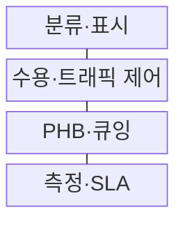
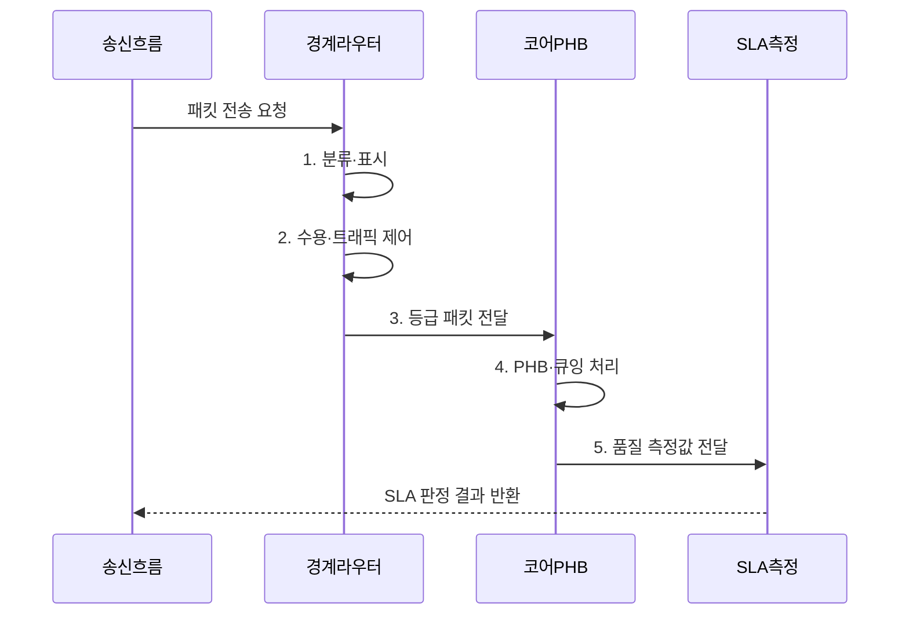

---
sidebar:
  order: 72
  label: "072. QoS, DiffServ, IntServ"
  badge:
    text: "미출 · 50%"
    variant: note
title: "QoS, DiffServ, IntServ"
date: "2026-08-02T12:00:00+09:00"
tags:
  - "notes-network"
weight: 72
extra:
  question_no: "072"
  source_status: "미출"
  source_history: ""
  priority: 50
  priority_note: "비교·설계형: DiffServ·IntServ QoS 기반"
---

## Ⅰ. 개요

핵심 용어

- **네트워크 트래픽 품질 관리 체계**: QoS는 혼잡 시 트래픽을 분류·표시하고 큐·대역폭·폐기 정책을 차등 적용하는 네트워크 트래픽 품질 관리 체계다.

- 정의/개념: **QoS**는 분류·표시·큐잉으로 지연·지터·손실·대역폭 자원을 차등 배분하는 **네트워크 트래픽 품질 관리 체계**
- 배경/필요성: 최선형 동일 처리는 혼잡 시 **서비스별 품질 보장 불가**

### 쉽게 이해하기 (학습용)

- 한정된 회선이 붐빌 때 중요한 패킷의 순서·대역폭·폐기 기준을 미리 정해 품질 차이를 만든다

## Ⅱ. 특징

핵심 용어

- **정책 연속성**: 정책 연속성은 도메인 경계의 DSCP 표시와 내부 PHB 규칙을 정렬해 종단 경로에서 같은 서비스 등급을 유지한다.

- **차등 처리**: 큐잉·폐기로 중요 흐름 손실 감소
- **정책 연속성**: 도메인별 표시·PHB 정합으로 종단 유지
- **자원 배분**: 등급별 대역폭·버퍼·폐기 기준 적용

### 쉽게 이해하기 (학습용)

- 혼잡하지 않을 때는 차이가 작지만 큐가 차면 어떤 패킷을 먼저 보내고 버릴지가 품질을 가른다

## Ⅲ. 구조 및 구성요소

핵심 용어

- **PHB·큐잉**: PHB·큐잉은 표시된 등급에 따라 패킷의 버퍼·전송 순서·대역폭·혼잡 폐기 방식을 실행한다.

| 구성요소 | 책임 |
|:---|:---|
| 분류·표시 | 흐름 식별과 DSCP 등급 설정 |
| 수용·트래픽 제어 | 자원 허용과 속도·버스트 제한 |
| PHB·큐잉 | 등급별 버퍼·전송·폐기 처리 |
| 측정·SLA | 지연·지터·손실·대역폭 판정 |

### 쉽게 이해하기 (학습용)

- 등급 표시는 약속일 뿐 실제 처리는 PHB와 큐잉 자원이 결정함

## Ⅳ. 흐름도

핵심 용어

- **4. PHB·큐잉 처리**: 코어 라우터는 DSCP 등급을 PHB에 매핑해 큐 순서·할당 대역·폐기 정책을 적용한다.

**동작 원리**

1. **분류·표시**: 트래픽을 식별해 DSCP 등급 설정
2. **수용·트래픽 제어**: 할당량과 속도 정책 적용
3. **등급 패킷 전달**: 표시를 보존해 코어 영역으로 전달
4. **PHB·큐잉 처리**: 등급별 순서·대역·폐기 정책 실행
5. **품질 측정값 전달**: 지연·지터·손실·대역폭 제공

### 쉽게 이해하기 (학습용)

- 중간 경로가 등급 표시를 지우면 이후 장비의 차등 처리가 끊긴다

## Ⅴ. 종류 및 비교

핵심 용어

- **DiffServ**: DiffServ는 개별 흐름 상태 대신 DSCP 등급을 집계하고 각 홉에서 PHB를 적용해 대규모 IP망의 트래픽을 차등 처리한다.

| 판단 기준 | **IntServ** | **DiffServ** |
|:---|:---|:---|
| 적용 기준 | 소수 흐름의 명시적 자원 예약 | 대규모 IP망의 통계적 차등 |
| 핵심 특징 | 흐름별 RSVP 예약·상태 | 등급별 DSCP·PHB 처리 |
| 한계 | 라우터 상태·신호 부하 증가 | 종단 자원 보장·도메인 정합 한계 |

> 요약: IntServ는 흐름 예약, DiffServ는 등급 처리다

### 쉽게 이해하기 (학습용)

- IntServ는 예약제, DiffServ는 서비스 등급 기반 차등제임

## Ⅵ. 실무 고려사항 및 대책

핵심 용어

- **DSCP 변경**: 도메인 경계에서 DSCP 변경 정책이 일치하지 않으면 뒤쪽 장비가 원래 서비스 등급을 인식하지 못해 종단 QoS가 끊긴다.

| 문제 | 대책 | 효과 |
|:---|:---|:---|
| 도메인 경계에서 DSCP 변경 | **표시 보존·재표시 정책** 합의 | 종단 차등 유지 |
| 우선 큐 과다 할당으로 일반 흐름 고갈 | **수용 제어·대역 상한** 설정 | 일반 트래픽 보호 |
| 흐름별 상태 증가로 라우터 확장 제약 | **DiffServ 등급 집계** 적용 | 라우터 상태 절감 |

### 쉽게 이해하기 (학습용)

- 음성 패킷에 DSCP 우선 등급을 표시하고 경로상의 장비가 지연이 짧은 우선 큐로 일관되게 처리한다

## Ⅶ. 결론

핵심 용어

- **IntServ**: IntServ는 RSVP로 흐름별 종단 자원을 예약하고 라우터가 개별 상태를 유지해 명시적 품질을 보장한다.

- 소수 흐름의 명시적 예약은 **IntServ**, 대규모 등급 차등은 **DiffServ**

### 쉽게 이해하기 (학습용)

- 소수 흐름의 명시적 예약은 IntServ, 많은 흐름의 등급 차등은 DiffServ가 유리하다.
