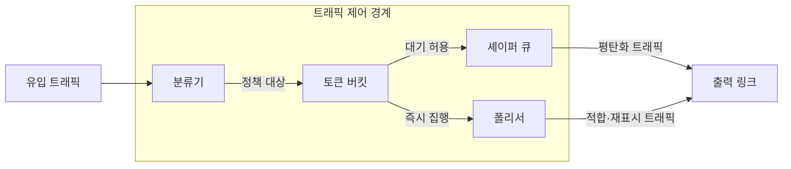
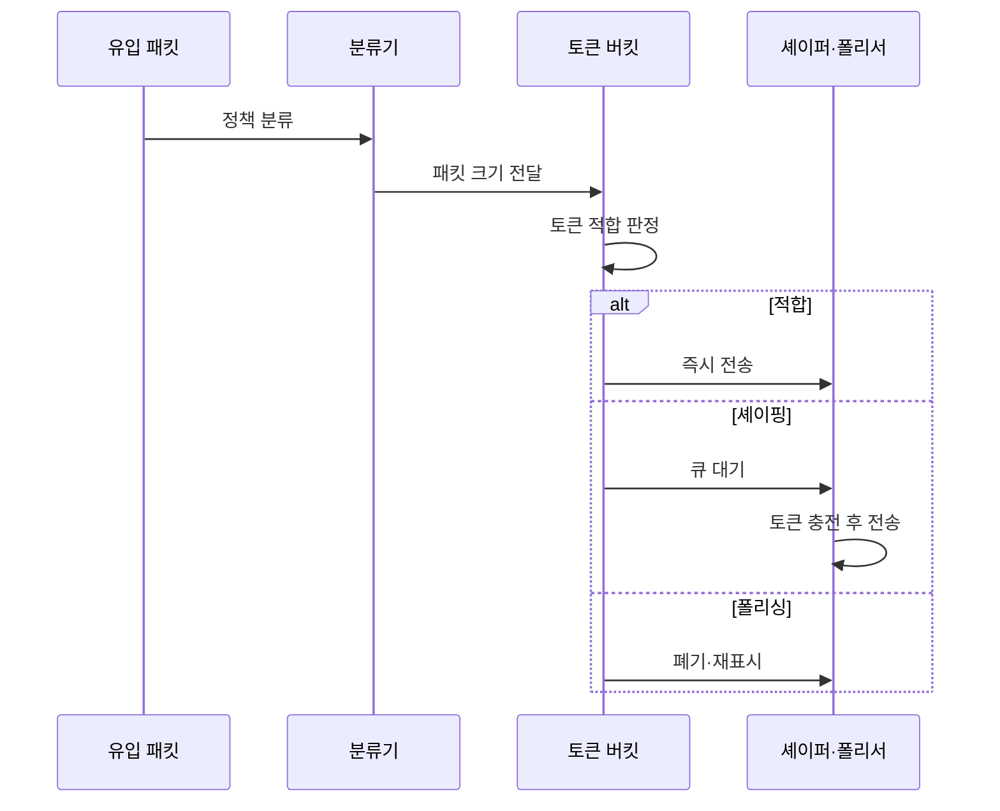

---
sidebar:
  order: 73
  label: "073. 트래픽 셰이핑과 폴리싱 (Traffic Shaping, Policing)"
  badge:
    text: "기출 · 30%"
    variant: note
title: "트래픽 셰이핑과 폴리싱 (Traffic Shaping, Policing)"
date: "2026-07-27T23:59:59+09:00"
tags:
  - "notes-network"
weight: 73
extra:
  question_no: "073"
  source_status: "기출"
  source_history: "135회"
  priority: 30
  priority_note: "비교·운영형: Shaping·Policing 정책 판단"
---

## 미리 알고가기

- **약정 정보율(Committed Information Rate, CIR)**: 계약이나 정책이 허용하는 장기 평균 전송률
- **최고 정보율(Peak Information Rate, PIR)**: 짧은 구간에 허용하는 최대 전송률
- **약정 버스트 크기(Committed Burst Size, Bc)**: CIR 안에서 한 번에 전송할 수 있도록 저장하는 토큰량
- **초과 버스트 크기(Excess Burst Size, Be)**: 약정 버스트를 넘어서 추가로 허용하는 토큰량
- **토큰 버킷(Token Bucket)**: 일정 속도로 쌓이는 토큰과 패킷 크기를 비교해 적합·초과를 판정하는 방식
- **트래픽 셰이핑(Traffic Shaping)**: 초과 패킷을 큐에 저장했다가 토큰이 생기면 보내 전송률을 평탄화하는 방식
- **트래픽 폴리싱(Traffic Policing)**: 초과 패킷을 즉시 폐기하거나 낮은 등급으로 재표시해 한도를 집행하는 방식
- **능동 큐 관리(Active Queue Management, AQM)**: 큐가 가득 차기 전에 패킷을 확률적으로 폐기·표시해 혼잡을 알리는 방식
- **속도 약어 읽기와 표기**: CIR·PIR은 씨아이알·피아이알로 읽고 Committed·Peak Information Rate의 머리글자를 딴 표기이며, 약정 평균 속도와 허용 최고 속도를 나타냄
- **버스트 기호 읽기와 표기**: $B_c$·$B_e$는 비 서브 씨·비 서브 이로 읽고 B는 Burst, 아래첨자 c와 e는 Committed와 Excess를 뜻하며 약정·초과 토큰량을 나타냄
- **능동 큐 관리 약어(AQM·에이큐엠)**: Active Queue Management의 머리글자를 딴 표기이며, 큐가 가득 차기 전에 혼잡을 알리는 폐기·표시 역할
- **차등 서비스 코드점(Differentiated Services Code Point, DSCP·디에스씨피)**: 영문 각 단어의 머리글자를 딴 표기이며, 폴리서가 초과 패킷의 전달 등급을 낮출 때 바꾸는 IP 헤더 값

## Ⅰ. 개요

- 정의: **토큰 판정**으로 트래픽 전송률 제어
- 기존 한계: 버스트의 **계약 위반·하위 회선 혼잡**

### 쉽게 이해하기 (학습용)

- 약속한 속도를 넘은 패킷을 기다렸다 보내거나 버려 회선에 한꺼번에 몰리지 않게 한다

## Ⅱ. 특징

- **토큰 생성률**에 따른 장기 평균 속도 제한
- **버킷 크기**에 따른 허용 버스트 결정
- 초과 패킷의 **대기 또는 즉시 집행**

### 쉽게 이해하기 (학습용)

- 버킷이 크면 순간적으로 많은 패킷을 보낼 수 있지만 출력 속도의 흔들림도 커진다

## Ⅲ. 아키텍처 및 구성요소

| 설계 요소 | 설명 |
|:---|:---|
| 분류기 | 서비스 등급 및 정책 대상 구분 |
| 토큰 버킷 | CIR·PIR·버스트로 적합·초과 판정 |
| 셰이퍼 | 초과분 큐 저장 및 지연 전송 |
| 폴리서 | 초과분 폐기 혹은 등급 변경 |

> 요약: 토큰 판정 뒤 대기하거나 즉시 집행한다

### 쉽게 이해하기 (학습용)
- 토큰 버킷이 초과를 판정하면 셰이퍼나 폴리서가 처리함

## Ⅳ. 원리 및 절차 흐름도

| 절차 | 설명 |
|:---|:---|
| 정책 분류 | 서비스·가입자별 제어 정책 선택 |
| 패킷 크기 전달 | 필요한 바이트 토큰 수 계산 |
| 토큰 적합 판정 | 잔여 토큰과 패킷 크기 비교 |
| 즉시 전송 | 적합 패킷의 토큰 차감 후 전달 |
| 큐 대기 | 초과 패킷을 셰이퍼 버퍼에 저장 |
| 토큰 충전 후 전송 | CIR 속도로 토큰이 생기면 전달 |
| 폐기·재표시 | 초과분 제거 또는 낮은 DSCP 부여 |

> 요약: 토큰 부족 시 대기하거나 폐기·재표시한다

### 쉽게 이해하기 (학습용)
- 패킷 크기만큼 토큰이 있으면 즉시 보내고 부족하면 정책에 따라 기다리거나 폐기한다

## Ⅴ. 종류 및 비교

| 트래픽 속도 제어 | 트래픽 셰이핑 | 트래픽 폴리싱 |
|:---|:---|:---|
| 적용 기준 | 출구 전송률 평탄화 | 입구 계약 한도 집행 |
| 핵심 특징 | 초과 패킷 큐 대기 | 초과 패킷 폐기·재표시 |
| 한계 | 큐 지연·버퍼 오버플로 | 손실·상위 프로토콜 재전송 |

> 요약: 대기는 셰이핑, 즉시 집행은 폴리싱이다

### 쉽게 이해하기 (학습용)
- 셰이퍼 버스트가 폴리서보다 크면 경계에서 폐기됨

## Ⅵ. 실무 사례

1. 지사 출구의 **CIR 기반 트래픽 셰이핑**

### 쉽게 이해하기 (학습용)

- 지사 라우터가 초과 패킷을 버리지 않고 버퍼에서 지연시켜 계약 속도로 전송함으로써 사업자 폴리서의 폐기를 줄인다

## Ⅶ. 결론

- 계약 대역 초과 트래픽이 하류에서 무작위 폐기되는 문제를 줄이기 위해 CIR·버스트·지연 허용·손실 정책·버퍼를 검토하여, 완화에는 셰이핑, 즉시 집행에는 폴리싱을 선택해야 한다.

### 쉽게 이해하기 (학습용)

- 기다려도 되면 셰이핑, 한도를 즉시 집행해야 하면 폴리싱을 선택한다
