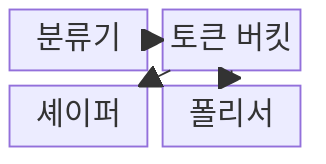
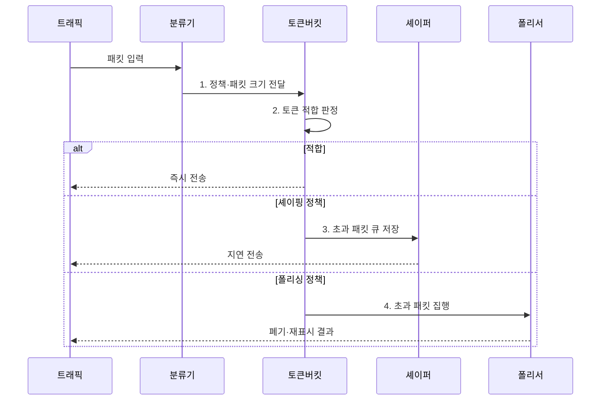

---
sidebar:
  order: 73
  label: "073. 트래픽 셰이핑과 폴리싱 (Traffic Shaping, Policing)"
  badge:
    text: "기출 · 30%"
    variant: note
title: "트래픽 셰이핑과 폴리싱 (Traffic Shaping, Policing)"
date: "2026-08-02T12:00:00+09:00"
tags:
  - "notes-network"
weight: 73
extra:
  question_no: "073"
  source_status: "기출"
  source_history: "135회"
  priority: 30
  priority_note: "비교·운영형: Shaping·Policing 정책 판단"
---

## Ⅰ. 개요

핵심 용어

- **트래픽 제어 기법**: 셰이핑과 폴리싱은 토큰 버킷으로 약정 속도와 순간 버스트의 적합 여부를 판단하는 트래픽 제어 기법이다.

- 정의/개념: 토큰 판정으로 속도와 버스트를 제한하는 **트래픽 제어 기법**
- 배경/필요성: 버스트의 **계약 위반·하위 회선 혼잡**

#### 한줄 요약

- 약속한 속도를 넘은 패킷을 기다렸다 보내거나 버려 회선에 한꺼번에 몰리지 않게 한다

## Ⅱ. 특징

핵심 용어

- **버스트 허용**: 버스트 허용은 버킷에 미리 축적한 토큰 범위에서 장기 평균 속도보다 큰 순간 전송을 허용한다.

- **평균 속도**: 토큰 생성률로 장기 전송률 제한
- **버스트 허용**: 버킷 크기로 순간 전송량 결정
- **초과 처리**: 대기·폐기·재표시 정책으로 집행

#### 한줄 요약

- 버킷이 크면 순간적으로 많은 패킷을 보낼 수 있지만 출력 속도의 흔들림도 커진다

## Ⅲ. 구조 및 구성요소

핵심 용어

- **토큰 버킷**: 토큰 버킷은 일정 속도로 생성되는 토큰과 패킷 크기를 비교해 약정 적합·초과 트래픽을 판정한다.

| 구성요소 | 책임 |
|:---|:---|
| 분류기 | 서비스 등급 및 정책 대상 구분 |
| 토큰 버킷 | CIR·PIR·버스트로 적합·초과 판정 |
| 셰이퍼 | 초과분 큐 저장 및 지연 전송 |
| 폴리서 | 초과분 폐기 혹은 등급 변경 |

#### 한줄 요약

- 토큰 버킷이 초과를 판정하면 셰이퍼나 폴리서가 처리함

## Ⅳ. 흐름도

핵심 용어

- **3. 초과 패킷 큐 저장**: 셰이퍼는 토큰이 부족한 패킷을 버리지 않고 큐에 저장했다가 토큰이 생성되면 지연 전송한다.

**동작 원리**

1. **정책·패킷 크기 전달**: 가입자 정책과 필요 토큰 계산
2. **토큰 적합 판정**: 잔여 토큰과 패킷 크기 비교
3. **초과 패킷 큐 저장**: 토큰 생성까지 버퍼에서 대기
4. **초과 패킷 집행**: 즉시 폐기하거나 DSCP 재표시

#### 한줄 요약

- 패킷 크기만큼 토큰이 있으면 즉시 보내고 부족하면 정책에 따라 기다리거나 폐기한다

## Ⅴ. 종류 및 비교

핵심 용어

- **트래픽 폴리싱**: 트래픽 폴리싱은 약정 한도를 넘은 패킷을 즉시 폐기하거나 낮은 DSCP로 재표시해 입구 계약을 집행한다.

| 트래픽 속도 제어 | **트래픽 셰이핑** | **트래픽 폴리싱** |
|:---|:---|:---|
| 적용 기준 | 출구 전송률 평탄화 | 입구 계약 한도 집행 |
| 핵심 특징 | 초과 패킷 큐 대기 | 초과 패킷 폐기·재표시 |
| 한계 | 큐 지연·버퍼 오버플로 | 손실·상위 프로토콜 재전송 |

> 요약: 대기는 셰이핑, 즉시 집행은 폴리싱이다

#### 한줄 요약

- 셰이퍼 버스트가 폴리서보다 크면 경계에서 폐기됨

## Ⅵ. 실무 고려사항 및 대책

핵심 용어

- **응답 지연 초과**: 응답 지연 초과는 셰이핑 큐가 계속 늘어 패킷이 응용의 지연 한도보다 오래 대기하는 문제다.

| 문제 | 대책 | 효과 |
|:---|:---|:---|
| 셰이퍼 버스트가 경계 폴리서 초과 | **양단 CIR·버킷 크기** 정렬 | 경계 폐기 감소 |
| 셰이핑 큐 증가로 응답 지연 초과 | **지연 한도·버퍼 상한** 설정 | 응답 시간 보호 |
| 폴리싱 폐기로 상위 재전송 증가 | **재표시·응용 영향** 함께 분석 | 불필요 재전송 감소 |

#### 한줄 요약

- 지사 라우터가 초과 패킷을 버리지 않고 버퍼에서 지연시켜 계약 속도로 전송함으로써 사업자 폴리서의 폐기를 줄인다

## Ⅶ. 결론

핵심 용어

- **셰이핑**: 초과 패킷의 지연 전송이 허용되면 셰이핑으로 출력률을 평탄화하고 즉시 계약을 집행해야 하면 폴리싱을 적용한다.

- 초과분 대기가 가능하면 **셰이핑**, 계약 한도 즉시 집행은 **폴리싱**

#### 한줄 요약

- 기다려도 되는 초과분은 셰이핑, 계약 한도를 즉시 집행해야 하면 폴리싱을 사용한다.
