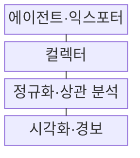
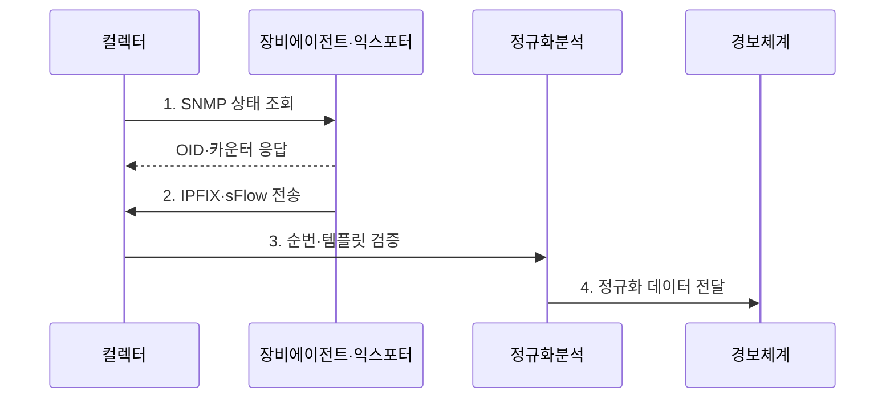

---
sidebar:
  order: 74
  label: "074. 네트워크 모니터링: SNMP, NetFlow, sFlow"
  badge:
    text: "미출 · 50%"
    variant: note
title: "네트워크 모니터링: SNMP, NetFlow, sFlow"
date: "2026-08-02T12:00:00+09:00"
tags:
  - "notes-network"
weight: 74
extra:
  question_no: "074"
  source_status: "미출"
  source_history: ""
  priority: 50
  priority_note: "설계·운영형: SNMP·Flow 관측의 공통 우산"
---

## Ⅰ. 개요

핵심 용어

- **네트워크 관측 체계**: 네트워크 모니터링은 SNMP 상태·흐름 레코드·패킷 표본을 함께 수집해 장애와 트래픽 원인을 연결하는 네트워크 관측 체계다.

- 정의/개념: **네트워크 모니터링**은 장비 상태·트래픽 흐름·패킷 표본을 수집·상관 분석하는 **네트워크 관측 체계**
- 배경/필요성: 단일 지표로는 **장비 장애·트래픽 원인 연결 불가**

### 쉽게 이해하기 (학습용)

- 장비 상태표와 통신 흐름 기록과 패킷 표본을 함께 봐야 장애 원인과 트래픽 주체를 연결할 수 있다

## Ⅱ. 특징

핵심 용어

- **신호 결합**: 신호 결합은 장비 카운터·통신 흐름·패킷 표본을 같은 시간축과 인터페이스 기준으로 연결한다.

- **단위 정규화**: 서로 다른 트래픽 지표를 공통 축으로 변환
- **수집 검증**: 시각·순번·템플릿 오류로 인한 왜곡 방지
- **신호 결합**: 상태·흐름·표본으로 장비와 주체 연결

### 쉽게 이해하기 (학습용)

- 같은 트래픽도 누적 카운터는 총량, 흐름 레코드는 통신 주체, 패킷 표본은 일부 내용을 보여 준다

## Ⅲ. 구조 및 구성요소

핵심 용어

- **정규화·상관 분석**: 정규화·상관 분석은 서로 다른 관측 단위와 수집 시각을 공통 축으로 변환해 상태 변화와 통신 주체를 연결한다.

| 구성요소 | 책임 |
|:---|:---|
| 에이전트·익스포터 | 장비 상태·흐름·패킷 표본 생성 |
| 컬렉터 | 템플릿·순번·수집 시각 검증과 저장 |
| 정규화·상관 분석 | 서로 다른 관측 단위를 시간축으로 결합 |
| 시각화·경보 | 품질 임계치·이상 패턴 통지 |

### 쉽게 이해하기 (학습용)

- 장비가 만든 상태·흐름·표본을 컬렉터가 같은 시간축으로 맞춰 분석기에 전달한다

## Ⅳ. 흐름도

핵심 용어

- **3. 순번·템플릿 검증**: 컬렉터는 레코드 순번과 IPFIX 템플릿을 확인해 누락·장비 재시작·필드 해석 오류를 식별한다.

**동작 원리**

1. **SNMP 상태 조회**: 필요한 OID를 주기적으로 요청
2. **IPFIX·sFlow 전송**: 흐름 레코드·패킷 표본 내보내기
3. **순번·템플릿 검증**: 누락·재시작·필드 해석 오류 식별
4. **정규화 데이터 전달**: 장비·인터페이스·시간 기준 통일

### 쉽게 이해하기 (학습용)

- 컬렉터는 레코드 순번과 형식을 먼저 검사한 뒤 같은 시각의 장비 상태와 트래픽을 연결한다

## Ⅴ. 종류 및 비교

핵심 용어

- **NetFlow·IPFIX**: NetFlow·IPFIX는 공통 속성의 패킷을 흐름 레코드로 집계해 송수신 주체·경로·바이트·패킷을 분석한다.

| 판단 기준 | **SNMP** | **NetFlow·IPFIX** | **sFlow** |
|:---|:---|:---|:---|
| 적용 기준 | 장비 장애·용량 상태 | 트래픽 주체·경로 분석 | 고속망의 낮은 수집 부하 |
| 핵심 특징 | OID 상태·누적 카운터 | 흐름별 바이트·패킷 집계 | 패킷 표본·인터페이스 카운터 |
| 한계 | 폴링 간 짧은 사건 누락 | 템플릿·수집기 부하 | 표본 오차·희소 흐름 누락 |

> 요약: 상태·흐름·표본을 결합해 원인을 분석한다

### 쉽게 이해하기 (학습용)

- 표본 분석에서 데이터가 안 보여도 트래픽이 없다고 단정 불가함

## Ⅵ. 실무 고려사항 및 대책

핵심 용어

- **사건 왜곡**: 사건 왜곡은 장비와 컬렉터의 시각·순번·재시작 상태가 맞지 않아 서로 다른 시점의 상태와 흐름을 같은 원인으로 연결하는 문제다.

| 문제 | 대책 | 효과 |
|:---|:---|:---|
| 수집 시각·순번 불일치로 사건 왜곡 | **NTP·순번·재시작** 검증 | 사건 상관 정확성 확보 |
| 고속망 전체 패킷 수집으로 장비 과부하 | **sFlow 표본율·IPFIX 집계** 조정 | 수집 비용 절감 |
| 표본 부재를 트래픽 없음으로 오인 | **카운터·흐름·표본** 교차 확인 | 희소 흐름 오판 방지 |

### 쉽게 이해하기 (학습용)

- SNMP로 포트 사용량이 급증한 시각을 찾고 같은 시각의 IPFIX 흐름을 분석해 대역을 점유한 송수신 주체를 확인한다

## Ⅶ. 결론

핵심 용어

- **sFlow**: sFlow는 패킷 표본과 인터페이스 카운터를 내보내 전체 패킷 수집보다 낮은 부하로 고속망을 관측한다.

- 장비 상태는 **SNMP**, 통신 주체는 **IPFIX**, 고속망 저부하는 **sFlow**

### 쉽게 이해하기 (학습용)

- 장비 상태와 통신 주체, 패킷 표본 중 질문에 필요한 자료를 수집 비용에 맞춰 조합해야 한다.
