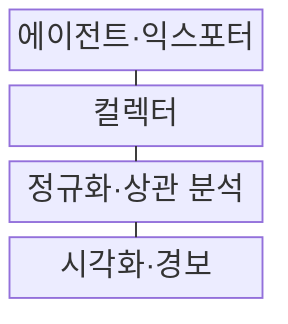
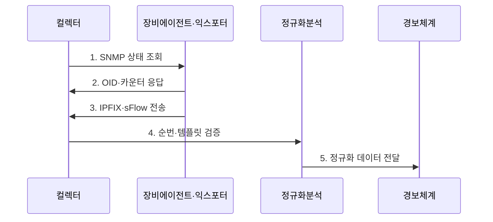

---
sidebar:
  order: 74
  label: "074. 네트워크 모니터링: SNMP, NetFlow, sFlow"
  badge:
    text: "미출 · 50%"
    variant: note
title: "네트워크 모니터링: SNMP, NetFlow, sFlow"
date: "2026-07-31T01:11:36+09:00"
tags:
  - "notes-network"
weight: 74
extra:
  question_no: "074"
  source_status: "미출"
  source_history: ""
  priority: 50
  priority_note: "설계·운영형: SNMP·Flow 관측의 공통 우산"
---

## 미리 알고가기

- **단순 네트워크 관리 프로토콜(Simple Network Management Protocol, SNMP)**: 관리자가 에이전트의 상태·카운터를 조회하고 알림을 받는 프로토콜
- **관리 정보 기반(Management Information Base, MIB)**: 장비 관리 항목의 계층·자료형·접근 권한을 정의한 정보 모델
- **객체 식별자(Object Identifier, OID)**: MIB의 각 관리 항목을 계층형 숫자로 식별하는 값
- **NetFlow**: 장비가 같은 특성의 패킷을 흐름 레코드로 집계해 내보내는 트래픽 관측 기술
- **IP 흐름 정보 내보내기(IP Flow Information Export, IPFIX)**: 템플릿과 데이터 레코드로 흐름 정보를 수집기에 전송하는 표준
- **sFlow**: 패킷 표본과 인터페이스 카운터를 수집기에 전송하는 고속망 관측 기술
- **플로우(Flow)**: 출발지·목적지 주소와 포트·프로토콜 등 공통 속성을 가진 패킷 묶음
- **템플릿(Template)**: IPFIX 레코드에 들어갈 필드의 종류·길이·순서를 수집기와 공유하는 형식 정보
- **익스포터(Exporter)**: 장비에서 흐름·표본 레코드를 생성해 수집기로 보내는 기능
- **컬렉터(Collector)**: 여러 장비의 관리·흐름·표본 데이터를 수신·검증·저장하는 기능
- **에이전트(Agent)**: 장비의 관리 항목을 제공하고 SNMP 요청에 응답하는 기능
- **카운터(Counter)**: 인터페이스 바이트·패킷·오류 누적값을 기록하는 관리 항목
- **폴링(Polling)**: 관리자가 일정 주기로 장비 상태를 조회하는 수집 방식
- **네트워크 시간 프로토콜(Network Time Protocol, NTP)**: 장비와 수집기의 시각을 동기화하는 프로토콜
- **표본율(Sampling Rate)**: 전체 패킷 중 sFlow가 추출하는 패킷 비율

## Ⅰ. 개요

- 정의/개념: 상태·흐름·표본을 수집해 판단하는 **네트워크 관측 체계**
- 배경/필요성: 단일 지표로는 **장비 장애·트래픽 원인 연결 불가**

### 쉽게 이해하기 (학습용)

- 장비 상태표와 통신 흐름 기록과 패킷 표본을 함께 봐야 장애 원인과 트래픽 주체를 연결할 수 있다

## Ⅱ. 특징

- **단위 정규화**: 서로 다른 트래픽 지표를 공통 축으로 변환
- **수집 검증**: 시각·순번·템플릿 오류로 인한 왜곡 방지
- **신호 결합**: 상태·흐름·표본으로 장비와 주체 연결

### 쉽게 이해하기 (학습용)

- 같은 트래픽도 누적 카운터는 총량, 흐름 레코드는 통신 주체, 패킷 표본은 일부 내용을 보여 준다

## Ⅲ. 구조 및 구성요소

| 구성요소 | 책임 |
|:---|:---|
| 에이전트·익스포터 | 장비 상태·흐름·패킷 표본 생성 |
| 컬렉터 | 템플릿·순번·수집 시각 검증과 저장 |
| 정규화·상관 분석 | 서로 다른 관측 단위를 시간축으로 결합 |
| 시각화·경보 | 품질 임계치·이상 패턴 통지 |

### 쉽게 이해하기 (학습용)

- 장비가 만든 상태·흐름·표본을 컬렉터가 같은 시간축으로 맞춰 분석기에 전달한다

## Ⅳ. 흐름도

**동작 원리**

1. **SNMP 상태 조회**: 필요한 OID를 주기적으로 요청
2. **OID·카운터 응답**: 장비 상태와 누적값 반환
3. **IPFIX·sFlow 전송**: 흐름 레코드·패킷 표본 내보내기
4. **순번·템플릿 검증**: 누락·재시작·필드 해석 오류 식별
5. **정규화 데이터 전달**: 장비·인터페이스·시간 기준 통일

### 쉽게 이해하기 (학습용)

- 컬렉터는 레코드 순번과 형식을 먼저 검사한 뒤 같은 시각의 장비 상태와 트래픽을 연결한다

## Ⅴ. 종류 및 비교

| 판단 기준 | **SNMP** | **NetFlow·IPFIX** | **sFlow** |
|:---|:---|:---|:---|
| 적용 기준 | 장비 장애·용량 상태 | 트래픽 주체·경로 분석 | 고속망의 낮은 수집 부하 |
| 핵심 특징 | OID 상태·누적 카운터 | 흐름별 바이트·패킷 집계 | 패킷 표본·인터페이스 카운터 |
| 한계 | 폴링 간 짧은 사건 누락 | 템플릿·수집기 부하 | 표본 오차·희소 흐름 누락 |

> 요약: 상태·흐름·표본을 결합해 원인을 분석한다

### 쉽게 이해하기 (학습용)

- 표본 분석에서 데이터가 안 보여도 트래픽이 없다고 단정 불가함

## Ⅵ. 실무 고려사항 및 대책

| 고려사항 | 대책 | 효과 |
|:---|:---|:---|
| 수집 시각·순번 불일치로 사건 왜곡 | **NTP·순번·재시작** 검증 | 사건 상관 정확성 확보 |
| 고속망 전체 패킷 수집으로 장비 과부하 | **sFlow 표본율·IPFIX 집계** 조정 | 수집 비용 절감 |
| 표본 부재를 트래픽 없음으로 오인 | **카운터·흐름·표본** 교차 확인 | 희소 흐름 오판 방지 |

### 쉽게 이해하기 (학습용)

- SNMP로 포트 사용량이 급증한 시각을 찾고 같은 시각의 IPFIX 흐름을 분석해 대역을 점유한 송수신 주체를 확인한다

## Ⅶ. 결론

- 장비 상태는 **SNMP**, 통신 주체는 **IPFIX**, 고속망 저부하는 **sFlow**

### 쉽게 이해하기 (학습용)

- 장비 상태와 통신 주체, 패킷 표본 중 질문에 필요한 자료를 수집 비용에 맞춰 조합해야 한다.
