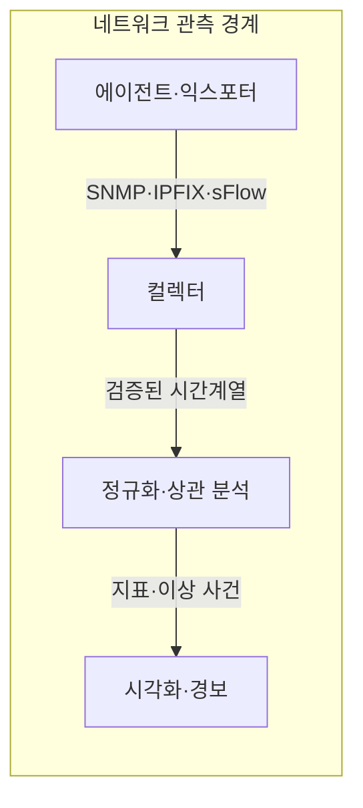
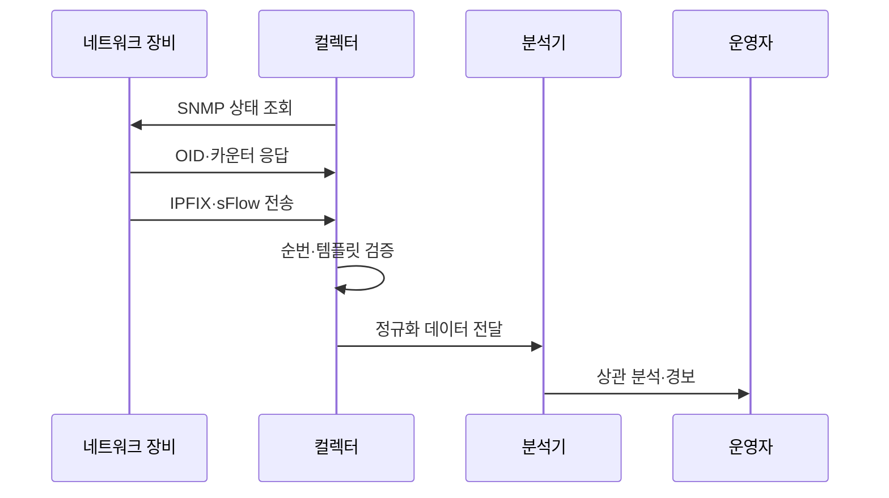

---
sidebar:
  order: 74
  label: "074. 네트워크 모니터링: SNMP, NetFlow, sFlow"
  badge:
    text: "미출제 · 50%"
    variant: note
title: "네트워크 모니터링: SNMP, NetFlow, sFlow"
date: "2026-07-25T12:30:00+09:00"
tags:
  - "notes-network"
weight: 74
extra:
  question_no: "074"
  source_status: "미출제"
  source_history: ""
  priority: 50
  priority_note: "설계·운영형: SNMP·Flow 관측의 공통 우산"
---

## 미리 알고가기

- **단순 네트워크 관리 프로토콜(Simple Network Management Protocol, SNMP)**: 관리자가 에이전트의 상태·카운터를 조회하고 알림을 받는 프로토콜
- **관리 정보 기반(Management Information Base, MIB)**: 장비 관리 항목의 계층·자료형·접근 권한을 정의한 정보 모델
- **객체 식별자(Object Identifier, OID)**: MIB의 각 관리 항목을 계층형 숫자로 식별하는 값
- **NetFlow**: 장비가 같은 특성의 패킷을 흐름 레코드로 집계해 내보내는 트래픽 관측 기술
- **IP 흐름 정보 내보내기(IP Flow Information Export, IPFIX)**: 템플릿과 데이터 레코드로 흐름 정보를 수집기에 전송하는 표준
- **sFlow**: 패킷 표본과 인터페이스 카운터를 수집기에 전송하는 고속망 관측 기술
- **플로우(Flow)**: 출발지·목적지 주소와 포트·프로토콜 등 공통 속성을 가진 패킷 묶음
- **템플릿(Template)**: IPFIX 레코드에 들어갈 필드의 종류·길이·순서를 수집기와 공유하는 형식 정보
- **익스포터(Exporter)**: 장비에서 흐름·표본 레코드를 생성해 수집기로 보내는 기능
- **컬렉터(Collector)**: 여러 장비의 관리·흐름·표본 데이터를 수신·검증·저장하는 기능

## Ⅰ. 개요

- 정의: SNMP·흐름·표본으로 망 상태를 판단한다
- 배경: 장애 원인 탐색과 대응 시간을 줄인다

### 쉽게 이해하기 (학습용)

- 장비 상태표와 통신 흐름 기록과 패킷 표본을 함께 봐야 장애 원인과 트래픽 주체를 연결할 수 있다

## Ⅱ. 특징

- 측정 단위 차이는 잘못된 트래픽 비교를 만든다
- 시각·순번 오류는 장애 원인 상관 분석을 왜곡한다

### 쉽게 이해하기 (학습용)

- 같은 트래픽도 누적 카운터는 총량, 흐름 레코드는 통신 주체, 패킷 표본은 일부 내용을 보여 준다

## Ⅲ. 아키텍처 및 구성요소

| 설계 요소 | 설명 |
|:---|:---|
| 에이전트·익스포터 | 장비 상태·흐름·패킷 표본 생성 |
| 컬렉터 | 템플릿·순번·수집 시각 검증과 저장 |
| 정규화·상관 분석 | 서로 다른 관측 단위를 시간축으로 결합 |
| 시각화·경보 | 품질 임계치·이상 패턴 통지 |

> 요약: 서로 다른 관측 레코드를 시간축으로 결합한다

### 쉽게 이해하기 (학습용)
- 장비가 만든 상태·흐름·표본을 컬렉터가 같은 시간축으로 맞춰 분석기에 전달한다

## Ⅳ. 원리 및 절차 흐름도

| 절차 | 설명 |
|:---|:---|
| SNMP 상태 조회 | 필요한 OID를 주기적으로 요청 |
| OID·카운터 응답 | 장비 상태와 누적값 반환 |
| IPFIX·sFlow 전송 | 흐름 레코드·패킷 표본 내보내기 |
| 순번·템플릿 검증 | 누락·재시작·필드 해석 오류 식별 |
| 정규화 데이터 전달 | 장비·인터페이스·시간 기준 통일 |
| 상관 분석·경보 | 상태·트래픽 원인을 연결해 통지 |

> 요약: 장비 상태와 흐름·표본을 시간축으로 분석한다

### 쉽게 이해하기 (학습용)
- 컬렉터는 레코드 순번과 형식을 먼저 검사한 뒤 같은 시각의 장비 상태와 트래픽을 연결한다

## Ⅴ. 종류 및 비교

| 판단 기준 | SNMP | NetFlow·IPFIX | sFlow |
|:---|:---|:---|:---|
| 핵심 특징 | OID 상태·누적 카운터 | 흐름별 바이트·패킷 집계 | 패킷 표본·인터페이스 카운터 |
| 적용 기준 | 장비 장애·용량 상태 | 트래픽 주체·경로 분석 | 고속망의 낮은 수집 부하 |
| 주요 위험 | 폴링 간 짧은 사건 누락 | 템플릿·수집기 부하 | 표본 오차·희소 흐름 누락 |

> 요약: 상태·흐름·표본을 결합해 원인을 분석한다

### 쉽게 이해하기 (학습용)
- 표본 분석에서 데이터가 안 보여도 트래픽이 없다고 단정 불가함

## Ⅵ. 실무 사례

1. 기업망의 **대역폭 폭증 원인 분석**

### 쉽게 이해하기 (학습용)

- SNMP로 포트 사용량이 급증한 시각을 찾고 같은 시각의 IPFIX 흐름을 분석해 대역을 점유한 송수신 주체를 확인한다

## Ⅶ. 결론

- 네트워크 장애와 트래픽 원인을 신속히 식별하기 위해 **장비 상태·대화 흐름·패킷 표본·수집 부하·보존 비용**을 검토하고, 상태는 SNMP, 흐름은 NetFlow, 고속망 표본은 sFlow로 수집해야 한다.

### 쉽게 이해하기 (학습용)

- 장비 상태·트래픽 주체·패킷 표본 중 필요한 질문과 수집 비용에 맞춰 관측 방식을 조합한다
