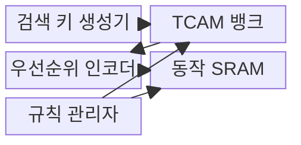
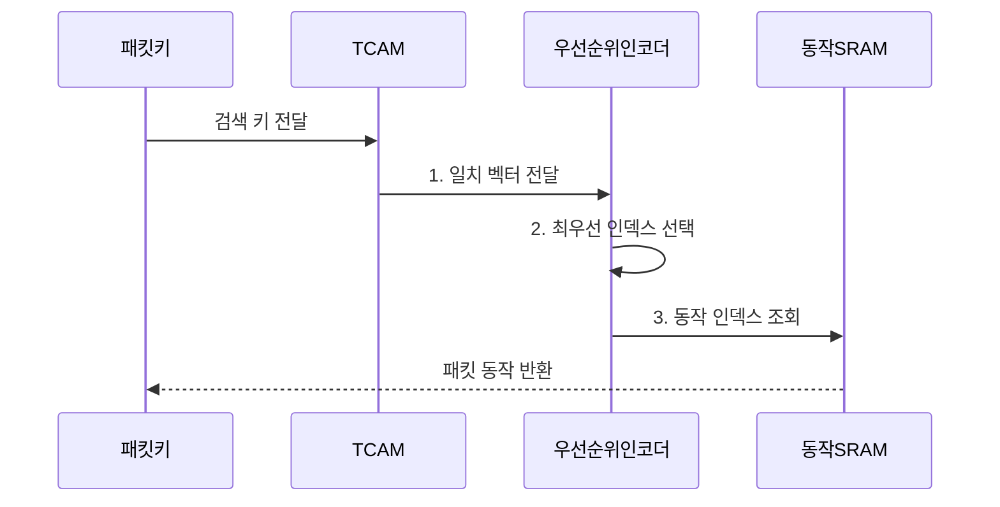

---
sidebar:
  order: 75
  label: "075. TCAM 삼진 검색 메모리 (TCAM)"
  badge:
    text: "기출 · 30%"
    variant: note
title: "TCAM 삼진 검색 메모리 (TCAM)"
date: "2026-08-02T12:00:00+09:00"
tags:
  - "notes-network"
weight: 75
extra:
  question_no: "075"
  source_status: "기출"
  source_history: "132회"
  priority: 30
  priority_note: "설명형: 132회 TCAM 고속검색 단답"
---

## Ⅰ. 개요

핵심 용어

- **삼진 내용 주소화 메모리(Ternary Content-Addressable Memory, TCAM)**: 입력 키를 0·1·무관 값으로 저장된 모든 규칙과 동시에 비교하는 병렬 검색 메모리다.

- 정의/개념: 0·1·무관 조건을 모든 항목과 비교하는 **삼진 내용 주소화 메모리(Ternary Content-Addressable Memory, TCAM)**
- 배경/필요성: 순차 메모리의 **규칙 조회 지연**

#### 한줄 요약

- 모든 규칙을 한꺼번에 비교하고 무관 값으로 주소 범위까지 표현해 가장 앞선 규칙을 찾는다

## Ⅱ. 특징

핵심 용어

- **우선순위 선택**: 여러 삼진 내용 주소화 메모리 규칙이 동시에 일치할 때 정책 순서가 가장 높은 항목의 동작을 고른다.

- **병렬 검색**: 모든 저장 항목을 한 주기에 비교
- **마스크 일치**: 무관 비트 X로 접두어·범위 표현
- **우선순위 선택**: 복수 일치 중 최상위 규칙 결정

#### 한줄 요약

- 검색은 빠르지만 모든 항목을 동시에 비교해 전력과 면적 비용이 크므로 규칙 수를 아껴야 한다.

## Ⅲ. 구조 및 구성요소

핵심 용어

- **TCAM 뱅크**: 경로·접근 제어 목록·서비스 품질 등 검색 기능이나 키 폭에 따라 값·마스크·유효 비트 항목을 나눈 하드웨어 영역이다.

**삼진 내용 주소화 메모리(Ternary Content-Addressable Memory, TCAM)** 가 규칙을 비교하고 **정적 임의 접근 메모리(Static Random-Access Memory, SRAM)** 가 대응 동작을 저장한다.

| 구성요소 | 책임 |
|:---|:---|
| 검색 키 생성기 | 패킷 헤더에서 비교 필드 결합 |
| TCAM 뱅크 | 값·마스크·유효 비트 병렬 비교 |
| 우선순위 인코더 | 복수 일치 중 최우선 인덱스 선택 |
| 동작 SRAM | 전달·폐기·재표시 동작 저장 |
| 규칙 관리자 | 영역 할당·우선순위·사용량 관리 |

#### 한줄 요약

- 모든 규칙을 병렬 비교한 뒤 우선순위 인코더가 가장 앞선 규칙의 동작을 SRAM에서 찾는다

## Ⅳ. 흐름도

핵심 용어

- **2. 최우선 인덱스 선택**: 우선순위 인코더는 일치 벡터에서 정책 순위가 가장 높은 규칙 인덱스를 선택한다.

**동작 원리**

1. **일치 벡터 전달**: 모든 값·마스크 항목을 병렬 비교
2. **최우선 인덱스 선택**: 가장 높은 우선순위 일치 결정
3. **동작 인덱스 조회**: **정적 임의 접근 메모리(Static Random-Access Memory, SRAM)** 의 전달·폐기·재표시 동작 검색

#### 한줄 요약

- 여러 규칙이 동시에 일치하므로 우선순위가 잘못되면 의도와 다른 동작이 실행된다

## Ⅴ. 종류 및 비교

핵심 용어

- **정적 임의 접근 메모리·해시(SRAM·해시)**: 대용량 세션이나 동작 정보를 주소·해시 기반으로 정확 조회하지만 충돌 처리와 다단 조회가 필요할 수 있다.

| 검색 메모리 비교 | **삼진 내용 주소화 메모리(Ternary Content-Addressable Memory, TCAM)** | **내용 주소화 메모리(Content-Addressable Memory, CAM)** | **정적 임의 접근 메모리(Static Random-Access Memory, SRAM)·해시** |
|:---|:---|:---|:---|
| 적용 기준 | **최장 접두어 일치(Longest Prefix Match, LPM)·접근 제어 목록(Access Control List, ACL)·서비스 품질(Quality of Service, QoS)** 우선순위 | **매체 접근 제어(Media Access Control, MAC)** 등 정확 일치 | 대용량 세션·동작 정보 |
| 핵심 특징 | 0·1·X 병렬 마스크 일치 | 0·1 병렬 정확 일치 | 주소·해시 기반 정확 조회 |
| 한계 | 전력·비용·규칙 확장 | 마스크 범위 표현 불가 | 충돌·다단 조회 지연 |

> 요약: 정확 일치는 CAM, 마스크 검색은 TCAM이다

#### 한줄 요약

- TCAM이 일치하면 SRAM이 대응 동작을 제공함

## Ⅵ. 실무 고려사항 및 대책

핵심 용어

- **TCAM 고갈**: TCAM 고갈은 특정 기능의 규칙 확장이 한정된 병렬 검색 항목을 점유해 다른 경로·보안·QoS 정책을 수용하지 못하는 문제다.

| 문제 | 대책 | 효과 |
|:---|:---|:---|
| 한 기능의 규칙 증가로 **삼진 내용 주소화 메모리(Ternary Content-Addressable Memory, TCAM)** 고갈 | **경로·접근 제어 목록(Access Control List, ACL)·서비스 품질(Quality of Service, QoS) 영역** 할당 | 자원 간섭 방지 |
| 범위 규칙의 확장량을 과소 산정 | **마스크 전개 후 항목 수** 계산 | 용량 예측 정확성 향상 |
| 앞선 규칙이 뒤 규칙을 항상 가림 | **중복·포함 관계** 사전 분석 | 정책 오동작 방지 |

#### 한줄 요약

- 경로·ACL·QoS 규칙에 TCAM 영역을 나눠 한 기능의 규칙 증가가 다른 기능의 하드웨어 검색 공간을 고갈시키지 않게 한다.

## Ⅶ. 결론

핵심 용어

- **삼진 내용 주소화 메모리(TCAM)**: 범위·접두어·우선순위 검색에 사용하고 정확 일치는 내용 주소화 메모리, 대용량 세션은 정적 임의 접근 메모리·해시로 분리해야 한다.

- 범위·우선순위는 **삼진 내용 주소화 메모리(Ternary Content-Addressable Memory, TCAM)**, 정확 일치는 **내용 주소화 메모리(Content-Addressable Memory, CAM)**, 대용량 세션은 **정적 임의 접근 메모리(Static Random-Access Memory, SRAM)·해시**

#### 한줄 요약

- 범위·우선순위 검색이 필요한 규칙만 TCAM에 두고 실제 늘어나는 항목 수를 먼저 계산해야 한다.
