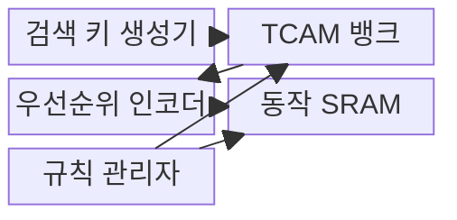
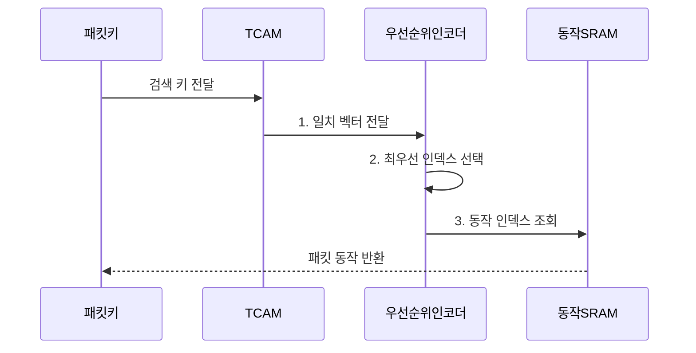

---
sidebar:
  order: 75
  label: "075. TCAM 삼진 검색 메모리 (TCAM)"
  badge:
    text: "기출 · 30%"
    variant: note
title: "TCAM 삼진 검색 메모리 (TCAM)"
date: "2026-07-31T02:58:00+09:00"
tags:
  - "notes-network"
weight: 75
extra:
  question_no: "075"
  source_status: "기출"
  source_history: "132회"
  priority: 30
  priority_note: "설명형: 132회 TCAM 고속검색 단답"
---

## 미리 알고가기

- **삼진 내용 주소화 메모리(Ternary Content-Addressable Memory, TCAM)**: 0·1·무관 값을 저장하고 모든 항목을 병렬 비교하는 검색 메모리
- **내용 주소화 메모리(Content-Addressable Memory, CAM)**: 입력 키와 정확히 일치하는 저장 항목을 병렬 검색하는 메모리
- **정적 임의 접근 메모리(Static Random-Access Memory, SRAM)**: 주소로 데이터를 조회하며 TCAM 일치 항목의 동작을 저장하는 고속 메모리
- **최장 접두어 일치(Longest Prefix Match, LPM)**: 목적지 주소와 일치하는 경로 중 접두어 길이가 가장 긴 항목을 선택하는 방식
- **접근 제어 목록(Access Control List, ACL)**: 패킷 조건과 허용·폐기 동작을 순서대로 정의한 규칙 목록
- **서비스 품질(Quality of Service, QoS)**: 트래픽별 지연·손실·대역폭을 구분해 제어하는 정책
- **정책 기반 라우팅(Policy-Based Routing, PBR)**: 목적지 주소 외의 출발지·응용·등급 정책으로 경로를 선택하는 방식
- **매체 접근 제어 주소(Media Access Control Address, MAC 주소)**: 이더넷 인터페이스를 식별해 같은 링크의 프레임 전달에 쓰는 주소
- **인터넷 프로토콜 버전 6(Internet Protocol Version 6, IPv6)**: 128비트 주소를 사용하는 인터넷 계층 프로토콜
- **규칙 확장(Rule Expansion)**: 범위·다중 필드 조건 하나를 TCAM이 표현 가능한 여러 항목으로 풀어 저장하는 현상
- **그림자 규칙(Shadow Rule)**: 앞선 우선순위 규칙에 항상 일치해 실행될 수 없는 뒤쪽 규칙
- **TCAM·CAM·SRAM·LPM·ACL·QoS·PBR**: 패킷의 주소·마스크·우선순위 규칙을 고속 검색해 경로·접근제어·품질·정책 기반 전달을 결정하는 메모리와 조회 기능
- **삼진값 기호(X·엑스)**: 0과 1 어느 값에도 일치하는 무관 조건을 한 글자로 나타내 범위·접두어를 표현하는 기호
- **TCAM 뱅크(TCAM Bank)**: 검색 항목을 기능이나 폭에 따라 나눈 하드웨어 저장 영역
- **유효 비트(Valid Bit)**: 해당 TCAM 항목을 검색에 포함할지 나타내는 상태 비트
- **우선순위 인코더(Priority Encoder)**: 여러 일치 항목 중 우선순위가 가장 높은 인덱스를 고르는 회로
- **일치 벡터(Match Vector)**: 각 TCAM 항목의 일치 여부를 비트열로 나타낸 결과
- **해시 충돌(Hash Collision)**: 서로 다른 키가 같은 해시 위치에 대응하는 현상

## Ⅰ. 개요

- 정의/개념: 0·1·X 조건을 모든 항목과 비교하는 **병렬 검색 메모리**
- 배경/필요성: 순차 메모리의 **규칙 조회 지연**

### 쉽게 이해하기 (학습용)

- 모든 규칙을 한꺼번에 비교하고 무관 값으로 주소 범위까지 표현해 가장 앞선 규칙을 찾는다

## Ⅱ. 특징

- **병렬 검색**: 모든 저장 항목을 한 주기에 비교
- **마스크 일치**: 무관 비트 X로 접두어·범위 표현
- **우선순위 선택**: 복수 일치 중 최상위 규칙 결정

### 쉽게 이해하기 (학습용)

- 검색은 빠르지만 모든 칸을 동시에 비교해 전력과 면적 비용이 크므로 규칙 수를 아껴야 한다

## Ⅲ. 구조 및 구성요소

| 구성요소 | 책임 |
|:---|:---|
| 검색 키 생성기 | 패킷 헤더에서 비교 필드 결합 |
| TCAM 뱅크 | 값·마스크·유효 비트 병렬 비교 |
| 우선순위 인코더 | 복수 일치 중 최우선 인덱스 선택 |
| 동작 SRAM | 전달·폐기·재표시 동작 저장 |
| 규칙 관리자 | 영역 할당·우선순위·사용량 관리 |

### 쉽게 이해하기 (학습용)

- 모든 규칙을 병렬 비교한 뒤 우선순위 인코더가 가장 앞선 규칙의 동작을 SRAM에서 찾는다

## Ⅳ. 흐름도

**동작 원리**

1. **일치 벡터 전달**: 모든 값·마스크 항목을 병렬 비교
2. **최우선 인덱스 선택**: 가장 높은 우선순위 일치 결정
3. **동작 인덱스 조회**: SRAM의 전달·폐기·재표시 동작 검색

### 쉽게 이해하기 (학습용)

- 여러 규칙이 동시에 일치하므로 우선순위가 잘못되면 의도와 다른 동작이 실행된다

## Ⅴ. 종류 및 비교

| 검색 메모리 비교 | **TCAM** | **CAM** | **SRAM·해시** |
|:---|:---|:---|:---|
| 적용 기준 | LPM·ACL·QoS 우선순위 | MAC 등 정확 일치 | 대용량 세션·동작 정보 |
| 핵심 특징 | 0·1·X 병렬 마스크 일치 | 0·1 병렬 정확 일치 | 주소·해시 기반 정확 조회 |
| 한계 | 전력·비용·규칙 확장 | 마스크 범위 표현 불가 | 충돌·다단 조회 지연 |

> 요약: 정확 일치는 CAM, 마스크 검색은 TCAM이다

### 쉽게 이해하기 (학습용)

- TCAM이 일치하면 SRAM이 대응 동작을 제공함

## Ⅵ. 실무 고려사항 및 대책

| 고려사항 | 대책 | 효과 |
|:---|:---|:---|
| 한 기능의 규칙 증가로 TCAM 고갈 | **경로·ACL·QoS 영역** 할당 | 자원 간섭 방지 |
| 범위 규칙의 확장량을 과소 산정 | **마스크 전개 후 항목 수** 계산 | 용량 예측 정확성 향상 |
| 앞선 규칙이 뒤 규칙을 항상 가림 | **중복·포함 관계** 사전 분석 | 정책 오동작 방지 |

### 쉽게 이해하기 (학습용)

- 경로·ACL·QoS 규칙에 TCAM 영역을 나눠 한 기능의 규칙 증가가 다른 기능의 하드웨어 검색 공간을 고갈시키지 않게 한다

## Ⅶ. 결론

- 범위·우선순위는 **TCAM**, 정확 일치는 **CAM**, 대용량 세션은 **SRAM·해시**

### 쉽게 이해하기 (학습용)

- 범위·우선순위 검색이 필요한 규칙만 TCAM에 두고 실제 늘어나는 항목 수를 먼저 계산해야 한다.
