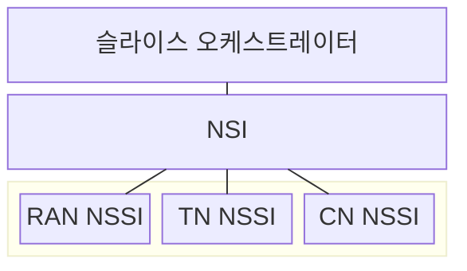
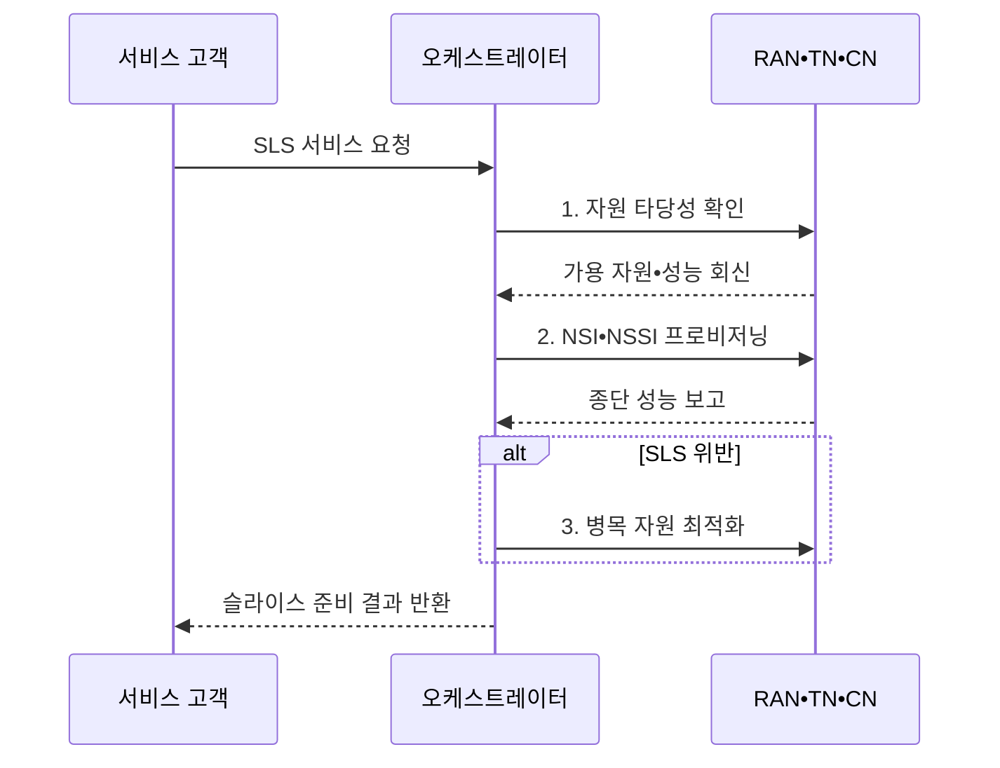

---
sidebar:
  order: 76
  label: "076. 네트워크 슬라이스 자원 관리 (Network Slice Resource Management)"
  badge:
    text: "기출 • 50%"
    variant: note
title: "네트워크 슬라이스 자원 관리 (Network Slice Resource Management)"
date: "2026-08-04T17:48:00+09:00"
tags:
  - "notes-network"
weight: 76
extra:
  question_no: "076"
  source_status: "기출"
  source_history: "137회"
  priority: 50
  priority_note: "설계•운영형: 137회 종단 Slice 관리"
---

## Ⅰ. 개요

핵심 용어

- **서비스 수준 명세(Service Level Specification, SLS)**: 서비스가 요구하는 지연•처리량•가용성 목표
- **네트워크 슬라이스 인스턴스(Network Slice Instance, NSI)**: 종단 서비스를 제공하는 논리망 인스턴스
- **네트워크 슬라이스 서브넷 인스턴스(Network Slice Subnet Instance, NSSI)**: NSI를 구성하는 도메인별 하위망 인스턴스
- **슬라이스 관리 체계**: SLS를 NSI•NSSI 자원과 정책으로 배치•조정하는 체계

- 정의/개념: 종단 SLS를 NSI•NSSI 자원으로 배치•조정하는 **슬라이스 관리 체계**
- 배경/필요성: 고정 예약은 **유휴 낭비**, 과도한 공유는 **SLS 위반**

#### 한줄 요약

- 하나의 이동통신망을 서비스별 전용 차선처럼 나누되 남는 자원은 다시 공유하는 방식이다.

## Ⅱ. 특징

핵심 용어

- **수용 제어**: 신규 슬라이스를 추가해도 기존•신규 SLS를 충족하는지 판정하는 기능

- **예산 분해**: 종단 SLS를 도메인별 자원 목표로 변환
- **수용 제어**: 기존•신규 요구의 동시 충족 판정
- **폐루프 조정**: 측정값으로 병목 자원만 탄력 변경

#### 한줄 요약

- 전용 몫이 많으면 낭비되고 공유 몫이 많으면 경쟁하므로 최소 보장량과 초과 공유량을 함께 설계한다.

## Ⅲ. 구조 및 구성요소

핵심 용어

- **무선 접속망(Radio Access Network, RAN)**: 단말의 무선 접속과 무선 자원을 제공하는 망
- **전송망(Transport Network, TN)**: 접속망과 코어망 사이의 전달 경로를 제공하는 망
- **코어망(Core Network, CN)**: 인증•세션•정책•사용자면 기능을 제공하는 중심망

| 구성요소 | 책임 |
|:---|:---|
| 슬라이스 오케스트레이터 | SLS를 NSI•NSSI 자원으로 매핑 |
| NSI | 도메인 NSSI를 종단망으로 결합 |
| RAN NSSI | 무선 용량•스케줄링 자원 제공 |
| TN NSSI | 대역폭•지연•격리 경로 제공 |
| CN NSSI | 코어 기능•연산 자원 제공 |

#### 한줄 요약

- 무선 구간만 늘려도 전송망이나 코어망이 막히면 종단 서비스 품질은 개선되지 않는다.

## Ⅳ. 흐름도

1. **자원 타당성 확인**: 기존•신규 SLS 동시 충족 판정
2. **NSI•NSSI 프로비저닝**: 도메인별 자원•정책 인스턴스화
3. **병목 자원 최적화**: 히스테리시스 후 제약 구간만 증감

#### 한줄 요약

- 확장과 축소 기준에 간격을 두면 경계 부하에서 자원이 계속 늘고 줄어드는 현상을 막을 수 있다.

## Ⅴ. 종류 및 비교

핵심 용어

- **혼합 할당**: 혼합 할당은 서비스별 최소 자원을 예약하고 남는 용량은 부하에 따라 공유해 품질 보장과 이용률을 함께 높인다.

| 슬라이스 자원 할당 | 정적 예약 | 동적 공유 | 혼합 할당 |
|:---|:---|:---|:---|
| 적용 기준 | **엄격한 고정 품질** | **변동 수요** 중심 | **최소 보장•탄력 수요** 병존 |
| 핵심 특징 | **자원량 고정 보장** | 부하 기반 **동적 재할당** | 최소 예약 후 **초과분 공유** |
| 한계 | **유휴 자원 낭비** | 슬라이스 **경합•간섭** | **정책 복잡성•순위 역전** |

#### 한줄 요약

- 혼합 할당은 최소 좌석을 예약하고 남는 좌석을 실시간 수요에 따라 나누는 방식이다.

## Ⅵ. 실무 고려사항 및 대책

핵심 용어

- **반복 증감**: 부하가 임계값 주변에서 흔들릴 때 자원이 계속 확장•축소되는 현상

| 문제 | 대책 | 효과 |
|:---|:---|:---|
| 피크 수요의 **SLS 위반** | 최소 예약과 **초과 자원 풀** 병행 | 보장 품질과 **이용률 균형** |
| 구간별 **병목 은폐** | 종단•NSSI 지표 **상관 분석** | 제약 도메인 **선별 확장** |
| 임계 부하의 **반복 증감** | **히스테리시스•쿨다운** 적용 | 제어 안정성과 **비용 예측성** |

#### 한줄 요약

- 원격 제어 서비스는 모든 구간의 지연을 합산해 목표를 넘으면 신규 세션을 보류하거나 병목 자원을 먼저 늘린다.

## Ⅶ. 결론

핵심 용어

- **동적 공유**: 동적 공유는 변동 수요가 큰 슬라이스 사이에서 측정 부하에 따라 자원을 재할당해 전체 이용률을 높인다.

- 엄격 고정 품질은 **정적 예약**, 변동 수요는 **동적 공유**, 최소 보장은 **혼합 할당**

#### 한줄 요약

- 품질 위반 손실이 큰 서비스에는 최소 자원을 보장하고 나머지는 공유해 전체 이용률을 높인다.
