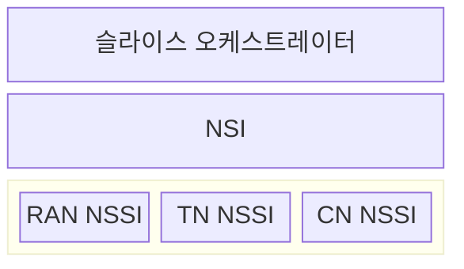
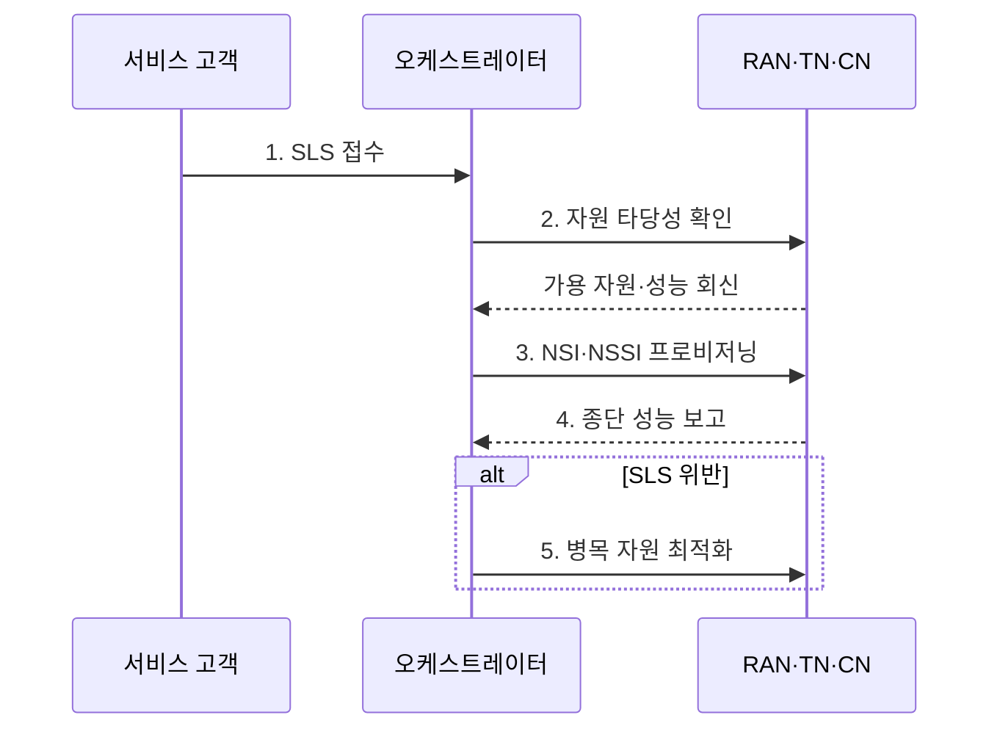

---
sidebar:
  order: 76
  label: "076. 네트워크 슬라이스 자원 관리 (Network Slice Resource Management)"
  badge:
    text: "기출 · 50%"
    variant: note
title: "네트워크 슬라이스 자원 관리 (Network Slice Resource Management)"
date: "2026-07-27T23:59:59+09:00"
tags:
  - "notes-network"
weight: 76
extra:
  question_no: "076"
  source_status: "기출"
  source_history: "137회"
  priority: 50
  priority_note: "설계·운영형: 137회 종단 Slice 관리"
---

## 미리 알고가기

- **네트워크 슬라이스(Network Slice)**: 공통 인프라의 기능·자원·정책을 서비스 요구별 논리망으로 구성하는 기술
- **서비스 수준 명세(Service Level Specification, SLS)**: 슬라이스가 충족해야 할 지연·처리량·가용성·격리 요구
- **네트워크 슬라이스 인스턴스(Network Slice Instance, NSI)**: 서비스 요구를 지원하도록 구성한 실행 중인 종단 슬라이스
- **네트워크 슬라이스 서브넷 인스턴스(Network Slice Subnet Instance, NSSI)**: 독립 관리 가능한 네트워크 기능과 자원의 실행 단위
- **무선접속망(Radio Access Network, RAN)**: 단말 접속과 무선 스케줄링을 담당하는 도메인
- **전송망(Transport Network, TN)**: 무선접속망과 코어망 사이의 대역폭·지연 경로를 제공하는 도메인
- **코어망(Core Network, CN)**: 인증·세션·정책·사용자 데이터 전달을 담당하는 도메인
- **수용 제어(Admission Control)**: 신규 요구를 수용해도 기존·신규 SLS를 함께 만족하는지 판정하는 제어
- **히스테리시스(Hysteresis)**: 확장·축소 임계값을 달리해 경계 부하의 반복 전환을 억제하는 방식
- **3GPP TS 28.530**: NSI·NSSI의 관리 개념·사용 사례·요구사항을 정의하는 3GPP 표준

## Ⅰ. 개요

- 정의: **3GPP TS 28.530** 기반 **NSI·NSSI 자원 관리**
- 필요성: **유휴 자원·SLS 위반** 동시 억제

### 쉽게 이해하기 (학습용)

- 하나의 이동통신망을 서비스별 전용 차선처럼 나누되 남는 자원은 다시 공유하는 방식이다.

## Ⅱ. 특징

- **종단 SLS**의 도메인별 자원 예산 분해
- **수용 제어**의 기존·신규 요구 동시 판정
- **폐루프 제어**의 병목 자원 탄력 조정

### 쉽게 이해하기 (학습용)

- 전용 몫이 많으면 낭비되고 공유 몫이 많으면 경쟁하므로 최소 보장량과 초과 공유량을 함께 설계한다.

## Ⅲ. 구조 및 구성요소

| 구성요소 | 책임 |
|:---|:---|
| **슬라이스 오케스트레이터** | SLS를 NSI·NSSI 자원으로 매핑 |
| **NSI** | 도메인 NSSI를 종단망으로 결합 |
| **RAN NSSI** | 무선 용량·스케줄링 자원 제공 |
| **TN NSSI** | 대역폭·지연·격리 경로 제공 |
| **CN NSSI** | 코어 기능·연산 자원 제공 |

### 쉽게 이해하기 (학습용)

- 무선 구간만 늘려도 전송망이나 코어망이 막히면 종단 서비스 품질은 개선되지 않는다.

## Ⅳ. 흐름도

| 단계 | 동작 원리 |
|:---|:---|
| **1. SLS 접수** | 품질·격리·가용성 목표 정규화 |
| **2. 자원 타당성 확인** | 기존·신규 SLS 동시 충족 판정 |
| **3. NSI·NSSI 프로비저닝** | 도메인별 자원·정책 인스턴스화 |
| **4. 종단 성능 보고** | 구간 측정값을 종단 기준으로 결합 |
| **5. 병목 자원 최적화** | 히스테리시스 후 제약 구간만 증감 |

### 쉽게 이해하기 (학습용)

- 확장과 축소 기준에 간격을 두면 경계 부하에서 자원이 계속 늘고 줄어드는 현상을 막을 수 있다.

## Ⅴ. 종류 및 비교

| 슬라이스 자원 할당 | 정적 예약 | 동적 공유 | 혼합 할당 |
|:---|:---|:---|:---|
| 적용 기준 | **엄격한 고정 품질** | **변동 수요** 중심 | **최소 보장·탄력 수요** 병존 |
| 핵심 특징 | **자원량 고정 보장** | 부하 기반 **동적 재할당** | 최소 예약 후 **초과분 공유** |
| 한계 | **유휴 자원 낭비** | 슬라이스 **경합·간섭** | **정책 복잡성·순위 역전** |

### 쉽게 이해하기 (학습용)

- 혼합 할당은 최소 좌석을 예약하고 남는 좌석을 실시간 수요에 따라 나누는 방식이다.

## Ⅵ. 실무 고려사항 및 대책

| 고려사항 | 대책 | 효과 |
|:---|:---|:---|
| 피크 수요의 **SLS 위반** | 최소 예약과 **초과 자원 풀** 병행 | 보장 품질과 **이용률 균형** |
| 구간별 **병목 은폐** | 종단·NSSI 지표 **상관 분석** | 제약 도메인 **선별 확장** |
| 임계 부하의 **반복 증감** | **히스테리시스·쿨다운** 적용 | 제어 안정성과 **비용 예측성** |

### 쉽게 이해하기 (학습용)

- 원격 제어 서비스는 모든 구간의 지연을 합산해 목표를 넘으면 신규 세션을 보류하거나 병목 자원을 먼저 늘린다.

## Ⅶ. 결론

- **SLS 위반 비용·자원 효율**로 혼합 할당 선택

### 쉽게 이해하기 (학습용)

- 품질 위반 손실이 큰 서비스에는 최소 자원을 보장하고 나머지는 공유해 전체 이용률을 높인다.
