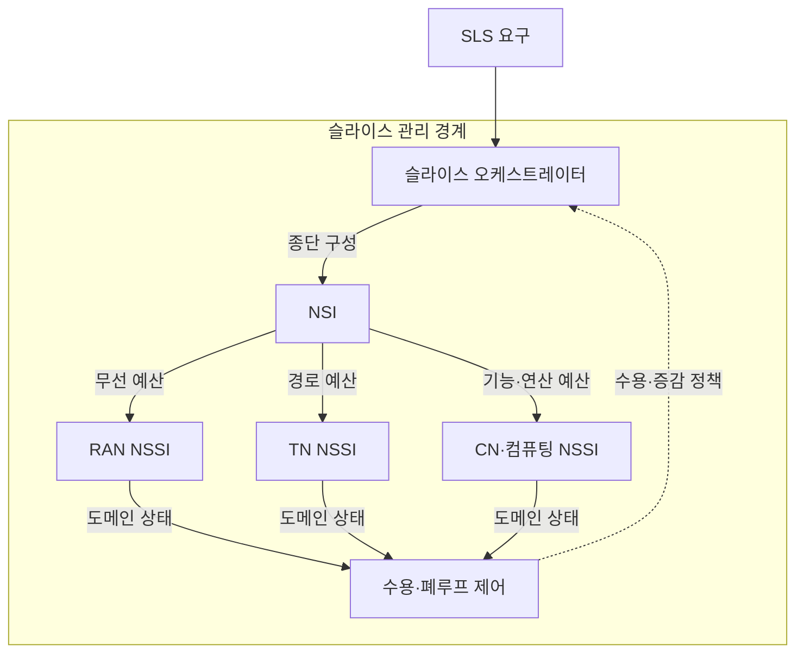
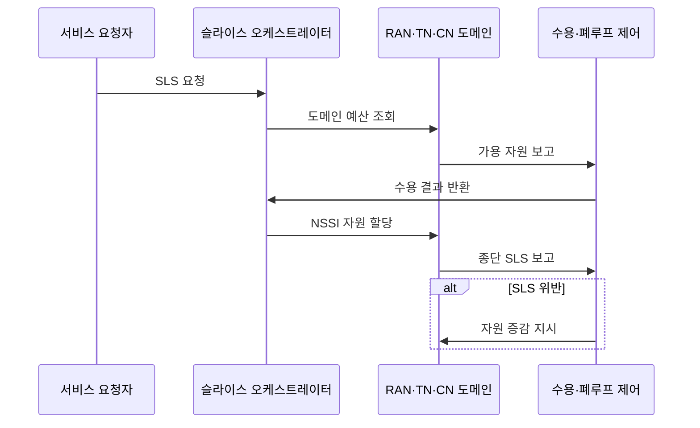

---
sidebar:
  order: 76
  label: "076. 네트워크 슬라이스 자원 관리 (Network Slice Resource Management)"
  badge:
    text: "기출 · 50%"
    variant: note
title: "네트워크 슬라이스 자원 관리 (Network Slice Resource Management)"
date: "2026-07-25T20:16:00+09:00"
tags:
  - "notes-network"
weight: 76
extra:
  question_no: "076"
  source_status: "기출"
  source_history: "137회"
  priority: 50
  priority_note: "설계·운영형: 137회 종단 Slice 관리"
---

## 미리 알고가기

- **네트워크 슬라이스(Network Slice)**: 공통 물리망 위에서 서비스별 기능·자원·정책을 논리적으로 분리한 종단망
- **무선접속망(Radio Access Network, RAN)**: 단말의 무선 접속과 주파수·스케줄링 자원을 제공하는 도메인
- **전송망(Transport Network, TN)**: RAN과 코어망·컴퓨팅 사이의 대역폭·지연 경로를 제공하는 도메인
- **코어망(Core Network, CN)**: 가입자 인증·세션·정책·사용자 데이터 전달을 제공하는 도메인
- **서비스 수준 명세(Service Level Specification, SLS)**: 슬라이스가 달성할 지연·대역폭·가용성·격리 요구
- **네트워크 슬라이스 인스턴스(Network Slice Instance, NSI)**: 여러 도메인 자원을 결합해 실행 중인 종단 슬라이스
- **네트워크 슬라이스 서브넷 인스턴스(Network Slice Subnet Instance, NSSI)**: RAN·TN·CN 등 한 도메인의 실행 중인 슬라이스 부분
- **수용 제어(Admission Control)**: 신규 슬라이스를 받아도 기존·신규 SLS를 만족하는지 판단하는 제어
- **히스테리시스(Hysteresis)**: 서로 다른 확장·축소 임계값을 두어 부하 경계의 반복 전환을 억제하는 방식
- **도메인 약어 읽기와 표기**: RAN·TN·CN은 랜·티엔·씨엔으로 읽고 영문 핵심 글자를 딴 표기이며, 무선 접속·전송·코어망 자원 영역을 구분함
- **슬라이스 약어 읽기와 표기**: SLS·NSI·NSSI는 에스엘에스·엔에스아이·엔에스에스아이로 읽고 영문 핵심 글자를 딴 표기이며, 품질 요구·종단 인스턴스·도메인별 인스턴스를 구분함

## Ⅰ. 개요

- 정의: SLS에 맞춰 종단망 자원을 분할·조정
- 필요성: 서비스별 품질·격리 요구의 동시 보장

### 쉽게 이해하기 (학습용)

- 이동통신망의 무선·전송·코어 구간에 서비스별 전용 몫과 공유 몫을 함께 정한다

## Ⅱ. 특징

- SLS를 RAN·TN·CN 자원 예산으로 나눈다.
- 수용 제어가 기존·신규 SLS 충족 여부를 판정한다.
- 폐루프 제어가 병목 도메인의 자원만 조정한다.
- 예약량 증가는 격리를 높이지만 이용률을 낮춘다.

### 쉽게 이해하기 (학습용)

- 전용 자원이 많으면 낭비되고 공유가 많으면 경쟁하므로 최소 보장량과 초과 공유량을 나눈다

## Ⅲ. 아키텍처 및 구성요소

| 설계 요소 | 설명 |
|:---|:---|
| 슬라이스 오케스트레이터 | SLS를 NSI·NSSI 자원으로 매핑 |
| NSI | 도메인 NSSI를 종단 슬라이스로 결합 |
| RAN NSSI | 주파수·스케줄링·무선 용량 제공 |
| TN NSSI | 대역폭·지연·분리 전송 경로 제공 |
| CN·컴퓨팅 NSSI | 코어 기능·프로세서·메모리 자원 제공 |
| 수용·폐루프 제어 | 신규 수용과 부하 기반 자원 증감 |

> 요약: SLS를 도메인 예산으로 나눠 NSI 구성

### 쉽게 이해하기 (학습용)

- RAN만 늘려도 TN·CN이 막히면 종단 품질은 저하됨

## Ⅳ. 원리 및 절차 흐름도

| 절차 | 설명 |
|:---|:---|
| SLS 요청 | 지연·대역폭·가용성·격리 목표 전달 |
| 도메인 예산 조회 | 종단 목표를 RAN·TN·CN 예산으로 분해 |
| 가용 자원 보고 | 예약·공유 자원과 경쟁 상태 제공 |
| 수용 결과 반환 | 기존·신규 SLS 충족 여부 판정 |
| NSSI 자원 할당 | 승인된 도메인별 자원·정책 적용 |
| 종단 SLS 보고 | 모든 구간의 실제 품질을 결합 |
| 자원 증감 지시 | 히스테리시스 후 병목 도메인만 조정 |

> 요약: 요구를 분해·할당하고 폐루프로 조정한다.

### 쉽게 이해하기 (학습용)

- 확장 임계값을 축소 임계값보다 높여 경계 부하에서 자원이 반복 증감하지 않게 한다

## Ⅴ. 종류 및 비교

| 판단 기준 | 정적 예약 | 동적 공유 | 혼합 할당 |
|:---|:---|:---|:---|
| 핵심 특징 | 자원량 고정 보장 | 부하에 따라 자원 재할당 | 최소 예약 후 초과분 공유 |
| 적용 기준 | 엄격·고정 품질 서비스 | 변동 수요·통계적 품질 | 최소 보장·탄력 수요 병존 |
| 주요 위험 | 유휴 자원 낭비 | 슬라이스 간 경합·간섭 | 정책 복잡성·우선순위 역전 |

> 요약: 최소 보장 후 초과 자원 공유가 혼합 할당

### 쉽게 이해하기 (학습용)

- 혼합 할당은 최저 좌석은 예약하고 남는 좌석은 수요에 따라 나누는 방식임

## Ⅵ. 실무 사례

1. 원격 제어 슬라이스는 RAN·TN·CN 지연 예산 합산
2. 영상 슬라이스는 최소 예약 후 잔여 대역 동적 공유

### 쉽게 이해하기 (학습용)

- 무선 구간이 빨라도 전송·코어 지연까지 더해 목표를 넘으면 수용하지 않는다
- 기본 화질 대역은 예약하고 남는 대역이 있을 때만 고화질 트래픽에 더 준다

## Ⅶ. 결론

- 종단 병목·격리 수준으로 예약·공유 자원 결정

### 쉽게 이해하기 (학습용)

- 가장 느린 도메인의 SLS와 서비스 격리 요구를 보고 예약량과 공유량을 정한다
