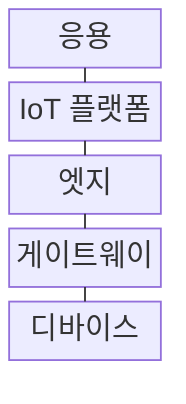
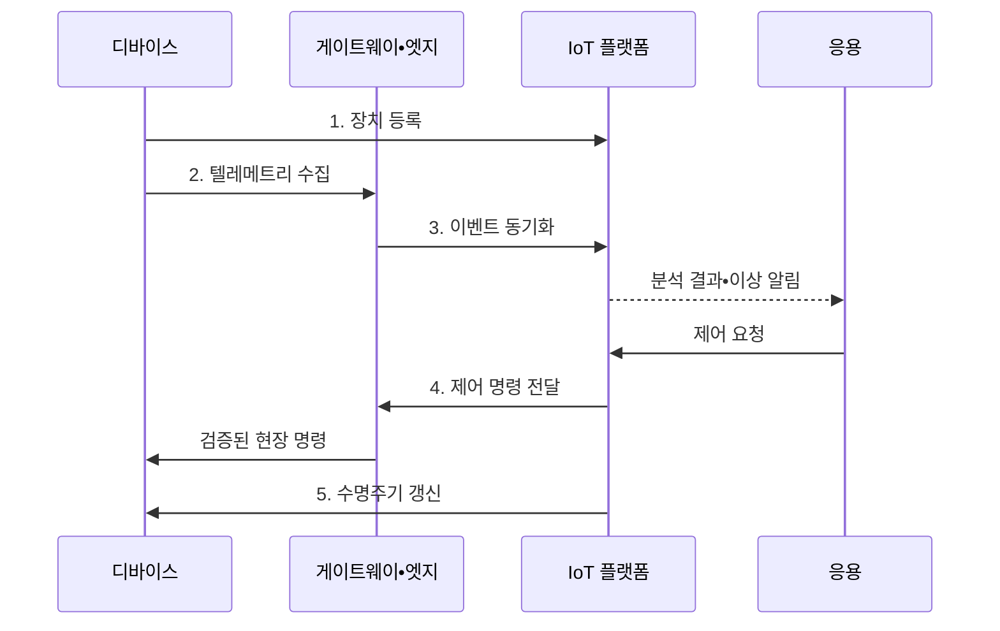

---
sidebar:
  order: 77
  label: "077. IoT 아키텍처 (IoT Architecture)"
  badge:
    text: "미출제 • 30%"
    variant: note
title: "IoT 아키텍처 (IoT Architecture)"
date: "2026-08-04T17:50:00+09:00"
tags:
  - "notes-network"
weight: 77
extra:
  question_no: "077"
  source_status: "미출제"
  source_history: ""
  priority: 30
  priority_note: "설계형: Device•Gateway•Cloud IoT 기반"
---

## Ⅰ. 개요

핵심 용어

- **사물인터넷(Internet of Things, IoT)**: 사물이 네트워크로 상태와 명령을 교환하는 체계
- **IoT 운영 구조**: 장치•게이트웨이•엣지•플랫폼의 데이터와 제어 책임을 연결하는 구조

- 정의/개념: **IoT 아키텍처** 는 센서•장치•게이트웨이•엣지•플랫폼의 데이터•제어•수명주기 책임을 연결하는 **IoT 운영 구조**
- 배경/필요성: 장치별 개별 관리는 **대규모 등록•갱신 추적 곤란**

#### 한줄 요약

- IoT 아키텍처는 센서값의 이동 경로와 현장 제어, 장치 등록부터 폐기까지의 책임을 함께 정하는 설계도이다.

## Ⅱ. 특징

핵심 용어

- **수명주기 추적**: 수명주기 추적은 장치의 등록•자격 증명•설정•업데이트•롤백•폐기 상태를 중앙에서 일관되게 관리한다.

- **양방향 흐름**: 상향 텔레메트리와 하향 명령 연결
- **현장 자율성**: 엣지 제어로 저지연•단절 대응
- **수명주기 추적**: 등록•인증•갱신•폐기 상태 관리

#### 한줄 요약

- 센서값은 중앙으로 올리고 긴급 제어는 현장에서 처리하며 장치 상태는 전체 수명주기로 관리한다.

## Ⅲ. 구조 및 구성요소

핵심 용어

- **IoT 플랫폼**: 장치 등록•데이터•규칙•명령과 수명주기 상태를 통합 관리하는 플랫폼

| 구성요소 | 책임 |
|:---|:---|
| 디바이스 | 상태 측정과 승인 명령 실행 |
| 게이트웨이 | 이기종 통신 변환•데이터 집계 |
| 엣지 | 현장 분석•단절 중 자율 제어 |
| IoT 플랫폼 | 장치•데이터•규칙•명령 통합 관리 |
| 응용 | 업무 분석과 장치 제어 요청 |

#### 한줄 요약

- 장치는 측정하고 게이트웨이는 통역하며 엣지는 현장 판단, 플랫폼은 전체 장치와 데이터를 관리한다.

## Ⅳ. 흐름도

핵심 용어

- **무선 업데이트(Over-the-Air, OTA)**: 통신망을 통해 장치 소프트웨어를 원격 갱신하는 방식

1. **장치 등록**: 식별자•소유 관계•자격 증명 연결
2. **텔레메트리 수집**: 측정값에 시각•순서 정보를 부여
3. **이벤트 동기화**: 필터링 후 단절 데이터를 중복 제거
4. **제어 명령 전달**: 권한•안전 조건 확인 후 하향 전송
5. **수명주기 갱신**: OTA 적용•롤백•폐기 상태 추적

#### 한줄 요약

- 단절 중 저장한 데이터는 발생 시각과 순서를 확인하고 중복을 제거해야 과거 상태로 되돌아가지 않는다.

## Ⅴ. 종류 및 비교

핵심 용어

- **게이트웨이 중계형**: 이기종 IoT 프로토콜을 변환•집계해 상위 플랫폼에 연결하는 구조
- **인터넷 프로토콜(Internet Protocol, IP)**: 패킷 주소 지정과 전달을 담당하는 프로토콜

| IoT 연결 구조 | 엣지 협업형 | 게이트웨이 중계형 | 직접 연결형 |
|:---|:---|:---|:---|
| 적용 기준 | **저지연•단절 제어** | **이기종 장치** 혼재 | 소수 **IP 장치** |
| 핵심 특징 | 현장 판단과 **중앙 관리** | **변환•집계** 후 상위 연계 | 장치의 **플랫폼 직접 접속** |
| 한계 | **규칙•상태 동기화** 복잡 | 게이트웨이 **단일 장애점** | 장치별 **연결•운영 부담** |

#### 한줄 요약

- 회선 단절에도 즉시 판단해야 하면 엣지 협업형, 통신 방식이 제각각이면 게이트웨이 중계형이 적합하다.

## Ⅵ. 실무 고려사항 및 대책

핵심 용어

- **장치 벽돌화**: OTA 실패 뒤 정상 부팅이나 원격 복구가 불가능한 상태

| 문제 | 대책 | 효과 |
|:---|:---|:---|
| 단절 중 **제어 공백** | 엣지에 **안전 규칙•버퍼** 배치 | 현장 연속성과 **데이터 보존** |
| 재연결 시 **순서•중복 충돌** | 시각•버전 기반 **멱등 동기화** | 상태 역전과 **이중 실행 방지** |
| OTA 실패의 **장치 벽돌화** | 단계 배포와 **자동 롤백** 적용 | 복구 시간과 **현장 방문 감소** |

#### 한줄 요약

- 스마트 공장은 회선이 끊겨도 엣지가 안전 제어를 계속하고 연결 복구 후 데이터를 순서대로 동기화한다.

## Ⅶ. 결론

핵심 용어

- **엣지형**: 엣지형은 저지연 판단과 회선 단절 중 안전 제어가 필요한 현장에서 중앙 플랫폼과 현장 상태를 협업 관리한다.

- 저지연•단절 제어는 **엣지형**, 이기종은 **게이트웨이형**, 소수 IP 장치는 **직접형**

#### 한줄 요약

- 즉시 필요한 판단은 엣지에 두고 전체 장치의 등록•업데이트•폐기는 중앙 플랫폼에서 일관되게 관리한다.
