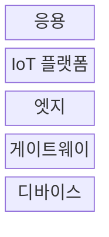
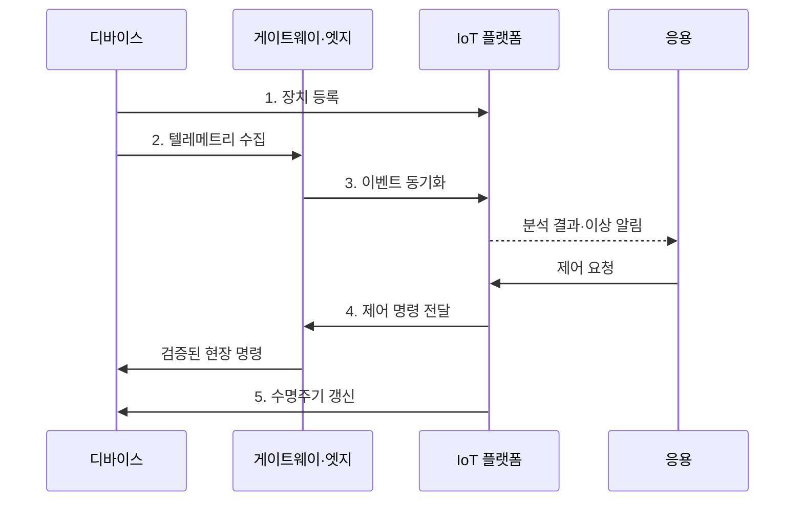

---
sidebar:
  order: 77
  label: "077. IoT 아키텍처 (IoT Architecture)"
  badge:
    text: "미출제 · 30%"
    variant: note
title: "IoT 아키텍처 (IoT Architecture)"
date: "2026-07-25T20:17:00+09:00"
tags:
  - "notes-network"
weight: 77
extra:
  question_no: "077"
  source_status: "미출제"
  source_history: ""
  priority: 30
  priority_note: "설계형: Device·Gateway·Cloud IoT 기반"
---

## 미리 알고가기

- **사물 인터넷(Internet of Things, IoT)**: 센서·장치를 네트워크로 연결해 현장 상태를 수집·분석·제어하는 기술
- **센서(Sensor)**: 온도·진동·위치 같은 물리 상태를 측정 데이터로 변환하는 장치
- **액추에이터(Actuator)**: 수신 명령을 모터 구동·밸브 개폐 같은 물리 동작으로 실행하는 장치
- **게이트웨이(Gateway)**: 이기종 장치 프로토콜을 변환하고 데이터를 집계하는 중계 장치
- **엣지 컴퓨팅(Edge Computing)**: 데이터 발생 지점 가까이에서 필터링·분석·제어를 수행하는 방식
- **IoT 플랫폼(IoT Platform)**: 장치 등록·데이터 저장·규칙 실행·원격 명령을 통합 관리하는 시스템
- **장치 수명주기(Device Lifecycle)**: 장치 등록·인증·설정·업데이트·폐기를 잇는 관리 단계
- **무선 원격 업데이트(Over-the-Air, OTA)**: 현장 방문 없이 네트워크로 장치 소프트웨어를 갱신하는 방식
- **롤백(Rollback)**: 업데이트 실패 시 장치 소프트웨어와 설정을 직전 정상 버전으로 되돌리는 복구

## Ⅰ. 개요

- 정의: 장치·엣지·플랫폼의 **연결·운영 구조**
- 필요성: 이기종 장치의 **대규모 수명주기 관리**

### 쉽게 이해하기 (학습용)

- IoT 아키텍처는 센서값의 이동 경로와 현장 제어, 장치 등록부터 폐기까지의 책임을 함께 정하는 설계도이다.

## Ⅱ. 특징

- **상향 텔레메트리·하향 명령**의 양방향성
- **엣지 자율 제어**의 저지연·단절 대응
- **장치 수명주기**의 등록·갱신·폐기 추적

### 쉽게 이해하기 (학습용)

- 센서값은 중앙으로 올리고 긴급 제어는 현장에서 처리하며 장치 상태는 전체 수명주기로 관리한다.

## Ⅲ. 구조 및 구성요소

| 구성요소 | 책임 |
|:---|:---|
| **디바이스** | 상태 측정과 승인 명령 실행 |
| **게이트웨이** | 이기종 통신 변환·데이터 집계 |
| **엣지** | 현장 분석·단절 중 자율 제어 |
| **IoT 플랫폼** | 장치·데이터·규칙·명령 통합 관리 |
| **응용** | 업무 분석과 장치 제어 요청 |

### 쉽게 이해하기 (학습용)

- 장치는 측정하고 게이트웨이는 통역하며 엣지는 현장 판단, 플랫폼은 전체 장치와 데이터를 관리한다.

## Ⅳ. 흐름도

1. **장치 등록**: 식별자·소유 관계·자격 증명 연결
2. **텔레메트리 수집**: 측정값에 시각·순서 정보를 부여
3. **이벤트 동기화**: 필터링 후 단절 데이터를 중복 제거
4. **제어 명령 전달**: 권한·안전 조건 확인 후 하향 전송
5. **수명주기 갱신**: OTA 적용·롤백·폐기 상태 추적

### 쉽게 이해하기 (학습용)

- 단절 중 저장한 데이터는 발생 시각과 순서를 확인하고 중복을 제거해야 과거 상태로 되돌아가지 않는다.

## Ⅴ. 종류 및 비교

| IoT 연결 구조 | 엣지 협업형 | 게이트웨이 중계형 | 직접 연결형 |
|:---|:---|:---|:---|
| 적용 기준 | **저지연·단절 제어** | **이기종 장치** 혼재 | 소수 **IP 장치** |
| 핵심 특징 | 현장 판단과 **중앙 관리** | **변환·집계** 후 상위 연계 | 장치의 **플랫폼 직접 접속** |
| 한계 | **규칙·상태 동기화** 복잡 | 게이트웨이 **단일 장애점** | 장치별 **연결·운영 부담** |

### 쉽게 이해하기 (학습용)

- 회선 단절에도 즉시 판단해야 하면 엣지 협업형, 통신 방식이 제각각이면 게이트웨이 중계형이 적합하다.

## Ⅵ. 실무 고려사항 및 대책

| 고려사항 | 대책 | 효과 |
|:---|:---|:---|
| 단절 중 **제어 공백** | 엣지에 **안전 규칙·버퍼** 배치 | 현장 연속성과 **데이터 보존** |
| 재연결 시 **순서·중복 충돌** | 시각·버전 기반 **멱등 동기화** | 상태 역전과 **이중 실행 방지** |
| OTA 실패의 **장치 벽돌화** | 단계 배포와 **자동 롤백** 적용 | 복구 시간과 **현장 방문 감소** |

### 쉽게 이해하기 (학습용)

- 스마트 공장은 회선이 끊겨도 엣지가 안전 제어를 계속하고 연결 복구 후 데이터를 순서대로 동기화한다.

## Ⅶ. 결론

- **지연·단절 허용도**로 엣지와 중앙 책임 배치

### 쉽게 이해하기 (학습용)

- 즉시 필요한 판단은 엣지에 두고 전체 장치의 등록·업데이트·폐기는 중앙 플랫폼에서 일관되게 관리한다.
