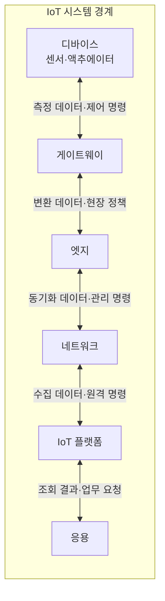
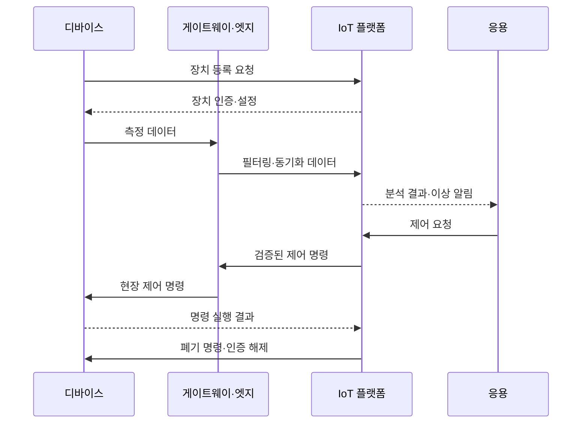

---
sidebar:
  order: 77
  label: "077. IoT 아키텍처 (IoT Architecture)"
  badge:
    text: "미출제 · 30%"
    variant: note
title: "IoT 아키텍처 (IoT Architecture)"
date: "2026-07-25T20:17:00+09:00"
tags:
  - "notes-network"
weight: 77
extra:
  question_no: "077"
  source_status: "미출제"
  source_history: ""
  priority: 30
  priority_note: "설계형: Device·Gateway·Cloud IoT 기반"
---

## 미리 알고가기

- **IoT (Internet of Things, 사물 인터넷)**: 센서와 장치를 네트워크로 연결해 현장 데이터를 수집하고 원격으로 상태를 분석·제어하는 기술
- **센서**: 온도·진동·위치처럼 현장의 물리 상태를 측정해 데이터로 바꾸는 장치
- **액추에이터**: 모터 구동·밸브 개폐처럼 수신한 명령을 실제 물리 동작으로 실행하는 장치
- **게이트웨이**: 서로 다른 장치 통신 방식을 변환하고 데이터를 모아 상위 시스템과 연결하는 중계 장치
- **엣지**: 데이터가 발생한 현장 가까이에서 필터링·분석·제어를 수행하는 컴퓨팅 영역
- **IoT 플랫폼**: 장치 등록·데이터 저장·규칙 실행·원격 명령·응용 연계를 제공하는 중앙 관리 시스템
- **장치 수명주기**: 장치의 등록·인증·설정·소프트웨어 업데이트·폐기까지 이어지는 전체 관리 단계
- **OTA (Over-the-Air, 무선 원격 업데이트)**: 현장 방문 없이 네트워크를 통해 장치 소프트웨어를 배포하고 설치하는 방식
- **중복 제거**: 같은 데이터나 명령이 여러 번 도착해도 한 번만 처리되게 하는 기능
- **롤백(Rollback)**: 업데이트 실패 시 장치 소프트웨어와 설정을 직전 정상 버전으로 되돌리는 복구
- **IoT·OTA**: IoT는 사물의 센서·통신·플랫폼을 연결하는 체계이고, OTA는 네트워크를 통해 장치 소프트웨어를 원격 업데이트하는 방식

## Ⅰ. 개요

- **정의**: 장치·엣지·플랫폼의 수명주기 구조
- **필요성**: 이기종 장치의 안전한 대규모 운영

### 쉽게 이해하기 (학습용)

- 센서 데이터를 모으는 통로뿐 아니라 단절 중 현장 제어와 장치 등록·업데이트·폐기를 맡는 운영 구조다

## Ⅱ. 특징

- 장치·게이트웨이·엣지·플랫폼이 책임을 나눈다.
- 엣지는 단절 중 필수 제어와 데이터를 보관한다.
- 측정값은 올리고 검증한 명령은 장치로 내린다.
- 등록·설정·갱신·폐기를 수명주기로 추적한다.
- 전 구간에서 장치 신원·권한·무결성을 검증한다.
- 검증 실패는 원격 명령을 물리 오동작으로 번지게 한다.

### 쉽게 이해하기 (학습용)

- 엣지는 필요한 센서값만 중앙으로 보내고 긴급 정지처럼 지연에 민감한 제어는 현장에서 수행한다

## Ⅲ. 아키텍처 및 구성요소

| 설계 요소 | 설명 |
|:---|:---|
| 디바이스 | 현장 측정값 생성·승인 제어 실행 |
| 게이트웨이 | 장치 통신 변환·데이터 집계 |
| 엣지 | 현장 필터링·분석·단절 제어 |
| 네트워크 | 현장·중앙 데이터와 명령 전달 |
| IoT 플랫폼 | 장치 등록·저장·분석·명령 관리 |
| 응용 | 업무 조회·장치 제어 요청 전달 |

> 요약: 측정은 상향, 검증된 명령은 하향 전달

### 쉽게 이해하기 (학습용)

- 측정 데이터는 플랫폼으로 올리고 제어 명령은 장치로 내리므로 양방향 모두 발신자·권한·순서·무결성을 검증한다

## Ⅳ. 원리 및 절차 흐름도

| 절차 | 설명 |
|:---|:---|
| 장치 등록 요청 | 고유 식별자와 소유 관계 등록 |
| 장치 인증·설정 | 신원 검증 후 통신 정책·초기 설정 전달 |
| 측정 데이터 | 센서 측정값을 게이트웨이·엣지로 전달 |
| 필터링·동기화 데이터 | 불필요한 값 제거·저장 순서 보정 |
| 분석 결과·이상 알림 | 분석 결과 제공·이상 상태 통지 |
| 제어 요청 | 사용자·업무 시스템의 장치 동작 요청 |
| 검증된 제어 명령 | 요청 권한·안전 조건 확인 후 전달 |
| 현장 제어 명령 | 최신 현장 확인 후 실행 명령 전달 |
| 명령 실행 결과 | 성공·실패 반환·명령 상태 확정 |
| 폐기 명령·인증 해제 | 폐기 장치의 인증·접근 권한 해제 |

> 요약: 등록·수집·제어·폐기로 수명주기 완결

### 쉽게 이해하기 (학습용)

- 단절 중 저장한 데이터와 명령은 발생 시각·순서를 확인하고 중복을 제거한 뒤 반영해야 과거 상태로 되돌아가지 않는다

## Ⅴ. 종류 및 비교

| 판단 기준 | 엣지 협업형 | 게이트웨이 중계형 | 직접 연결형 |
|:---|:---|:---|:---|
| 핵심 특징 | 엣지 현장 판단·플랫폼 중앙 관리 | 게이트웨이 통신 변환·집계 | 디바이스의 플랫폼 직접 접속 |
| 적용 기준 | 단절·저지연 산업 제어 | 이기종 통신 장치가 혼재 | 인터넷 가능한 소수 독립 장치 |
| 주요 위험 | 중앙·엣지 규칙 불일치 | 게이트웨이 장애의 전체 통신 중단 | 장치별 보안·연결·갱신 부담 |

> 요약: 장치 이질성과 현장 자율성으로 구조 선택

### 쉽게 이해하기 (학습용)

- 장치가 적어도 중앙 회선 단절 중 즉시 판단하고 제어해야 하면 직접 연결보다 엣지 협업형이 필요하다

## Ⅵ. 실무 사례

1. 스마트 공장의 **회선 단절 시 엣지 자율 제어**

### 쉽게 이해하기 (학습용)

- 중앙 클라우드 연결이 끊겨도 엣지가 안전 제어를 계속하고 센서 데이터를 보관한 뒤 연결 복구 시 동기화한다

## Ⅶ. 결론

- 대규모 IoT 장치를 안정적으로 연결·운영하기 위해 **단절 시 제어·데이터 지연·장치 수명주기·보안 업데이트**를 검토하고, 즉시 처리는 엣지, 통합 분석과 관리는 중앙 플랫폼에 배치해야 한다.

### 쉽게 이해하기 (학습용)

- 단절 중 필요한 제어는 엣지에 두고 등록·업데이트·폐기는 플랫폼에서 일관된 수명주기로 관리한다
