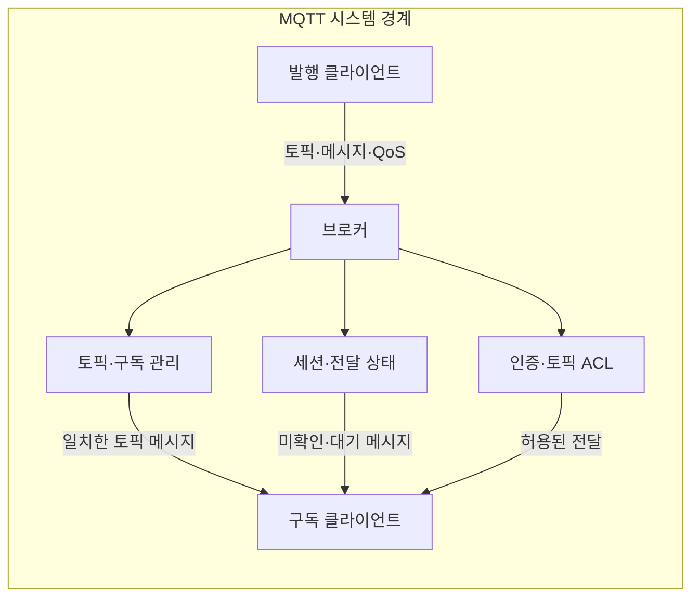
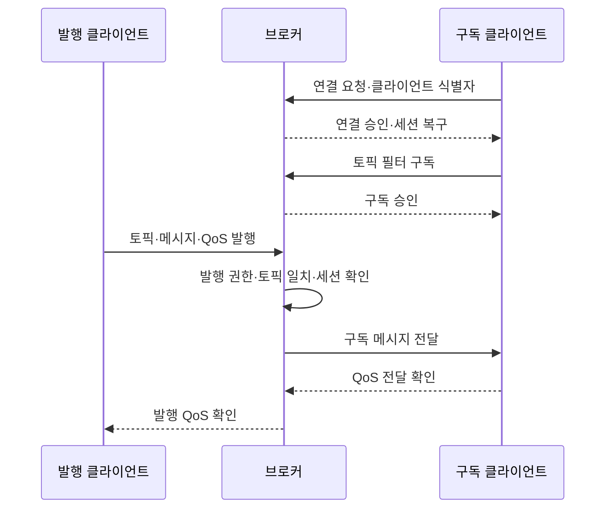

---
sidebar:
  order: 78
  label: "078. MQTT 경량 메시징 (MQTT)"
  badge:
    text: "기출 · 50%"
    variant: note
title: "MQTT 경량 메시징 (MQTT)"
date: "2026-07-27T23:59:59+09:00"
tags:
  - "notes-network"
weight: 78
extra:
  question_no: "078"
  source_status: "기출"
  source_history: "123회"
  priority: 50
  priority_note: "비교·설계형: MQTT·CoAP 경량 통신 우산"
---

## 미리 알고가기

- **MQTT (Message Queuing Telemetry Transport)**: 제한된 장치와 불안정한 네트워크를 위해 설계된 경량 발행·구독 메시징 프로토콜
- **발행·구독**: 발행자가 분류 경로에 메시지를 보내고, 그 경로를 구독한 수신자에게 중계자가 메시지를 전달하는 통신 방식
- **브로커**: 클라이언트의 연결·구독·메시지를 관리하고 발행 메시지를 해당 구독자에게 중계하는 서버
- **토픽**: 발행 메시지를 계층적으로 분류하고 구독 대상을 지정하는 문자열 경로
- **토픽 필터**: 구독자가 받을 토픽의 범위를 정확한 경로나 여러 경로를 나타내는 기호로 지정한 조건
- **QoS (Quality of Service, 서비스 품질)**: MQTT 클라이언트와 브로커 사이에서 메시지 전달 횟수와 확인 절차를 정하는 수준
- **세션**: 클라이언트 식별자와 구독·미확인 메시지 등 연결을 이어서 처리하기 위한 상태
- **보존 메시지**: 브로커가 토픽의 마지막 메시지를 저장했다가 새 구독자에게 즉시 전달하는 기능
- **유언 메시지**: 클라이언트가 비정상적으로 끊겼을 때 브로커가 미리 지정된 토픽에 대신 발행하는 메시지
- **ACL (Access Control List, 접근 제어 목록)**: 클라이언트별로 발행·구독할 수 있는 토픽을 제한하는 권한 규칙
- **TLS (Transport Layer Security, 전송 계층 보안)**: 통신 상대를 인증하고 전송 내용을 암호화·무결성 보호하는 보안 프로토콜
- **멱등성**: 같은 메시지를 여러 번 처리해도 업무 결과가 한 번 처리한 것과 같게 유지되는 성질
- **약어 읽기와 표기**: MQTT·QoS·ACL·TLS는 엠큐티티·큐오에스·에이씨엘·티엘에스로 읽고 영문 핵심 글자를 딴 표기이며, 메시징·전달 수준·토픽 권한·전송 보안 역할을 구분함

## Ⅰ. 개요

- 정의/개념: 브로커 기반 **경량 발행·구독 프로토콜**
- **배경/필요성**: 직접 연결의 **주소 결합·간헐 통신 한계** 해소

### 쉽게 이해하기 (학습용)

- 발행자와 구독자는 서로의 주소를 몰라도 토픽을 통해 브로커에서 메시지를 주고받는다

## Ⅱ. 특징

- 토픽 기반 **발행자·구독자 공간 분리**
- 세션의 **재접속 상태 복구**
- QoS별 **전달 보장·상태 비용 상충**

### 쉽게 이해하기 (학습용)

- QoS가 높을수록 확인 절차와 미완료 상태 저장이 늘어 유실은 줄지만 통신량·메모리·지연은 증가한다

## Ⅲ. 아키텍처 및 구성요소

| 설계 요소 | 설명 |
|:---|:---|
| 발행 클라이언트 | 토픽·메시지·QoS를 지정해 발행 |
| 브로커 | 토픽·세션·권한에 따라 메시지 중계 |
| 토픽·구독 관리 | 발행 토픽과 필터를 비교해 구독자 선택 |
| 세션·전달 상태 | 구독·대기·확인 상태로 재접속 처리 |
| 인증·토픽 ACL | 신원 확인과 발행·구독 범위 제한 |
| 구독 클라이언트 | 토픽 필터와 일치하는 메시지 수신 |

> 요약: 브로커가 토픽·세션·권한으로 중계

### 쉽게 이해하기 (학습용)

- 브로커는 토픽·세션·권한을 대조해 발행 메시지를 허용된 구독 연결로 중계한다

## Ⅳ. 원리 및 절차 흐름도

| 절차 | 설명 |
|:---|:---|
| 연결 요청·클라이언트 식별자 | 식별 정보·인증값을 브로커에 제시 |
| 연결 승인·세션 복구 | 기존 구독·미확인 상태 복구 |
| 토픽 필터 구독 | 받을 메시지 범위를 필터로 등록 |
| 구독 승인 | 토픽 ACL로 허용 범위 확정 |
| 토픽·메시지·QoS 발행 | 분류 경로·전달 수준을 지정해 발행 |
| 발행 권한·토픽 일치·세션 확인 | 구독자와 전달 상태 결정 |
| 구독 메시지 전달 | 구독 연결별 QoS로 메시지 전송 |
| QoS 전달 확인 | 구독 구간의 수신 확인 교환 |
| 발행 QoS 확인 | 발행 구간 완료 후 상태 종료 |

> 요약: 양쪽 구간의 인증·권한·QoS를 별도 처리

### 쉽게 이해하기 (학습용)

- 발행·구독 구간의 QoS가 따로 동작하므로 응용도 메시지 식별자로 중복 처리를 제거한다

## Ⅴ. 종류 및 비교

| MQTT QoS 수준 | QoS 0 | QoS 1 | QoS 2 |
|:---|:---|:---|:---|
| 적용 기준 | 일부 유실 허용 센서 데이터 | 중복 제거 가능한 상태·알림 | 중복 영향이 큰 제어 메시지 |
| 핵심 특징 | 최대 한 번 전달 | 최소 한 번 전달 | 정확히 한 번 전달 |
| 한계 | 유실 확인·복구 불가 | 중복 처리 가능성 | 확인·저장·복구 복잡성 |

> 요약: 유실·중복 비용에 맞춰 QoS 선택

### 쉽게 이해하기 (학습용)

- QoS 1은 확인 응답이 사라지면 같은 메시지를 재전송하므로 응용이 식별자로 중복을 제거한다

## Ⅵ. 실무 사례

1. 측정값·고장 알림의 QoS 차등
2. 브로커 전환 시 세션·미확인 상태 복구

### 쉽게 이해하기 (학습용)

- 유실·중복 비용과 빈도에 따라 토픽별 QoS를 정한다
- 장애 전환 때 세션과 미확인 메시지까지 복구해야 전달이 이어진다

## Ⅶ. 결론

- 유실·중복 비용으로 QoS·세션 복구 설정

### 쉽게 이해하기 (학습용)

- 허용 가능한 유실·중복과 재접속 상태에 맞춰 토픽별 QoS와 세션 복구 범위를 설정한다
