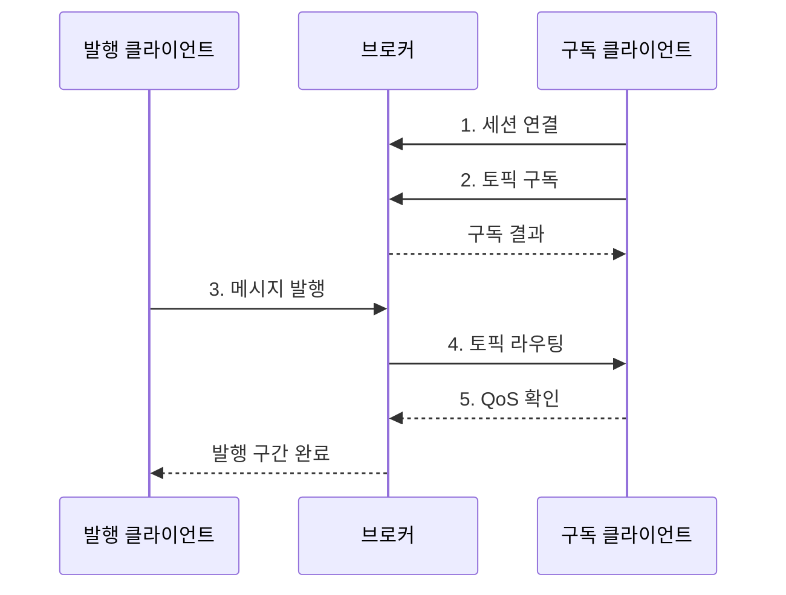

---
sidebar:
  order: 78
  label: "078. MQTT 경량 메시징 (MQTT)"
  badge:
    text: "기출 · 50%"
    variant: note
title: "MQTT 경량 메시징 (MQTT)"
date: "2026-07-27T23:59:59+09:00"
tags:
  - "notes-network"
weight: 78
extra:
  question_no: "078"
  source_status: "기출"
  source_history: "123회"
  priority: 50
  priority_note: "비교·설계형: MQTT·CoAP 경량 통신 우산"
---

## 미리 알고가기

- **메시지 큐 텔레메트리 전송(Message Queuing Telemetry Transport, MQTT)**: 제한 장치와 저대역폭 환경을 위한 경량 발행·구독 메시징 프로토콜
- **발행·구독(Publish/Subscribe)**: 발행자가 토픽에 메시지를 보내면 브로커가 일치하는 구독자에게 전달하는 통신 방식
- **브로커(Broker)**: 연결·구독·세션을 관리하고 발행 메시지를 구독자에게 중계하는 서버
- **토픽(Topic)**: 발행 메시지를 계층적으로 분류하고 구독 대상을 지정하는 문자열 경로
- **토픽 필터(Topic Filter)**: 단일 또는 와일드카드 경로로 수신할 토픽 범위를 지정하는 조건
- **서비스 품질(Quality of Service, QoS)**: 클라이언트와 브로커 사이의 전달 횟수와 확인 절차를 정하는 수준
- **세션 상태(Session State)**: 클라이언트 식별자에 연결한 구독·미전송·미확인 메시지 상태
- **보존 메시지(Retained Message)**: 브로커가 토픽의 마지막 메시지를 저장해 신규 구독자에게 전달하는 기능
- **유언 메시지(Will Message)**: 비정상 연결 종료 시 브로커가 클라이언트를 대신해 발행하는 메시지
- **접근 제어 목록(Access Control List, ACL)**: 클라이언트별 발행·구독 가능 토픽을 제한하는 권한 규칙
- **전송 계층 보안(Transport Layer Security, TLS)**: 통신 상대 인증과 전송 암호화·무결성을 제공하는 프로토콜
- **멱등성(Idempotency)**: 같은 메시지를 반복 처리해도 업무 결과가 한 번 처리한 것과 같게 유지되는 성질
- **OASIS MQTT 5.0**: MQTT 제어 패킷·QoS·세션·속성을 규정한 OASIS 표준

## Ⅰ. 개요

- 정의: **OASIS MQTT 5.0** 기반 **경량 발행·구독 표준**
- 필요성: **주소 결합·간헐 연결** 부담 해소

### 쉽게 이해하기 (학습용)

- 발행자와 구독자는 서로의 주소를 몰라도 같은 토픽을 통해 브로커에서 메시지를 주고받는다.

## Ⅱ. 특징

- **토픽 기반 분리**의 송수신자 공간 비결합
- **세션 상태**의 연결 단절 후 전달 재개
- **QoS 수준**의 신뢰성과 상태 비용 상충

### 쉽게 이해하기 (학습용)

- QoS가 높을수록 유실은 줄지만 확인 패킷과 미완료 상태 저장이 늘어 통신량·메모리·지연이 증가한다.

## Ⅲ. 구조 및 구성요소

| 구성요소 | 책임 |
|:---|:---|
| **발행 클라이언트** | 토픽·메시지·QoS 지정 발행 |
| **브로커** | 연결·권한·메시지 중계 총괄 |
| **토픽·구독 엔진** | 토픽과 필터를 대조해 수신자 선택 |
| **세션·전달 저장소** | 구독·대기·미확인 상태 보존 |
| **구독 클라이언트** | 일치 토픽 메시지 수신·확인 |

### 쉽게 이해하기 (학습용)

- 브로커는 토픽 일치 여부와 세션 상태를 확인해 발행 메시지를 연결된 구독자나 대기 저장소로 보낸다.

## Ⅳ. 흐름도

| 단계 | 동작 원리 |
|:---|:---|
| **1. 세션 연결** | 식별자·인증 후 이전 상태 복구 |
| **2. 토픽 구독** | 토픽 필터와 ACL 허용 범위 등록 |
| **3. 메시지 발행** | 토픽·페이로드·QoS를 브로커에 전송 |
| **4. 토픽 라우팅** | 필터 일치 구독별 QoS로 전달 |
| **5. QoS 확인** | 확인 교환 후 미완료 상태 정리 |

### 쉽게 이해하기 (학습용)

- 발행 구간과 구독 구간의 QoS가 따로 동작하므로 응용은 메시지 식별자로 중복 업무 처리를 막아야 한다.

## Ⅴ. 종류 및 비교

| MQTT QoS 수준 | QoS 0 | QoS 1 | QoS 2 |
|:---|:---|:---|:---|
| 적용 기준 | 유실 허용 **주기 측정값** | 멱등 처리 가능한 **상태·알림** | 중복 영향이 큰 **제어 메시지** |
| 핵심 특징 | **최대 한 번** 전달 | **최소 한 번** 전달 | 구간 내 **정확히 한 번** 전달 |
| 한계 | **유실 확인 불가** | **중복 도착 가능** | 확인·저장 **비용 최대** |

### 쉽게 이해하기 (학습용)

- QoS 1은 확인 응답이 사라지면 같은 메시지를 재전송할 수 있으므로 수신 응용이 중복을 제거한다.

## Ⅵ. 실무 고려사항 및 대책

| 고려사항 | 대책 | 효과 |
|:---|:---|:---|
| 토픽별 **유실·중복 비용** | 중요도 기반 **QoS 차등화** | 신뢰성과 **전송량 균형** |
| 재접속 시 **상태 단절** | 세션 만료와 **대기 한도** 설계 | 복구성과 **저장량 통제** |
| 와일드카드의 **과다 권한** | 최소 토픽 **ACL·TLS** 적용 | 오발행·도청 **범위 축소** |

### 쉽게 이해하기 (학습용)

- 주기 측정값은 QoS 0, 반드시 도착해야 하는 고장 알림은 QoS 1로 설정해 메시지 가치에 비용을 맞춘다.

## Ⅶ. 결론

- **유실·중복 비용**으로 토픽별 QoS·세션 선택

### 쉽게 이해하기 (학습용)

- 잃어도 되는 데이터와 중복되면 위험한 명령을 구분해 QoS와 세션 보존 범위를 다르게 정한다.
