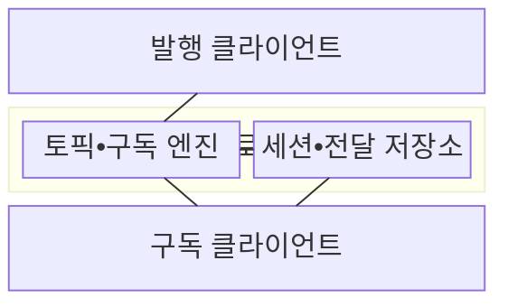
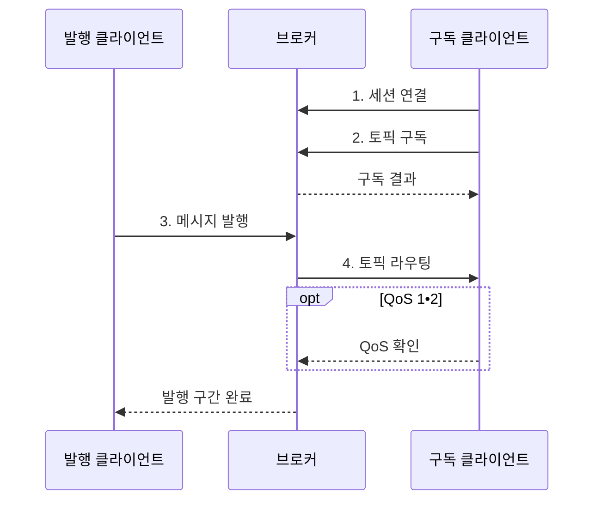

---
sidebar:
  order: 78
  label: "078. MQTT 경량 메시징 (MQTT)"
  badge:
    text: "기출 • 50%"
    variant: note
title: "MQTT 경량 메시징 (MQTT)"
date: "2026-08-04T14:34:12+09:00"
tags:
  - "notes-network"
weight: 78
extra:
  question_no: "078"
  source_status: "기출"
  source_history: "123회"
  priority: 50
  priority_note: "비교•설계형: MQTT•CoAP 경량 통신 우산"
---

## Ⅰ. 개요

핵심 용어

- **메시지 큐 원격 측정 전송(Message Queuing Telemetry Transport, MQTT)**: 브로커가 토픽을 기준으로 메시지를 중계해 제한 장치와 저대역폭 환경을 지원하는 경량 발행•구독 프로토콜이다.

- 정의/개념: 브로커가 토픽 메시지를 중계하는 **경량 발행•구독 프로토콜**
- 배경/필요성: 직접 주소 결합은 **간헐 연결 장치의 오프라인 전달 곤란**

#### 한줄 요약

- 발행자와 구독자는 서로의 주소를 몰라도 같은 토픽을 통해 브로커에서 메시지를 주고받는다.

## Ⅱ. 특징

핵심 용어

- **서비스 품질(Quality of Service, QoS)**: 메시지 전달 확인 수준과 재전송•저장 비용을 정하는 기준
- **QoS 상충**: 전달 확인 수준이 높을수록 확인•저장•지연 비용이 증가하는 관계

- **공간 비결합**: 토픽으로 발행자•구독자 주소 분리
- **세션 복구**: 연결 단절 후 구독•대기 전달 재개
- **QoS 상충**: 신뢰성 향상과 확인•저장 비용 증가

#### 한줄 요약

- QoS가 높을수록 유실은 줄지만 확인 패킷과 미완료 상태 저장이 늘어 통신량•메모리•지연이 증가한다.

## Ⅲ. 구조 및 구성요소

핵심 용어

- **세션•전달 저장소(Session/Delivery Store)**: 클라이언트 식별자에 연결한 구독•대기 메시지•미확인 QoS 교환 상태를 보존한다.

| 구성요소 | 책임 |
|:---|:---|
| 발행 클라이언트 | 토픽•메시지•QoS 지정 발행 |
| 브로커 | 연결•권한•메시지 중계 총괄 |
| 토픽•구독 엔진 | 토픽과 필터를 대조해 수신자 선택 |
| 세션•전달 저장소 | 구독•대기•미확인 상태 보존 |
| 구독 클라이언트 | 일치 토픽 메시지 수신•확인 |

#### 한줄 요약

- 브로커는 토픽 일치 여부와 세션 상태를 확인해 발행 메시지를 연결된 구독자나 대기 저장소로 보낸다.

## Ⅳ. 흐름도

핵심 용어

- **토픽 라우팅(Topic Routing)**: 브로커는 발행 토픽과 구독 필터를 대조하고 구독별 허용 권한과 QoS에 따라 메시지를 전달한다.
- **접근 제어 목록(Access Control List, ACL)**: 토픽별 발행•구독 허용 권한을 정한 목록

**동작 원리**

1. **세션 연결**: 식별자•인증 후 이전 상태 복구
2. **토픽 구독**: 토픽 필터와 ACL 허용 범위 등록
3. **메시지 발행**: 토픽•페이로드•QoS를 브로커에 전송
4. **토픽 라우팅**: 필터 일치 구독별 QoS로 전달

#### 한줄 요약

- 발행 구간과 구독 구간의 QoS가 따로 동작하므로 응용은 메시지 식별자로 중복 업무 처리를 막아야 한다.

## Ⅴ. 종류 및 비교

핵심 용어

- **QoS 0**: 확인 없이 최대 한 번 전달하는 수준
- **QoS 1**: 확인 응답으로 최소 한 번 전달하는 수준
- **QoS 2**: 확인 절차로 구간 내 정확히 한 번 전달하는 수준

| MQTT QoS 수준 | QoS 0 | QoS 1 | QoS 2 |
|:---|:---|:---|:---|
| 적용 기준 | 유실 허용 **주기 측정값** | 멱등 처리 가능한 **상태•알림** | 중복 영향이 큰 **제어 메시지** |
| 핵심 특징 | **최대 한 번** 전달 | **최소 한 번** 전달 | 구간 내 **정확히 한 번** 전달 |
| 한계 | **유실 확인 불가** | **중복 도착 가능** | 확인•저장 **비용 최대** |

#### 한줄 요약

- QoS 1은 확인 응답이 사라지면 같은 메시지를 재전송할 수 있으므로 수신 응용이 중복을 제거한다.

## Ⅵ. 실무 고려사항 및 대책

핵심 용어

- **와일드카드 과다 권한(Wildcard Excessive Privilege)**: 한 클라이언트가 필요 범위를 넘어 여러 장치의 토픽을 수신하거나 발행하게 하는 문제다.
- **전송 계층 보안(Transport Layer Security, TLS)**: 통신 상대를 인증하고 전송 데이터를 암호화하는 프로토콜

| 문제 | 대책 | 효과 |
|:---|:---|:---|
| 토픽별 **유실•중복 비용** | 중요도 기반 **QoS 차등화** | 신뢰성과 **전송량 균형** |
| 재접속 시 **상태 단절** | 세션 만료와 **대기 한도** 설계 | 복구성과 **저장량 통제** |
| 와일드카드의 **과다 권한** | 최소 토픽 **ACL•TLS** 적용 | 오발행•도청 **범위 축소** |

#### 한줄 요약

- 주기 측정값은 QoS 0, 반드시 도착해야 하는 고장 알림은 QoS 1로 설정해 메시지 가치에 비용을 맞춘다.

## Ⅶ. 결론

핵심 용어

- 유실 허용 측정은 **QoS 0**, 멱등 알림은 **QoS 1**, 중복 위험 제어는 **QoS 2**

#### 한줄 요약

- 잃어도 되는 데이터와 중복되면 위험한 명령을 구분해 QoS와 세션 보존 범위를 다르게 정한다.
