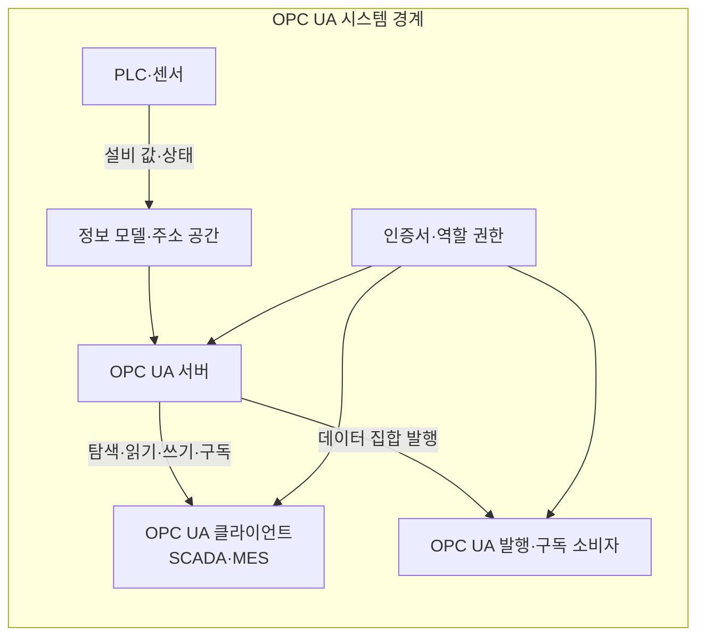
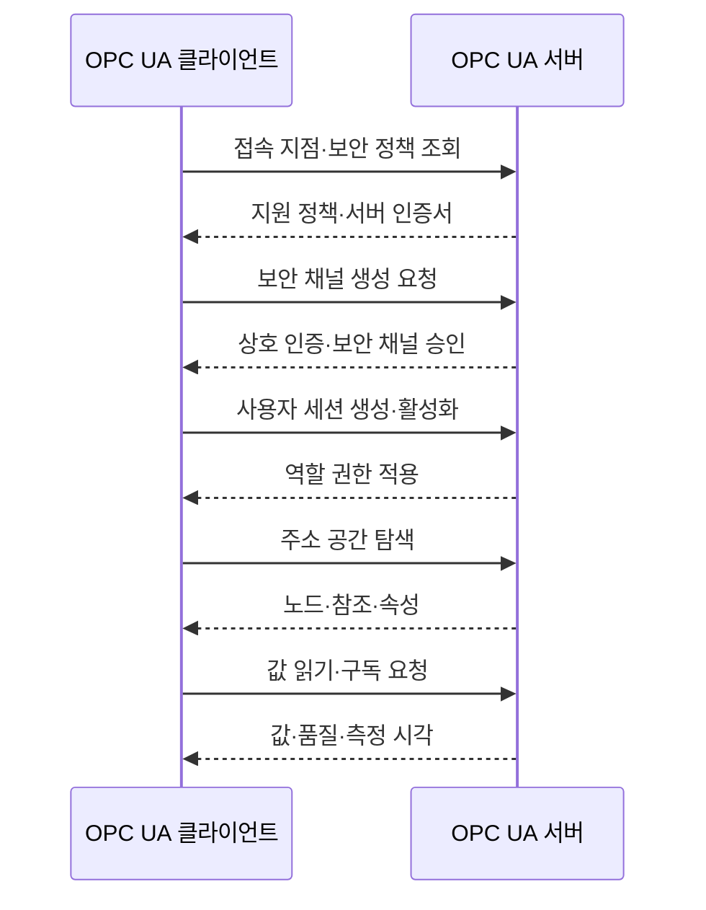

---
sidebar:
  order: 79
  label: "079. OPC UA 산업 표준 통신 (OPC UA)"
  badge:
    text: "기출 · 50%"
    variant: note
title: "OPC UA 산업 표준 통신 (OPC UA)"
date: "2026-07-27T23:59:59+09:00"
tags:
  - "notes-network"
weight: 79
extra:
  question_no: "079"
  source_status: "기출"
  source_history: "137회"
  priority: 50
  priority_note: "설계·보안형: 산업 상호운용 OPC UA"
---

## 미리 알고가기

- **OPC UA (Open Platform Communications Unified Architecture)**: 산업 장비의 데이터·의미·서비스·보안을 함께 표준화한 상호운용 통신 규격
- **PLC (Programmable Logic Controller, 프로그램 가능 논리 제어기)**: 센서 입력을 읽고 제어 논리에 따라 기계와 설비를 동작시키는 산업용 제어기
- **SCADA (Supervisory Control and Data Acquisition, 감시 제어 및 데이터 수집)**: 여러 설비의 상태를 중앙에서 수집·표시하고 원격 제어하는 시스템
- **MES (Manufacturing Execution System, 제조 실행 시스템)**: 생산 지시·공정 실적·품질·설비 상태를 관리하는 제조 운영 시스템
- **정보 모델**: 설비의 값뿐 아니라 데이터 형식·단위·속성·관계를 함께 표현한 구조
- **주소 공간**: OPC UA 서버가 객체·변수·메서드 등의 노드와 노드 간 참조를 계층적으로 공개하는 정보 구조
- **노드**: 주소 공간에서 설비·값·형식·동작을 나타내는 개별 정보 요소
- **참조**: 노드 사이의 포함·종류·연결 관계를 나타내는 연결 정보
- **클라이언트·서버**: 클라이언트가 서버의 주소 공간을 탐색하고 읽기·쓰기·호출·구독을 요청하는 통신 방식
- **발행·구독(Publish-Subscribe, PubSub)**: 발행자가 데이터 집합을 보내고 관심 있는 여러 구독자가 받아 송신자와 수신자를 분리하는 통신 방식
- **인증서**: 통신 프로그램의 신원을 증명하고 암호화 통신의 신뢰 관계를 만드는 전자 문서
- **약어 읽기와 표기**: OPC UA·PLC·SCADA·MES·PubSub는 오피씨 유에이·피엘씨·스카다·엠이에스·펍섭으로 읽고 영문 핵심 글자나 단어를 줄인 표기이며, 산업 통신·제어기·감시·생산 실행·다중 배포 역할을 구분함

## Ⅰ. 개요

- **정의/개념**: **정보 모델·서비스·보안** 통합 산업 통신 규격
- **배경/필요성**: 이기종 설비의 **데이터 의미 불일치** 해소

### 쉽게 이해하기 (학습용)

- OPC UA는 값과 함께 설비 이름·자료형·단위·측정 시각·품질을 전달해 서로 다른 시스템이 같은 뜻으로 해석하게 한다

## Ⅱ. 특징

- 노드·참조 기반 **설비 의미 정보 모델**
- 탐색·읽기·쓰기·호출·구독의 **표준 서비스**
- 인증서·역할 권한 기반 **통신 보안**

### 쉽게 이해하기 (학습용)

- 같은 값도 단위·자료형·품질 의미가 다르면 오해하므로 양쪽이 공통 정보 모델을 사용해야 한다

## Ⅲ. 아키텍처 및 구성요소

| 설계 요소 | 설명 |
|:---|:---|
| PLC·센서 | 설비 값·상태 생성과 제어 명령 실행 |
| 정보 모델·주소 공간 | 노드·참조에 이름·형식·단위·관계 부여 |
| OPC UA 서버 | 주소 공간과 표준 서비스 제공 |
| OPC UA 클라이언트 | 서버 탐색·값 조회·제어 요청 |
| OPC UA 발행·구독 소비자 | 데이터 집합을 분석·감시에 활용 |
| 인증서·역할 권한 | 프로그램·사용자 신원과 작업 제한 |

> 요약: 정보 모델 제공과 역할별 접근 제한

### 쉽게 이해하기 (학습용)

- 서버의 주소 공간이 원시 설비값에 이름·자료형·단위·관계를 붙여 클라이언트가 같은 의미로 사용하게 한다

## Ⅳ. 원리 및 절차 흐름도

| 절차 | 설명 |
|:---|:---|
| 접속 지점·보안 정책 조회 | 접속 주소·지원 인증·암호화 확인 |
| 지원 정책·서버 인증서 | 정책과 서버 인증서 제공 |
| 보안 채널 생성 요청 | 정책·인증서를 선택해 암호화 요청 |
| 상호 인증·보안 채널 승인 | 인증서 신뢰 확인 후 채널 생성 |
| 사용자 세션 생성·활성화 | 사용자·서비스 계정 세션 생성 |
| 역할 권한 적용 | 역할별 읽기·쓰기·호출 노드 제한 |
| 주소 공간 탐색 | 노드·참조로 설비·변수·동작 탐색 |
| 노드·참조·속성 | 이름·형식·단위·관계 반환 |
| 값 읽기·구독 요청 | 현재 값 조회·변경 통지 요청 |
| 값·품질·측정 시각 | 품질과 실제 측정 시각 전달 |

> 요약: 프로그램·사용자·데이터 의미 순으로 검증

### 쉽게 이해하기 (학습용)

- 인증서는 프로그램 신원을 확인하고 사용자 역할은 세션에서 읽기·쓰기·호출 가능한 노드를 제한한다

## Ⅴ. 종류 및 비교

| OPC UA 통신 모델 | 클라이언트·서버 | 발행·구독 |
|:---|:---|:---|
| 적용 기준 | 설비 탐색·진단·개별 제어 | 주기 데이터를 다수 시스템에 배포 |
| 핵심 특징 | 주소 공간의 서비스 직접 요청 | 데이터 집합의 다중 배포 |
| 한계 | 세션·구독 증가로 서버 부하 | 모델 불일치에 따른 값 오해 |

> 요약: 직접 요청과 다중 배포 목적에 맞춰 선택

### 쉽게 이해하기 (학습용)

- 설비를 탐색해 개별 제어하면 클라이언트·서버, 같은 데이터를 여러 시스템에 보내면 발행·구독을 선택한다

## Ⅵ. 실무 사례

1. PLC 값을 공통 모델로 MES 연계
2. 처리량에 맞춰 구독 주기·대기열 조정

### 쉽게 이해하기 (학습용)

- 원시 설비값을 같은 뜻으로 해석하도록 이름·자료형·단위를 공통 모델에 맞춘다
- 수신 처리량에 맞춰 구독 주기와 대기열을 조정해 오래된 데이터가 쌓이지 않게 한다

## Ⅶ. 결론

- 데이터 의미·구독 규모로 통신 모델·권한 설정

### 쉽게 이해하기 (학습용)

- 양쪽의 노드·자료형·단위·품질 의미를 맞추고 구독 규모에 맞는 통신 모델과 역할 권한을 설정한다
