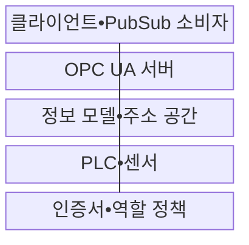
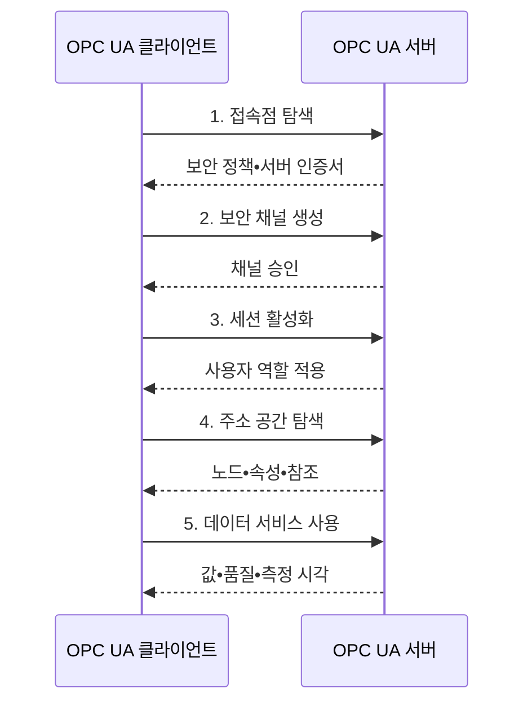

---
sidebar:
  order: 79
  label: "079. OPC UA 산업 표준 통신 (OPC UA)"
  badge:
    text: "기출 • 50%"
    variant: note
title: "OPC UA 산업 표준 통신 (OPC UA)"
date: "2026-08-04T14:34:12+09:00"
tags:
  - "notes-network"
weight: 79
extra:
  question_no: "079"
  source_status: "기출"
  source_history: "137회"
  priority: 50
  priority_note: "설계•보안형: 산업 상호운용 OPC UA"
---

## Ⅰ. 개요

핵심 용어

- **개방형 플랫폼 통신 통합 아키텍처(Open Platform Communications Unified Architecture, OPC UA)**: 산업 데이터의 값•자료형•단위•관계와 서비스•보안을 함께 규정하는 상호운용 표준이다.

- 정의/개념: 산업 데이터의 의미•서비스•보안을 통합한 **상호운용 표준**
- 배경/필요성: 제조사별 원시 값은 **이름•단위•품질 의미 공유 불가**

#### 한줄 요약

- OPC UA는 값뿐 아니라 설비 이름•자료형•단위•품질을 함께 전달해 서로 다른 시스템이 같은 뜻으로 해석하게 한다.

## Ⅱ. 특징

핵심 용어

- **계층 보안(Layered Security)**: 애플리케이션 인증서로 프로그램 신원을 확인하고 세션의 사용자 역할로 노드별 작업 권한을 제한한다.

- **의미 모델**: 노드•속성•참조로 산업 데이터 표현
- **표준 서비스**: 탐색•읽기•쓰기•호출 인터페이스
- **계층 보안**: 인증서로 프로그램, 역할로 사용자 통제

#### 한줄 요약

- 같은 숫자도 단위와 품질 의미가 다르면 오해하므로 송수신 시스템이 공통 정보 모델을 사용해야 한다.

## Ⅲ. 구조 및 구성요소

핵심 용어

- **정보 모델(Information Model)**: 설비 데이터의 이름•자료형•단위•관계를 정의하는 모델
- **주소 공간(Address Space)**: 정보 모델의 노드•속성•참조를 제공하는 논리 공간
- **프로그래머블 논리 제어기(Programmable Logic Controller, PLC)**: 현장의 센서 값을 수집하고 제어 논리를 실행하는 산업 제어 장치이다.
- **OPC UA 발행•구독(OPC UA Publish-Subscribe, OPC UA PubSub)**: 데이터 집합을 생산자와 소비자 사이에 비결합 배포하는 모델

| 구성요소 | 책임 |
|:---|:---|
| PLC•센서 | 설비 값 생성과 제어 명령 실행 |
| 정보 모델•주소 공간 | 노드•속성•참조에 의미 부여 |
| OPC UA 서버 | 주소 공간과 표준 서비스 제공 |
| 클라이언트•PubSub 소비자 | 탐색•제어 요청과 데이터 활용 |
| 인증서•역할 정책 | 애플리케이션 신뢰와 권한 제한 |

#### 한줄 요약

- 서버의 주소 공간이 원시 설비값에 이름•자료형•단위•관계를 붙여 상위 시스템이 같은 의미로 사용하게 한다.

## Ⅳ. 흐름도

핵심 용어

- **보안 채널 생성(Secure Channel Establishment)**: 클라이언트와 서버는 신뢰된 애플리케이션 인증서와 보안 정책을 검증해 메시지 무결성•기밀성 채널을 만든다.

**동작 원리**

1. **접속점 탐색**: 주소•지원 정책•서버 인증서 확인
2. **보안 채널 생성**: 애플리케이션 신뢰와 메시지 보호 설정
3. **세션 활성화**: 사용자 인증 후 역할 권한 연결
4. **주소 공간 탐색**: 노드•속성•참조로 설비 의미 발견
5. **데이터 서비스 사용**: 읽기•쓰기•호출•구독 수행

#### 한줄 요약

- 인증서는 프로그램 신원을 확인하고 사용자 역할은 세션에서 접근 가능한 노드와 작업을 제한한다.

## Ⅴ. 종류 및 비교

| OPC UA 통신 모델 | 클라이언트•서버 | 발행•구독 |
|:---|:---|:---|
| 적용 기준 | **탐색•진단•개별 제어** | **다대다 주기 배포** |
| 핵심 특징 | 주소 공간의 **서비스 요청•응답** | 데이터 집합의 **비결합 배포** |
| 한계 | 세션•구독 증가의 **서버 부하** | 전달 보장의 **전송 매핑 의존** |

#### 한줄 요약

- 설비를 탐색해 개별 제어하면 클라이언트•서버, 같은 데이터를 여러 시스템에 배포하면 PubSub가 적합하다.

## Ⅵ. 실무 고려사항 및 대책

핵심 용어

- **인증서 기반 통신 중단(Certificate-Induced Communication Failure)**: 애플리케이션 인증서가 만료되거나 신뢰 목록이 갱신되지 않아 보안 채널을 수립하지 못하는 문제다.
- **제조 실행 시스템(Manufacturing Execution System, MES)**: 생산 계획과 현장 설비 실적•품질 정보를 연계해 제조 활동을 관리하는 시스템이다.

| 문제 | 대책 | 효과 |
|:---|:---|:---|
| 제조사별 **의미 모델 불일치** | 컴패니언 명세와 **매핑 규칙** 적용 | MES 연계의 **의미 일관성** |
| 인증서 만료의 **통신 중단** | 신뢰 목록•갱신 **자동화** | 보안 채널의 **운영 연속성** |
| 대규모 구독의 **서버 과부하** | 샘플링•큐•PubSub **분산 설계** | 지연과 **서버 부하 감소** |

#### 한줄 요약

- 제조사마다 다른 PLC 값을 공통 정보 모델로 매핑하면 MES가 이름•단위•품질을 같은 의미로 해석할 수 있다.

## Ⅶ. 결론

핵심 용어

- **컴패니언 명세(Companion Specification)**: 산업별 장비•데이터의 이름•단위•속성•관계를 공통 OPC UA 정보 모델로 정의한다.

- 공통 의미는 **컴패니언 명세**, 개별 제어는 **클라이언트•서버**, 다대다는 **PubSub**

#### 한줄 요약

- 공통 의미 모델을 먼저 맞추고 개별 제어는 클라이언트•서버, 대량 배포는 PubSub로 설계한다.
