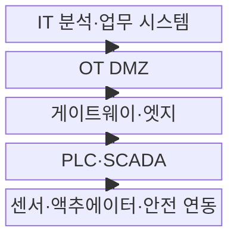
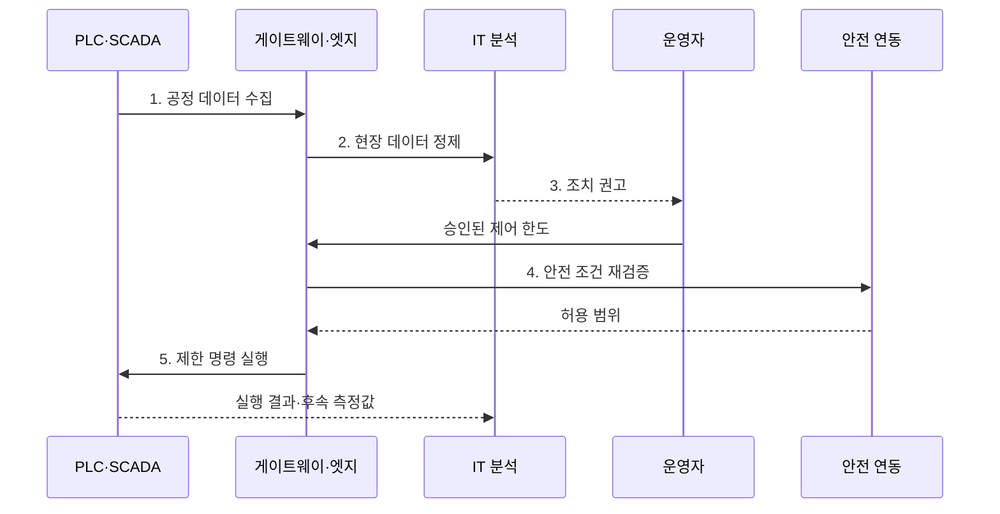

---
sidebar:
  order: 80
  label: "080. 산업용 IoT (Industrial IoT, IIoT)"
  badge:
    text: "기출 · 50%"
    variant: note
title: "산업용 IoT (Industrial IoT, IIoT)"
date: "2026-08-02T12:00:00+09:00"
tags:
  - "notes-network"
weight: 80
extra:
  question_no: "080"
  source_status: "기출"
  source_history: "137회"
  priority: 50
  priority_note: "설계·보안형: 산업망·OT 융합의 상위 주제"
---

## Ⅰ. 개요

핵심 용어

- **산업 운영 체계**: IIoT는 설비 데이터를 상태 감시·예지 정비·생산 조건·안전 제어 판단에 연결하는 산업 운영 체계다.

- 정의/개념: 설비 데이터를 운영 판단·제어에 연결하는 **산업 운영 체계**
- 배경/필요성: IT·OT 직접 결합은 **장애 전파·노후 명령 오제어** 유발

### 쉽게 이해하기 (학습용)

- IIoT는 설비 데이터를 모으는 데서 끝나지 않고 정비 시점·생산 조건·안전 정지 결정으로 연결한다.

## Ⅱ. 특징

핵심 용어

- **현장 검증**: 현장 검증은 상위 분석에서 승인한 명령도 최신 공정 상태·허용 한도·안전 연동 조건과 다시 대조한다.

- **안전 우선**: 처리량보다 OT 가용성·결정성 보호
- **경계 분리**: 게이트웨이·DMZ로 IT·OT 책임 분할
- **현장 검증**: 승인 명령도 최신 상태·안전 한도 재확인

### 쉽게 이해하기 (학습용)

- 산업 분석이 틀리면 설비가 잘못 움직일 수 있으므로 결과의 정확성과 실패 시 안전 상태를 함께 확인한다.

## Ⅲ. 구조 및 구성요소

핵심 용어

- **OT DMZ**: OT DMZ는 IT와 OT의 직접 연결을 차단하고 중계·검사 시스템을 배치해 장애와 침해의 전파 범위를 줄인다.

| 구성요소 | 책임 |
|:---|:---|
| 센서·액추에이터·안전 연동 | 측정·동작과 위험 시 우선 정지 |
| PLC·SCADA | 결정적 제어와 운전 상태 감시 |
| 게이트웨이·엣지 | 변환·정제·단절 중 제한 제어 |
| OT DMZ | IT·OT 중계·검사와 직접 연결 차단 |
| IT 분석·업무 시스템 | 품질·정비·생산 분석과 정책 제안 |

### 쉽게 이해하기 (학습용)

- IT는 조치를 제안하고 PLC와 안전 연동 장치는 최신 현장 상태를 확인해 최종 실행과 보호를 맡는다.

## Ⅳ. 흐름도

핵심 용어

- **4. 안전 조건 재검증**: 안전 연동 장치는 명령 실행 직전에 최신 설비 상태와 허용 범위·보호 조건을 다시 확인한다.

1. **공정 데이터 수집**: 측정값·부하·운전 단계를 함께 획득
2. **현장 데이터 정제**: 잡음·중복 제거와 단위·시각 정렬
3. **조치 권고**: 열화 예측과 생산·안전 영향 제시
4. **안전 조건 재검증**: 최신 상태·허용 범위·연동 조건 확인
5. **제한 명령 실행**: 승인 범위 안의 명령만 PLC 적용

### 쉽게 이해하기 (학습용)

- 같은 온도도 설비 종류와 부하에 따라 의미가 달라 측정값과 공정 상태를 함께 분석해야 한다.

## Ⅴ. 종류 및 비교

핵심 용어

- **IIoT**: IIoT는 중단·오동작 영향이 큰 산업 공정에서 IT 분석과 OT 현장 제어의 책임을 분리하고 안전·결정성을 우선한다.

| 사물 인터넷 환경 | IIoT | 소비자 IoT |
|:---|:---|:---|
| 적용 기준 | 중단·오동작 영향 큰 **산업 공정** | 재시작 가능한 **개인 기기** |
| 핵심 특징 | **현장 제어·IT 분석** 책임 분리 | 연결 편의와 **사용자 자동화** |
| 한계 | **지연·중단·안전사고** 영향 | 계정·개인정보·**중앙 장애** |

### 쉽게 이해하기 (학습용)

- 산업 설비는 재시작과 오동작의 영향이 커 PLC·엣지·DMZ가 단계별로 데이터와 제어 명령을 검증한다.

## Ⅵ. 실무 고려사항 및 대책

핵심 용어

- **상태 노후화**: 상태 노후화는 분석과 승인 사이에 공정 상태가 바뀌어 과거 측정값에 맞춘 명령이 현재 설비에 위험해지는 문제다.

| 문제 | 대책 | 효과 |
|:---|:---|:---|
| 가동 장비의 **자산 미식별** | 탭·미러 포트의 **수동 관찰** | 생산 영향 없이 **가시성 확보** |
| IT 연계의 **OT 장애 전파** | DMZ 중계와 **구역·도관 분리** | 고장 범위와 **직접 접근 축소** |
| 분석 명령의 **상태 노후화** | 시각·한도·연동 **현장 재검증** | 오제어와 **안전사고 방지** |

### 쉽게 이해하기 (학습용)

- 가동 중인 공장은 능동 탐색 대신 기존 통신을 수동 분석해 장비·프로토콜·연결 관계를 식별한다.

## Ⅶ. 결론

핵심 용어

- **안전 연동 차단**: 안전 연동 차단은 승인된 명령이라도 최신 안전 조건을 위반하면 상위 제어보다 우선해 실행을 막는다.

- 업무 분석은 **IT**, 현장 제어는 **PLC·엣지**, 위험 명령은 **안전 연동 차단**

### 쉽게 이해하기 (학습용)

- 분석 결과는 사람의 승인과 최신 현장 안전 조건을 확인한 뒤 허용 범위 안에서만 제어에 반영한다.
