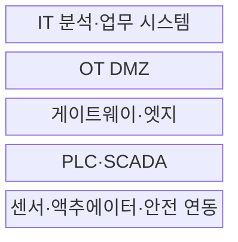
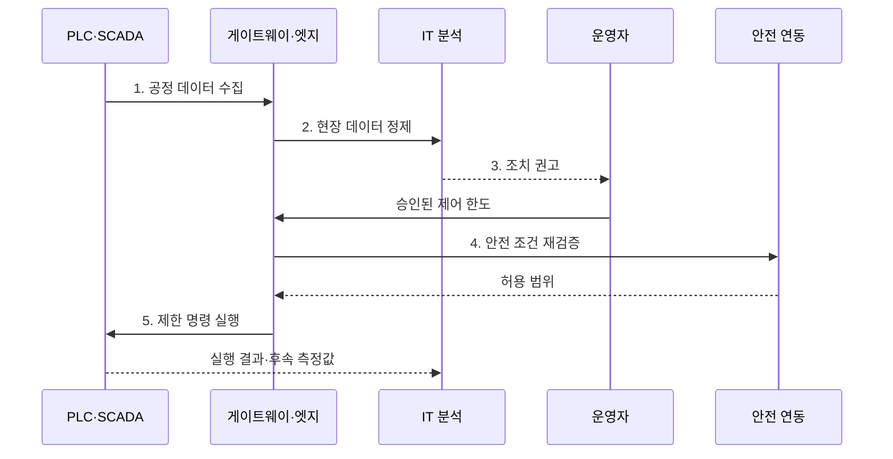

---
sidebar:
  order: 80
  label: "080. 산업용 IoT (Industrial IoT, IIoT)"
  badge:
    text: "기출 · 50%"
    variant: note
title: "산업용 IoT (Industrial IoT, IIoT)"
date: "2026-07-27T23:59:59+09:00"
tags:
  - "notes-network"
weight: 80
extra:
  question_no: "080"
  source_status: "기출"
  source_history: "137회"
  priority: 50
  priority_note: "설계·보안형: 산업망·OT 융합의 상위 주제"
---

## 미리 알고가기

- **산업용 사물 인터넷(Industrial Internet of Things, IIoT)**: 산업 설비 데이터를 연결해 상태 감시·예지 정비·안전 제어에 활용하는 운영 체계
- **사물 인터넷(Internet of Things, IoT)**: 사물·센서를 네트워크로 연결해 데이터를 수집하고 원격 명령을 전달하는 기술
- **운영 기술(Operational Technology, OT)**: 물리 공정을 감시하고 직접 제어하는 장비·소프트웨어 영역
- **정보 기술(Information Technology, IT)**: 업무 데이터·응용·서버·사용자 계정을 처리하는 정보 시스템 영역
- **프로그램 가능 논리 제어기(Programmable Logic Controller, PLC)**: 센서 입력과 제어 논리로 산업 설비를 실시간 동작시키는 제어기
- **감시 제어 및 데이터 수집(Supervisory Control and Data Acquisition, SCADA)**: 여러 PLC와 설비를 중앙 감시·제어하는 시스템
- **산업용 게이트웨이(Industrial Gateway)**: 설비 프로토콜을 변환하고 OT 데이터를 상위 시스템에 중계하는 장치
- **엣지 컴퓨팅(Edge Computing)**: 설비 가까이에서 데이터를 분석하고 단절 중 현장 처리를 수행하는 방식
- **비무장 지대(Demilitarized Zone, DMZ)**: IT와 OT의 직접 연결을 막고 중계·검사 시스템을 배치하는 경계 구간
- **결정성(Determinism)**: 제어 작업이 예측 가능한 제한 시간 안에 완료되는 성질
- **안전 연동 장치(Safety Interlock)**: 위험 조건에서 상위 명령보다 우선해 설비를 안전 상태로 전환하는 보호 장치
- **수동 관찰(Passive Monitoring)**: 탐색 패킷을 보내지 않고 기존 통신으로 자산과 연결 관계를 식별하는 방식

## Ⅰ. 개요

- 정의: 설비 데이터를 **운영 판단·안전 제어**에 연결
- 필요성: IT 분석과 **OT 안전·가용성**의 균형

### 쉽게 이해하기 (학습용)

- IIoT는 설비 데이터를 모으는 데서 끝나지 않고 정비 시점·생산 조건·안전 정지 결정으로 연결한다.

## Ⅱ. 특징

- 처리량보다 **OT 안전·가용성** 우선
- 게이트웨이·DMZ의 **IT·OT 책임 분리**
- 승인·현장 상태 기반 **제어 명령 재검증**

### 쉽게 이해하기 (학습용)

- 산업 분석이 틀리면 설비가 잘못 움직일 수 있으므로 결과의 정확성과 실패 시 안전 상태를 함께 확인한다.

## Ⅲ. 구조 및 구성요소

| 구성요소 | 책임 |
|:---|:---|
| **센서·액추에이터·안전 연동** | 측정·동작과 위험 시 우선 정지 |
| **PLC·SCADA** | 결정적 제어와 운전 상태 감시 |
| **게이트웨이·엣지** | 변환·정제·단절 중 제한 제어 |
| **OT DMZ** | IT·OT 중계·검사와 직접 연결 차단 |
| **IT 분석·업무 시스템** | 품질·정비·생산 분석과 정책 제안 |

### 쉽게 이해하기 (학습용)

- IT는 조치를 제안하고 PLC와 안전 연동 장치는 최신 현장 상태를 확인해 최종 실행과 보호를 맡는다.

## Ⅳ. 흐름도

1. **공정 데이터 수집**: 측정값·부하·운전 단계를 함께 획득
2. **현장 데이터 정제**: 잡음·중복 제거와 단위·시각 정렬
3. **조치 권고**: 열화 예측과 생산·안전 영향 제시
4. **안전 조건 재검증**: 최신 상태·허용 범위·연동 조건 확인
5. **제한 명령 실행**: 승인 범위 안의 명령만 PLC 적용

### 쉽게 이해하기 (학습용)

- 같은 온도도 설비 종류와 부하에 따라 의미가 달라 측정값과 공정 상태를 함께 분석해야 한다.

## Ⅴ. 종류 및 비교

| 사물 인터넷 환경 | IIoT | 소비자 IoT |
|:---|:---|:---|
| 적용 기준 | 중단·오동작 영향 큰 **산업 공정** | 재시작 가능한 **개인 기기** |
| 핵심 특징 | **현장 제어·IT 분석** 책임 분리 | 연결 편의와 **사용자 자동화** |
| 한계 | **지연·중단·안전사고** 영향 | 계정·개인정보·**중앙 장애** |

### 쉽게 이해하기 (학습용)

- 산업 설비는 재시작과 오동작의 영향이 커 PLC·엣지·DMZ가 단계별로 데이터와 제어 명령을 검증한다.

## Ⅵ. 실무 고려사항 및 대책

| 고려사항 | 대책 | 효과 |
|:---|:---|:---|
| 가동 장비의 **자산 미식별** | 탭·미러 포트의 **수동 관찰** | 생산 영향 없이 **가시성 확보** |
| IT 연계의 **OT 장애 전파** | DMZ 중계와 **구역·도관 분리** | 고장 범위와 **직접 접근 축소** |
| 분석 명령의 **상태 노후화** | 시각·한도·연동 **현장 재검증** | 오제어와 **안전사고 방지** |

### 쉽게 이해하기 (학습용)

- 가동 중인 공장은 능동 탐색 대신 기존 통신을 수동 분석해 장비·프로토콜·연결 관계를 식별한다.

## Ⅶ. 결론

- **안전·가용성 영향**으로 분석과 제어 책임 분리

### 쉽게 이해하기 (학습용)

- 분석 결과는 사람의 승인과 최신 현장 안전 조건을 확인한 뒤 허용 범위 안에서만 제어에 반영한다.
