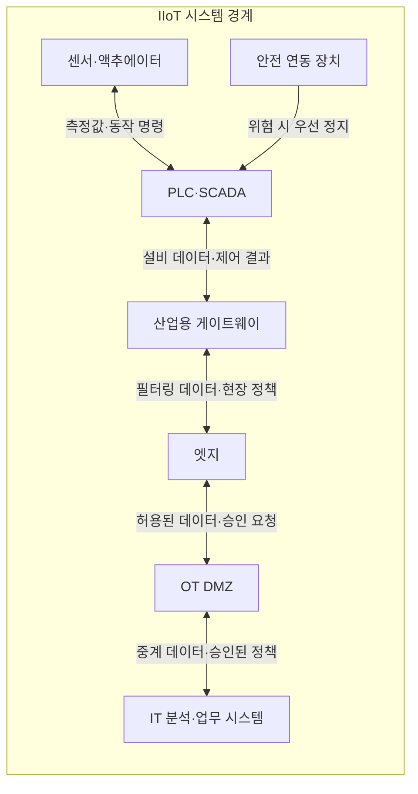
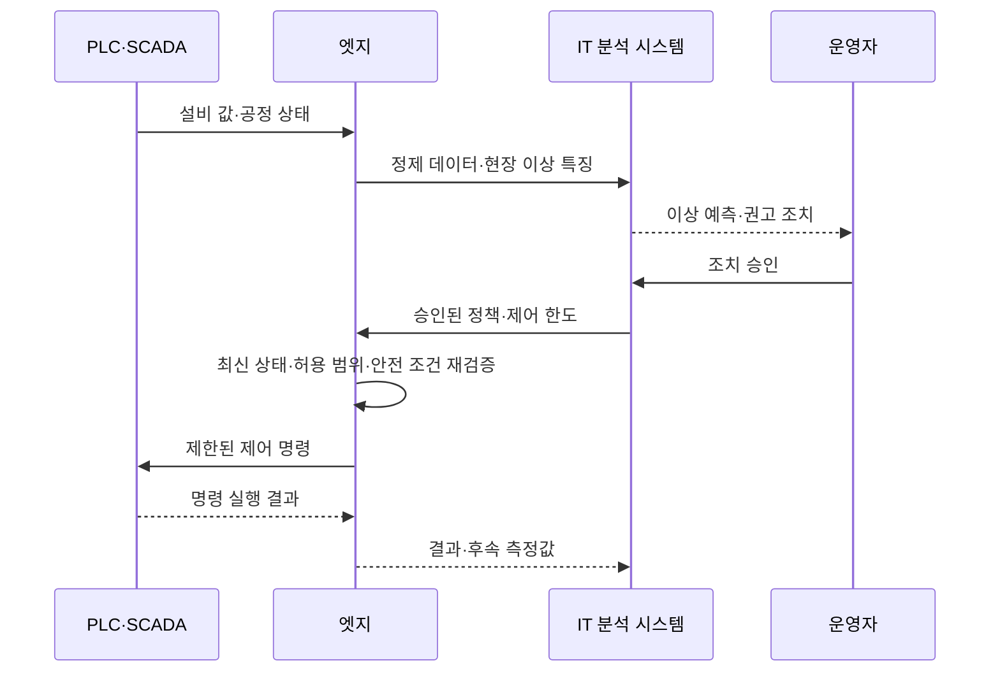

---
sidebar:
  order: 80
  label: "080. 산업용 IoT (Industrial IoT, IIoT)"
  badge:
    text: "기출 · 50%"
    variant: note
title: "산업용 IoT (Industrial IoT, IIoT)"
date: "2026-07-27T23:59:59+09:00"
tags:
  - "notes-network"
weight: 80
extra:
  question_no: "080"
  source_status: "기출"
  source_history: "137회"
  priority: 50
  priority_note: "설계·보안형: 산업망·OT 융합의 상위 주제"
---

## 미리 알고가기

- **IIoT (Industrial Internet of Things, 산업용 사물 인터넷)**: 산업 설비와 센서 데이터를 연결해 상태 감시·품질 개선·예지 정비·안전한 제어에 활용하는 운영 체계
- **IoT (Internet of Things, 사물 인터넷)**: 사물과 센서를 네트워크로 연결해 데이터를 수집하고 원격 명령을 전달하는 기술
- **OT (Operational Technology, 운영 기술)**: 공장·발전소·교통 시설처럼 물리 공정을 감시하고 직접 제어하는 장비와 시스템
- **IT (Information Technology, 정보 기술)**: 업무 데이터와 응용·서버·사용자 계정을 처리하는 정보 시스템 영역
- **PLC (Programmable Logic Controller, 프로그램 가능 논리 제어기)**: 센서 입력과 제어 논리에 따라 산업 설비를 실시간으로 동작시키는 제어기
- **SCADA (Supervisory Control and Data Acquisition, 감시 제어 및 데이터 수집)**: 여러 PLC와 설비의 상태를 중앙에서 수집·표시하고 원격 제어하는 시스템
- **엣지**: 설비 가까이에서 데이터를 필터링·분석하고 중앙 회선 없이도 필요한 현장 처리를 수행하는 컴퓨팅 영역
- **산업용 게이트웨이**: 설비 통신 방식을 변환하고 OT 데이터를 상위 엣지나 중앙 시스템에 안전하게 전달하는 중계 장치
- **DMZ (Demilitarized Zone, 비무장 지대)**: IT와 OT가 직접 연결되지 않도록 중계·검사 시스템을 두는 별도 보안 구간
- **결정성**: 정해진 작업이 예측 가능한 시간 안에 완료되는 성질
- **안전 연동 장치**: 위험 조건이 발생하면 상위 분석이나 사용자 명령과 무관하게 설비를 안전 상태로 전환하는 보호 기능
- **MFA (Multi-Factor Authentication, 다중 요소 인증)**: 비밀번호 외에 소유·생체 등 서로 다른 인증 요소를 추가로 확인하는 방식
- **점프 서버**: 관리자가 OT 장비에 직접 접속하지 않고 인증·승인·기록을 거쳐 접속하도록 만드는 중계 서버
- **수동 관찰(Passive Monitoring)**: 설비에 탐색 패킷을 보내지 않고 기존 통신을 분석해 자산과 연결 관계를 식별하는 방식
- **약어 읽기와 표기**: IIoT·IoT·OT·IT·PLC·SCADA·DMZ·MFA는 아이아이오티·아이오티·오티·아이티·피엘씨·스카다·디엠지·엠에프에이로 읽고 영문 핵심 글자를 딴 표기이며, 산업 사물망·운영 영역·제어기·감시·보안 구간·인증 역할을 구분함

## Ⅰ. 개요

- 정의/개념: 설비 데이터를 **안전한 운영 판단·제어에 연결**
- **배경/필요성**: IT 분석의 **OT 안전·가용성 침해 한계** 통제

### 쉽게 이해하기 (학습용)

- IIoT는 설비 데이터를 수집하는 데서 끝나지 않고 정비·생산 조건·안전 정지 결정으로 연결한다

## Ⅱ. 특징

- 처리량보다 **OT 안전·가용성 우선**
- 게이트웨이·DMZ의 **IT·OT 직접 연결 차단**
- 승인·현장 조건 기반 **제어 명령 검증**

### 쉽게 이해하기 (학습용)

- 산업 분석이 틀리면 설비가 잘못 움직일 수 있으므로 결과의 정확성뿐 아니라 실패해도 안전한지 확인한다

## Ⅲ. 아키텍처 및 구성요소

| 설계 요소 | 설명 |
|:---|:---|
| 센서·액추에이터 | 설비 상태 측정과 허용된 물리 동작 실행 |
| PLC·SCADA | 정시 설비 제어·운전 상태·경보 제공 |
| 산업용 게이트웨이 | 설비 통신 변환·허용 데이터 교환 |
| 엣지 | 현장 정제·분석·단절 중 제한 제어 |
| OT DMZ | IT·OT 중계·승인·검사·직접 연결 차단 |
| IT 분석·업무 시스템 | 품질·정비·생산 계획과 정책 전달 |
| 안전 연동 장치 | 위험 시 PLC·설비를 안전 상태로 전환 |

> 요약: OT 제어·엣지 분석·DMZ 교환 책임 분리

### 쉽게 이해하기 (학습용)

- IT 분석은 조치를 제안하고 PLC와 안전 연동 장치는 현장 상태를 확인해 최종 실행·보호를 맡는다

## Ⅳ. 원리 및 절차 흐름도

| 절차 | 설명 |
|:---|:---|
| 설비 값·공정 상태 | 측정값·부하·운전 단계 전달 |
| 정제 데이터·현장 이상 특징 | 잡음·중복 제거 후 이상 특징 전달 |
| 이상 예측·권고 조치 | 열화 분석 후 정비·조건 변경 제안 |
| 조치 승인 | 생산·안전·오경보 비용 확인 |
| 승인된 정책·제어 한도 | 변경 가능 범위를 엣지로 전달 |
| 최신 상태·허용 범위·안전 조건 재검증 | 오래되거나 위험한 요청 거부 |
| 제한된 제어 명령 | 허용 범위 명령만 PLC로 전달 |
| 명령 실행 결과 | 성공·실패와 실제 적용 상태 반환 |
| 결과·후속 측정값 | 실행 결과로 예측·정책 개선 |

> 요약: 사람 승인과 현장 재검증 후 제어

### 쉽게 이해하기 (학습용)

- 같은 온도도 설비 종류와 부하에 따라 의미가 달라 측정값과 공정 상태를 함께 분석해야 한다

## Ⅴ. 종류 및 비교

| 사물 인터넷 환경 | IIoT | 소비자 IoT |
|:---|:---|:---|
| 적용 기준 | 중단·오동작 영향이 큰 산업 시설 | 재시작 가능한 가정·개인 기기 |
| 핵심 특징 | 현장 제어·IT 분석 분리 | 기기·중앙 연결 편의 자동화 |
| 한계 | 지연·중단·안전사고 | 계정·개인정보·중앙 장애 |

> 요약: 산업용은 편의보다 안전·가용성 우선

### 쉽게 이해하기 (학습용)

- 산업 설비는 재시작과 오동작의 영향이 커 PLC·엣지·DMZ가 단계별로 제어 명령을 검증한다

## Ⅵ. 실무 사례

1. 가동 중인 공장의 **수동 관찰 기반 자산 식별**

### 쉽게 이해하기 (학습용)

- 생산 설비에 능동 탐색 패킷을 보내지 않고 기존 통신을 수동 분석해 장비·프로토콜·연결 관계를 식별한다

## Ⅶ. 결론

- 산업 데이터 활용이 공정 안전을 해치는 것을 막기 위해 자산 가시성·프로토콜·제어 영향·현장 상태·승인 권한을 검토하여, 수동 관찰과 안전 재검증을 거친 IIoT 제어만 허용해야 한다.

### 쉽게 이해하기 (학습용)

- 분석 결과는 사람의 승인과 최신 현장 안전 조건을 다시 확인한 뒤 허용 범위 안에서만 제어에 반영한다
