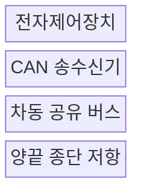
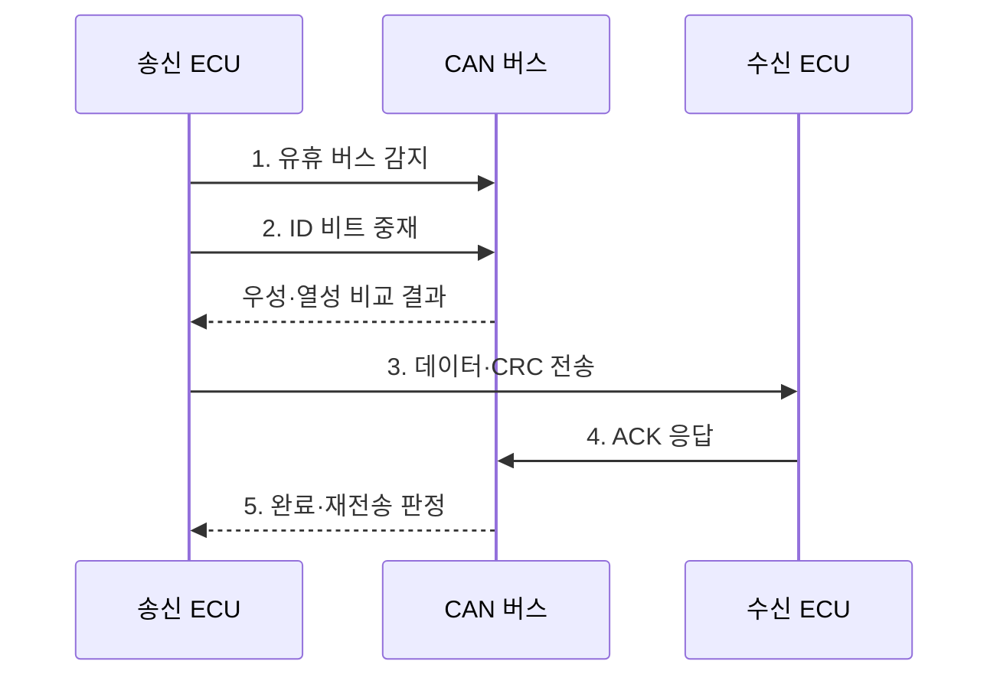

---
sidebar:
  order: 81
  label: "081. CAN 버스 자동차 통신 (CAN Bus)"
  badge:
    text: "기출 · 30%"
    variant: note
title: "CAN 버스 자동차 통신 (CAN Bus)"
date: "2026-07-27T23:59:59+09:00"
tags: ["notes-network"]
weight: 81
extra:
  question_no: "081"
  source_status: "기출"
  source_history: "129회"
  priority: 30
  priority_note: "설명형: 129회 CAN 통신 직접 출제"
---

## 미리 알고가기

- **제어기 영역 네트워크(Controller Area Network, CAN)**: 차량 제어기가 공유 회선에서 프레임 식별자로 우선순위를 중재하는 통신 규격
- **전자제어장치(Electronic Control Unit, ECU)**: 센서 입력으로 엔진·제동·조향 같은 차량 기능을 제어하는 장치
- **식별자(Identifier, ID)**: 송신 주소가 아니라 프레임 의미와 중재 우선순위를 나타내는 값
- **비파괴 중재(Non-destructive Arbitration)**: 동시 송신 시 패자만 중단하고 승자의 프레임은 손상하지 않는 방식
- **우성 비트(Dominant Bit)**: 열성 비트와 동시에 전송되면 버스값을 0으로 결정하는 논리 비트
- **순환 중복 검사(Cyclic Redundancy Check, CRC)**: 송수신 검사값 비교로 전송 오류를 검출하는 방식
- **수신 확인(Acknowledgement, ACK)**: 하나 이상의 수신 노드가 정상 수신을 버스 비트로 알리는 신호
- **종단 저항(Termination Resistor)**: 공유 회선 양 끝에서 신호 반사를 줄여 파형을 유지하는 저항
- **클래식 CAN(Classical CAN, CAN CC)**: 최대 8바이트 데이터 필드를 지원하는 1세대 CAN 규격
- **가변 데이터율 CAN(CAN Flexible Data Rate, CAN FD)**: 최대 64바이트와 데이터 구간 비트율 전환을 지원하는 규격
- **확장 데이터 길이 CAN(CAN Extended Data-Field Length, CAN XL)**: 최대 2048바이트와 고속 데이터 구간을 지원하는 규격
- **오류 제한(Error Confinement)**: 오류 누적 노드를 버스 오프로 전환해 다른 통신에 미치는 영향을 차단하는 기능
- **ISO 11898-1**: CAN CC·CAN FD·CAN XL 데이터 링크 계층을 규정하는 국제 표준

## Ⅰ. 개요

- 정의: **ISO 11898-1** 기반 **비파괴 중재 통신**
- 필요성: 다중 배선과 **긴급 프레임 지연** 해소

### 쉽게 이해하기 (학습용)

- 여러 차량 제어기가 한 회선을 함께 쓰면서 더 긴급한 프레임이 충돌 없이 먼저 지나가게 한다.

## Ⅱ. 특징

- 작은 ID의 **우성 비트 중재 우선권**
- 중재 패배 프레임의 **무손상 재시도**
- 오류 누적 노드의 **버스 오프 격리**

### 쉽게 이해하기 (학습용)

- 동시에 말해도 우선순위가 낮은 장치만 조용히 멈추므로 긴급 메시지는 깨지지 않고 전송된다.

## Ⅲ. 구조 및 구성요소

| 구성요소 | 책임 |
|:---|:---|
| **전자제어장치** | 메시지 생성·수신 필터링 수행 |
| **CAN 송수신기** | 논리 비트와 차동 전압 변환 |
| **차동 공유 버스** | 모든 노드에 동일 프레임 전달 |
| **양끝 종단 저항** | 회선 끝의 신호 반사 억제 |

### 쉽게 이해하기 (학습용)

- 각 ECU의 송수신기가 두 가닥 회선에 붙고 양 끝 저항이 반사를 줄여 모든 장치가 같은 프레임을 본다.

## Ⅳ. 흐름도

| 단계 | 동작 원리 |
|:---|:---|
| **1. 유휴 버스 감지** | 회선이 비었을 때 송신 시작 |
| **2. ID 비트 중재** | 송신값과 버스값을 비트별 비교 |
| **3. 데이터·CRC 전송** | 중재 승자만 본문과 검사값 전송 |
| **4. ACK 응답** | 정상 수신 노드가 확인 비트 기록 |
| **5. 완료·재전송 판정** | 오류 검출 시 프레임 재시도 |

### 쉽게 이해하기 (학습용)

- ECU들은 ID를 한 비트씩 비교해 승자를 정하고 CRC와 ACK 결과에 따라 전송을 끝내거나 다시 시도한다.

## Ⅴ. 종류 및 비교

| CAN 규격 | CAN CC | CAN FD | CAN XL |
|:---|:---|:---|:---|
| 적용 기준 | 소량·주기 **제어 메시지** | 중용량·고속 **차량 데이터** | 대용량·고속 **백본 연계** |
| 핵심 특징 | 데이터 **최대 8바이트** | 최대 64바이트·**구간 가속** | 최대 2048바이트·**고속 전송** |
| 한계 | **낮은 대역폭** | 기존 CC 노드와 **혼재 제약** | 장비·물리망 **설계 복잡성** |

### 쉽게 이해하기 (학습용)

- 짧은 제어값은 CAN CC, 더 큰 자료는 CAN FD, 대용량 백본 연계는 CAN XL이 적합하다.

## Ⅵ. 실무 고려사항 및 대책

| 고려사항 | 대책 | 효과 |
|:---|:---|:---|
| 고부하의 **저순위 기아** | 최악 응답시간과 **버스 부하 분석** | 긴급성과 **주기 보장** |
| 배선 반사의 **프레임 오류** | 토폴로지·종단·길이 **검증** | 신호 무결성과 **재전송 감소** |
| 고장 ECU의 **오류 프레임 반복** | 오류 카운터와 **버스 오프 복구** | 장애 노드의 **영향 격리** |

### 쉽게 이해하기 (학습용)

- 급제동 프레임에 작은 ID를 주되 낮은 우선순위 메시지도 제한 시간 안에 전송되는지 함께 계산해야 한다.

## Ⅶ. 결론

- **긴급도·데이터량·호환성**으로 CAN 규격 선택

### 쉽게 이해하기 (학습용)

- 프레임의 긴급 순위를 먼저 정하고 데이터 크기와 기존 ECU 호환성에 맞춰 CAN 세대를 선택한다.
