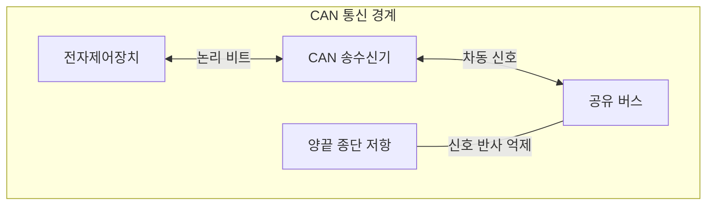
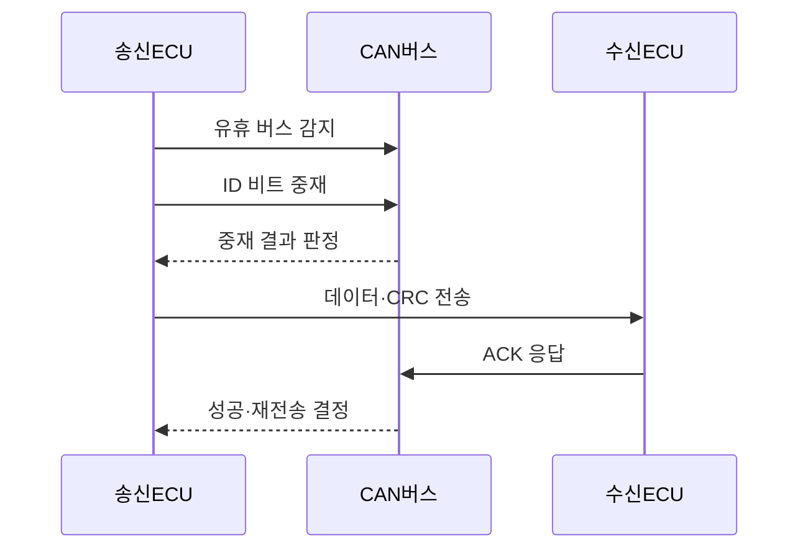

---
sidebar:
  order: 81
  label: "081. CAN 버스 자동차 통신 (CAN Bus)"
  badge:
    text: "기출 · 30%"
    variant: note
title: "CAN 버스 자동차 통신 (CAN Bus)"
date: "2026-07-27T23:59:59+09:00"
tags: ["notes-network"]
weight: 81
extra:
  question_no: "081"
  source_status: "기출"
  source_history: "129회"
  priority: 30
  priority_note: "설명형: 129회 CAN 통신 직접 출제"
---

## 미리 알고가기

- **제어기 영역 네트워크(Controller Area Network, CAN)**: 여러 차량 제어기가 두 가닥의 공유 회선에서 프레임 식별자로 전송 우선순위를 겨루는 통신 방식이다.
- **전자제어장치(Electronic Control Unit, ECU)**: 센서 입력을 받아 엔진·제동·조향 같은 차량 기능을 제어하는 장치다.
- **프레임 식별자(Identifier, ID)**: 송신 주소가 아니라 프레임 종류와 중재 우선순위를 나타내는 값이다.
- **비파괴 중재**: 여러 노드가 동시에 송신해도 우선순위가 낮은 노드만 중단하고 승자의 프레임은 손상하지 않는 방식이다.
- **우성 비트**: 열성 비트와 동시에 전송되면 버스 값을 덮어쓰는 논리값 0이며 작은 식별자에 우선권을 준다.
- **순환 중복 검사(Cyclic Redundancy Check, CRC)**: 송신 데이터로 계산한 검사값을 수신 측이 다시 계산해 전송 오류를 찾는 방식이다.
- **수신 확인(Acknowledgement, ACK)**: 하나 이상의 노드가 프레임을 정상 수신했음을 버스 비트로 알리는 신호다.
- **종단 저항**: 공유 회선 양 끝에서 신호 반사를 줄여 파형을 유지하는 저항이다.
- **CAN 클래식(CAN Classic, CAN CC)**: 최대 8바이트 데이터 필드를 사용하는 1세대 CAN 데이터 링크 규격이다.
- **가변 데이터율 CAN(CAN Flexible Data Rate, CAN FD)**: 최대 64바이트 데이터 필드와 데이터 구간의 빠른 비트율을 지원하는 규격이다.
- **확장 데이터 길이 CAN(CAN Extended Data-Field Length, CAN XL)**: 최대 2048바이트 데이터 필드와 더 높은 데이터 구간 속도를 지원하는 규격이다.
- **오류 제한(Error Confinement)**: 오류 카운터가 임계값을 넘은 고장 노드를 버스 오프 상태로 전환해 다른 통신에 주는 영향을 차단하는 기능이다.
- **약어 읽기와 표기**: CAN·ECU·ID·CRC·ACK·CC·FD·XL은 캔·이씨유·아이디·씨알씨·애크·씨씨·에프디·엑스엘로 읽고 영문 핵심 글자를 딴 표기이며, 버스·제어기·식별자·오류 검사·응답·세대별 규격을 구분한다.

## Ⅰ. 개요

- **정의/개념**: ID 기반 **공유 버스 비파괴 중재 통신**
- **배경/필요성**: 다중 배선의 **복잡성·긴급 메시지 지연** 해소

### 쉽게 이해하기 (학습용)

- 여러 차량 제어기가 한 회선을 함께 쓰면서 더 긴급한 프레임이 충돌 없이 먼저 지나가게 한다.

## Ⅱ. 특징

- 작은 ID의 **우성 비트 중재 우선권**
- 중재 패배 프레임의 **무손상 재시도**
- 오류 누적 노드의 **버스 오프 격리**

### 쉽게 이해하기 (학습용)

- 동시에 말해도 우선순위가 낮은 장치만 조용히 멈추므로 긴급 메시지는 깨지지 않고 전송된다.

## Ⅲ. 아키텍처 및 구성요소

| 설계 요소 | 설명 |
|:---|:---|
| 전자제어장치 | 메시지 생성·수신 필터링 수행 |
| CAN 송수신기 | 논리 비트와 차동 전압을 변환 |
| 공유 버스 | 모든 노드에 프레임을 전달 |
| 종단 저항 | 회선 끝의 신호 반사를 억제 |

> 요약: 송수신기가 공유 회선의 차동 신호 변환

### 쉽게 이해하기 (학습용)

- 각 제어기의 송수신기가 두 가닥 회선에 붙고 양 끝 저항이 신호 반사를 줄여 모든 장치가 같은 프레임을 본다.

## Ⅳ. 원리 및 절차 흐름도

| 절차 | 설명 |
|:---|:---|
| 유휴 버스 감지 | 회선이 비었을 때 송신 시작 |
| ID 비트 중재 | 송신값과 버스값을 비트별 비교 |
| 중재 결과 판정 | 열성 비트가 지면 송신 중단 |
| 데이터·CRC 전송 | 승자만 본문과 검사값을 전송 |
| ACK 응답 | 정상 수신 노드가 확인 비트 기록 |
| 성공·재전송 결정 | 오류면 프레임을 다시 전송 |

> 요약: 비파괴 중재 후 오류 검사·재전송

### 쉽게 이해하기 (학습용)

- 제어기들은 식별자를 한 비트씩 비교해 승자를 정하고 수신 확인이나 오류 결과에 따라 전송을 끝내거나 다시 시도한다.

## Ⅴ. 종류 및 비교

| CAN 규격 | CAN CC | CAN FD | CAN XL |
|:---|:---|:---|:---|
| 적용 기준 | 소량·주기 제어 메시지 | 기존 CAN과 호환하며 용량 확대 | 대용량 차량 데이터 전송 |
| 핵심 특징 | 최대 8바이트 | 최대 64바이트·구간 가속 | 최대 2048바이트·고속 백본 |
| 한계 | 낮은 대역폭 | 혼합 노드 호환 설정 오류 | 복잡한 장비·망 설계 |

> 요약: 데이터 크기·속도·호환성으로 규격 선택

### 쉽게 이해하기 (학습용)

- 짧은 제어값은 CAN CC, 더 큰 자료는 CAN FD, 차량 백본의 대용량 자료는 CAN XL이 알맞다.

## Ⅵ. 실무 사례

1. 제동 프레임에 작은 ID를 배정해 우선 전송
2. CAN FD로 차량 진단 자료 전송 시간 단축

### 쉽게 이해하기 (학습용)

- 급제동 명령은 다른 편의 기능보다 작은 식별자를 써 동시에 송신돼도 먼저 버스를 차지한다.
- 정비 장비가 많은 진단 자료를 받을 때 CAN FD의 긴 프레임과 빠른 데이터 구간을 사용한다.

## Ⅶ. 결론

- 긴급도·데이터 크기·호환성으로 CAN 선택

### 쉽게 이해하기 (학습용)

- 긴급 프레임의 식별자 우선순위를 정하고 데이터량과 기존 장치 호환성에 맞춰 규격을 선택한다.
