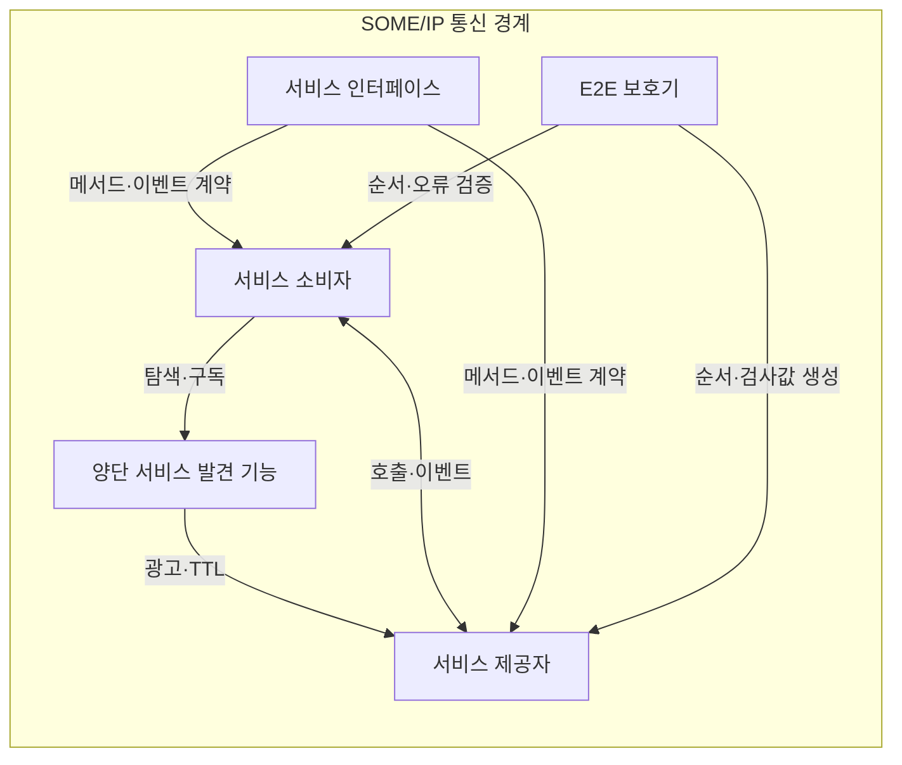
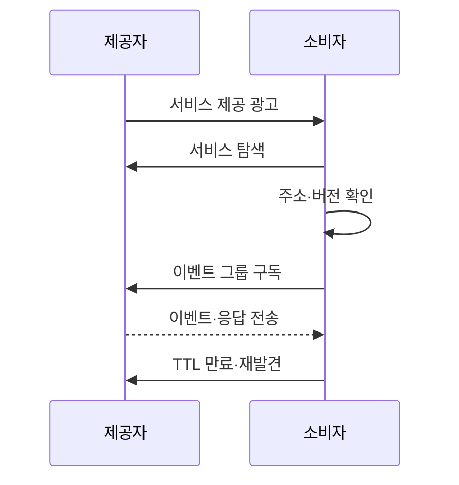

---
sidebar:
  order: 82
  label: "082. SOME/IP 차량 이더넷 (SOME/IP Automotive Ethernet)"
  badge:
    text: "기출 · 30%"
    variant: note
title: "SOME/IP 차량 이더넷 (SOME/IP Automotive Ethernet)"
date: "2026-07-27T23:59:59+09:00"
tags: ["notes-network"]
weight: 82
extra:
  question_no: "082"
  source_status: "기출"
  source_history: "138회"
  priority: 30
  priority_note: "설명·설계형: 138회 SDV의 SOME/IP 연계"
---

## 미리 알고가기

- **IP 기반 확장형 서비스 지향 미들웨어 SOME/IP(썸아이피, Scalable service-Oriented MiddlewarE over IP)**: Service-oriented MiddlewarE over IP의 핵심 글자와 IP를 슬래시로 나눈 표기로 차량 이더넷에서 기능을 서비스로 호출·구독하게 하는 통신 규약이다.
- **소프트웨어 정의 차량(Software-Defined Vehicle, SDV)**: 하드웨어 교체보다 소프트웨어 배포로 차량 기능을 추가·변경하는 차량이다.
- **전자제어장치(Electronic Control Unit, ECU)**: 센서 입력을 받아 차량 기능을 제어하거나 서비스를 제공하는 장치다.
- **서비스 발견(Service Discovery, SOME/IP-SD)**: 서비스 제공 위치와 버전을 동적으로 광고·탐색하고 이벤트 구독을 관리하는 규약이다.
- **생존 시간(Time To Live, TTL)**: 서비스 광고나 구독 상태를 유효하다고 보는 시간이며 만료되면 다시 발견해야 한다.
- **이벤트 그룹**: 소비자가 함께 구독할 수 있도록 관련 이벤트를 묶은 단위다.
- **종단 간 보호(End-to-End Protection, E2E)**: 순서 번호와 검사값으로 데이터의 손상·반복·누락을 검출하는 방식이다.
- **인터넷 프로토콜(Internet Protocol, IP)**: 차량 이더넷에서 제어기 사이 패킷의 주소 지정과 전달을 맡는 네트워크 계층 프로토콜이다.
- **약어 읽기와 표기**: SOME/IP·SOME/IP-SD·SDV·ECU·TTL·E2E·IP는 썸아이피·썸아이피 에스디·에스디브이·이씨유·티티엘·이투이·아이피로 읽고 영문 핵심 글자를 딴 표기이며, 서비스 통신·발견·차량·제어기·유효 시간·오류 보호·패킷 전달 역할을 구분한다.

## Ⅰ. 개요

- 정의/개념: 차량 IP망의 **서비스 호출·구독 통신 규약**
- **배경/필요성**: ECU 주소 직접 결합의 **기능 확장 한계** 해소

### 쉽게 이해하기 (학습용)

- 차량 제어기의 주소를 직접 알지 않아도 필요한 기능 이름과 버전으로 제공자를 찾아 호출하게 한다.

## Ⅱ. 특징

- 서비스 ID·버전의 **인터페이스 계약 식별**
- 요청·응답·이벤트의 **통신 방식 지원**
- SOME/IP-SD의 **동적 발견·재연결**

### 쉽게 이해하기 (학습용)

- 기능 제공자가 바뀌어도 다시 찾을 수 있지만 이름과 버전을 검증하지 않으면 엉뚱한 서비스에 연결될 수 있다.

## Ⅲ. 아키텍처 및 구성요소

| 설계 요소 | 설명 |
|:---|:---|
| 서비스 소비자 | 서비스 호출·이벤트 구독 수행 |
| 양단 서비스 발견 기능 | 제공 위치·버전·생존 시간 관리 |
| 서비스 제공자 | 메서드 실행·이벤트 발행 담당 |
| 서비스 인터페이스 | ID·버전·자료 형식 계약 정의 |
| E2E 보호기 | 손상·반복·누락 메시지 검출 |

> 요약: 발견기가 계약에 맞는 제공자를 연결

### 쉽게 이해하기 (학습용)

- 소비자는 발견기에서 제공자의 위치와 버전을 받고 같은 인터페이스 계약으로 기능을 호출하거나 상태 변화를 구독한다.

## Ⅳ. 원리 및 절차 흐름도

| 절차 | 설명 |
|:---|:---|
| 서비스 제공 광고 | 제공자가 ID·주소·버전을 알림 |
| 서비스 탐색 | 소비자가 필요한 서비스 ID 조회 |
| 주소·버전 확인 | 호환되는 제공자 위치를 선택 |
| 이벤트 그룹 구독 | 필요한 상태 묶음의 통지를 요청 |
| 이벤트·응답 전송 | 호출 결과나 상태 변화를 전달 |
| TTL 만료·재발견 | 광고 만료 시 제공자를 다시 탐색 |

> 요약: 서비스 발견·버전 확인 후 호출·구독

### 쉽게 이해하기 (학습용)

- 제공자가 기능과 위치를 알리면 소비자가 호환 버전을 골라 구독하고, 광고 시간이 끝나면 다시 제공자를 찾는다.

## Ⅴ. 종류 및 비교

| SOME/IP 통신 방식 | 요청·응답 | 무응답 요청 | 이벤트 통지 |
|:---|:---|:---|:---|
| 적용 기준 | 조회·실행 결과가 필요 | 결과보다 전달 지연 최소화 | 상태가 바뀔 때 다수에게 통지 |
| 핵심 특징 | 요청별 처리 결과 반환 | 결과 없는 단방향 호출 | 구독자에게 상태 변화 발행 |
| 한계 | 응답 지연·세션 누락 | 처리 성공 확인 곤란 | 구독 폭증·오래된 상태 |

> 요약: 결과 확인·지연·구독 수로 통신 선택

### 쉽게 이해하기 (학습용)

- 답이 필요하면 요청·응답, 빠른 단방향 명령이면 무응답 요청, 상태 변화를 여러 장치가 받아야 하면 이벤트를 쓴다.

## Ⅵ. 실무 사례

1. 차량 계기판의 **주행 속도 서비스 구독**

### 쉽게 이해하기 (학습용)

- 계기판은 ECU 주소를 고정하지 않고 SOME/IP-SD로 속도 서비스를 발견한 뒤 주행 속도 이벤트 그룹을 구독한다.

## Ⅶ. 결론

- 차량 ECU의 주소 고정 결합을 줄이기 위해 서비스 ID·인터페이스 버전·발견·구독 TTL·종단 오류 검출을 검토하여, 동적 서비스 통신에 SOME/IP를 활용해야 한다.

### 쉽게 이해하기 (학습용)

- SOME/IP 설계는 서비스 이름만 맞추지 말고 인터페이스 버전과 광고 만료, 종단 간 오류 검출까지 함께 정해야 한다.
