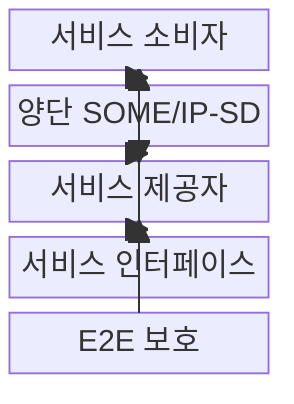
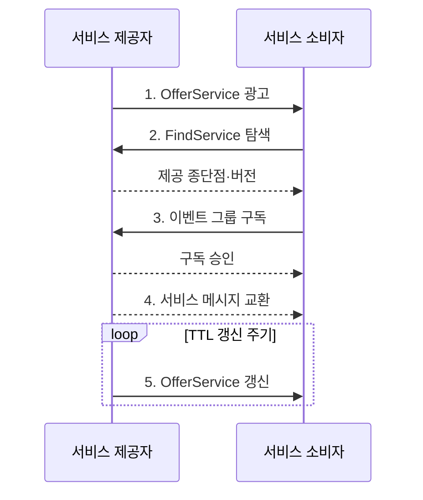

---
sidebar:
  order: 82
  label: "082. SOME/IP 차량 이더넷 (SOME/IP Automotive Ethernet)"
  badge:
    text: "기출 · 30%"
    variant: note
title: "SOME/IP 차량 이더넷 (SOME/IP Automotive Ethernet)"
date: "2026-07-31T03:55:00+09:00"
tags: ["notes-network"]
weight: 82
extra:
  question_no: "082"
  source_status: "기출"
  source_history: "138회"
  priority: 30
  priority_note: "설명·설계형: 138회 SDV의 SOME/IP 연계"
---

## 미리 알고가기

- **IP 기반 확장형 서비스 지향 미들웨어(Scalable service-Oriented MiddlewarE over IP, SOME/IP)**: 차량 IP망에서 기능을 서비스로 호출·구독하는 AUTOSAR 통신 규약
- **소프트웨어 정의 차량(Software-Defined Vehicle, SDV)**: 하드웨어 교체보다 소프트웨어 배포로 기능을 추가·변경하는 차량
- **전자제어장치(Electronic Control Unit, ECU)**: 센서 입력을 받아 차량 기능을 제어하거나 서비스를 제공하는 장치
- **서비스 발견(Service Discovery, SOME/IP-SD)**: 서비스 제공 위치·버전을 광고·탐색하고 이벤트 구독을 관리하는 규약
- **생존 시간(Time To Live, TTL)**: 서비스 광고나 구독 상태를 유효하다고 인정하는 시간
- **이벤트 그룹(Eventgroup)**: 소비자가 함께 구독하도록 관련 이벤트를 묶은 단위
- **종단 간 보호(End-to-End Protection, E2E)**: 순서 번호와 검사값으로 손상·반복·누락을 검출하는 방식
- **인터페이스 버전(Interface Version)**: 소비자와 제공자 서비스 계약의 호환성을 식별하는 버전 정보
- **OfferService**: 제공자가 서비스 ID·버전·종단점·TTL을 광고하는 SOME/IP-SD 항목
- **FindService**: 소비자가 필요한 서비스 ID·버전을 탐색하는 SOME/IP-SD 항목
- **AUTOSAR SOME/IP**: 차량 서비스 호출·직렬화·메시지 형식을 규정한 AUTOSAR 표준
- **종단점(Endpoint)**: 서비스 제공자의 IP 주소·포트·전송 프로토콜 조합
- **메서드(Method)**: 소비자가 제공자에 실행을 요청하는 서비스 기능
- **직렬화(Serialization)**: 구조화된 매개변수를 SOME/IP 메시지 바이트열로 변환하는 처리
- **멀티캐스트(Multicast)**: 하나의 패킷을 같은 그룹의 여러 수신자에게 전달하는 방식
- **계약 테스트(Contract Test)**: 소비자와 제공자의 ID·버전·자료형 호환성을 검증하는 시험
- **무응답 요청(Fire and Forget)**: 제공자의 처리 결과를 기다리지 않는 단방향 메서드 호출

## Ⅰ. 개요

- 정의/개념: 차량 IP망에서 기능을 호출·구독하는 **서비스 지향 미들웨어 규약**
- 배경/필요성: ECU 주소 고정 호출은 **기능 재배치·버전 변경 대응 곤란**

### 쉽게 이해하기 (학습용)

- 차량 ECU의 주소를 직접 알지 않아도 필요한 기능과 버전으로 제공자를 찾아 호출할 수 있다.

## Ⅱ. 특징

- **계약 식별**: 서비스 ID·버전으로 호환 인터페이스 선택
- **통신 다양성**: 요청·응답·무응답·이벤트 방식 제공
- **동적 발견**: SOME/IP-SD로 제공자 위치·TTL 갱신

### 쉽게 이해하기 (학습용)

- 기능 제공 ECU가 바뀌어도 다시 찾을 수 있지만 인터페이스 버전을 확인해야 호환되지 않는 서비스 연결을 막는다.

## Ⅲ. 구조 및 구성요소

| 구성요소 | 책임 |
|:---|:---|
| 서비스 소비자 | 메서드 호출·이벤트 그룹 구독 |
| 양단 SOME/IP-SD | 제공 위치·버전·TTL 관리 |
| 서비스 제공자 | 메서드 실행·이벤트 발행 |
| 서비스 인터페이스 | ID·버전·자료형 계약 정의 |
| E2E 보호 | 손상·반복·누락 메시지 검출 |

### 쉽게 이해하기 (학습용)

- 소비자는 SOME/IP-SD에서 제공자의 위치와 버전을 받고 같은 인터페이스 계약으로 기능을 호출하거나 이벤트를 구독한다.

## Ⅳ. 흐름도

1. **OfferService 광고**: 제공 ID·버전·종단점·TTL 공지
2. **FindService 탐색**: 요구 ID·버전의 제공자 조회
3. **이벤트 그룹 구독**: 이벤트 묶음과 구독 TTL 등록
4. **서비스 메시지 교환**: 메서드 결과·이벤트·E2E 상태 전달
5. **OfferService 갱신**: 만료 전 광고 갱신·실패 시 재탐색

### 쉽게 이해하기 (학습용)

- 제공자가 기능과 위치를 알리면 소비자가 호환 버전을 선택하고 TTL이 끝나기 전에 광고와 구독을 갱신한다.

## Ⅴ. 종류 및 비교

| SOME/IP 통신 방식 | 요청·응답 | 무응답 요청 | 이벤트 통지 |
|:---|:---|:---|:---|
| 적용 기준 | 결과가 필요한 **조회·실행** | 지연 우선 **단방향 호출** | 상태 변화의 **다중 배포** |
| 핵심 특징 | 요청별 **응답·오류 반환** | **Fire & Forget** 처리 | 구독자 대상 **Notification** |
| 한계 | 응답 지연·**세션 관리** | 처리 성공 **확인 곤란** | 구독 폭증·**상태 노후화** |

### 쉽게 이해하기 (학습용)

- 답이 필요하면 요청·응답, 결과를 기다리지 않으면 무응답 요청, 상태 변화를 배포하면 이벤트 통지를 사용한다.

## Ⅵ. 실무 고려사항 및 대책

| 고려사항 | 대책 | 효과 |
|:---|:---|:---|
| 배포 간 **버전 불일치** | 호환 규칙과 **계약 테스트** 적용 | 오호출과 **직렬화 오류 방지** |
| SD 광고의 **멀티캐스트 폭증** | 초기 지연·반복·TTL **튜닝** | 탐색 부하와 **재연결 시간 균형** |
| 제어 데이터의 **누락·반복** | 카운터·CRC 기반 **E2E 보호** | 오류 검출과 **안전 반응 연결** |

### 쉽게 이해하기 (학습용)

- 계기판은 SOME/IP-SD로 속도 서비스의 호환 버전을 찾고 주행 속도 이벤트 그룹을 구독한다.

## Ⅶ. 결론

- 결과가 필요하면 **요청·응답**, 지연 우선은 **무응답**, 다중 배포는 **이벤트**

### 쉽게 이해하기 (학습용)

- 서비스 계약과 TTL을 먼저 맞추고 결과 필요 여부와 구독 규모에 따라 메서드 또는 이벤트 방식을 선택한다.
